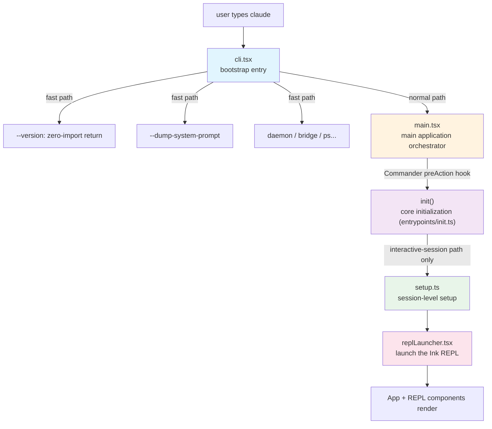
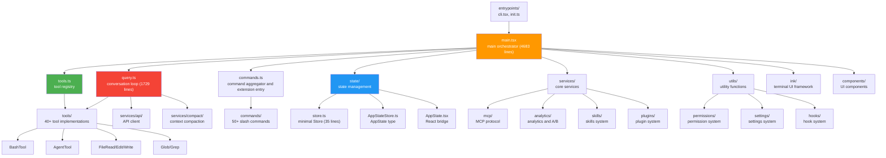

# Chapter 1: Project Overview and Four Entrypoint Forms — A Technical Blueprint for an AI CLI Product

> This chapter opens the *Deep Dive into Claude Code Source* (深入 Claude Code 源码) series. We will build a global understanding of the entire project from three angles: technology stack selection, the startup pipeline (启动链路), and module dependencies.

## Why start with an overview?

When you are staring at a large project of roughly 1,835 TypeScript source files (including `.tsx`), with the largest single file `main.tsx` running 4,683 lines, the biggest challenge is not understanding any one function — it is **not knowing where to start reading**.

Claude Code is an AI-driven command-line programming assistant built by Anthropic. It is not a simple API wrapper — it is a complete AI Agent runtime that spans the full stack: terminal UI rendering, multi-agent orchestration, the tool system, permission and security, and prompt engineering. Understanding it as a whole is equivalent to understanding the complete architecture of a production-grade AI product.

This chapter answers four core questions:
1. **How is the same codebase exposed to the outside world?** — The four entrypoint forms (入口形态) under `entrypoints/` (CLI / SDK / MCP server / Sandbox runner) share one codebase.
2. **Why these technology choices?** — The selection logic behind the Bun + TypeScript + Ink + Commander.js stack.
3. **How does the program start?** — The startup pipeline from `cli.tsx` to the REPL.
4. **How is the code organized?** — A module dependency overview (全景) of around 1,835 TypeScript files.

---

## The entrypoint landscape: one codebase, four faces

Open the `entrypoints/` directory and what you see is not a single `main.ts` but six sibling files and directories:

```
entrypoints/
├── cli.tsx              # entrypoint form 1: interactive / non-interactive CLI
├── sdk/                 # entrypoint form 2: internal implementation of the Agent SDK
│   ├── controlSchemas.ts
│   ├── coreSchemas.ts
│   └── coreTypes.ts
├── agentSdkTypes.ts     # public surface for entrypoint form 2 (exports from the @npm package)
├── mcp.ts               # entrypoint form 3: launch itself as an MCP server
├── sandboxTypes.ts      # entrypoint form 4: configuration schema for the Sandbox runner
└── init.ts              # shared initialization module (only main.tsx's preAction actually calls it)
```

This "one codebase, multiple entrypoints" structure is what sets Claude Code apart from an ordinary CLI. It means the same tool implementations, the same permission system, and the same prompt engineering can be invoked by four entirely different categories of external consumers.

### 1.1 Entrypoint form 1: CLI (`cli.tsx`)

`cli.tsx` is the file that actually runs when the user types `claude` in a terminal. But it is not the main program in itself — its role is closer to a doorman: before loading any heavyweight modules, it first sizes up the caller and, whenever it can handle the request on the spot, does so and saves the few hundred milliseconds of subsequent startup cost.

The most extreme example is `--version`:

```typescript
// entrypoints/cli.tsx:36-42
if (args.length === 1 && (args[0] === '--version' || args[0] === '-v' || args[0] === '-V')) {
  // MACRO.VERSION is inlined at build time
  console.log(`${MACRO.VERSION} (Claude Code)`)
  return
}
```

This snippet uses nothing but a constant inlined at compile time; even the string concatenation is folded away by the Bun bundler. In other words, on the execution path of `claude --version` **nothing other than `cli.tsx` itself is loaded**.

Following the same idea, `cli.tsx` defines a dozen-odd fast paths covering `--dump-system-prompt`, `daemon`, `remote-control / bridge / sync`, background-task management (`ps / logs / attach / kill`), template tasks (`new / list / reply`), `environment-runner`, and so on. Each one follows the same recipe: arguments match → dynamically import only the few modules required for this path → do the work and `return`.

Only when none of the fast paths match does control reach the genuinely expensive `await import('../main.js')` at the end of the file, which pulls the full CLI into memory.

### 1.2 Entrypoint form 2: Agent SDK (`agentSdkTypes.ts` + `sdk/`)

If you are not using `claude` in a terminal but instead writing this inside your own Node or Bun program:

```typescript
import { query, createSdkMcpServer } from '@anthropic-ai/claude-agent-sdk'
```

then the entrypoint you actually hit is `entrypoints/agentSdkTypes.ts`.

What makes this file interesting is that every runtime function it exports — `query`, `tool`, `createSdkMcpServer`, `unstable_v2_createSession` — has a body that is **literally `throw new Error('not implemented')`**. It looks like dead code but it is deliberate: the real implementation is injected by the bundle when the SDK is published, and the source repository only carries the "declaration skeleton".

Its true role is a **public API surface**: it re-exports, from the `sdk/` subdirectory, the types that may be exposed to external users — serializable message structures, settings schema, tool types. In-file type re-exports have no runtime entity after compilation and therefore cannot throw.

It is worth noting that `agentSdkTypes.ts` writes its `import` paths as `./sdk/runtimeTypes.js`, `./sdk/controlTypes.js`, `./sdk/settingsTypes.generated.js`, `./sdk/toolTypes.js` — a group of `.js` files — but in the current source tree the `sdk/` directory only contains three `.ts` originals: `controlSchemas.ts`, `coreSchemas.ts`, `coreTypes.ts`. The other `.js` paths have no `.ts` original visible in the audited source tree — they are the parts of the "public API facade" that are not checked into this repository and are supplied by the SDK bundle at release time.

Isolating "external interface" from "internal implementation" through a single-file facade (门面) is a technique that Claude Code uses repeatedly when shipping the SDK.

### 1.3 Entrypoint form 3: MCP server (`mcp.ts`)

`entrypoints/mcp.ts` solves the opposite problem — not "how do others call Claude Code" but "how does Claude Code expose itself as a standard MCP server that others can call".

After the entrypoint function `startMCPServer(cwd, debug, verbose)` receives the working directory, it registers two standard MCP handlers:

```typescript
// entrypoints/mcp.ts:47-57
const server = new Server(
  { name: 'claude/tengu', version: MACRO.VERSION },
  { capabilities: { tools: {} } },
)
```

- The `ListToolsRequestSchema` handler translates Claude Code's entire internal toolset (Bash, FileRead, FileWrite, Grep, …) into MCP `Tool` descriptions and returns them.
- The `CallToolRequestSchema` handler routes calls from external MCP clients to the internal `tool.call()` and reuses the same `hasPermissionsToUseTool` permission check.

Note that the `ToolUseContext` constructed by the MCP entrypoint is a **simplified** one: `isNonInteractiveSession: true`, `mcpClients: []`, `agentDefinitions` empty. In other words, this entrypoint does not participate in multi-agent orchestration and does not attach any MCP sub-clients — it does one thing only: expose its own tools to external MCP clients.

### 1.4 Entrypoint form 4: Sandbox runner (`sandboxTypes.ts`)

The fourth entrypoint is the least obvious one at first glance — `sandboxTypes.ts` does only one thing: it exports a handful of Zod schemas (`SandboxNetworkConfigSchema`, `SandboxFilesystemConfigSchema`, `SandboxSettingsSchema`) along with the TypeScript types inferred from them.

But it really is an entrypoint form. When `claude` launches a subcommand in sandbox mode, the configuration it uses is the one validated against this schema — fields such as `enabled`, `failIfUnavailable`, `autoAllowBashIfSandboxed`, `network`, `filesystem` are propagated all the way to the child process to constrain its network and filesystem access. In other words, **the schema *is* the interface**: by reading this schema, a host process learns exactly which holes the sandbox can open, and an enterprise deployment team can hard-wire policy into the CLI by writing a single settings JSON.

The comments inside the file also leave behind some interesting evolutionary traces. For example, the `enableWeakerNetworkIsolation` switch is annotated "macOS only: Allow access to com.apple.trustd.agent" — the goal is to let Go-based toolchains (gh / gcloud / terraform) complete TLS verification under a MITM proxy with a self-signed CA. Likewise, `autoAllowBashIfSandboxed` and `enabledPlatforms` exist so that large customers such as NVIDIA can enable the sandbox on macOS while leaving it off on Linux / WSL. None of these fields were designed in a vacuum — they were welded into the source code as-is by requirements coming back from enterprise deployments.

### 1.5 `init.ts`: not a fifth entrypoint but the CLI's initialization module

It is easy to assume that `entrypoints/init.ts`, which sits in the same directory, is a fifth entrypoint form. **It is not.** It is an ordinary initialization module that exports an `init()` function.

In the current source tree the only file that actually `import { init } from './entrypoints/init.js'`s and wires it into the runtime is `main.tsx`: it imports at the top of the file and `await init()` inside `program.hook('preAction', ...)`. In other words, `init()` is only triggered explicitly along the chain `cli.tsx → main.tsx → Commander preAction`.

The other three entrypoints — `agentSdkTypes.ts`, `mcp.ts`, `sandboxTypes.ts` — **do not** `import` `init` anywhere in this repository:

- The runtime implementation of `agentSdkTypes.ts` is replaced by the SDK bundle at release time, and the bundle takes over the initialization responsibility itself.
- `mcp.ts` has `startMCPServer` invoked by external MCP clients; the host owns initialization.
- `sandboxTypes.ts` only exports schemas; the host process that reads the schema handles its own initialization.

The `init()` function itself is wrapped with `lodash-es/memoize`, so it executes only once no matter how many times `preAction` fires. The work it does runs roughly in this order:

- Enable the configuration system (`enableConfigs`) and inject **only** the "safe" environment variables first (`applySafeConfigEnvironmentVariables`), leaving a safety buffer for the upcoming trust dialog.
- Inject `NODE_EXTRA_CA_CERTS` ahead of time — this must happen before the first TLS handshake, otherwise Bun / BoringSSL will cache an empty certificate store.
- Register graceful shutdown, lazily initialize the 1P event log, backfill OAuth account information, and probe for the JetBrains IDE and GitHub repository environments.
- Asynchronously load remote managed settings and policy limits, configure mTLS and proxies.
- Pre-establish a TCP + TLS connection to the Anthropic API in parallel with the action handler's work, saving 100–200 ms on the first request latency.
- Lazy-load `upstreamproxy/` and wire in the CCR upstream proxy only when `CLAUDE_CODE_REMOTE` is truthy.

Because only the main CLI entrypoint runs `init()`, the chapter later in this book that singles out "configuration as code" scopes its discussion to this chain — the evolution of migrations, the merge order of enterprise MDM, and the two phases of `applyConfigEnvironmentVariables` (the safe subset before trust / the full set after trust) all happen at this layer and do not generalize to the other three entrypoints.

---

## 1. Technology stack selection: why Bun + TypeScript + Ink?

### 1.1 Runtime: deep dependency on Bun

Claude Code's build and parts of its runtime characteristics **depend deeply on Bun**. That said, this is not a Bun-only project — the source code explicitly checks the Node version (`setup.ts:69-79`) and provides an `isRunningWithBun()` function to distinguish the runtime (`utils/bundledMode.ts:1-22`), showing that the project also considers compatibility with non-Bun environments.

At the core, choosing Bun has clear engineering reasons:

- **Startup speed**: Bun's cold-start time is far below Node.js, which is critical for a CLI tool. The time between the user typing `claude` and seeing the UI directly affects experience.
- **Built-in bundler**: Bun's `bun:bundle` module provides the compile-time `feature()` function, which enables Dead Code Elimination (DCE). This lets the same source code produce two different products — an internal build and an external build.
- **Native TypeScript support**: no `ts-node` or extra transpilation step is needed.

More precisely, the project's **build / bundling capability depends deeply on Bun**, and some runtime paths are optimized or assume Bun, but the runtime itself is treated as distinguishable.

One Bun feature is used heavily across the codebase:

```typescript
// entrypoints/cli.tsx:1
import { feature } from 'bun:bundle';

// tools.ts:26-28
const SleepTool =
  feature('PROACTIVE') || feature('KAIROS')
    ? require('./tools/SleepTool/SleepTool.js').SleepTool
    : null
```

`feature()` is replaced with `true` or `false` at compile time; combined with `require()` (not `import`), Bun's bundler can delete the unwanted branch wholesale at build time, realizing a truly zero-cost abstraction.

### 1.2 Language: TypeScript + Zod

TypeScript provides static type safety. Worth noting is that the project uses **Zod** extensively for runtime type validation — because the tool-call arguments returned by AI models are dynamic, and TypeScript's compile-time type checking cannot cover them.

### 1.3 Terminal UI: Ink (React for the CLI)

Claude Code's terminal interface is not stitched together with `console.log`; it is built with **Ink** — a framework that runs React inside the terminal. The project even forks Ink and customizes it deeply (the `ink/` directory contains around 96 files):

```
ink/
├── reconciler.ts          # custom React reconciler
├── layout/                # layout engine based on Yoga
├── render-node-to-output.ts  # render to terminal
├── optimizer.ts           # rendering performance optimizer
├── line-width-cache.ts    # line-width cache
└── …(about 96 files in total)
```

Why use React for a terminal UI? Because Claude Code's UI is **highly dynamic**: streaming output, parallel tool-progress bars, permission confirmation dialogs, theme switching — all of these would become a nightmare under imperative code, but become natural under React's declarative model.

### 1.4 CLI argument parsing: Commander.js

Argument parsing uses `@commander-js/extra-typings` — a type-enhanced edition of Commander.js. In `main.tsx` you can see it being used to declare every CLI option and subcommand.

### Technology-stack summary

| Layer | Choice | Reasoning |
|------|---------|---------|
| Runtime | Bun (primary) | Fast startup + compile-time DCE (compatible with Node.js as a runtime) |
| Language | TypeScript | Type safety + maintainability for a large project |
| Runtime validation | Zod | Dynamic validation of AI return values |
| Terminal UI | Ink (forked) | React's declarative UI model |
| CLI parser | Commander.js | A mature argument-parsing solution |
| Layout engine | Yoga | Flexbox in the terminal |

---

## 2. The startup pipeline: from `claude` to the REPL

When the user types `claude` and hits enter, on the **interactive main path** the program runs through roughly the following initialization phases before finally launching the interactive REPL. Each phase has a clearly defined responsibility:



> **Note**: `init()` is not an independent startup tier. It is defined in `entrypoints/init.ts` but is actually invoked inside `main.tsx`'s Commander `preAction` hook (`main.tsx:907-916`). This means `init()`'s execution timing is controlled by Commander.js's command-parsing flow — it only fires when the user runs an actual command and does not run when help (`--help`) is displayed.
>
> Similarly, `setup()` is **not a unified startup tier that every command passes through**. The source code makes it explicit that some subcommands never call `setup()`, which is why `preAction` has to additionally call `initSinks()` so that logging is not lost (`main.tsx:926-930`). `setup()` only actually fires inside the default action flow that enters the interactive REPL (`main.tsx:1903-1935`). So more precisely, `setup()` is "session setup before entering an interactive session", not a unified startup phase shared by all subcommands.

### 2.1 First layer: cli.tsx — bootstrap entry

**File**: `entrypoints/cli.tsx` (about 300 lines)

This is the program's **true entrypoint**. Its core design principle is: **load as few modules as possible, return as fast as possible**.

```typescript
// entrypoints/cli.tsx:33-42
async function main(): Promise<void> {
  const args = process.argv.slice(2);

  // Fast-path for --version/-v: zero module loading needed
  if (args.length === 1 && (args[0] === '--version' || args[0] === '-v' || args[0] === '-V')) {
    console.log(`${MACRO.VERSION} (Claude Code)`);
    return;
  }
  // ...
}
```

The `--version` path achieves a **zero-import return** — apart from `cli.tsx` itself, no other module is loaded. `MACRO.VERSION` is a constant inlined at compile time, so even the cost of string concatenation is spared.

`cli.tsx` defines a large number of fast paths; each one dynamically imports only the modules it absolutely needs. The major fast paths are shown below (the full list also includes `--daemon-worker`, `--claude-in-chrome-mcp`, `environment-runner`, `self-hosted-runner`, template jobs, tmux worktree, and more — see the source for the complete list):

| Fast path | Trigger | Modules loaded |
|----------|---------|-----------|
| --version | single argument `-v/-V/--version` | none |
| --dump-system-prompt | first argument matches | config, model, prompts |
| daemon | first argument `daemon` | config, sinks, daemon/main |
| bridge/remote | first argument `remote-control` etc. | config, auth, bridge |
| ps/logs/attach/kill | first argument matches | config, cli/bg |
| Normal startup | no match | main.tsx (full) |

Only when no fast path matches does it load the heaviest target, `main.tsx`:

```typescript
// entrypoints/cli.tsx:291-298
const { startCapturingEarlyInput } = await import('../utils/earlyInput.js');
startCapturingEarlyInput();
profileCheckpoint('cli_before_main_import');
const { main: cliMain } = await import('../main.js');
profileCheckpoint('cli_after_main_import');
await cliMain();
```

Note the `profileCheckpoint()` calls here — the team is continuously monitoring the time spent on `import main.js`, because this step triggers the evaluation of a large number of modules.

### 2.2 Second layer: main.tsx — main application orchestrator

**File**: `main.tsx` (about 4,683 lines)

This is the **largest single file** in the project. It is the orchestration center for the entire CLI application and is responsible for:
- Declaring every CLI option and subcommand (`config`, `doctor`, `mcp`, …) with Commander.js.
- Orchestrating the initialization flow via the `preAction` hook: `init()` → configuration migration → remote-settings loading.
- The authentication flow (API Key / OAuth / AWS / GCP).
- Model selection and validation.
- Permission-mode initialization.
- MCP server configuration and connection.
- Plugin loading and Agent-definition discovery.
- Creating the AppState and launching the REPL (interactive mode) or executing print mode (non-interactive mode).

The first 20 lines of `main.tsx` show a subtle startup-optimization trick — **side-effect hoisting**:

```typescript
// main.tsx:1-20
import { profileCheckpoint, profileReport } from './utils/startupProfiler.js';
profileCheckpoint('main_tsx_entry');  // checkpoint immediately

import { startMdmRawRead } from './utils/settings/mdm/rawRead.js';
startMdmRawRead();  // start the MDM subprocess immediately

import { ensureKeychainPrefetchCompleted, startKeychainPrefetch }
  from './utils/secureStorage/keychainPrefetch.js';
startKeychainPrefetch();  // start the Keychain prefetch immediately
```

Function calls are interleaved between these `import` statements — **during the 135 ms of subsequent import evaluation**, the MDM subprocess and the Keychain read are already running in parallel. This is a clever performance optimization: it uses the blocking time of JavaScript module evaluation to run I/O in parallel.

### 2.3 init() — core initialization (called inside main.tsx's preAction)

**File**: `entrypoints/init.ts`

`init()` is defined in a separate file but is invoked through `main.tsx`'s Commander `preAction` hook (`main.tsx:916`). It is wrapped with lodash's `memoize`, ensuring it runs only once no matter how often it is invoked:

```typescript
// entrypoints/init.ts:57
export const init = memoize(async (): Promise<void> => {
  // configuration validation
  enableConfigs();
  // environment-variable application (safe subset)
  applySafeConfigEnvironmentVariables();
  // CA-certificate configuration
  applyExtraCACertsFromConfig();
  // register graceful shutdown
  setupGracefulShutdown();
  // telemetry initialization
  // proxy configuration
  // mTLS configuration
  // policy limits loading
  // ...
});
```

A key design point: `init()` distinguishes between "safe environment variables" and "full environment variables". Before the user accepts the trust dialog, only the safe environment variables are applied. This is a security consideration — a project that has not been trusted should not be able to modify critical environment variables through `.claude/settings.json`.

### 2.4 setup.ts — session setup for an interactive session

**File**: `setup.ts` (about 477 lines)

`setup()` handles session-level initialization before entering the interactive REPL. It is worth emphasizing that it is **only invoked on the interactive-session path**; not every subcommand (such as `config` or `doctor`) executes this step:
- Set the current working directory (CWD).
- Git worktree creation (when `--worktree` is enabled).
- Snapshot the hooks configuration.
- Initialize the file-change watcher.
- Initialize session memory.
- Send the `tengu_started` analytics event.

```typescript
// setup.ts:56-66
export async function setup(
  cwd: string,
  permissionMode: PermissionMode,
  allowDangerouslySkipPermissions: boolean,
  worktreeEnabled: boolean,
  // ...
): Promise<void> {
  setCwd(cwd);
  captureHooksConfigSnapshot();
  initializeFileChangedWatcher(cwd);
  // ...
}
```

### 2.5 replLauncher.tsx — launching the REPL

**File**: `replLauncher.tsx` (about 22 lines)

The final REPL launch is surprisingly concise — it does only one thing: render the `<App>` and `<REPL>` components into Ink's React tree:

```typescript
// replLauncher.tsx:12-22
export async function launchRepl(
  root: Root, appProps: AppWrapperProps,
  replProps: REPLProps,
  renderAndRun: (root: Root, element: React.ReactNode) => Promise<void>
): Promise<void> {
  const { App } = await import('./components/App.js');
  const { REPL } = await import('./screens/REPL.js');
  await renderAndRun(root,
    <App {...appProps}>
      <REPL {...replProps} />
    </App>
  );
}
```

Note that both `App` and `REPL` are dynamically `import`ed — these heavyweight UI modules are deferred until the very last moment.

---

## 3. Module dependency overview: how ~1,835 files are organized

Claude Code's source code is divided by responsibility into more than ten top-level modules:



### 3.1 Core file sizes

| File | Lines | Responsibility |
|------|------|------|
| `main.tsx` | 4,683 | Main orchestrator; CLI option declarations; startup flow |
| `query.ts` | 1,729 | Conversation loop; API calls; tool execution |
| `Tool.ts` | 792 | `Tool` interface definition; `buildTool()` |
| `commands.ts` | 754 | Command aggregator entrypoint: built-in commands + dynamic skills + plugins + workflow commands |
| `tools.ts` | 389 | Tool registry; `getAllBaseTools()` |
| `setup.ts` | 477 | Session initialization |
| `cli.tsx` | 303 | Bootstrap entry |

### 3.2 Directory structure and responsibilities

```
claude-code-cli/
├── entrypoints/          # entrypoints (cli.tsx, init.ts)
├── state/                # state management (store, AppState)
├── tools/                # 40+ tool implementations, one directory each
│   ├── AgentTool/        # Agent subsystem
│   ├── BashTool/         # shell-command execution
│   ├── FileEditTool/     # file editing
│   ├── GlobTool/         # file search
│   └── ...
├── commands/             # built-in slash commands (aggregated dynamically with skill / plugin commands via commands.ts)
├── services/             # core services
│   ├── api/              # Anthropic API client
│   ├── compact/          # context compaction
│   ├── mcp/              # MCP protocol implementation
│   └── analytics/        # analytics and Feature Flags
├── components/           # 380+ UI component files
│   └── design-system/    # design-system primitives
├── ink/                  # forked Ink framework (about 96 files)
├── utils/                # utility functions
│   ├── permissions/      # permission system
│   ├── settings/         # multi-layer settings system
│   └── hooks/            # hook system
├── constants/            # constant definitions (the core assembly logic of the System Prompt lives in prompts.ts and the related section system)
├── tasks/                # task system (concurrent agents)
├── coordinator/          # multi-agent coordination
├── memdir/               # automatic memory system
├── skills/               # skill framework
├── bridge/               # IDE remote bridge
└── migrations/           # configuration migration scripts
```

### 3.3 The key data flow

The core data flow of the whole application can be summarized as a single main thread:

```
user input → query.ts assembles messages → Anthropic API → model returns tool_use
→ look up and execute Tool → result fed back to API → model continues / ends
```

This main thread is driven by `query.ts`, the **core entry point** of agent-turn orchestration. Every user question triggers this loop until the model decides to stop using tools and produces a final reply. Note that, as the project has evolved, much of the key logic has moved into modules such as `services/tools/toolOrchestration.js`, `services/api/*`, and `services/compact/*`; `query.ts` is more accurately the orchestration entry of the conversation loop than the only core.

---

## 4. A few notable architectural decisions

### 4.1 The trade-off between single file and modularization

`main.tsx` has 4,683 lines and `query.ts` has 1,729 lines — this looks like a violation of the "small files" principle. But it is intentional:

- **main.tsx** is the orchestrator. Not only does it need to import almost every module to complete initialization, more importantly it carries a large amount of CLI option parsing, feature-gate branching, auth/provider strategy selection, interactive/non-interactive routing, and resume/remote/assistant mode orchestration. It is a "strategy aggregation layer"; splitting it would only scatter tightly coupled orchestration logic across multiple files without actually reducing complexity.
- **query.ts** is the conversation loop, whose logic is highly cohesive. Splitting it would only raise the cost of understanding.

### 4.2 The strategic use of dynamic `import`

The project uses two import patterns:

```typescript
// static import: loaded immediately when the module is evaluated
import { BashTool } from './tools/BashTool/BashTool.js'

// dynamic import: loaded only when execution reaches this point
const { App } = await import('./components/App.js')
```

**The rule**: use static `import` for core logic (to keep type checking), and dynamic `import` for UI and optional features (to defer loading).

### 4.3 Two purposes for lazy `require()`

The project uses the lazy-`require()` pattern extensively, but it serves **two different purposes**:

**Purpose 1: break circular dependencies**

```typescript
// tools.ts:63-66
const getTeamCreateTool = () =>
  require('./tools/TeamCreateTool/TeamCreateTool.js')
    .TeamCreateTool as typeof import('./tools/TeamCreateTool/TeamCreateTool.js').TeamCreateTool
```

**Purpose 2: combine with `feature()` for compile-time DCE**

```typescript
// main.tsx:74-81, tools.ts:25-53
const SleepTool =
  feature('PROACTIVE') || feature('KAIROS')
    ? require('./tools/SleepTool/SleepTool.js').SleepTool
    : null
```

Using `require()` here instead of `import` is deliberate: a static `import` is loaded unconditionally by the module system, even if it sits in an `if (false)` branch it still ends up in the bundle. `require()`, on the other hand, is a runtime call; combined with compile-time `feature()` constant folding, Bun's bundler can delete the entire `require()` call and its dependencies at build time.

The shared pattern characteristics:
1. **Wrap `require()` in a function** — it executes only when called.
2. **Use `as typeof import(...)` to preserve type information** — without losing type safety.
3. **Comment-annotate the reason** — `// Lazy require to break circular dependency` or the feature-gate condition.

---

## 5. Transferable design patterns

### Pattern 1: layered startup + fast paths

Split CLI startup into layers, with each layer loading only the modules it needs. For simple commands (such as `--version`), return at the earliest layer to avoid loading the entire application.

**Applies to**: any CLI tool, especially those where startup speed matters.

### Pattern 2: side-effect hoisting for parallelization

Use the blocking time of JavaScript module evaluation by injecting I/O start-up calls between `import` statements. The I/O then runs in parallel while subsequent modules are still being loaded.

**Applies to**: any application that needs to perform I/O during startup (network requests, file reads, subprocesses).

### Pattern 3: compile-time feature flag + conditional `require`

Use a compile-time constant (such as Bun's `feature()`) together with a conditional `require()` to gate functionality at zero cost. The compiler can delete the unwanted code branch entirely at build time.

**Applies to**: projects that need to produce multiple builds from a single codebase (internal/external, free/paid, …).

---

---

## Preview of the next chapter

[Chapter 2: Startup Pipeline and Cold-Start Optimization — The Engineering Art of Millisecond-Level CLI Startup](./02-startup-pipeline-and-cold-start.md)

We will dive into the startup paths of `cli.tsx` and `main.tsx` and reveal how the Claude Code team optimized CLI startup to millisecond scale.

---
*For the full content, follow https://github.com/luyao618/Claude-Code-Source-Study (a free star is appreciated).*
