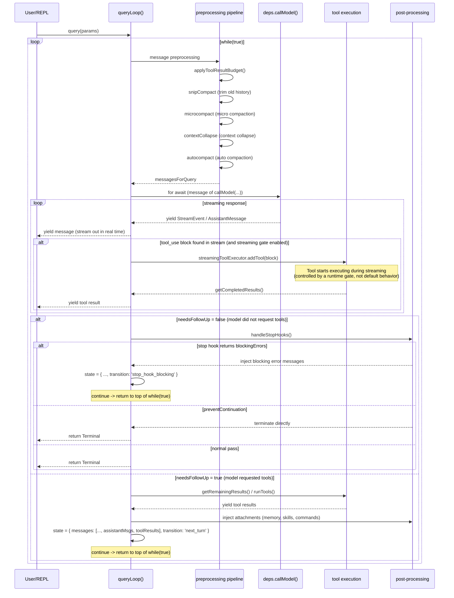

# Chapter 5: QueryEngine and the Conversation Main Loop — the Heartbeat of a Complete AI Interaction

> This is chapter 5 of the *Deep Dive into Claude Code Source* series. We will dig into `query.ts`, a 1,729-line core file, and uncover how a complete AI conversation is driven: from message assembly, API calls, and tool execution to error recovery. The goal is to understand the "heartbeat" of this Agent runtime.

## Why Understand the Conversation Loop?

If Claude Code were a human body, `query.ts` would be its **heart**: the orchestration entrypoint for the conversation main loop (对话主循环). Of course, the heart needs a vascular system to work: retry logic lives in `services/api/withRetry.ts`, tool execution in `services/tools/`, stop hooks in `query/stopHooks.ts`, and environment configuration in `query/config.ts`. This chapter covers that entire "circulatory system," not just `query.ts` in isolation. Every user question triggers this loop:

```
user input -> assemble messages -> call API -> model returns -> execute tools -> send results back -> model continues...
```

The loop looks simple, but the real engineering complexity is far higher than it first appears. A production-grade AI conversation loop must handle:

- **Streaming responses**: model responses stream back token by token, and tool calls may start executing in the middle of the stream.
- **Multi-layer compaction**: conversation history can exceed the context window at any time, so multiple strategies are needed to compact it automatically.
- **Error recovery**: API overload, context too long, truncated output... each error has its own recovery path.
- **Model fallback**: when the primary model is unavailable, automatically switch to a fallback model.
- **Concurrent tool execution**: read-only tools can run in parallel, while write tools must run serially.

This chapter expands the loop layer by layer, from the macro view down to the implementation details.

> **Reading map (three-layer structure)**:
> - **Facade layer**: `QueryEngine.ts` (1,295 lines) — one `QueryEngine` instance per conversation, responsible for session-level state, SDK translation, and termination branches (see §11).
> - **Kernel layer**: `query.ts` (1,729 lines) — a stateless AsyncGenerator; `query()` / `queryLoop()` is the real core that drives one request-tool-retry cycle (§1-§10).
> - **Cross-cutting layer**: `query/` submodules (four small files, about 652 lines total) — `config.ts` / `deps.ts` / `stopHooks.ts` / `tokenBudget.ts`, the cross-cutting (横切) concerns of `query.ts` (§12).
>
> The first 10 sections look at `query.ts` from the kernel perspective; §11 returns to the `QueryEngine` facade; §12 closes with the `query/` submodules.

---

## 1. Global View: an AsyncGenerator-Driven State Machine

### 1.1 The Signature of query()

The core of `query.ts` is two nested AsyncGenerator functions:

```typescript
// query.ts:219-239
export async function* query(
  params: QueryParams,
): AsyncGenerator<
  | StreamEvent
  | RequestStartEvent
  | Message
  | TombstoneMessage
  | ToolUseSummaryMessage,
  Terminal
> {
  const consumedCommandUuids: string[] = []
  const terminal = yield* queryLoop(params, consumedCommandUuids)
  // Notify consumed commands on normal exit
  for (const uuid of consumedCommandUuids) {
    notifyCommandLifecycle(uuid, 'completed')
  }
  return terminal
}
```

`query()` is a thin wrapper; the real logic lives in `queryLoop()`. The purpose of this layered design is: **command lifecycle notifications run only on normal exit**. If `queryLoop()` throws or is closed via `.return()`, the `for...of` loop will not run. That is exactly the intended behavior, because an exception means the command did not complete successfully.

### 1.2 Why Use AsyncGenerator?

`query()` returns an `AsyncGenerator`, not a `Promise`. This is a key architectural decision. AsyncGenerator lets the conversation loop:

1. **Stream events out**: every intermediate result (streaming token, tool execution progress, compaction notice) is yielded one by one, and the caller (REPL or SDK) consumes it in real time.
2. **Support bidirectional communication**: the caller can terminate the loop at any time via `.return()` (for example, when the user presses Ctrl+C).
3. **Defer computation**: the loop advances only when the caller pulls from it, giving natural backpressure control.

### 1.3 QueryParams: the Input Contract for the Conversation Loop

```typescript
// query.ts:181-199
export type QueryParams = {
  messages: Message[]           // Conversation history
  systemPrompt: SystemPrompt    // System prompt
  userContext: { [k: string]: string }   // User context (injected before messages)
  systemContext: { [k: string]: string } // System context (appended after the system prompt)
  canUseTool: CanUseToolFn      // Permission check function
  toolUseContext: ToolUseContext // Runtime context container
  fallbackModel?: string        // Fallback model
  querySource: QuerySource      // Query source identifier
  maxTurns?: number             // Maximum turn limit
  taskBudget?: { total: number } // API task_budget
  deps?: QueryDeps              // Dependency injection (for tests)
}
```

Here, `QueryDeps` is a carefully designed dependency injection interface:

```typescript
// query/deps.ts:21-31
export type QueryDeps = {
  callModel: typeof queryModelWithStreaming  // API call
  microcompact: typeof microcompactMessages // Micro compaction
  autocompact: typeof autoCompactIfNeeded   // Auto compaction
  uuid: () => string                        // UUID generation
}
```

Production uses `productionDeps()` to return the real implementations; tests inject fakes. This is cleaner than `spyOn`-style module mocks. `callModel` and `autocompact` were spied on in six to eight test files, and dependency injection removes that repeated boilerplate.

### 1.4 State: the Loop's Mutable State

The mutable state shared by each iteration is wrapped in a `State` type:

```typescript
// query.ts:204-217
type State = {
  messages: Message[]                    // Current message array
  toolUseContext: ToolUseContext          // Tool execution context
  autoCompactTracking: AutoCompactTrackingState | undefined
  maxOutputTokensRecoveryCount: number   // Output truncation recovery count
  hasAttemptedReactiveCompact: boolean   // Whether reactive compaction has been attempted
  maxOutputTokensOverride: number | undefined
  pendingToolUseSummary: Promise<ToolUseSummaryMessage | null> | undefined
  stopHookActive: boolean | undefined
  turnCount: number                      // Turn count
  transition: Continue | undefined       // Why the previous iteration continued
}
```

Notice the `transition` field: it records **why the previous iteration hit `continue`**. This is not just for debugging; it also controls recovery logic. For example, if `collapse_drain_retry` is followed by another 413 (context too long), the loop does not drain again and instead falls through to reactive compact.

There are **7+ `continue` sites** in the loop, and each site writes the new state via `state = { ... }`. One important caveat: this is not a highly formalized single-layer closed-loop state machine. It is closer to a **main loop + several recovery `continue` points + multiple early exits** hybrid. In addition to the `continue` sites in the table below, there is an inner `while` loop driven by `attemptWithFallback`, exception paths, an abort early return (`return { reason: 'aborted_streaming' }`), and several normal termination branches (`return { reason: 'completed' / 'image_error' / 'prompt_too_long' / ... }`):

| `continue` site | `transition.reason` | Trigger condition |
|---|---|---|
| Context collapse drain | `collapse_drain_retry` | Drain pending collapse summaries when prompt-too-long occurs |
| Reactive compact retry | `reactive_compact_retry` | Retry after a full compaction triggered by a 413 error |
| Output token escalation | `max_output_tokens_escalate` | Hit the default 8k limit and escalate to 64k |
| Multi-turn output truncation recovery | `max_output_tokens_recovery` | Output was truncated; inject a recovery message and retry (up to three times) |
| Stop Hook blocking | `stop_hook_blocking` | A stop hook returned blocking errors |
| Token Budget continuation | `token_budget_continuation` | Continue execution because the token budget is not exhausted |
| Next turn after tool execution | `next_turn` | Normal tool result round-trip |

---

## 2. The Complete Loop Sequence

The following Mermaid sequence diagram shows one complete conversation loop **with tool calls**:



---

## 3. Message Preprocessing Pipeline

Before each API call, messages pass through a multi-stage preprocessing pipeline. The pipeline follows one principle: **the lighter a compaction strategy is, the earlier it runs; the heavier it is, the later it runs**.

### 3.1 Pipeline Stages

```typescript
// query.ts:365-468 (simplified)
// 1. Trim tool results by budget
messagesForQuery = await applyToolResultBudget(messagesForQuery, ...)

// 2. History trimming (snip compact)
if (feature('HISTORY_SNIP')) {
  const snipResult = snipModule!.snipCompactIfNeeded(messagesForQuery)
  messagesForQuery = snipResult.messages
}

// 3. Micro compaction (microcompact)
const microcompactResult = await deps.microcompact(messagesForQuery, ...)
messagesForQuery = microcompactResult.messages

// 4. Context collapse
if (feature('CONTEXT_COLLAPSE') && contextCollapse) {
  const collapseResult = await contextCollapse.applyCollapsesIfNeeded(...)
  messagesForQuery = collapseResult.messages
}

// 5. Auto compaction (autocompact)
const { compactionResult } = await deps.autocompact(messagesForQuery, ...)
```

**Why does this order matter?**

- **snip** and **microcompact** are local operations. They require no API call and have zero network cost. Running them first may already bring the token count below the autocompact threshold.
- **context collapse** runs before autocompact because if collapse alone can reduce the token count below the threshold, there is no need for a full autocompact summary, preserving more fine-grained context.
- **autocompact** is the heaviest step: it needs a full API call to generate a conversation summary.

### 3.2 Final Assembly of the System Prompt

```typescript
// query.ts:449-451
const fullSystemPrompt = asSystemPrompt(
  appendSystemContext(systemPrompt, systemContext),
)
```

`systemContext` is appended to the end of the system prompt, while `userContext` is prepended to the message array when calling the API (`prependUserContext(messagesForQuery, userContext)`). This separation ensures that:

- **systemContext** (such as MCP instructions and Agent rules) is part of the system prompt and benefits from prompt cache.
- **userContext** (such as session-specific context) is a user message and does not affect the system prompt cache hit rate.

---

## 4. API Calls and Streaming Response Handling

### 4.1 Calling the Model

API calls are initiated through `deps.callModel()`. The production implementation of `callModel` is `queryModelWithStreaming` (defined in `services/api/claude.ts:752`), which is itself an AsyncGenerator:

```typescript
// services/api/claude.ts:752-780
export async function* queryModelWithStreaming({
  messages, systemPrompt, thinkingConfig, tools, signal, options,
}: { ... }): AsyncGenerator<
  StreamEvent | AssistantMessage | SystemAPIErrorMessage,
  void
> {
  return yield* withStreamingVCR(messages, async function* () {
    yield* queryModel(messages, systemPrompt, thinkingConfig, tools, signal, options)
  })
}
```

`withStreamingVCR` is a "videotape" middleware: in debug mode, it records and replays API responses for testing and reproduction.

### 4.2 `withRetry`: a Retry Layer for Unreliable Networks

Inside `queryModel`, the real API call is wrapped by `withRetry`. `withRetry` is also an AsyncGenerator. It yields retry status messages (such as "API error, retrying in 2s...") so the caller can display them in the UI in real time:

```typescript
// services/api/withRetry.ts:170-178
export async function* withRetry<T>(
  getClient: () => Promise<Anthropic>,
  operation: (client: Anthropic, attempt: number, context: RetryContext) => Promise<T>,
  options: RetryOptions,
): AsyncGenerator<SystemAPIErrorMessage, T> {
  const maxRetries = getMaxRetries(options)
  // ...
  for (let attempt = 1; attempt <= maxRetries + 1; attempt++) {
    // ...
  }
}
```

The retry strategy has several key design points:

**1. Distinguish foreground and background queries**

```typescript
// services/api/withRetry.ts:62-82
const FOREGROUND_529_RETRY_SOURCES = new Set<QuerySource>([
  'repl_main_thread',
  'sdk',
  'agent:custom',
  'compact',
  // ...
])
```

529 (overload) errors are retried only for **foreground queries**. Background queries, such as title generation and tool summaries, give up immediately. During a capacity cascade, each retry creates 3-10x gateway amplification, and users cannot see those background task failures anyway.

**2. Exponential backoff + Retry-After**

```typescript
// services/api/withRetry.ts:530-548
export function getRetryDelay(
  attempt: number,
  retryAfterHeader?: string | null,
  maxDelayMs = 32000,
): number {
  if (retryAfterHeader) {
    const seconds = parseInt(retryAfterHeader, 10)
    if (!isNaN(seconds)) return seconds * 1000
  }
  const baseDelay = Math.min(BASE_DELAY_MS * Math.pow(2, attempt - 1), maxDelayMs)
  const jitter = Math.random() * 0.25 * baseDelay
  return baseDelay + jitter
}
```

The base delay is 500 ms, grows exponentially up to a 32 s cap, and adds 25% jitter. If the API returns a `Retry-After` header, the server's instruction takes precedence.

**3. Fallback path after three consecutive 529s (with conditional gates)**

```typescript
// services/api/withRetry.ts:326-365
if (
  is529Error(error) &&
  (process.env.FALLBACK_FOR_ALL_PRIMARY_MODELS ||
    (!isClaudeAISubscriber() && isNonCustomOpusModel(options.model)))
) {
  consecutive529Errors++
  if (consecutive529Errors >= MAX_529_RETRIES) {
    if (options.fallbackModel) {
      throw new FallbackTriggeredError(options.model, options.fallbackModel)
    }
    // If there is no fallback model, report an error directly to external users
    if (process.env.USER_TYPE === 'external' && !isPersistentRetryEnabled()) {
      throw new CannotRetryError(new Error(REPEATED_529_ERROR_MESSAGE), retryContext)
    }
  }
}
```

Note the gate here: **not every 529 increments the fallback counter**. A 529 increments `consecutive529Errors` only under specific model/subscription conditions: the `FALLBACK_FOR_ALL_PRIMARY_MODELS` environment variable is set, or a non-Claude AI subscriber is using a non-custom Opus model. The TODO comment in the source also implies that the `isNonCustomOpusModel` check may be historical residue from early Claude Code hard-coding around Opus models. After three consecutive qualifying 529s, it throws `FallbackTriggeredError`, which is taken over by the fallback handling logic in `queryLoop()` (see §5.1 below).

**4. Persistent Retry mode**

For unattended sessions (`CLAUDE_CODE_UNATTENDED_RETRY`), 429/529 errors retry indefinitely, with a maximum backoff of five minutes and a heartbeat message yielded every 30 seconds so the host environment does not treat the session as idle:

```typescript
// services/api/withRetry.ts:96-98
const PERSISTENT_MAX_BACKOFF_MS = 5 * 60 * 1000    // 5 minutes
const PERSISTENT_RESET_CAP_MS = 6 * 60 * 60 * 1000 // 6 hours
const HEARTBEAT_INTERVAL_MS = 30_000                 // 30 seconds
```

### 4.3 Streaming Response Handling

`queryLoop()` consumes the streaming response with `for await...of`:

```typescript
// query.ts:659-863 (core flow, simplified)
for await (const message of deps.callModel({ ... })) {
  // 1. Handle streaming fallback
  if (streamingFallbackOccured) {
    // Clear all collected messages and reset the tool executor
    // Yield tombstones to mark discarded messages
  }

  // 2. Withhold recoverable error messages
  let withheld = false
  if (isPromptTooLongMessage(message)) withheld = true
  if (isWithheldMaxOutputTokens(message)) withheld = true
  if (!withheld) yield yieldMessage  // Stream normal messages out in real time

  // 3. Collect assistant messages and tool_use blocks
  if (message.type === 'assistant') {
    assistantMessages.push(message)
    const toolBlocks = message.message.content.filter(c => c.type === 'tool_use')
    if (toolBlocks.length > 0) {
      toolUseBlocks.push(...toolBlocks)
      needsFollowUp = true
    }
  }

  // 4. Streaming tool execution: tools start during API streaming
  if (streamingToolExecutor) {
    for (const toolBlock of msgToolUseBlocks) {
      streamingToolExecutor.addTool(toolBlock, message)
    }
    for (const result of streamingToolExecutor.getCompletedResults()) {
      yield result.message
      toolResults.push(...)
    }
  }
}
```

There is an important concept in this code: **withholding**. When a recoverable error such as prompt-too-long or max_output_tokens arrives, it is not yielded to the caller immediately. Instead, the loop waits for the stream to finish and then attempts recovery. If recovery succeeds, the caller **never sees the error**. If recovery fails, the error is yielded.

> Source comments explain why max_output_tokens errors must be withheld (`query.ts:166-179`): if they were yielded early to SDK callers such as Cowork/Desktop, those callers would terminate the session as soon as they saw the error field, even though the recovery loop might still be running successfully.

---

## 5. Error Recovery: Seven Layers of Defense

### 5.1 Fallback Model Switching

When `withRetry` throws `FallbackTriggeredError`, the inner `try...catch` in `queryLoop()` takes over:

```typescript
// query.ts:893-953 (simplified)
} catch (innerError) {
  if (innerError instanceof FallbackTriggeredError && fallbackModel) {
    currentModel = fallbackModel

    // 1. Generate tool_result error blocks for discarded assistant messages
    yield* yieldMissingToolResultBlocks(assistantMessages, 'Model fallback triggered')

    // 2. Clear all collected state
    assistantMessages.length = 0
    toolResults.length = 0
    toolUseBlocks.length = 0

    // 3. Discard pending results from the streaming tool executor
    if (streamingToolExecutor) {
      streamingToolExecutor.discard()
      streamingToolExecutor = new StreamingToolExecutor(...)
    }

    // 4. Strip thinking signature blocks (prevents cross-model 400 errors)
    if (process.env.USER_TYPE === 'ant') {
      messagesForQuery = stripSignatureBlocks(messagesForQuery)
    }

    // 5. Notify the user
    yield createSystemMessage(
      `Switched to ${renderModelName(fallbackModel)} due to high demand...`
    )

    attemptWithFallback = true
    continue  // Re-run the inner while loop
  }
  throw innerError
}
```

Step 4, `stripSignatureBlocks()`, is the subtle detail. Thinking signatures are model-bound: a protected-thinking block produced by the capybara model will trigger a 400 error if replayed to the opus model. So fallback must strip those blocks.

### 5.2 Three-Level Recovery for Prompt-Too-Long (413)

When the API returns a prompt-too-long error, recovery strategies are attempted in increasing cost order:

```
Level 1: Context Collapse Drain (zero API cost)
    ↓ failure
Level 2: Reactive Compact (one API call for a full summary)
    ↓ failure
Level 3: Surface Error (report the error to the user)
```

```typescript
// query.ts:1085-1183 (simplified)
if (isWithheld413) {
  // Level 1: drain pending context-collapse summaries
  if (feature('CONTEXT_COLLAPSE') && state.transition?.reason !== 'collapse_drain_retry') {
    const drained = contextCollapse.recoverFromOverflow(messagesForQuery, querySource)
    if (drained.committed > 0) {
      state = { ..., transition: { reason: 'collapse_drain_retry' } }
      continue  // Retry the API call
    }
  }
}

if (isWithheld413 || isWithheldMedia) {
  // Level 2: reactive compaction
  const compacted = await reactiveCompact.tryReactiveCompact({
    hasAttempted: hasAttemptedReactiveCompact,
    // ...
  })
  if (compacted) {
    state = { ..., hasAttemptedReactiveCompact: true, transition: { reason: 'reactive_compact_retry' } }
    continue
  }

  // Level 3: recovery failed, expose the error
  yield lastMessage
  return { reason: 'prompt_too_long' }
}
```

The `hasAttemptedReactiveCompact` flag prevents infinite loops. If the loop still gets a 413 after compaction, the compacted context is still too long, so further compaction is meaningless.

### 5.3 Two-Stage Recovery for Max-Output-Tokens

When model output is truncated (`stop_reason === 'max_output_tokens'`), recovery has two steps:

**Stage 1: escalate the output limit**

If the current limit is the 8k default (`CAPPED_DEFAULT_MAX_TOKENS`), first try escalating to 64k (`ESCALATED_MAX_TOKENS`). This injects no recovery message; it simply retries the same request:

```typescript
// query.ts:1199-1221
if (capEnabled && maxOutputTokensOverride === undefined) {
  state = { ..., maxOutputTokensOverride: ESCALATED_MAX_TOKENS,
    transition: { reason: 'max_output_tokens_escalate' } }
  continue
}
```

**Stage 2: multi-turn recovery**

If 64k is still not enough, inject a recovery message that asks the model to continue from the break point, up to three times:

```typescript
// query.ts:1223-1251
if (maxOutputTokensRecoveryCount < MAX_OUTPUT_TOKENS_RECOVERY_LIMIT) {
  const recoveryMessage = createUserMessage({
    content: `Output token limit hit. Resume directly — no apology, no recap...`,
    isMeta: true,
  })
  state = {
    messages: [...messagesForQuery, ...assistantMessages, recoveryMessage],
    maxOutputTokensRecoveryCount: maxOutputTokensRecoveryCount + 1,
    transition: { reason: 'max_output_tokens_recovery', attempt: ... },
    // ...
  }
  continue
}
```

The wording of the recovery message is deliberate: **"no apology, no recap"**. Without this instruction, the model tends to say "Sorry, let me continue the previous work" on every recovery, wasting additional output tokens.

---

## 6. Tool Execution

### 6.1 Two Execution Modes

After the model returns a `tool_use` block, there are two execution paths:

```typescript
// query.ts:1380-1382
const toolUpdates = streamingToolExecutor
  ? streamingToolExecutor.getRemainingResults()
  : runTools(toolUseBlocks, assistantMessages, canUseTool, toolUseContext)
```

| Mode | Implementation | Characteristics |
|------|------|------|
| Streaming Tool Execution | `StreamingToolExecutor` | Tools start executing during API streaming |
| Batch Tool Execution | `runTools()` | Execute tools in batch after the API response completes |

Streaming mode is controlled by the Statsig Feature Gate (`tengu_streaming_tool_execution2`). In this mode, every arriving `tool_use` block is added to the execution queue immediately:

```typescript
// query.ts:838-844
if (streamingToolExecutor && !toolUseContext.abortController.signal.aborted) {
  for (const toolBlock of msgToolUseBlocks) {
    streamingToolExecutor.addTool(toolBlock, message)
  }
}
```

### 6.2 Concurrency-Safe Partitioning

Regardless of execution mode, tool execution follows the same concurrency rules. In `toolOrchestration.ts`, `partitionToolCalls()` divides tool calls into two kinds of batches:

```typescript
// services/tools/toolOrchestration.ts:91-100
function partitionToolCalls(toolUseMessages, toolUseContext): Batch[] {
  return toolUseMessages.reduce((acc, toolUse) => {
    const tool = findToolByName(toolUseContext.options.tools, toolUse.name)
    const isConcurrencySafe = tool?.isConcurrencySafe(parsedInput)
    // ...
  }, [])
}
```

- **Concurrent-safe batches** (such as Grep, Glob, and FileRead): run in parallel with `runToolsConcurrently()`, with maximum concurrency 10.
- **Non-concurrent batches** (such as FileEdit and BashTool): run serially with `runToolsSerially()`.

The partitioning algorithm preserves the original tool order. Consecutive read-only tools are merged into one concurrent batch; a write tool starts a new serial batch:

```
[Grep, Glob, FileRead, FileEdit, Grep, FileRead]
 └── concurrent batch ─┘  └ serial ┘  └── concurrent batch ─┘
```

### 6.3 StreamingToolExecutor Discard and Cancellation Mechanisms

When streaming fallback or model switching occurs, tool results that are already executing must be discarded:

```typescript
// services/tools/StreamingToolExecutor.ts:69-71
discard(): void {
  this.discarded = true
}
```

`discard()` makes the tool results from the failed attempt **sink as a whole**. After the flag is set, both `getCompletedResults()` and `getRemainingResults()` return empty arrays directly (`StreamingToolExecutor.ts:412-415, 453-456`), yielding no results. The caller then creates a fresh `StreamingToolExecutor` instance to serve the fallback request.

The actual synthetic error `tool_result` is generated by a separate mechanism: `getAbortReason()` (`StreamingToolExecutor.ts:210-231`). When an abort signal is detected during tool execution, `getAbortReason()` returns a cancellation reason based on `this.discarded`, `this.hasErrored`, and `abortController.signal.aborted`: `streaming_fallback`, `sibling_error`, or `user_interrupted`. Then `executeTool()` uses that reason to create a synthetic error block (`StreamingToolExecutor.ts:276-291`).

The division of labor is:

- **`discard()`**: called after the stream ends, making completed-but-not-yielded results **disappear silently**.
- **`getAbortReason()`**: checked during tool execution, generating **API-protocol-compliant `tool_result` error blocks** for running or queued tools.

---

## 7. Attachment Injection: Memory, Skill, Command

After tool execution completes and before the next loop starts, `queryLoop()` injects a series of "attachment" messages:

```typescript
// query.ts:1580-1628 (simplified)
// 1. General attachments (file-change notifications, queued commands, etc.)
for await (const attachment of getAttachmentMessages(
  null, updatedToolUseContext, null, queuedCommandsSnapshot,
  [...messagesForQuery, ...assistantMessages, ...toolResults], querySource,
)) {
  yield attachment
  toolResults.push(attachment)
}

// 2. Memory prefetch results
if (pendingMemoryPrefetch?.settledAt !== null && pendingMemoryPrefetch?.consumedOnIteration === -1) {
  const memoryAttachments = filterDuplicateMemoryAttachments(
    await pendingMemoryPrefetch.promise,
    toolUseContext.readFileState,
  )
  for (const memAttachment of memoryAttachments) {
    const msg = createAttachmentMessage(memAttachment)
    yield msg
    toolResults.push(msg)
  }
  pendingMemoryPrefetch.consumedOnIteration = turnCount - 1
}

// 3. Skill discovery results
if (skillPrefetch && pendingSkillPrefetch) {
  const skillAttachments = await skillPrefetch.collectSkillDiscoveryPrefetch(pendingSkillPrefetch)
  for (const att of skillAttachments) {
    const msg = createAttachmentMessage(att)
    yield msg
    toolResults.push(msg)
  }
}
```

Memory prefetch uses the ES2024 `using` keyword (explicit resource management):

```typescript
// query.ts:301-304
using pendingMemoryPrefetch = startRelevantMemoryPrefetch(
  state.messages, state.toolUseContext,
)
```

`using` ensures that, no matter how the loop exits (normal return, exception, or `.return()`), the prefetch resource is correctly cleaned up (disposed). Prefetch starts at the loop entry and is consumed **non-blockingly** during each iteration's post-processing stage. If the prefetch has not completed yet, that iteration skips it and tries again in the next iteration.

---

## 8. QueryConfig: an Immutable Environment Snapshot

At the entrypoint of `queryLoop()`, the environment configuration is snapshotted once:

```typescript
// query/config.ts:15-27
export type QueryConfig = {
  sessionId: SessionId
  gates: {
    streamingToolExecution: boolean  // Statsig gate
    emitToolUseSummaries: boolean    // Environment variable
    isAnt: boolean                   // Internal user
    fastModeEnabled: boolean         // Fast mode
  }
}
```

Why snapshot? Because Statsig Feature Gate values can change during a session (`CACHED_MAY_BE_STALE`), but one execution of the conversation loop should behave consistently. The snapshot freezes the "current gate values" as immutable data, avoiding inconsistencies caused by a gate flipping in the middle of the loop.

Notice that `QueryConfig` **deliberately excludes `feature()` gates**. The source comment (`query/config.ts:14`) explains why: `feature()` is a compile-time constant and must remain inline inside `if (feature('...'))` so Bun's Dead Code Elimination can remove the entire branch from the build output. If the value of `feature()` were stored in `QueryConfig`, the DCE condition would be broken because the compiler could not determine whether `config.gates.someFeature` is `true` or `false`.

---

## 9. How `feature()` Is Used in query.ts

The top of `query.ts` has several `feature()`-gated conditional loads:

```typescript
// query.ts:15-21
const reactiveCompact = feature('REACTIVE_COMPACT')
  ? (require('./services/compact/reactiveCompact.js') as typeof import('./services/compact/reactiveCompact.js'))
  : null
const contextCollapse = feature('CONTEXT_COLLAPSE')
  ? (require('./services/contextCollapse/index.js') as typeof import('./services/contextCollapse/index.js'))
  : null
```

These `feature() + require()` combinations ensure that:

1. **External builds do not include the code from these modules**: when `feature()` is `false`, the `require()` is removed by DCE.
2. **`require()` is used instead of `import`**: static `import` statements are included in the bundler dependency graph regardless of conditions.
3. **Type safety is preserved through `as typeof import()`**: TypeScript type information is not lost.

Modules gated by `feature()` in `query.ts` include:

| feature gate | Module | Functionality |
|---|---|---|
| `REACTIVE_COMPACT` | `reactiveCompact.js` | Reactive compaction after a 413 error |
| `CONTEXT_COLLAPSE` | `contextCollapse/index.js` | Context collapse (segmented summaries) |
| `HISTORY_SNIP` | `snipCompact.js` | History message trimming |
| `EXPERIMENTAL_SKILL_SEARCH` | `skillSearch/prefetch.js` | Skill discovery prefetch |
| `TEMPLATES` | `jobs/classifier.js` | Template task classification |
| `BG_SESSIONS` | `taskSummary.js` | Background session summary |
| `TOKEN_BUDGET` | `tokenBudget.js` | Token budget control |

---

## 10. Transferable Design Patterns

### Pattern 1: AsyncGenerator State Machine

Use `while(true)` + `yield` + `state = { ..., transition }` to implement an explicit state machine. The `transition` field records the jump reason, which makes debugging easier and lets later iterations decide behavior based on the previous jump reason, such as avoiding repeated recovery.

**When to use it**: any long-running task that needs multi-turn interaction, error recovery, and interruption. Compared with recursive calls (early Claude Code used recursion), a `while(true)` state machine has no stack overflow risk, and every field in `State` is visible at a glance.

### Pattern 2: Withhold-Recover

In streaming processing, do **not report recoverable errors to the caller immediately**. Withhold first, attempt recovery, and only expose the error if recovery fails. If recovery succeeds, the caller is unaware anything happened. This prevents downstream consumers from reacting incorrectly to intermediate states.

**When to use it**: any consumption layer for a streaming API, such as frontend WebSocket message handling or retry logic in data pipelines.

### Pattern 3: Minimal Dependency Injection Interface

`QueryDeps` has only four methods (`callModel`, `microcompact`, `autocompact`, `uuid`) and uses `typeof realFunction` to keep signatures in sync. This is much lighter than mocking an entire module or introducing a DI framework.

**When to use it**: any core business logic that needs unit testing. The key is to inject only the **I/O boundaries that truly need replacement**, not every dependency.

---

## 11. Facade Layer QueryEngine.ts: Session-Level State and SDK Translation

The first nine sections covered "what happens inside one turn," but the `query()` kernel is not the entrypoint that SDK callers face directly. Between the SDK and `query()` sits a 1,295-line facade: `QueryEngine.ts`. This layer is not as visibly dominant as `query.ts`, but it handles several things that `query()` intentionally does not.

### 11.1 One Session vs One Turn

`query()` is stateless: the same message array can be fed to it repeatedly, and each invocation starts a new `while(true)` round from scratch. Session-level state, such as which messages have been persisted, current cumulative token usage, and which tool calls the user has actively denied, is gathered inside the `QueryEngine` class:

```typescript
// QueryEngine.ts:184-207 (abridged)
export class QueryEngine {
  private config: QueryEngineConfig
  private mutableMessages: Message[]
  private abortController: AbortController
  private permissionDenials: SDKPermissionDenial[]
  private totalUsage: NonNullableUsage
  private discoveredSkillNames = new Set<string>()
  private loadedNestedMemoryPaths = new Set<string>()
  // ...
}
```

The comments state the boundary plainly: **one `QueryEngine` per conversation, and each `submitMessage()` starts a new turn in the same session** (`QueryEngine.ts:175-183`). In other words, mutable state in the facade layer is "shared across turns and isolated across conversations." `mutableMessages` accumulates across multiple turns, while `discoveredSkillNames` is cleared at the entrypoint of each `submitMessage` to prevent the Set from growing without bound in long sessions.

### 11.2 submitMessage: Before Feeding One Turn to the Kernel

`submitMessage()` is itself an AsyncGenerator (`QueryEngine.ts:209-1156`). Before calling `query()`, it performs a series of preparations that "are not query's concern, but must happen every turn":

1. **System prompt assembly** (`QueryEngine.ts:284-325`): `fetchSystemPromptParts()` fetches the base system prompt, then layers in the SDK caller's `customSystemPrompt` / `appendSystemPrompt`, and injects memory mechanism instructions when needed.
2. **Second wrapping of the permission closure** (`QueryEngine.ts:244-271`): the original `canUseTool` is wrapped as `wrappedCanUseTool`, adding one step: record every deny decision into the `permissionDenials` array, which is eventually reported to the SDK together with the `result` message.
3. **Constructing `processUserInput` twice** (`QueryEngine.ts:335-395, 492-527`): because slash commands may rewrite messages or switch models after the first construction, context must be rebuilt after slash command processing. That way, the later `query()` call receives the final effective `mainLoopModel`.
4. **Two-phase session persistence** (`QueryEngine.ts:450-463, 717-732`): user messages are written to the transcript **before the API call**. The comments explain why: if transcript writing waited until assistant messages came back, a process killed halfway through (for example, by the Cowork/Desktop "Stop" button) would leave the transcript with only queued operation records, and `--resume` would report "No conversation found".

Only after all of this does `for await (const message of query({ ... }))` run (`QueryEngine.ts:675-1049`), feeding the prepared message array, system prompt, wrapped `canUseTool`, `fallbackModel`, `maxTurns`, and `taskBudget` to the kernel.

### 11.3 How Does the Facade Consume Messages Yielded by the Kernel?

`query()` yields nine event types (`tombstone` / `assistant` / `progress` / `user` / `stream_event` / `attachment` / `stream_request_start` / `system` / `tool_use_summary`). These align one-for-one with the `case` branches in the `switch (message.type)` block inside `submitMessage()` (`QueryEngine.ts:757-969`) and the yield union type in `query.ts:219-227`. SDK callers do not want to deal with this internal representation directly, so this switch translates "kernel event -> SDK message":

- A `compact_boundary` system message triggers one extra transcript truncation (`QueryEngine.ts:701-715, 922-942`): old messages that have been compacted away are spliced out of `mutableMessages`, allowing GC to reclaim them.
- An `attachment` with `type === 'max_turns_reached'` is query's "I hit the wall" signal to the facade. The facade translates it into a `result` message with `subtype: 'error_max_turns'` and returns directly.
- `message_delta` inside `stream_event` is the only place with the real `stop_reason`: assistant messages yielded early by the kernel still have `stop_reason` as `null`, so the facade captures it here (`QueryEngine.ts:802-808`).
- `stream_event` is passed through only when the user provided `includePartialMessages: true`; otherwise, it is used only for internal usage accounting.

### 11.4 Termination Branches: Four Ways to End

The exit branches of `submitMessage` are also outside the view of `query()`. In addition to the normal `success` return, the facade may actively `return` inside the loop:

| subtype | Trigger condition | Anchor |
|---|---|---|
| `error_max_turns` | The kernel yields a `max_turns_reached` attachment | `QueryEngine.ts:842-873` |
| `error_max_budget_usd` | `getTotalCost() >= maxBudgetUsd` after each message | `QueryEngine.ts:972-1002` |
| `error_max_structured_output_retries` | `jsonSchema` is configured and `SyntheticOutputTool` calls exceed `MAX_STRUCTURED_OUTPUT_RETRIES` (default 5) | `QueryEngine.ts:1004-1048` |
| `error_during_execution` | The loop completes but `isResultSuccessful()` rejects it (the last message is not a valid assistant/user message) | `QueryEngine.ts:1082-1118` |

The last branch, `error_during_execution`, uses a **reference-style watermark** in `errors[]`: `errorLogWatermark = getInMemoryErrors().at(-1)` (`QueryEngine.ts:669`). It stores a direct object reference instead of an array index to avoid index drift when the log ring buffer is shifted during the turn. If the referenced object has already been evicted from the buffer, `lastIndexOf` returns -1 and the logic safely falls back to "dump everything."

### 11.5 ask(): a Convenience Wrapper for One-Shot Sessions

If the caller does not need multiple turns and only wants one question-answer session, `ask()` (`QueryEngine.ts:1186-1295`) is a convenience wrapper around `new QueryEngine() + submitMessage()`. The comment states the relationship plainly: `QueryEngine` is an independent class extracted from `ask()`, with the goal of letting headless/SDK paths and the REPL share it "in a future phase" (`QueryEngine.ts:176-178`). Whether the REPL has already switched is not something this chapter can prove or disprove from the source.

`ask()` itself adds only one thing: it injects the `snipReplay` callback corresponding to the `HISTORY_SNIP` feature into `QueryEngineConfig` (`QueryEngine.ts:1276-1284`). This is carefully isolated: the `QueryEngine` class itself does not reference `snipCompactIfNeeded`, so when the feature is off, DCE can erase the entire compaction chain from external builds.

---

## 12. `query/` Submodule Overview: Four Small Files, One Responsibility Each

The current `query/` directory has only four files, 652 lines in total (`config.ts:46` + `deps.ts:40` + `stopHooks.ts:473` + `tokenBudget.ts:93`), while `query.ts` itself still has 1,729 lines. After moving cross-cutting concerns into these four files, each file solves one thing that cannot be explained cleanly inside `query.ts`.

### 12.1 `query/config.ts`: Freezing Environment Values for a Session

`buildQueryConfig()` (`query/config.ts:29-46`) does exactly one thing: snapshot three categories of values that are "theoretically mutable, but should remain consistent for one loop" — Statsig gates, environment variables, and session id — into a `QueryConfig` object:

```typescript
// query/config.ts:15-27
export type QueryConfig = {
  sessionId: SessionId
  gates: {
    streamingToolExecution: boolean
    emitToolUseSummaries: boolean
    isAnt: boolean
    fastModeEnabled: boolean
  }
}
```

Why not read `getFeatureValue_CACHED_MAY_BE_STALE` directly inside the loop? Because the `MAY_BE_STALE` in the function name is literal: Statsig's local cache may be refreshed by a background request in the middle of one turn. If the loop enters the streaming tool execution branch at the beginning of the turn and the gate flips halfway through, downstream `discard()` / `getAbortReason()` logic would become inconsistent with whether `streamingToolExecutor` was actually initialized. `buildQueryConfig` freezes those values once at the entrance of `queryLoop` (`query.ts:295`), eliminating mid-loop drift.

The comment at the top of the submodule explicitly excludes `feature()` (`query/config.ts:14`): compile-time `feature('X')` must remain inline inside `if (feature('X'))` so the bundler can delete the whole branch. If it were moved into `QueryConfig.gates`, DCE would stop working. This is the source of the rule: "Statsig gates go into config; `feature()` gates do not."

### 12.2 `query/deps.ts`: Dependency Injection Through Four Openings

The `QueryDeps` type lists only four openings:

```typescript
// query/deps.ts:21-31
export type QueryDeps = {
  callModel: typeof queryModelWithStreaming
  microcompact: typeof microcompactMessages
  autocompact: typeof autoCompactIfNeeded
  uuid: () => string
}
```

`productionDeps()` (`query/deps.ts:33-40`) returns those four real functions. In tests, callers pass a hand-built fake. The comment is explicit: these four openings were chosen because they were "spied on by 6-8 test files." More would become a DI framework; fewer would not cover the real seams. `uuid` is included too: it lets tests provide a deterministic value for `queryTracking.chainId` (`query.ts:353`) without mocking `crypto`.

### 12.3 `query/stopHooks.ts`: What Happens When the Loop Refuses to Leave

`handleStopHooks()` (`query/stopHooks.ts:65-473`) is the thickest file in this group. Its function body spans 409 lines (`stopHooks.ts` is 473 lines total) and does one thing: when `query()` is about to finish the turn, run every hook that asks "does the user want to prevent completion?" and decide whether the loop should return or continue.

Its return type is:

```typescript
// query/stopHooks.ts:60-63
type StopHookResult = {
  blockingErrors: Message[]
  preventContinuation: boolean
}
```

When `blockingErrors` is non-empty, `queryLoop` injects those error messages at the end of `messages` and continues another round with `transition: { reason: 'stop_hook_blocking' }`. This is the source of the stop hook `continue` site in the table in §1.4. `preventContinuation` is the "soft stop" signal outside `executeStopFailureHooks`: it lets the loop exit normally without starting another turn.

`handleStopHooks` also owns a few things that query refuses to touch:

- **`saveCacheSafeParams`** (`query/stopHooks.ts:96-98`): snapshot the current turn's messages/systemPrompt/userContext as "cache-safe parameters" on disk for the REPL's `/btw` command and the SDK's `side_question` control requests.
- **`executeTaskCompletedHooks` / `executeTeammateIdleHooks`**: two teammate-mode-only hook categories, triggered when the current agent is recognized as a teammate (`isTeammate(getAgentName())`).
- **`feature('EXTRACT_MEMORIES')` and `feature('TEMPLATES')`**: two extended compile-time-gated chains — memory extraction at stop time, and classification of the turn result into a template job. In external builds, both entire chains are removed by DCE.

Putting this back into `query.ts` would add nearly 500 lines to the main loop, and these actions do not depend on each other. After extraction into a submodule, the call site in `query.ts` is just `yield* handleStopHooks(...)`.

### 12.4 `query/tokenBudget.ts`: a 93-Line Judge for Budget Continuation

`checkTokenBudget()` (`query/tokenBudget.ts:45-93`) is a small judge called only when the `TOKEN_BUDGET` feature is enabled. Its inputs are how many tokens the current turn has used and the total budget; its output is whether to give the model another nudge message or stop:

```typescript
// query/tokenBudget.ts:3-4
const COMPLETION_THRESHOLD = 0.9
const DIMINISHING_THRESHOLD = 500
```

The two thresholds each handle one concern. `COMPLETION_THRESHOLD` means "if 90% of the budget has been consumed, do not nudge again." `DIMINISHING_THRESHOLD` means "if two consecutive deltas are both under 500 tokens, treat returns as diminishing and force stop." `isDiminishing` also requires `continuationCount >= 3`, ensuring the model gets at least three continuation opportunities and short replies are not misclassified as diminishing.

`BudgetTracker` itself (`query/tokenBudget.ts:6-11`) has only four fields: continuation count, previous delta, previous total, and start timestamp. This "small enough to read at a glance" state object matches the style of this group of submodules. They all refuse to introduce a framework; each file can be understood within one screen.

---

---

## Next Chapter Preview

[Chapter 6: System Prompt and Output Style Injection — a Prompt System for Precise Model Behavior Control](./06-system-prompt-and-output-style-injection.md)

We will dig into constants/prompts.ts and systemPromptSections.ts to reveal how Claude Code assembles thousands of words of system prompts in sections, partitions them for caching, and parses how Output Style is injected into that system as a pluggable personality layer.

---
*For all content, follow https://github.com/luyao618/Claude-Code-Source-Study (a free star would be appreciated).*
