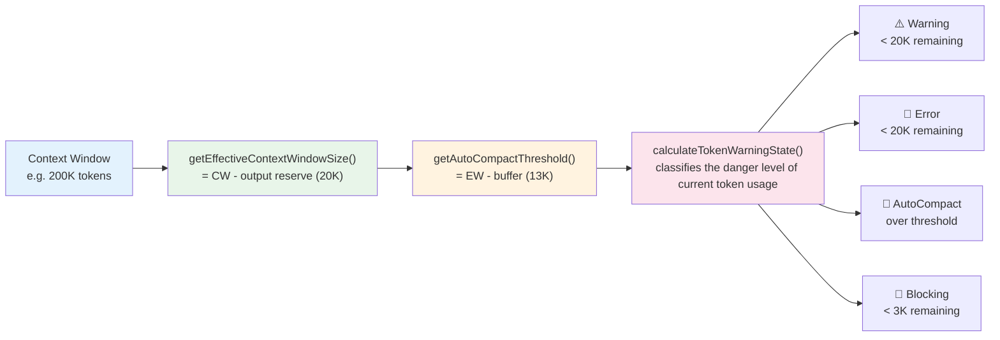

# Chapter 7: The Context Compaction Family — The Secret Behind Infinite Conversations

> This is Chapter 7 of *Deep Dive into Claude Code Source*. We will look at how Claude Code sustains arbitrarily long conversations inside a finite context window — from token-budget management and multi-level compaction strategies to file-state caching and the post-compact context recovery design.
>
> **Scope note**: context *construction* (System Prompt assembly, CLAUDE.md injection, git status capture) was already covered in Chapter 6, and the cross-cutting view of caching strategies will be unfolded in Chapter 8. This chapter focuses on what happens *after* the context has been built — the **compaction, cleanup, and recovery** that kick in when the context window starts running short. The goal: free space and rebuild the working context without ever interrupting the conversation.

## Why context management matters this much

An LLM's context window is bounded. Claude models typically ship with a 200K-token window (some support 1M), which sounds generous, but in real use it burns down fast:

- A single System Prompt may take 5K–15K tokens.
- A user's bundled CLAUDE.md file may take 3K–10K tokens.
- Each tool-call result (e.g. reading a 500-line file) may take 2K–5K tokens.
- One full agentic loop (read file → analyze → edit → run tests) may consume 30K–50K tokens.

In a real coding session, a user may work for several hours and trigger hundreds of tool calls. Without any context management, the window is exhausted quickly and the conversation is forced to halt.

Claude Code's answer is a **multi-tier context-compaction-and-recovery system** — from the lightest-weight Microcompact (clearing tool results) up to the heaviest Full Compact (using the model to summarize the entire conversation), forming a complete graded response to context pressure.

This chapter covers **six compaction / cleanup pipelines (five local + one API-layer declarative one)**, all backed by files under the `services/compact/` directory.

### §0 · Cheat sheet of the six pipelines

| # | Pipeline | Trigger | Source |
|---|---|---|---|
| 1 | **Microcompact** (time-based / cached, two implementations) | Tool-result buildup, lightweight cleanup | `services/compact/microCompact.ts` (time-based: 446–530; cached: 305–399; entrypoint: 253–293) |
| 2 | **API-level Microcompact** (declarative, delegated to the Anthropic API) | Injected by the API layer, no local trimming | `services/compact/apiMicrocompact.ts`; injected via `services/api/claude.ts:1633` |
| 3 | **Auto Compact** (auto-triggers full when over threshold) | Token usage crosses the line | `services/compact/autoCompact.ts` |
| 4 | **Full Compact** (calls the model to summarize the whole conversation) | User runs `/compact` manually, or auto-triggered | `services/compact/compact.ts` + `services/compact/prompt.ts` |
| 5 | **Session Memory Compact** (no model call — session memory *is* the compaction result) | A reusable session memory already exists | `services/compact/sessionMemoryCompact.ts` |
| 6 | **Post-Compact Cleanup** (cache cleanup after compaction) | Any compaction has just finished | `services/compact/postCompactCleanup.ts` |

Helper files (**not** counted as standalone pipelines — they are supporting infrastructure): `grouping.ts`, `compactWarningHook.ts`, `compactWarningState.ts`, `timeBasedMCConfig.ts`. §4 and §5 of this chapter position `FileStateCache` and `compactWarningState` as "supporting state machines" — they are **not** part of the six pipelines.

---

## 1. Token budget management: three key functions

Context management is built on top of precise token-budget arithmetic. Three core functions define the operating boundary of the entire system.



### 1.1 `getEffectiveContextWindowSize()` — the actually usable space

**File**: `services/compact/autoCompact.ts:33-49`

```typescript
const MAX_OUTPUT_TOKENS_FOR_SUMMARY = 20_000

export function getEffectiveContextWindowSize(model: string): number {
  const reservedTokensForSummary = Math.min(
    getMaxOutputTokensForModel(model),
    MAX_OUTPUT_TOKENS_FOR_SUMMARY,
  )
  let contextWindow = getContextWindowForModel(model, getSdkBetas())

  // Allow an environment-variable override (for testing).
  const autoCompactWindow = process.env.CLAUDE_CODE_AUTO_COMPACT_WINDOW
  if (autoCompactWindow) {
    const parsed = parseInt(autoCompactWindow, 10)
    if (!isNaN(parsed) && parsed > 0) {
      contextWindow = Math.min(contextWindow, parsed)
    }
  }

  return contextWindow - reservedTokensForSummary
}
```

This function computes the **token space that is actually available for input**. The key logic:

- Subtract the output reserve (`MAX_OUTPUT_TOKENS_FOR_SUMMARY = 20_000`) from the model's context window (e.g. 200K).
- The 20K reserve is grounded in p99.99 statistics: the maximum size ever observed for a compact summary output is 17,387 tokens.

For a model with a 200K window: `effectiveContextWindow = 200,000 - 20,000 = 180,000`.

### 1.2 `getAutoCompactThreshold()` — the auto-compaction trigger line

**File**: `services/compact/autoCompact.ts:72-91`

```typescript
export const AUTOCOMPACT_BUFFER_TOKENS = 13_000

export function getAutoCompactThreshold(model: string): number {
  const effectiveContextWindow = getEffectiveContextWindowSize(model)
  const autocompactThreshold =
    effectiveContextWindow - AUTOCOMPACT_BUFFER_TOKENS

  // Allow a percentage override (for testing).
  const envPercent = process.env.CLAUDE_AUTOCOMPACT_PCT_OVERRIDE
  if (envPercent) {
    const parsed = parseFloat(envPercent)
    if (!isNaN(parsed) && parsed > 0 && parsed <= 100) {
      const percentageThreshold = Math.floor(
        effectiveContextWindow * (parsed / 100),
      )
      return Math.min(percentageThreshold, autocompactThreshold)
    }
  }

  return autocompactThreshold
}
```

The auto-compact trigger line = effective window − 13K buffer. For a 200K model: `167,000 = 180,000 - 13,000`.

That 13K buffer is deliberate — it guarantees that once the system decides a compaction is needed, there is still enough room to finish the current turn's tool calls and the model's response.

### 1.3 `calculateTokenWarningState()` — the four-level alert system

**File**: `services/compact/autoCompact.ts:93-145`

```typescript
export const WARNING_THRESHOLD_BUFFER_TOKENS = 20_000
export const ERROR_THRESHOLD_BUFFER_TOKENS = 20_000
export const MANUAL_COMPACT_BUFFER_TOKENS = 3_000

export function calculateTokenWarningState(
  tokenUsage: number,
  model: string,
): {
  percentLeft: number
  isAboveWarningThreshold: boolean
  isAboveErrorThreshold: boolean
  isAboveAutoCompactThreshold: boolean
  isAtBlockingLimit: boolean
} {
  const autoCompactThreshold = getAutoCompactThreshold(model)
  const threshold = isAutoCompactEnabled()
    ? autoCompactThreshold
    : getEffectiveContextWindowSize(model)

  const warningThreshold = threshold - WARNING_THRESHOLD_BUFFER_TOKENS
  const errorThreshold = threshold - ERROR_THRESHOLD_BUFFER_TOKENS
  const blockingLimit =
    getEffectiveContextWindowSize(model) - MANUAL_COMPACT_BUFFER_TOKENS

  return {
    percentLeft: Math.max(0, Math.round(((threshold - tokenUsage) / threshold) * 100)),
    isAboveWarningThreshold: tokenUsage >= warningThreshold,
    isAboveErrorThreshold: tokenUsage >= errorThreshold,
    isAboveAutoCompactThreshold:
      isAutoCompactEnabled() && tokenUsage >= autoCompactThreshold,
    isAtBlockingLimit: tokenUsage >= blockingLimit,
  }
}
```

The four alert levels on a 200K model with auto-compact enabled:

| Level | Threshold | Token value | Meaning |
|---|---|---|---|
| Warning | threshold − 20K | ~147K | UI shows a yellow warning |
| Error | threshold − 20K | ~147K | UI shows a red warning |
| **AutoCompact** | threshold | **~167K** | **Triggers an automatic compaction** |
| **Blocking** | effective − 3K | **~177K** | **Blocks new queries; manual `/compact` required** |

Worth pointing out: the Warning and Error thresholds in the current source are **identical** (both use a 20K buffer), which means they always trip together. In `TokenWarning.tsx` the UI picks the color via `isAboveErrorThreshold ? "error" : "warning"`, but because the two thresholds are equal it effectively always renders red (error). Defining the two constants separately leaves room to tune them independently in the future.

---

## 2. Microcompact — the lightest-weight context cleanup

Before auto-compact triggers, the system first tries the lighter-weight Microcompact. Microcompact does not call the model to summarize the conversation — it **directly clears old tool-call results** to free space.

### 2.1 Design idea

Tool-call results (file contents, command output, search hits) are critical to the model's understanding at the moment they arrive, but their value decays as the conversation moves on — the model has already "digested" the information and acted on it. Microcompact's strategy is exactly that: **keep the most recent N tool results, drop the older ones**.

### 2.2 Compactable tool types

**File**: `services/compact/microCompact.ts:41-50`

```typescript
const COMPACTABLE_TOOLS = new Set<string>([
  FILE_READ_TOOL_NAME,
  ...SHELL_TOOL_NAMES,
  GREP_TOOL_NAME,
  GLOB_TOOL_NAME,
  WEB_SEARCH_TOOL_NAME,
  WEB_FETCH_TOOL_NAME,
  FILE_EDIT_TOOL_NAME,
  FILE_WRITE_TOOL_NAME,
])
```

These are the **high-footprint tools whose historical results are allowed to be cleared**. The list includes readers (FileRead, Grep, Glob), shell commands, network calls, and writers (FileEdit, FileWrite) — the `tool_result` of writers often carries large blocks of operational feedback text whose informational value drops sharply in later turns. Note that tools such as AgentTool are not on this list: their output is typically a highly distilled summary, and clearing it would lose too much information.

### 2.3 The two paths of local Microcompact

The `microcompactMessages()` function (`services/compact/microCompact.ts:253-293`) holds two local paths internally, picked by short-circuit priority:

**Path 1: Time-based Microcompact**

**File**: `services/compact/microCompact.ts:446-530`

When the user comes back after a long break (gap > threshold), the server-side prompt cache has already expired. There is nothing to protect, so the function simply builds fresh message objects to replace the old tool-result content:

```typescript
function maybeTimeBasedMicrocompact(
  messages: Message[],
  querySource: QuerySource | undefined,
): MicrocompactResult | null {
  const trigger = evaluateTimeBasedTrigger(messages, querySource)
  if (!trigger) return null

  // ... collect compactable tool IDs, keep the most recent N
  const keepSet = new Set(compactableIds.slice(-keepRecent))
  const clearSet = new Set(compactableIds.filter(id => !keepSet.has(id)))

  // Build new message objects, replacing the content with placeholder text
  const result: Message[] = messages.map(message => {
    // ...
    return { ...block, content: TIME_BASED_MC_CLEARED_MESSAGE }
    // '[Old tool result content cleared]'
  })
}
```

This path returns **new Message / content objects** built via `{ ...block, content: ... }` and `{ ...message, message: { ...message.message, content: newContent } }` rather than mutating the originals in place. Because the cache has gone cold, there is no prefix to protect, so the content can be swapped without consequence.

**Path 2: Cached Microcompact (`cache_edits` API)**

**File**: `services/compact/microCompact.ts:305-399`

When the prompt cache is still warm, replacing message content is not safe (it would change the prompt prefix and bust the cache). Instead, the deletion is expressed through the Anthropic API's `cache_edits` mechanism, which removes the specified tools' `tool_result` at the API layer:

```typescript
async function cachedMicrocompactPath(
  messages: Message[],
  querySource: QuerySource | undefined,
): Promise<MicrocompactResult> {
  // ... register the tool results into the tracking state
  const toolsToDelete = mod.getToolResultsToDelete(state)

  if (toolsToDelete.length > 0) {
    // Create a cache_edits instruction, dispatched by the API layer
    const cacheEdits = mod.createCacheEditsBlock(state, toolsToDelete)
    pendingCacheEdits = cacheEdits

    // Local messages are untouched! cache_reference and cache_edits are added at the API layer
    return {
      messages, // unchanged
      compactionInfo: { pendingCacheEdits: { ... } },
    }
  }
}
```

The key difference: this path **does not modify local messages**. The deletion travels through the API's `cache_edits` parameter and is executed in the cache layer on the server. This preserves the prompt-cache hit rate.

### 2.4 API-level Context Management — an independent parallel mechanism

**File**: `services/compact/apiMicrocompact.ts`

Beyond the two local microcompact paths above, there is a **separate API-layer context-management mechanism**. It is not part of the selection chain in `microcompactMessages()`. Instead, `services/api/claude.ts` injects a `context_management` configuration parameter when building API requests, declaratively delegating the cleanup strategy to the Anthropic API server:

```typescript
// services/api/claude.ts:1633 — called when building the API request
const contextManagement = getAPIContextManagement({
  hasThinking,
  isRedactThinkingActive,
  clearAllThinking,
})
// Passed as a request parameter to the API
```

`getAPIContextManagement()` returns a set of declarative strategies:

```typescript
export function getAPIContextManagement(options?: {
  hasThinking?: boolean
  isRedactThinkingActive?: boolean
  clearAllThinking?: boolean
}): ContextManagementConfig | undefined {
  const strategies: ContextEditStrategy[] = []

  // Clear old thinking blocks
  if (hasThinking && !isRedactThinkingActive) {
    strategies.push({
      type: 'clear_thinking_20251015',
      keep: clearAllThinking
        ? { type: 'thinking_turns', value: 1 }
        : 'all',
    })
  }

  // Clear old tool results (ant-only)
  if (useClearToolResults) {
    strategies.push({
      type: 'clear_tool_uses_20250919',
      trigger: { type: 'input_tokens', value: triggerThreshold },
      clear_at_least: { type: 'input_tokens', value: triggerThreshold - keepTarget },
      clear_tool_inputs: TOOLS_CLEARABLE_RESULTS,
    })
  }

  return { edits: strategies }
}
```

**Relationship to local microcompact**: the two mechanisms **coexist in parallel and do not exclude each other**. Local microcompact clears or marks messages on the client before the request is sent; API-level context management declares a cleanup strategy inside the request parameters, executed by the server while processing the request. They can be in effect simultaneously — the client performs a coarse first pass, the server performs a finer second pass.

---

## 3. Full Compact — letting the model summarize the conversation

When Microcompact is not enough and token usage hits the auto-compact threshold, the system triggers Full Compact — **the model itself summarizes the prior conversation**.

### 3.1 Trigger flow

**File**: `services/compact/autoCompact.ts:241-351`

```typescript
export async function autoCompactIfNeeded(
  messages: Message[],
  toolUseContext: ToolUseContext,
  cacheSafeParams: CacheSafeParams,
  // ...
): Promise<{ wasCompacted: boolean; compactionResult?: CompactionResult }> {
  // 1. Circuit breaker: stop trying after 3 consecutive failures
  if (tracking?.consecutiveFailures >= MAX_CONSECUTIVE_AUTOCOMPACT_FAILURES) {
    return { wasCompacted: false }
  }

  // 2. Check whether compaction is needed
  const shouldCompact = await shouldAutoCompact(messages, model, querySource)
  if (!shouldCompact) return { wasCompacted: false }

  // 3. Prefer Session Memory Compact
  const sessionMemoryResult = await trySessionMemoryCompaction(...)
  if (sessionMemoryResult) return { wasCompacted: true, ... }

  // 4. Fall back to traditional Full Compact
  const compactionResult = await compactConversation(messages, ...)
  return { wasCompacted: true, compactionResult, consecutiveFailures: 0 }
}
```

A few important engineering details:

**Circuit breaker**: stops retrying after 3 consecutive failures. A code comment captures the backstory:

> BQ 2026-03-10: 1,279 sessions had 50+ consecutive failures (up to 3,272) in a single session, wasting ~250K API calls/day globally.

Without the breaker, sessions whose context is irrecoverably over the limit will fire a doomed compact request on every single turn — globally wasting around 250K API calls per day.

**Recursion guard**: `shouldAutoCompact()` checks `querySource` to prevent compact itself (`'compact'`) or session memory (`'session_memory'`) from triggering a new compact, avoiding infinite recursion.

Beyond those two most direct recursion guards, the source code lays out a few more guardrails inside `shouldAutoCompact()` for next-generation context mechanisms (`services/compact/autoCompact.ts:174-223`). They all fall into the same category: "looks unrelated to compact, but once both fire at once they tear each other apart."

- **The `marble_origami` ctx-agent**: once `CONTEXT_COLLAPSE` is on, contextCollapse itself runs as a forked agent (querySource = `marble_origami`). If it triggers autocompact mid-flight, `runPostCompactCleanup` would casually call `resetContextCollapse()` and wipe the main thread's module-level collapse log. The source comment spells out this chain reaction — so this querySource is explicitly blacklisted from ever triggering autocompact.
- **`REACTIVE_COMPACT` reactive mode**: when the `tengu_cobalt_raccoon` gate is open, the global strategy becomes "no more proactive front-loaded compaction — wait until the API actually returns prompt-too-long and let reactive compact pick up the pieces." `shouldAutoCompact()` therefore returns `false` outright, handing the decision entirely to the 413 recovery pipeline from Chapter 5.
- **Yielding when `CONTEXT_COLLAPSE` is enabled**: collapse itself promises a trigger at 90% and blocks generation at 95%, while autocompact's threshold sits at effective minus 13K (which on a 200K model is 167K, about 93%) — squarely between the two collapse lines. Without yielding, autocompact would usually fire before collapse and lop off the fine-grained context that collapse was about to preserve. The secondary check via `isContextCollapseEnabled()` (rather than reading the feature flag directly) exists so that local overrides such as the `CLAUDE_CONTEXT_COLLAPSE` environment variable also take effect.

The shared theme of these guardrails: **when several context-management subsystems are alive in the same process, whoever fires first wins, and the wrong firing order produces silent state corruption.** Funneling every "I should not run right now" decision into the single `shouldAutoCompact()` entrypoint is far safer than letting each subsystem feel out the situation on its own.

### 3.2 Session Memory Compact — the no-call compaction

**File**: `services/compact/sessionMemoryCompact.ts`

This is an innovative compact path: instead of calling the model to generate a summary, it **uses the existing conversation memory from the Session Memory subsystem** as the post-compact summary.

Session Memory is an independent background subsystem (covered in detail in Chapter 31) that continuously extracts key information to disk asynchronously during the conversation. When a compact is triggered and Session Memory already has content, it is used directly as the summary, skipping the expensive API call:

```typescript
export async function trySessionMemoryCompaction(
  messages: Message[],
  agentId?: AgentId,
  autoCompactThreshold?: number,
): Promise<CompactionResult | null> {
  // Wait for any in-flight session memory extraction to finish
  await waitForSessionMemoryExtraction()

  const sessionMemory = await getSessionMemoryContent()
  if (!sessionMemory || await isSessionMemoryEmpty(sessionMemory)) {
    return null // fall back to traditional compact
  }

  // Decide how many recent messages to keep
  const startIndex = calculateMessagesToKeepIndex(messages, lastSummarizedIndex)
  const messagesToKeep = messages.slice(startIndex)

  // Use session memory directly as the summary — no API call needed
  return createCompactionResultFromSessionMemory(
    messages, sessionMemory, messagesToKeep, ...
  )
}
```

`calculateMessagesToKeepIndex` uses a set of configurable thresholds to decide how many recent messages to keep:

- **Keep at least 10K tokens** or **5 text-bearing messages** (whichever is larger).
- **Keep at most 40K tokens** (hard cap).
- It also ensures `tool_use` / `tool_result` pairs are never split.

### 3.3 Traditional Full Compact — `compactConversation()`

**File**: `services/compact/compact.ts:387-586`

When Session Memory Compact is not available, traditional Full Compact runs:

1. **Run PreCompact hooks** — allow user-defined hook scripts to run before compaction.
2. **Build the summarization request** — send the conversation history together with the summary prompt to the model.
3. **Stream the summary back** — the model produces the conversation summary.
4. **Handle `prompt_too_long`** — if even the compact request itself exceeds the limit, the oldest messages are truncated and the request is retried.
5. **Rebuild the context** — clear file caches, re-inject critical attachments.

### 3.4 Compact Prompt — how the model is guided to produce the summary

**File**: `services/compact/prompt.ts`

The compact prompt is designed carefully. It asks the model to produce a structured summary along nine dimensions:

```
1. Primary Request and Intent
2. Key Technical Concepts
3. Files and Code Sections
4. Errors and fixes
5. Problem Solving
6. All user messages (excluding tool results)
7. Pending Tasks
8. Current Work
9. Optional Next Step
```

One elegant detail is the **`<analysis>` tag**: the model is asked to first organize its thinking inside `<analysis>`, then produce the formal summary inside `<summary>`. Afterwards, `formatCompactSummary()` **strips out the `<analysis>` block** and injects only `<summary>` into the downstream context:

```typescript
// services/compact/prompt.ts:311-335
export function formatCompactSummary(summary: string): string {
  let formattedSummary = summary
  // Strip analysis — it is a draft that improves summary quality but carries
  // no information value once the formal summary is finished.
  formattedSummary = formattedSummary.replace(
    /<analysis>[\s\S]*?<\/analysis>/, '',
  )
  // Extract and format summary
  const summaryMatch = formattedSummary.match(/<summary>([\s\S]*?)<\/summary>/)
  if (summaryMatch) {
    formattedSummary = formattedSummary.replace(
      /<summary>[\s\S]*?<\/summary>/,
      `Summary:\n${summaryMatch[1]?.trim()}`,
    )
  }
  return formattedSummary.trim()
}
```

This is essentially a **chain-of-thought-then-strip** technique: let the model think deeply before producing the final summary, but do not inject the thinking into the downstream context (saving tokens).

`prompt.ts` actually prepares three versions of the compact prompt for three kinds of "what is being compacted": `BASE_COMPACT_PROMPT` summarizes the entire conversation (`services/compact/prompt.ts:61`); `PARTIAL_COMPACT_PROMPT` summarizes only "the newer slice of messages" (earlier messages are kept as-is, `services/compact/prompt.ts:145`); and `PARTIAL_COMPACT_UP_TO_PROMPT` says "summarize this slice and put it at the beginning of the session — new messages will continue afterwards, out of your view" (`services/compact/prompt.ts:208`). The three share the same nine-section skeleton; only the narrative perspective differs. `getPartialCompactPrompt()` selects one template based on the `direction: 'from' | 'up_to'` argument (`services/compact/prompt.ts:274-291`); its single caller is `compact.ts:840` when partial compact is in play. The benefit of multiple templates is that partial compact does not have to wedge in an awkward "please summarize everything, but actually only half" instruction — it can use the template that matches the direction. Note: microCompact and apiMicrocompact each maintain their own independent tool-call trimming prompts; sessionMemoryCompact bypasses the compact prompt entirely — it reads the Session Memory file directly as the summary source (`services/compact/sessionMemoryCompact.ts:514-580` for `trySessionMemoryCompaction()`). The only shared piece is the tail wrapper `getCompactUserSummaryMessage()` that packages the summary as a user message (`services/compact/sessionMemoryCompact.ts:42`).

Another detail is the closing `getCompactUserSummaryMessage()` (`services/compact/prompt.ts:337-374`). It wraps whatever summary the model produced into a user message and inserts it into the new session, optionally splicing in tail clauses such as "transcript path", "recent messages have been preserved", and "do not ask any further questions, just continue". The "just continue" clause has a dedicated extension for proactive / KAIROS autonomous modes (`services/compact/prompt.ts:361-368`) — it adds a sentence saying "this wake-up is not a fresh start; you were already working autonomously before compact — resume from the summary, do not greet the user," which prevents the autonomous agent from turning into a sudden cheerful assistant saying hi after a compact.

Another worthwhile design: the prompt begins with a forceful **NO_TOOLS_PREAMBLE** that repeatedly tells the model not to call tools:

```
CRITICAL: Respond with TEXT ONLY. Do NOT call any tools.
- Tool calls will be REJECTED and will waste your only turn — you will fail the task.
```

A comment explains why: compact runs in a forked agent with `maxTurns: 1`, and any tool call by the model will be rejected, wasting an API call for nothing. On Sonnet 4.6 the incidence of this problem climbed from 0.01% to 2.79%, which is why this preamble was added.

### 3.5 Context rebuild after compaction

Compact is not only compression — once compaction completes, the model needs the **working context rebuilt** so it can keep going:

```typescript
// compact.ts:531-585 (simplified)
// 1. Clear file caches
context.readFileState.clear()
context.loadedNestedMemoryPaths?.clear()

// 2. Generate follow-up attachments in parallel
const [fileAttachments, asyncAgentAttachments] = await Promise.all([
  createPostCompactFileAttachments(preCompactReadFileState, context, 5),
  createAsyncAgentAttachmentsIfNeeded(context),
])

// 3. Restore critical context
// - Most recently read files (up to 5, each up to 5K tokens)
// - Plan attachments (if in plan mode)
// - Invoked Skill content (each up to 5K tokens)
// - Incremental attachments for Deferred Tools / Agent / MCP instructions
```

File restoration is under strict token budget control: `POST_COMPACT_TOKEN_BUDGET = 50_000`, `POST_COMPACT_MAX_TOKENS_PER_FILE = 5_000`, `POST_COMPACT_MAX_FILES_TO_RESTORE = 5`. These caps ensure that the post-compact context does not bloat right back up from restored attachments.

---

## 4. FileStateCache — tracking file read/write safety state

**File**: `utils/fileStateCache.ts`

FileStateCache's core responsibility is *not* "avoid redundant reads." It is to **track file read state and editability**, and after a compaction it serves as the **index used to drive file restoration**. The question it answers: what level of awareness does the model currently have for each file, and is it safe to edit?

```typescript
export type FileState = {
  content: string
  timestamp: number
  offset: number | undefined
  limit: number | undefined
  // True when this entry was populated by auto-injection (e.g. CLAUDE.md) and
  // the injected content did not match disk (stripped HTML comments, stripped
  // frontmatter, truncated MEMORY.md). The model has only seen a partial view;
  // Edit/Write must require an explicit Read first. `content` here holds the
  // RAW disk bytes (for getChangedFiles diffing), not what the model saw.
  isPartialView?: boolean
}
```

```typescript
export class FileStateCache {
  private cache: LRUCache<string, FileState>

  constructor(maxEntries: number, maxSizeBytes: number) {
    this.cache = new LRUCache<string, FileState>({
      max: maxEntries,
      maxSize: maxSizeBytes,
      sizeCalculation: value => Math.max(1, Buffer.byteLength(value.content)),
    })
  }
  // ...
}
```

Several design highlights:

1. **Read/write safety guard**: the `isPartialView` flag carries the most important semantics of this cache. When the content was injected in a truncated form (e.g. CLAUDE.md with HTML comments stripped, MEMORY.md truncated), the flag tells the FileEdit / FileWrite tools that they must perform a full Read first and cannot edit based on the cached partial content. The source comment makes it explicit: the `content` field stores the **raw disk bytes** (used for `getChangedFiles` diffing), *not* what the model saw.

2. **Post-compact file-restoration index**: after Full Compact, `readFileState.clear()` wipes the entire cache; then `createPostCompactFileAttachments()` (`services/compact/compact.ts:1415-1464`) pulls the most recently touched files from the pre-compact `preCompactReadFileState` and re-injects them. FileStateCache acts as a "restoration index" here — it knows which files the model recently read, and after sorting by timestamp it picks the most important ones to restore.

3. **Dual limits**: `max` caps the number of entries (default 100), `maxSize` caps the total size (default 25MB). This prevents memory bloat from a flood of large files.

4. **Path normalization**: every key goes through `normalize()` on store and lookup, so `/foo/../bar` and `/bar` hit the same entry.

5. **Agent isolation**: `createSubagentContext()` calls `cloneFileStateCache()`, ensuring that a SubAgent's file reads do not contaminate the parent's cache state.

---

## 5. `compactWarningState` — managing alert state with the Store pattern

**File**: `services/compact/compactWarningState.ts`

This is a small but interesting module — it reuses the minimal Store from Chapter 33 to manage the suppression state of the compact warning:

```typescript
import { createStore } from '../../state/store.js'

export const compactWarningStore = createStore<boolean>(false)

export function suppressCompactWarning(): void {
  compactWarningStore.setState(() => true)
}

export function clearCompactWarningSuppression(): void {
  compactWarningStore.setState(() => false)
}
```

Why suppress? Because right after a successful compact, the token count is no longer accurate (we have to wait for the next API response to learn the true number). Continuing to display the warning would mislead the user. So once compact succeeds we set suppression, and we clear it when the next microcompact begins.

This module also showcases how reusable the Store pattern is — the same 35-line Store implementation handles both the global AppState and this small piece of UI state.

It is worth noting that the **React subscription hook for the alert state was deliberately split into a separate file** at `services/compact/compactWarningHook.ts:1-16`:

```typescript
export function useCompactWarningSuppression(): boolean {
  return useSyncExternalStore(
    compactWarningStore.subscribe,
    compactWarningStore.getState,
  )
}
```

This hook has only 7 effective lines, yet lives in its own file in order to **keep `compactWarningState.ts` React-free**. `microCompact.ts` reads and writes this store during the preprocessing of every turn; if the state file imported React, the entire print-mode startup path would be forced to drag React into the module graph. That trade-off is called out explicitly in the source comments. This "zero-dependency state file, hook split out" layout is another sample of the same idea on top of the Store pattern from Chapter 33.

---

## 6. `postCompactCleanup` — cache cleanup after compaction

**File**: `services/compact/postCompactCleanup.ts`

After compaction, a lot of caches and tracking state need to be reset. This cleanup function exposes **just how many module-level caches** live inside Claude Code:

```typescript
export function runPostCompactCleanup(querySource?: QuerySource): void {
  const isMainThreadCompact =
    querySource === undefined ||
    querySource.startsWith('repl_main_thread') ||
    querySource === 'sdk'

  resetMicrocompactState()          // Microcompact tracking state
  clearSystemPromptSections()       // System Prompt section cache
  clearClassifierApprovals()        // Classifier approval cache
  clearSpeculativeChecks()          // Speculative permission-check cache
  clearBetaTracingState()           // Telemetry tracing state
  clearSessionMessagesCache()       // Session messages cache

  // Only main-thread compact clears these (SubAgents share module-level state)
  if (isMainThreadCompact) {
    getUserContext.cache.clear?.()   // User context cache
    resetGetMemoryFilesCache('compact') // CLAUDE.md file cache
  }
}
```

The `isMainThreadCompact` check is especially important — SubAgents and the main thread live in the same process and share module-level state. If a SubAgent compact cleared main-thread caches (such as the getUserContext cache), it would corrupt the main thread's state. A comment in the source records this lesson.

Sitting next to `postCompactCleanup` is a small 63-line file `services/compact/grouping.ts`. It has nothing to do with cleanup itself, but it belongs to the same family of "glue modules that exist so the compact family can actually run," so it deserves a mention. It exports just one function, `groupMessagesByApiRound()`, which splits a `Message[]` along "API round-trip boundaries" — every time it encounters an assistant message whose `message.id` differs from the previous assistant's, it opens a new group. This replaces an earlier strategy of "split only at real user prompts": that grouping worked for REPL but degraded to "only one group" for SDK / CCR / eval callers whose entire session has one human prompt and the rest is agentic loop, leaving reactive compact no place to cut. After switching to API round-trip splits, the mid-turns of single-prompt agentic sessions can also be summarized independently. The comments at `services/compact/grouping.ts:18-21` also explain why this lives in its own file: originally inlined in `compact.ts`, it formed an `compact.ts ↔ compactMessages.ts` import cycle (CC-1180) that on CI shard-2 surfaced a latent CJS/ESM resolution race in the `ws` module. Extracting it was done purely to **change module initialization order**. Such "purely structural modules born to break an import cycle" are not rare in long-pipeline projects, but few codebases spell out the cause and effect this clearly in a comment.

---

## 7. Transferable design patterns

### Pattern 1: Graded pressure response

Do not wait until a resource is exhausted to act. Design a series of interventions from light to heavy, triggered at different pressure levels:

- **Low pressure**: Time-based cleanup (near-zero cost).
- **Medium pressure**: Cached Microcompact (leverages the API's native capability).
- **High pressure**: Full Compact (use the model to summarize — expensive but effective).
- **Limit**: Blocking (forbid new requests, force manual user intervention).

**Applicable**: any system with resource limits — memory management, database connection pools, disk space, API quotas.

### Pattern 2: Circuit breaker + consecutive-failure counter

When an operation fails consecutively past a threshold, stop retrying. This avoids the trap of "spending resources on operations already known not to succeed."

```
fail → counter += 1 → past threshold → break (stop trying)
success → counter resets
```

Claude Code's practice: break after 3 consecutive compact failures, because telemetry showed certain sessions failing thousands of times consecutively, costing 250K wasted API calls per day.

**Applicable**: any retry loop that can fail consecutively — API calls, database reconnects, task queues.

### Pattern 3: Chain-of-thought then strip

Have the model perform detailed reasoning inside a designated tag (e.g. `<analysis>`) before producing the final output, then strip the reasoning in post-processing and keep only the final result (`<summary>`). This balances output quality and token economy.

**Applicable**: any scenario that needs the model to produce high-quality summaries, especially when the summary will be injected into a downstream prompt.

---

---

## Next chapter

[Chapter 8: Prompt Cache cross-cutting — how a cross-module cache strategy lowers API cost](./08-prompt-cache-cross-cutting.md)

We will look at Prompt Cache from a cross-cutting perspective, tracing how it runs through System Prompt, the conversation main loop, and context management, and how Fork Agent achieves cross-process cache sharing through carefully aligned parameters.

---
*Full content at https://github.com/luyao618/Claude-Code-Source-Study (a free star would be welcome)*
