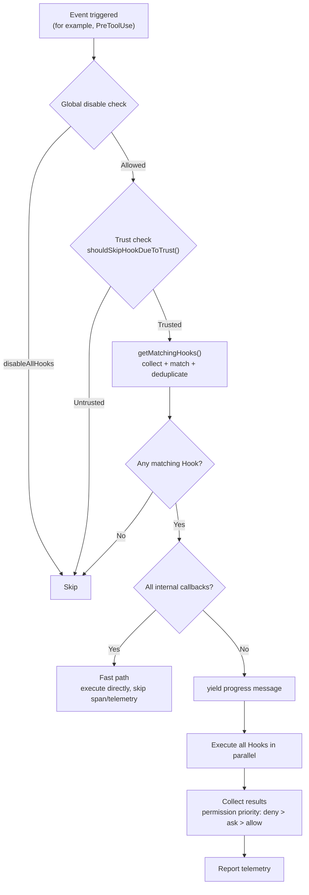
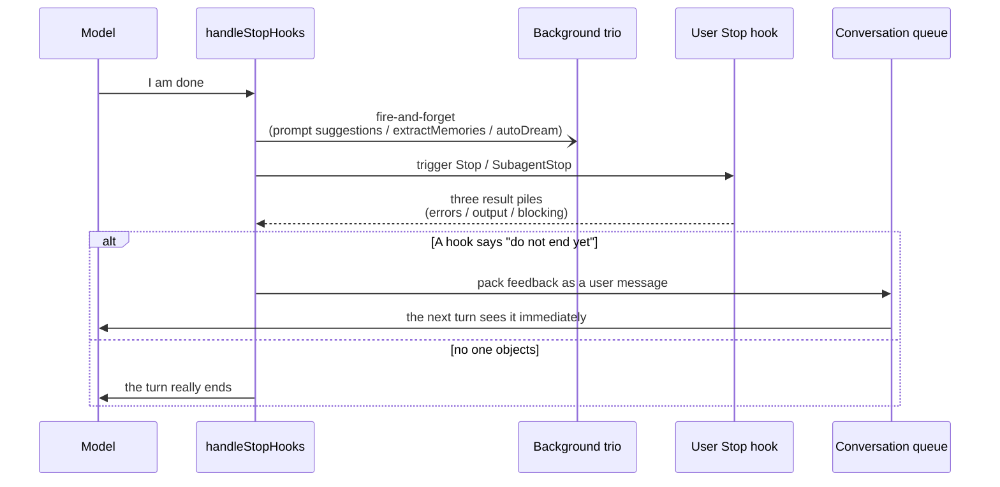
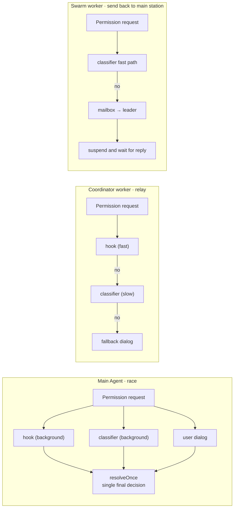

# Chapter 20: Hooks System — Extending AI Behavior with Shell Commands

> This chapter is chapter 20 of the *Deep Dive into Claude Code Source* series. We will examine the complete Hooks system implementation, showing how Claude Code lets users inject custom logic at key points in the AI lifecycle, and how the system is carefully designed for security, extensibility, and performance.

## Why Do We Need Hooks?

Imagine this scenario: you want Claude Code to automatically run `prettier` after every `Write` tool invocation, load project-specific environment variables when a session starts, or run a validation script to check code quality just before the model finishes its response.

These requirements all share one trait: **they are not capabilities of the AI itself; they are custom behaviors that users want to inject at specific points in the AI workflow**.

The Hooks system exists for exactly this purpose. It is Claude Code's lifecycle-hook framework — similar to Git Hooks, Webpack Plugins, or React's `useEffect`, but targeted at the execution cycle of an AI Agent. Users declare in `settings.json`: for which event, under what matcher condition, which command, or hook, should run.

---

> **Chapter guide**: §1 27 lifecycle events → §2 the three-level Event → Matcher → Hook configuration → §3 execution engine → §4 Shell command pipeline → §5 asynchronous Hooks → §6 Prompt/Agent Hooks, or using AI to validate AI → §7 permission decision protocol → §8 three-level security controls → §9 Frontmatter registration → §10 Fast Path performance optimization → §11 Prompt Elicitation two-way dialogue → portable patterns. §1-§3 are the skeleton, §4-§6 expand the three hook command types one by one, and §7-§11 cover cross-cutting (横切) concerns.

## 1. Event Type Overview: 27 Lifecycle Nodes

The Hooks system defines **27 event types**, covering the full lifecycle of AI interaction. These events are defined as an `as const` array in `entrypoints/sdk/coreSchemas.ts:355-383`:

```typescript
// entrypoints/sdk/coreSchemas.ts:355-383
export const HOOK_EVENTS = [
  'PreToolUse',         // before tool execution
  'PostToolUse',        // after tool execution
  'PostToolUseFailure', // after tool execution failure
  'Notification',       // when sending a notification
  'UserPromptSubmit',   // when the user submits a prompt
  'SessionStart',       // session start
  'SessionEnd',         // session end
  'Stop',               // model is about to finish its response
  'StopFailure',        // turn ends because of an API error
  'SubagentStart',      // SubAgent start
  'SubagentStop',       // SubAgent stop
  'PreCompact',         // before conversation compaction
  'PostCompact',        // after conversation compaction
  'PermissionRequest',  // when showing the permission dialog
  'PermissionDenied',   // after auto mode denies a tool call
  'Setup',              // repository setup, init, or maintenance
  'TeammateIdle',       // before Teammate becomes idle
  'TaskCreated',        // when a task is created
  'TaskCompleted',      // when a task is completed
  'Elicitation',        // when MCP requests user input
  'ElicitationResult',  // after the user responds to MCP elicitation
  'ConfigChange',       // when configuration files change
  'WorktreeCreate',     // when creating a worktree
  'WorktreeRemove',     // when removing a worktree
  'InstructionsLoaded', // when instruction files are loaded
  'CwdChanged',         // after the working directory changes
  'FileChanged',        // when a watched file changes
] as const
```

These events can be grouped into six functional domains:

| Category | Events | Purpose |
|------|------|------|
| Tool lifecycle | `PreToolUse`, `PostToolUse`, `PostToolUseFailure` | Intercept, audit, or enhance tool calls |
| Session lifecycle | `SessionStart`, `SessionEnd`, `Setup`, `Stop`, `StopFailure`, `UserPromptSubmit` | Initialize, clean up, or validate |
| Permissions and security | `PermissionRequest`, `PermissionDenied` | Custom permission decisions |
| Agent collaboration | `SubagentStart`, `SubagentStop`, `TeammateIdle`, `TaskCreated`, `TaskCompleted` | Multi-Agent orchestration |
| Context management | `PreCompact`, `PostCompact`, `Notification` | Control context compaction (上下文压缩) and notifications |
| Environment awareness | `ConfigChange`, `CwdChanged`, `FileChanged`, `InstructionsLoaded`, `Elicitation`, `ElicitationResult`, `WorktreeCreate`, `WorktreeRemove` | Respond to external changes |

---

## 2. Configuration Model: The Three-Level Event → Matcher → Hook Structure

Hooks are declared in `settings.json` using a three-level nested structure. The corresponding Zod Schema is defined in `schemas/hooks.ts:194-213`:

```typescript
// schemas/hooks.ts:194-213
export const HookMatcherSchema = lazySchema(() =>
  z.object({
    matcher: z.string().optional()
      .describe('String pattern to match (e.g. tool names like "Write")'),
    hooks: z.array(HookCommandSchema())
      .describe('List of hooks to execute when the matcher matches'),
  }),
)

export const HooksSchema = lazySchema(() =>
  z.partialRecord(z.enum(HOOK_EVENTS), z.array(HookMatcherSchema())),
)
```

A real configuration example:

```json
{
  "hooks": {
    "PreToolUse": [
      {
        "matcher": "Write|Edit",
        "hooks": [
          {
            "type": "command",
            "command": "echo 'About to write file' | tee -a /tmp/audit.log"
          }
        ]
      }
    ],
    "Stop": [
      {
        "hooks": [
          {
            "type": "command",
            "command": "npm test 2>&1 | tail -20"
          }
        ]
      }
    ]
  }
}
```

### 2.1 Four Hook Types

`HookCommand` is a **discriminated union** that uses the `type` field to distinguish four persistent types (`schemas/hooks.ts:31-189`):

```typescript
// schemas/hooks.ts:176-189
export const HookCommandSchema = lazySchema(() => {
  return z.discriminatedUnion('type', [
    BashCommandHookSchema,   // type: 'command' — Shell command
    PromptHookSchema,        // type: 'prompt'  — LLM evaluation
    AgentHookSchema,         // type: 'agent'   — multi-turn Agent validation
    HttpHookSchema,          // type: 'http'    — HTTP POST
  ])
})
```

| Type | Execution method | Typical scenario |
|------|---------|---------|
| `command` | Start a Shell process with `spawn()` | Run lint, test, or formatting scripts |
| `prompt` | Call an LLM, by default `getSmallFastModel()`, usually Haiku, to evaluate a condition | "Check whether the code has security vulnerabilities" |
| `agent` | Start a multi-turn Agent conversation for validation | "Verify that unit tests pass" |
| `http` | HTTP POST to a specified URL | Call an external approval or CI system |

Besides these four persistent types, the runtime also has two in-memory types:

- **`callback`**: a TypeScript callback function used for SDK registration and internal monitoring, such as file-access tracking and commit attribution.
- **`function`**: a session-level TypeScript callback used for strict structured-output validation.

### 2.2 Matcher Logic

The `matcher` field controls when a Hook fires. The `matchesPattern()` function (`utils/hooks.ts:1346-1381`) supports three modes:

```typescript
// utils/hooks.ts:1346-1381
function matchesPattern(matchQuery: string, matcher: string): boolean {
  if (!matcher || matcher === '*') {
    return true  // empty or * matches everything
  }
  // Pure alphanumerics plus pipe characters: exact match or multi-value match
  if (/^[a-zA-Z0-9_|]+$/.test(matcher)) {
    if (matcher.includes('|')) {
      const patterns = matcher.split('|').map(p => normalizeLegacyToolName(p.trim()))
      return patterns.includes(matchQuery)
    }
    return matchQuery === normalizeLegacyToolName(matcher)
  }
  // Otherwise treat it as a regular expression
  try {
    const regex = new RegExp(matcher)
    if (regex.test(matchQuery)) return true
    // Compatibility with legacy tool names
    for (const legacyName of getLegacyToolNames(matchQuery)) {
      if (regex.test(legacyName)) return true
    }
    return false
  } catch { return false }
}
```

The three matching modes are:

1. **Exact match**: `"Write"` exactly matches a tool name.
2. **Multi-value match**: `"Write|Edit"` lists several exact values separated by pipes.
3. **Regex match**: `"^Bash.*"` is a full regular expression.

In addition, the `if` condition field provides finer-grained filtering (`schemas/hooks.ts:19-27`). It uses permission-rule syntax, such as `"Bash(git *)"` to match only git commands, avoiding process startup for tool calls that do not match.

---

## 3. Execution Engine: From Event Trigger to Result Collection

### 3.1 Core Execution Flow

The entire Hook execution process is driven by the AsyncGenerator function `executeHooks()` (`utils/hooks.ts:1952-2972`). Its full flow is:



### 3.2 Security Boundary: Trust Check

The first gate for every Hook execution is the **workspace trust** check (`utils/hooks.ts:267-296`):

```typescript
// utils/hooks.ts:286-296
export function shouldSkipHookDueToTrust(): boolean {
  // In non-interactive mode, SDK sessions are implicitly trusted
  const isInteractive = !getIsNonInteractiveSession()
  if (!isInteractive) {
    return false
  }
  // In interactive mode, every Hook requires workspace trust
  const hasTrust = checkHasTrustDialogAccepted()
  return !hasTrust
}
```

This code reflects a deep security consideration. The comments (`utils/hooks.ts:267-285`) record two historical vulnerabilities that once existed:

- `SessionEnd` hooks still executed when the user **rejected** the trust dialog.
- `SubagentStop` hooks executed when a subagent completed **before** trust confirmation.

The current design therefore uses **centralized defense**: regardless of event type, if the trust dialog has not been accepted in interactive mode, all Hooks are skipped. This is a typical defense-in-depth strategy.

### 3.3 Multi-Source Hook Configuration Merge

The `getHooksConfig()` function (`utils/hooks.ts:1492-1566`) merges Hook configuration from three sources:

```typescript
// utils/hooks.ts:1492-1566, simplified
function getHooksConfig(appState, sessionId, hookEvent) {
  // Source 1: Settings snapshot, captured at startup
  const hooks = [...(getHooksConfigFromSnapshot()?.[hookEvent] ?? [])]

  // Source 2: registered Hooks, SDK callbacks + Plugin native hooks
  const registeredHooks = getRegisteredHooks()?.[hookEvent]
  if (registeredHooks) {
    for (const matcher of registeredHooks) {
      if (managedOnly && 'pluginRoot' in matcher) continue  // skip plugins in managed mode
      hooks.push(matcher)
    }
  }

  // Source 3: session-level Hooks, temporary Hooks registered by Agent/Skill frontmatter
  if (!managedOnly && appState !== undefined) {
    const sessionHooks = getSessionHooks(appState, sessionId, hookEvent)
    // ... merge session hooks and function hooks
  }

  return hooks
}
```

**Source 1 — Settings snapshot**: captured during `setup()` by `captureHooksConfigSnapshot()` (`utils/hooks/hooksConfigSnapshot.ts:95-97`) and executed from the snapshot by default. Specific flows refresh it with `updateHooksConfigSnapshot()`: after entering a worktree (`setup.ts:284`), when leaving a worktree (`ExitWorktreeTool.ts:140`), and when settings files change (`applySettingsChange.ts:42`). This "snapshot + targeted refresh" design prevents arbitrary mid-session injection while still allowing configuration changes to take effect at reasonable points.

**Source 2 — Registered Hooks**: SDK callbacks and Plugin native Hooks are obtained through `getRegisteredHooks()` from `bootstrap/state.ts`.

**Source 3 — Session Hooks**: Hooks defined by Agent and Skill frontmatter are registered at runtime into `AppState.sessionHooks`, a `Map<string, SessionStore>`. The key design decision is that Session Hooks use `Map` rather than `Record` (`utils/hooks/sessionHooks.ts:48-62`) for concurrency performance: in `parallel()` mode, N Agents may register Hooks in the same tick. `Map.set()` is O(1), while Record + spread is O(N).

### 3.4 Deduplication and `if` Condition Filtering

After matching, `getMatchingHooks()` performs deduplication (`utils/hooks.ts:1720-1806`). The key design is **namespace isolation by source**:

```typescript
// utils/hooks.ts:1453-1455
function hookDedupKey(m: MatchedHook, payload: string): string {
  return `${m.pluginRoot ?? m.skillRoot ?? ''}\0${payload}`
}
```

Duplicate Hooks from the same Plugin are merged, but identical command templates from different Plugins are not, because `${CLAUDE_PLUGIN_ROOT}/hook.sh` expands to different files.

For `callback` and `function` Hooks, the deduplication logic is skipped directly (`utils/hooks.ts:1723-1729`). This is a performance optimization: for internal Hooks such as `sessionFileAccessHooks`, skipping 6 rounds of `filter`, 4 `Map` objects, and 4 `Array.from` calls produced a 44x micro-benchmark speedup.

### 3.5 The Final Gate Before a Turn Ends: `Stop` and `SubagentStop`

Picture this: the model has just said "I'm done" and is about to hand the microphone back to the user. At that moment, one last gate asks, "Are you sure? Should you think again?" That is where `Stop` and `SubagentStop` hooks sit — the final decision gate before a turn truly ends.

Its cadence looks like this:



The function that does this is `handleStopHooks()`. Its cadence has three phases, each doing one thing.

The first phase is background cleanup. Unless the session is in a minimal mode such as `--bare`, it starts three fire-and-forget flows without waiting for them on the main path:

```typescript
// query/stopHooks.ts:136-156, excerpt
if (!isBareMode()) {
  if (!isEnvDefinedFalsy(process.env.CLAUDE_CODE_ENABLE_PROMPT_SUGGESTION)) {
    void executePromptSuggestion(stopHookContext)
  }
  if (feature('EXTRACT_MEMORIES') && !toolUseContext.agentId && isExtractModeActive()) {
    void extractMemoriesModule!.executeExtractMemories(stopHookContext, ...)
  }
  if (!toolUseContext.agentId) {
    void executeAutoDream(stopHookContext, toolUseContext.appendSystemMessage)
  }
}
```

The three `void` expressions indicate three intentions: prepare prompt suggestions for the next round, extract facts worth remembering from the current turn, and trigger "automatic reflection." Notice that both `extractMemories` and `autoDream` refuse to run for SubAgents (`!toolUseContext.agentId`), because these are session-level cognitive loops, not subtask concerns.

The second phase is where user-configured Stop hooks actually run. The event name branches by identity: the main session triggers `Stop`, while a SubAgent triggers `SubagentStop`. The same execution engine is used for two hook points:

```typescript
// query/stopHooks.ts:180-189, excerpt
const generator = executeStopHooks(
  permissionMode,
  toolUseContext.abortController.signal,
  undefined,
  stopHookActive ?? false,
  toolUseContext.agentId,           // ← agentId means SubagentStop
  toolUseContext,
  [...messagesForQuery, ...assistantMessages],
  toolUseContext.agentType,
)
```

The third phase collects results. As Hooks return one by one, they are sorted into three piles: errors, outputs, and blockers. If a Hook explicitly says "no, do not end yet," its feedback is packaged as a user message and put back into the queue. The model sees it as soon as the next turn starts, then continues thinking.

So a Stop hook is not a "session-end hook". It is a decision hook for whether the session is **willing to end**. The model says "I'm done"; the Hook says "think again"; the turn continues. This is a completely different layer from hooks such as `PreToolUse` and `PostToolUse`, which cut before or after a tool call. Stop hooks bind to the rhythm of the conversation, not to a single action.

The asynchronous branch reuses the same semantics. For example, if a Hook runs tests in the background and eventually fails, it does not need to drag the current turn back. Instead, it packages the failure as a system reminder and feeds it in when the model next becomes idle. That is the `asyncRewake` pattern described earlier in §5.3. Synchronous execution pulls the current turn back; asynchronous execution pulls back some future turn. Both forms reuse the same "blocking means keep talking" protocol.

Appendix for this section's source references: `query/stopHooks.ts:65-473` `handleStopHooks()`, `query/stopHooks.ts:133-157` for the three background flows, `query/stopHooks.ts:175-189` for the main flow, and `utils/hooks.ts:3653-3656` for the event-name branch and the `hasHookForEvent()` fast check.

### 3.6 `notifs`: Another Thing Called a "Hook"

When reading the source, you will run into a directory named `hooks/notifs/`. Its name makes it look like part of the Hooks system. It is not. The "hook" here is the React hook. It is completely separate from the execution engine discussed above; the name just happens to overlap.

It solves a very plain problem: after the CLI starts, it needs to show one-off notices at the right time: startup banners, subscription-status changes, model migrations, outdated NPM packages, Rate Limit warnings, LSP initialization completion, Plugin auto-updates, and so on. There are 16 such notifications in total, each living in its own `useXxxNotification` file.

These notifications share one temperament: **show only once after process startup, and stay quiet in remote mode**. Early implementations repeated this guard logic in every notification. Later, it was extracted into a shared custom hook:

```typescript
// hooks/notifs/useStartupNotification.ts:19-30, excerpt
export function useStartupNotification(
  compute: () => Result | Promise<Result>,
): void {
  const { addNotification } = useNotifications()
  const hasRunRef = useRef(false)
  // ...
  useEffect(() => {
    if (getIsRemoteMode() || hasRunRef.current) return  // ← two guards
    hasRunRef.current = true
    void Promise.resolve()
      .then(() => computeRef.current())
      .then(result => { /* dispatch notification */ })
      .catch(logError)
  }, [addNotification])
}
```

Eleven lines of code cover two things: `hasRunRef` guarantees "run only once," and `getIsRemoteMode()` guarantees "skip in remote mode." `compute` can return `null`, one notification, or a list of notifications, synchronously or asynchronously. Remote mode is skipped because these prompts are either meaningless for remote sessions, such as an NPM package being outdated on the host, or already emitted by the host side, such as Rate Limit. Reporting from both sides would only create noise.

This appears in the same chapter as lifecycle hooks because the two systems have the same name and, semantically, also express the same idea: **attach custom behavior to a point in time**. The difference is where the behavior attaches:

| Category | Attachment point | Trigger timing | Example |
|------|--------|----------|------|
| Lifecycle hook | Event bus in the query loop | Shell, LLM, HTTP, Stop, and so on | `PreToolUse` blocks a dangerous bash command |
| notifs hook | React render loop | Component mount or state change | Show an NPM outdated warning once at startup |

The two systems are not coupled in the code. Once you know that, the directory name will not lead you astray next time.

---

## 4. Shell Command Execution: The Complete `execCommandHook` Pipeline

`execCommandHook()` (`utils/hooks.ts:747-1335`) is the most complex function in the Hooks system, at roughly 590 lines. It does much more than "run a Shell command": it must handle cross-platform Shell differences, asynchronous backgrounding, the Prompt Elicitation protocol, timeout control, and other scenarios.

### 4.1 Shell Selection and Cross-Platform Adaptation

Hooks support two Shells (`utils/hooks.ts:790-984`):

```typescript
// utils/hooks.ts:790-791
const shellType = hook.shell ?? DEFAULT_HOOK_SHELL  // default: 'bash'
const isPowerShell = shellType === 'powershell'
```

The two Shells are spawned in completely different ways:

```typescript
// utils/hooks.ts:958-984
if (shellType === 'powershell') {
  // PowerShell: explicit argv, no shell option
  child = spawn(pwshPath, buildPowerShellArgs(finalCommand), {
    env: envVars, cwd: safeCwd, windowsHide: true,
  })
} else {
  // Bash: the shell option lets Node parse the entire command string with a shell
  // Note: on Windows, Git Bash is used explicitly; on non-Windows, shell: true actually uses /bin/sh
  const shell = isWindows ? findGitBashPath() : true
  child = spawn(finalCommand, [], {
    env: envVars, cwd: safeCwd, shell, windowsHide: true,
  })
}
```

On Windows, Bash Hooks run through Git Bash rather than `cmd.exe`, and every path must be converted to POSIX format (`C:\Users\foo` → `/c/Users/foo`). PowerShell Hooks keep native Windows paths.

> **Implementation detail**: although the configuration calls this `shell: 'bash'`, on non-Windows platforms, Node.js `spawn(..., { shell: true })` actually uses `/bin/sh`; the source comment at `utils/hooks.ts:975` explicitly says "On other platforms, shell: true uses /bin/sh". This means Hook commands should use POSIX-shell-compatible syntax rather than relying on GNU bash-specific features such as `[[` conditionals or arrays. If you really need bash, call `bash -c '...'` explicitly in the command.

### 4.2 Environment Variable Injection

Every Hook process receives a carefully prepared set of environment variables (`utils/hooks.ts:882-926`):

```typescript
// utils/hooks.ts:882-926, simplified
const envVars: NodeJS.ProcessEnv = {
  ...subprocessEnv(),                      // inherit process environment
  CLAUDE_PROJECT_DIR: toHookPath(projectDir), // project root directory
}

// Additional variables for Plugin/Skill Hooks
if (pluginRoot) {
  envVars.CLAUDE_PLUGIN_ROOT = toHookPath(pluginRoot)
  envVars.CLAUDE_PLUGIN_DATA = toHookPath(getPluginDataDir(pluginId))
}
// Expose Plugin configuration items as env vars
if (pluginOpts) {
  for (const [key, value] of Object.entries(pluginOpts)) {
    const envKey = key.replace(/[^A-Za-z0-9_]/g, '_').toUpperCase()
    envVars[`CLAUDE_PLUGIN_OPTION_${envKey}`] = String(value)
  }
}

// SessionStart/Setup/CwdChanged/FileChanged Hooks receive CLAUDE_ENV_FILE
if (!isPowerShell && (hookEvent === 'SessionStart' || ...)) {
  envVars.CLAUDE_ENV_FILE = await getHookEnvFilePath(hookEvent, hookIndex)
}
```

`CLAUDE_ENV_FILE` is a special mechanism: a Hook can write environment variable definitions in `export VAR=value` format to this file, and later `BashTool` commands will automatically load them. This lets a `SessionStart` Hook set environment for the whole session.

### 4.3 Input and Output Protocol

Hooks receive **JSON input through stdin** and return **JSON or plain-text output through stdout**:

```
┌──────────┐    stdin (JSON)     ┌──────────┐    stdout (JSON/text)    ┌──────────┐
│ Claude   │ ──────────────────> │   Hook   │ ───────────────────────> │ Claude   │
│ Code     │                    │  Process │                          │ Code     │
└──────────┘                    └──────────┘                          └──────────┘
```

The input is serialized JSON for `HookInput`, containing context such as the event name, tool name, tool input, and session ID.

Output parsing is handled by `parseHookOutput()` (`utils/hooks.ts:399-451`):

```typescript
// utils/hooks.ts:399-451, simplified
function parseHookOutput(stdout: string) {
  const trimmed = stdout.trim()
  if (!trimmed.startsWith('{')) {
    return { plainText: stdout }  // does not start with {, so treat as plain text
  }
  // Try to parse as JSON and validate with Zod
  const result = validateHookJson(trimmed)
  if ('json' in result) return result
  return { plainText: stdout, validationError: result.validationError }
}
```

### 4.4 Exit Code Semantics

Hook exit codes have explicit semantic conventions (`utils/hooks.ts:2617-2697`):

| Exit Code | Meaning | Handling |
|-----------|------|---------|
| 0 | Success | `stdout` is treated as a success message |
| 2 | Blocking error | `stderr` is fed back to the model and prevents the operation from continuing |
| Other | Non-blocking error | `stderr` is shown to the user, but the operation continues |

Exit code 2 is a clever design: it lets a Hook **block the AI's operation and provide feedback**. For example, if a `PreToolUse` Hook exits with code 2, the AI receives the error message and adjusts its behavior:

```typescript
// utils/hooks.ts:2648-2668
if (result.status === 2) {
  yield {
    blockingError: {
      blockingError: `[${hook.command}]: ${result.stderr || 'No stderr output'}`,
      command: hook.command,
    },
    outcome: 'blocking' as const,
    hook,
  }
  return
}
```

### 4.5 JSON Output Protocol

When a Hook's output starts with `{`, the system attempts to parse it as a structured JSON response. `syncHookResponseSchema` (`types/hooks.ts:50-166`) defines a rich set of output fields:

```typescript
// types/hooks.ts:50-66, simplified
export const syncHookResponseSchema = lazySchema(() =>
  z.object({
    continue: z.boolean().optional(),       // whether to continue
    suppressOutput: z.boolean().optional(),  // hide stdout
    stopReason: z.string().optional(),       // reason when continue=false
    decision: z.enum(['approve', 'block']).optional(),  // permission decision
    reason: z.string().optional(),           // decision reason
    systemMessage: z.string().optional(),    // warning message
    hookSpecificOutput: z.union([            // event-specific output
      // PreToolUse: permissionDecision, updatedInput, additionalContext
      // PostToolUse: additionalContext, updatedMCPToolOutput
      // SessionStart: additionalContext, initialUserMessage, watchPaths
      // PermissionRequest: decision (allow/deny + updatedInput)
      // ...
    ]).optional(),
  }),
)
```

The especially important field is **`updatedInput`**: a `PreToolUse` Hook can use it to **modify the tool's input parameters**. This means Hooks can not only intercept an AI tool call, but also **rewrite** it.

---

## 5. Asynchronous Hooks: Background Execution and Wake-Up Mechanism

Hooks support two asynchronous modes, controlled by the `async` and `asyncRewake` configuration fields.

### 5.1 Configuration-Level Asynchrony

When `hook.async = true`, the Hook is backgrounded immediately after startup (`utils/hooks.ts:995-1030`):

```typescript
// utils/hooks.ts:995-1030, simplified
if ((hook.async || hook.asyncRewake) && !forceSyncExecution) {
  // Write stdin first
  child.stdin.write(jsonInput + '\n', 'utf8')
  child.stdin.end()
  // Background it
  const backgrounded = executeInBackground({
    processId, hookId, shellCommand,
    asyncResponse: { async: true, asyncTimeout: hookTimeoutMs },
    hookEvent, hookName, command: hook.command,
    asyncRewake: hook.asyncRewake,
  })
  if (backgrounded) {
    return { stdout: '', stderr: '', output: '', status: 0, backgrounded: true }
  }
}
```

### 5.2 Protocol-Level Asynchrony

A Hook can also **switch dynamically** to asynchronous mode at runtime. When the first line of stdout is `{"async": true}`, the system detects it and automatically backgrounds the Hook (`utils/hooks.ts:1112-1164`):

```typescript
// utils/hooks.ts:1117-1143, simplified
if (!initialResponseChecked) {
  const firstLine = firstLineOf(stdout).trim()
  if (!firstLine.includes('}')) return  // wait for a complete JSON object
  initialResponseChecked = true
  const parsed = jsonParse(firstLine)
  if (isAsyncHookJSONOutput(parsed) && !forceSyncExecution) {
    const backgrounded = executeInBackground({...})
    if (backgrounded) {
      shellCommandTransferred = true
      asyncResolve?.({ stdout, stderr, output, status: 0 })
    }
  }
}
```

### 5.3 `asyncRewake`: Background Execution Plus Model Wake-Up

`asyncRewake` is a more advanced pattern (`utils/hooks.ts:205-246`). The Hook runs in the background, but if it exits with code 2, it wakes the model through `enqueuePendingNotification()`:

```typescript
// utils/hooks.ts:218-243, simplified
void shellCommand.result.then(async result => {
  await new Promise(resolve => setImmediate(resolve))  // wait for I/O to drain
  const stdout = await shellCommand.taskOutput.getStdout()
  const stderr = await shellCommand.taskOutput.getStderr()
  shellCommand.cleanup()
  if (result.code === 2) {
    enqueuePendingNotification({
      value: wrapInSystemReminder(
        `Stop hook blocking error from command "${hookName}": ${stderr || stdout}`,
      ),
      mode: 'task-notification',
    })
  }
})
```

### 5.4 Async Hook Registry

Backgrounded Hooks are registered in the global `AsyncHookRegistry` (`utils/hooks/AsyncHookRegistry.ts`). `pendingHooks` is a `Map<string, PendingAsyncHook>`:

```typescript
// utils/hooks/AsyncHookRegistry.ts:28
const pendingHooks = new Map<string, PendingAsyncHook>()
```

`checkForAsyncHookResponses()` (`AsyncHookRegistry.ts:113-268`) is called in every query turn to check completed asynchronous Hooks and collect their output. This function uses `Promise.allSettled()` rather than `Promise.all()`, ensuring one Hook failure does not affect result collection for the others.

---

## 6. Prompt and Agent Hooks: Using AI to Validate AI

### 6.1 Prompt Hook

Prompt Hooks let users define validation conditions in natural language, evaluated by a small model. By default they use `getSmallFastModel()` (`utils/model/model.ts:36-38`), currently mapped to Haiku but overrideable via the `ANTHROPIC_SMALL_FAST_MODEL` environment variable. The core logic of `execPromptHook()` (`utils/hooks/execPromptHook.ts:21-211`) is:

```typescript
// utils/hooks/execPromptHook.ts:62-100, simplified
const response = await queryModelWithoutStreaming({
  messages: messagesToQuery,
  systemPrompt: asSystemPrompt([
    `You are evaluating a hook in Claude Code.
Your response must be a JSON object matching one of the following schemas:
1. If the condition is met, return: {"ok": true}
2. If the condition is not met, return: {"ok": false, "reason": "..."}`,
  ]),
  thinkingConfig: { type: 'disabled' as const },
  options: {
    model: hook.model ?? getSmallFastModel(),
    outputFormat: {
      type: 'json_schema',
      schema: {
        type: 'object',
        properties: { ok: { type: 'boolean' }, reason: { type: 'string' } },
        required: ['ok'],
        additionalProperties: false,
      },
    },
  },
})
```

Key design points:

- It uses `json_schema` structured output to ensure the model returns a parseable result.
- It disables thinking (`type: 'disabled'`) to reduce latency.
- By default it uses `getSmallFastModel()`, currently Haiku and overrideable via an environment variable, while still allowing any model to be specified through `hook.model`.
- The `$ARGUMENTS` placeholder is replaced with the Hook input JSON.

### 6.2 Agent Hook

Agent Hooks (`utils/hooks/execAgentHook.ts`) go one step further: they start a complete multi-turn conversation so the Agent can call tools to validate a condition. This is especially useful for validations that require actual execution, such as "run tests and check the result."

---

## 7. Permission Decision Protocol

`PreToolUse` Hooks can make permission decisions that affect whether a tool is executed. Decision priority follows a strict hierarchy (`utils/hooks.ts:2820-2847`):

```typescript
// utils/hooks.ts:2826-2847
switch (result.permissionBehavior) {
  case 'deny':
    // deny always wins
    permissionBehavior = 'deny'
    break
  case 'ask':
    // ask wins over allow, but not over deny
    if (permissionBehavior !== 'deny') {
      permissionBehavior = 'ask'
    }
    break
  case 'allow':
    // allow only takes effect when there is no other decision
    if (!permissionBehavior) {
      permissionBehavior = 'allow'
    }
    break
  case 'passthrough':
    // passthrough does not set permission behavior
    break
}
```

The **priority chain is: deny > ask > allow > passthrough**. This means:

- If any Hook says `deny`, the operation is definitely blocked.
- If there is no `deny` but there is an `ask`, a confirmation dialog is shown.
- Only when every Hook agrees, or uses passthrough, will the operation be automatically `allow`ed.

This is a security-first design: **the strictest decision wins**.

---

## 8. Security Boundaries: Three-Level Control Strategy

The Hooks system's security controls are implemented by `hooksConfigSnapshot.ts` and split into three levels:

### 8.1 Three-Level Switches

```typescript
// utils/hooks/hooksConfigSnapshot.ts:62-88

// 1. shouldAllowManagedHooksOnly(): allow only Hooks from managed policy
export function shouldAllowManagedHooksOnly(): boolean {
  const policySettings = getSettingsForSource('policySettings')
  if (policySettings?.allowManagedHooksOnly === true) return true
  // disableAllHooks from non-managed settings is interpreted as "keep only managed Hooks"
  if (getSettings_DEPRECATED().disableAllHooks === true &&
      policySettings?.disableAllHooks !== true) {
    return true
  }
  return false
}

// 2. shouldDisableAllHooksIncludingManaged(): completely disable all Hooks
export function shouldDisableAllHooksIncludingManaged(): boolean {
  return getSettingsForSource('policySettings')?.disableAllHooks === true
}
```

The hierarchy is:

- **Normal mode**: Hooks from all sources execute.
- **`managedOnly` mode**: only Hooks from `policySettings`, the enterprise management policy, execute; user-level and project-level Hooks are skipped.
- **`disableAll` mode**: no Hooks execute, including managed Hooks.

### 8.2 Snapshot Isolation

Hook configuration is captured as a snapshot during `setup()` through `captureHooksConfigSnapshot()`, and execution uses the snapshot by default. The snapshot is refreshed at specific moments with `updateHooksConfigSnapshot()` such as worktree switches and settings-file changes, but it is not updated in real time for arbitrary file modifications. This "snapshot + targeted refresh" design prevents arbitrary mid-session configuration injection:

```typescript
// utils/hooks/hooksConfigSnapshot.ts:95-97
export function captureHooksConfigSnapshot(): void {
  initialHooksConfig = getHooksFromAllowedSources()
}

// utils/hooks/hooksConfigSnapshot.ts:104-112
export function updateHooksConfigSnapshot(): void {
  resetSettingsCache()  // ensure the latest settings are read from disk
  initialHooksConfig = getHooksFromAllowedSources()
}
```

### 8.3 SSRF Protection for HTTP Hooks

HTTP Hooks include built-in SSRF (Server-Side Request Forgery) protection (`utils/hooks/ssrfGuard.ts`). The `isBlockedAddress()` function blocks requests to private and link-local addresses such as `169.254.0.0/16`, `10.0.0.0/8`, `172.16.0.0/12`, and `192.168.0.0/16`, but **intentionally allows loopback addresses** (`127.0.0.0/8`), because local development policy servers are the primary use case for HTTP Hooks.

### 8.4 Permission Handlers for Three Execution Identities

For a single tool call, who asks "is this allowed?" The answer depends on the identity. The `hooks/toolPermission/handlers/` directory contains three handlers, corresponding to three identities: the main Agent you use in the terminal, a worker in Coordinator mode, and a worker in a Swarm. The three flows have different timing:



**The main Agent uses a "race" mode**. The permission hook runs in the background, the bash-command classifier runs in the background, and the user dialog is shown at the same time. Whoever produces an answer first decides. The key is the one-shot resolver:

```typescript
// hooks/toolPermission/handlers/interactiveHandler.ts:70, excerpt
const { resolve: resolveOnce, isResolved, claim } = createResolveOnce(resolve)
```

`resolveOnce` is the referee at the finish line: whichever lane arrives first wins, and later `resolveOnce(...)` calls from the other lanes are automatically invalidated, avoiding repeated resolution of the same Promise.

**Coordinator workers use a "relay" mode**. The same checks exist, but here they do not run together. Instead, they are awaited in sequence:

```typescript
// hooks/toolPermission/handlers/coordinatorHandler.ts:31-46, excerpt
// 1. Try permission hooks first (fast, local)
const hookResult = await ctx.runHooks(permissionMode, suggestions, updatedInput)
if (hookResult) return hookResult

// 2. Try classifier (slow, inference -- bash only)
const classifierResult = feature('BASH_CLASSIFIER')
  ? await ctx.tryClassifier?.(params.pendingClassifierCheck, updatedInput)
  : null
if (classifierResult) return classifierResult

// 3. Neither resolved -- fall through to dialog below.
```

Hooks run first, because they are local and fast; if they cannot decide, the classifier runs, because it is inference-based, slower, and only applies to bash; if that still cannot decide, the flow falls back to the interactive dialog. Worker processes have little concurrency budget, so serial execution is simpler.

**Swarm workers use a "send back to the main station" mode**. The worker has no local user to ask, so it packages the request as a message, sends it back to the main session through the mailbox, and suspends while waiting for a reply:

```typescript
// hooks/toolPermission/handlers/swarmWorkerHandler.ts:49-57, excerpt
// Try the classifier fast path first: if it can allow locally, avoid a cross-process round trip
const classifierResult = feature('BASH_CLASSIFIER')
  ? await ctx.tryClassifier?.(params.pendingClassifierCheck, updatedInput)
  : null
if (classifierResult) return classifierResult
// Otherwise createPermissionRequest + sendPermissionRequestViaMailbox + wait for the leader's reply
```

Notice lines 51-52: the bash classifier remains as a "save one round trip" fast path. If the worker can decide locally, it does not bother the main station.

The common foundation of all three flows is the Hook merge rule described in §7: the deny > ask > allow priority chain. The question "how do permission Hooks merge?" is uniform across all three identities. The only difference is who provides the fallback when Hooks cannot decide: a dialog, a sequential relay, or remote adjudication.

Appendix for this section's source references: `hooks/toolPermission/handlers/interactiveHandler.ts:57-72`, `hooks/toolPermission/handlers/coordinatorHandler.ts:26-62`, `hooks/toolPermission/handlers/swarmWorkerHandler.ts:40-80`, and `createResolveOnce` in `hooks/toolPermission/PermissionContext.ts`.

---

## 9. Frontmatter Hook Registration

Agents and Skills can define Hooks in markdown frontmatter. These Hooks are registered as temporary session-level Hooks. `registerFrontmatterHooks()` (`utils/hooks/registerFrontmatterHooks.ts:18-67`) handles the registration logic:

```typescript
// utils/hooks/registerFrontmatterHooks.ts:18-67, simplified
export function registerFrontmatterHooks(
  setAppState, sessionId, hooks, sourceName, isAgent = false,
): void {
  for (const event of HOOK_EVENTS) {
    const matchers = hooks[event]
    if (!matchers) continue

    // Key point: an Agent's Stop hook is automatically converted to SubagentStop
    let targetEvent = event
    if (isAgent && event === 'Stop') {
      targetEvent = 'SubagentStop'
    }

    for (const matcherConfig of matchers) {
      for (const hook of matcherConfig.hooks) {
        addSessionHook(setAppState, sessionId, targetEvent, matcher, hook)
      }
    }
  }
}
```

A clever design detail: a `Stop` Hook defined in an Agent is automatically converted to `SubagentStop`, because a SubAgent ending triggers `SubagentStop`, not the `Stop` event.

---

## 10. Performance Optimization: Fast Path and Lazy Serialization

Hooks run on the critical path of AI interaction, so performance matters. The source contains several notable optimizations:

### 10.1 Fast Path for Internal Hooks

When every matching Hook is an internal callback, such as file-access tracking, the entire span/progress/telemetry flow is skipped (`utils/hooks.ts:2036-2067`):

```typescript
// utils/hooks.ts:2036-2067
// Fast-path: all hooks are internal callbacks (sessionFileAccessHooks,
// attributionHooks). Measured: 6.01µs → ~1.8µs per PostToolUse hit (-70%).
if (matchingHooks.every(m => m.hook.type === 'callback' && m.hook.internal)) {
  for (const [i, { hook }] of matchingHooks.entries()) {
    if (hook.type === 'callback') {
      await hook.callback(hookInput, toolUseID, signal, i, context)
    }
  }
  return  // skip telemetry, span, progress, and other overhead
}
```

### 10.2 Lazy JSON Serialization

`hookInput` is serialized to JSON only once, and only when needed. Multiple Hooks share the result (`utils/hooks.ts:2124-2140`):

```typescript
// utils/hooks.ts:2124-2140
let jsonInputResult: { ok: true; value: string } | { ok: false; error: unknown } | undefined
function getJsonInput() {
  if (jsonInputResult !== undefined) return jsonInputResult
  try {
    return (jsonInputResult = { ok: true, value: jsonStringify(hookInput) })
  } catch (error) {
    return (jsonInputResult = { ok: false, error })
  }
}
```

### 10.3 Fast Existence Check for Events

`hasHookForEvent()` (`utils/hooks.ts:1582-1593`) provides a lightweight existence check, allowing the system to skip the cost of `createBaseHookInput()` and `getMatchingHooks()` when no Hooks are configured:

```typescript
// utils/hooks.ts:1582-1593
function hasHookForEvent(hookEvent, appState, sessionId): boolean {
  const snap = getHooksConfigFromSnapshot()?.[hookEvent]
  if (snap && snap.length > 0) return true
  const reg = getRegisteredHooks()?.[hookEvent]
  if (reg && reg.length > 0) return true
  if (appState?.sessionHooks.get(sessionId)?.hooks[hookEvent]) return true
  return false
}
```

---

## 11. Prompt Elicitation: Two-Way Dialogue Between Hook and User

One particularly elegant feature is the **Prompt Elicitation protocol** (`utils/hooks.ts:1060-1110`). A Hook process can print a special JSON format to stdout to **ask the user a question**, then receive the answer through stdin:

```typescript
// types/hooks.ts:28-40
export const promptRequestSchema = lazySchema(() =>
  z.object({
    prompt: z.string(),          // request ID
    message: z.string(),         // question shown to the user
    options: z.array(z.object({  // option list
      key: z.string(),
      label: z.string(),
      description: z.string().optional(),
    })),
  }),
)
```

When a Hook process outputs `{"prompt":"id1","message":"Select a branch","options":[...]}`, Claude Code shows the options in the terminal. After the user chooses, it writes `{"prompt_response":"id1","selected":"option-key"}` back to the Hook's stdin.

This is implemented by line-by-line parsing inside `child.stdout.on('data', ...)` (`utils/hooks.ts:1068-1110`), with `promptChain` serializing the handling order of multiple asynchronous Prompt requests.

---

## Portable Design Patterns

### Pattern 1: Exit Code Semantic Protocol

Use different exit-code values to express different semantics, such as 0 = success, 2 = blocking, and any other value = non-blocking error, so external scripts can precisely control system behavior. This provides a richer expressive model than a simple success/failure binary.

**Applicable scenarios**: any system that needs to interact with external scripts or processes, especially CI/CD pipelines and build systems.

### Pattern 2: Security-First Permission Aggregation

When multiple sources can make permission decisions for the same operation, use a "strictest decision wins" aggregation strategy, such as deny > ask > allow. This ensures the operation is intercepted even if only one checker finds a problem.

**Applicable scenarios**: any multi-layer permission-checking system or multi-factor approval flow.

### Pattern 3: Snapshot-Isolated Configuration Loading

Capture a configuration snapshot at application startup and use that snapshot during runtime instead of reading configuration live. This avoids inconsistency caused by mid-session configuration changes and also prevents configuration-injection attacks.

**Applicable scenarios**: security-sensitive configuration systems, especially when configuration may come from untrusted sources such as project-level `.claude/settings.json`.

---

---

## Next Chapter Preview

[Chapter 21: Skill / Plugin / Output Style — Three Extension Points: Understanding Extension Points from Source](./21-skill-plugin-outputstyle-three-extension-points.md)

From the perspective of an extension developer, we will see how the three extension paths, Skill, Plugin, and Output Style, let users apply source-code understanding back to the product.

---
*For all content, follow https://github.com/luyao618/Claude-Code-Source-Study (a free star would be appreciated).*
