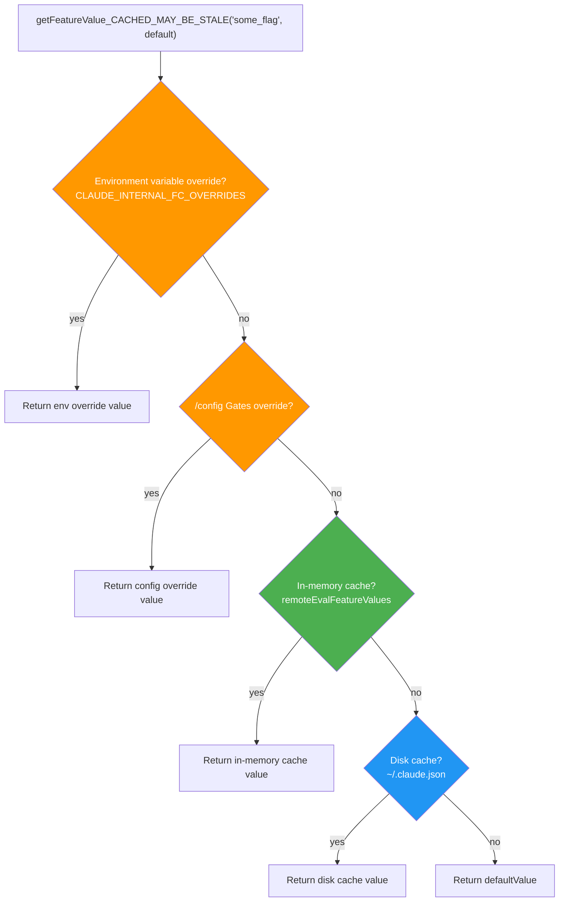
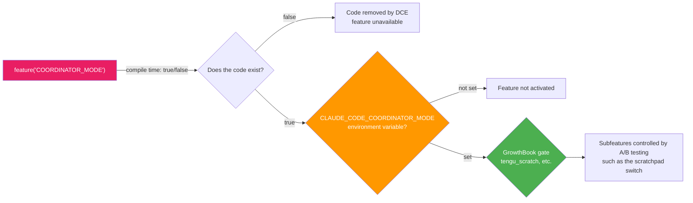

# Chapter 22: Feature Flag and Compile-Time Optimization — Building Two Products from One Codebase

> This chapter shows how Claude Code maintains both an internal edition and an external edition from the same codebase. You will see how Bun's `feature()` compile-time constant folding, the `process.env.USER_TYPE` build-time `--define` constant, `MACRO.*` build-time value injection, and the GrowthBook A/B testing platform work together across different time horizons.

## Why Do You Need Multiple Layers of Feature Flags?

Imagine you are an engineer at an AI company. Your product has both a public-facing open-source edition and an enhanced internal edition for employees. The internal edition has more experimental capabilities, such as voice mode, a multi-Agent coordinator, and a background task engine, but you do not want to maintain two separate repositories.

Claude Code faces exactly this problem. Its solution is a **three-layer feature flag system**, where each layer solves a different problem:

| Layer | Mechanism | Decision time | Purpose |
|------|------|---------|------|
| Compile time | `feature()` from `bun:bundle` | Build time | Physically remove internal code branches from the artifact |
| Compile time | `process.env.USER_TYPE` (`--define`) | Build time | Internal/external identity gating, also triggering DCE |
| Runtime | GrowthBook A/B testing | While the process is running | Progressive rollout, experiments, Kill Switches |

The first two both make decisions at build time, but they have different responsibilities: `feature()` is a **feature-level switch** (one flag controls one complete feature), while `USER_TYPE` is an **identity-level switch** (distinguishing internal employees from external users). Runtime GrowthBook, meanwhile, supports turning features on and off without restarting the process.

---

> **Chapter guide**: §1 Compile-time `feature()` and DCE (including a 90-flag overview and categorized quick-reference tables) -> §2 Build-time identity constant `USER_TYPE` -> §3 `MACRO.*` constant injection -> §4 Runtime GrowthBook A/B -> §5 The complete gating pipeline formed by the three layers -> §6 Preventing flag flips from breaking the system -> §7 Portable patterns. §1-§4 expand the "four gating mechanisms" one by one, and §5 connects them into a single pipeline.

## 1. Compile Time: `feature()` and Dead Code Elimination

### 1.1 Core Mechanism

`feature()` is a compile-time function imported from `bun:bundle`. During the Bun build, it is replaced with the literal `true` or `false`; then Bun's bundler applies Dead Code Elimination (DCE) to branches such as `if (false) { ... }`, physically removing the entire branch and its dependencies from the output artifact.

```typescript
// entrypoints/cli.tsx:1
import { feature } from 'bun:bundle';
```

This means that in an external build, code disabled by `feature()` **does not exist in the final JS file**. It is not skipped by `if (false)`; it is completely removed. This is much stronger than a runtime check: an attacker cannot enable these features by changing environment variables, because the relevant code is not present in the artifact at all.

### 1.2 The Two Ways to Pair feature() with Module Loading: require() and Dynamic import()

The **core constraint** for `feature()` to implement DCE is that it must remain inline in the conditional expression, so the bundler can constant-fold the whole branch at compile time. The source comment states this explicitly:

> `feature() must stay inline for build-time dead code elimination` — `cli.tsx:110`

Under that constraint, `feature()` can be paired with **two** module-loading styles:

**Style 1: conditional `require()`** — used for conditional loading at the **module top level** (`tools.ts`, `commands.ts`):

```typescript
// tools.ts:25-28
const SleepTool =
  feature('PROACTIVE') || feature('KAIROS')
    ? require('./tools/SleepTool/SleepTool.js').SleepTool
    : null
```

**Style 2: dynamic `import()` inside a branch** — used for conditional loading **inside function bodies** (the fast path in `cli.tsx`):

```typescript
// entrypoints/cli.tsx:100-106
if (feature('DAEMON') && args[0] === '--daemon-worker') {
  const { runDaemonWorker } = await import('../daemon/workerRegistry.js');
  await runDaemonWorker(args[1]);
  return;
}
```

What both have in common is that neither is a **top-level static `import` declaration**. ES Module static `import` statements are resolved and loaded unconditionally by the module system, regardless of whether they sit on an executable code path; the bundler cannot delete the static import's dependency tree. By contrast, both `require()` and `await import()` are runtime call expressions. Once the compiler proves that `feature(...)` is `false`, the entire branch, including the module-loading call inside it, is removed.

**Which style to choose depends on context**: `require()` fits module-top-level code (synchronous and assignable to a `const`), while `await import()` fits async function bodies (asynchronous and a more natural code flow).

This pattern is densest in `tools.ts`, because tool registration is where feature flags are used most heavily:

```typescript
// tools.ts:29-41 — consecutive conditional registrations
const cronTools = feature('AGENT_TRIGGERS')
  ? [
      require('./tools/ScheduleCronTool/CronCreateTool.js').CronCreateTool,
      require('./tools/ScheduleCronTool/CronDeleteTool.js').CronDeleteTool,
      require('./tools/ScheduleCronTool/CronListTool.js').CronListTool,
    ]
  : []
const RemoteTriggerTool = feature('AGENT_TRIGGERS_REMOTE')
  ? require('./tools/RemoteTriggerTool/RemoteTriggerTool.js').RemoteTriggerTool
  : null
const MonitorTool = feature('MONITOR_TOOL')
  ? require('./tools/MonitorTool/MonitorTool.js').MonitorTool
  : null
```

### 1.3 Overview of the 90 Feature Flags

**How was the number 90 counted?** Run this directly against the source repository (`/Users/yao/work/code/awesome-project/claude-code-cli`):

```bash
grep -rhoE "feature\(['\"]([A-Z_0-9]+)['\"]\)" --include="*.ts" --include="*.tsx" . \
  | sed -E "s/feature\(['\"]([A-Z_0-9]+)['\"]\)/\1/" \
  | sort | uniq -c | sort -rn | wc -l
```

The result is **90** independent flags. First, here are the high-frequency Top 16 flags (usage count >= 16); then the remaining 74 flags are listed in **categorized quick-reference tables**, grouped by topic domain so you can search by feature family rather than alphabetically.

Note: the frequently occurring `KAIROS` (Greek for "the right moment") appears 156 times, almost 1.5x the second-place flag. It corresponds to Claude Code's **Assistant / chat mode**, a large internal experimental feature with entrypoints in `assistant/index.ts`, `assistant/gate.ts`, `commands/assistantChat.tsx`, and others. It also has five derived `KAIROS_*` sub-flags; see the quick-reference tables below.

| Feature Flag | Usage count | Feature area |
|-------------|---------|---------|
| `KAIROS` | 156 | Assistant/chat mode |
| `TRANSCRIPT_CLASSIFIER` | 110 | Permission auto-classification |
| `TEAMMEM` | 53 | Team memory |
| `VOICE_MODE` | 49 | Voice interaction |
| `BASH_CLASSIFIER` | 49 | Bash command safety classification |
| `KAIROS_BRIEF` | 39 | Assistant brief mode |
| `PROACTIVE` | 37 | Proactive mode (`SleepTool`, etc.) |
| `COORDINATOR_MODE` | 32 | Multi-Agent coordinator |
| `BRIDGE_MODE` | 29 | IDE remote bridge |
| `CONTEXT_COLLAPSE` | 23 | Context collapse |
| `KAIROS_CHANNELS` | 21 | Assistant channels |
| `EXPERIMENTAL_SKILL_SEARCH` | 21 | Experimental skill search |
| `UDS_INBOX` | 18 | Unix domain socket messages |
| `BUDDY` | 18 | Buddy mode |
| `HISTORY_SNIP` | 16 | History snippet clipping |
| `CHICAGO_MCP` | 16 | Computer Use MCP |

Among these flags, `KAIROS` (Greek for "the right moment") appears 156 times, almost 1.5x the second-place flag. It corresponds to Claude Code's "Assistant" (Kairos Assistant) mode. In essence, it is a large internal experimental feature that uses the Claude Code kernel as a "proactive chat assistant": compared with the default request-response loop, it speaks proactively at more trigger points, such as long-task completion, idle reminders, and scheduled briefs, and it relies on a family of same-prefix sub-flags such as `KAIROS_BRIEF`, `KAIROS_CHANNELS`, and `KAIROS_GITHUB_WEBHOOKS`. Strictly speaking, then, `KAIROS` is not merely a broad "assistant mode"; it is the master switch for the "proactive assistant."

#### 1.3.1 Categorized Quick-Reference Tables for the Remaining 74 Flags

Grouped by topic domain (**listed one by one**, so readers do not need to run grep themselves). "Count" means the number of appearances of `feature('X')` in the source. The groups below total 74 unique flags (`BUDDY` is already in the Top 16 and is not counted again here).

**Assistant / KAIROS family (3 flags excluding KAIROS, KAIROS_BRIEF, and KAIROS_CHANNELS)**

| Flag | Count | Purpose |
|---|---|---|
| `KAIROS_PUSH_NOTIFICATION` | 4 | Assistant push notifications |
| `KAIROS_GITHUB_WEBHOOKS` | 4 | Assistant listening to GitHub Webhooks |
| `KAIROS_DREAM` | 1 | Dream/memory organization in Assistant mode |

**Coordinator / multi-Agent / Workflow (6 flags)**

| Flag | Count | Purpose |
|---|---|---|
| `WORKFLOW_SCRIPTS` | 10 | Workflow scripts (`LocalWorkflowTask`) |
| `MONITOR_TOOL` | 13 | `MonitorTool` (paired with `MonitorMcpTask`) |
| `FORK_SUBAGENT` | 5 | Forked subagent context branching |
| `VERIFICATION_AGENT` | 4 | Verification built-in Agent (内置 Agent) |
| `BUILTIN_EXPLORE_PLAN_AGENTS` | 1 | Master switch for Explore/Plan built-in Agents |
| `COWORKER_TYPE_TELEMETRY` | 2 | Coworker type telemetry |

**Cron / automation triggers (2 flags)**

| Flag | Count | Purpose |
|---|---|---|
| `AGENT_TRIGGERS` | 11 | The three `ScheduleCronTool` tools |
| `AGENT_TRIGGERS_REMOTE` | 2 | Remote triggers |

**Compact / context compaction (上下文压缩) management (5 flags)**

| Flag | Count | Purpose |
|---|---|---|
| `CACHED_MICROCOMPACT` | 12 | Cached microcompact pipeline |
| `REACTIVE_COMPACT` | 5 | Reactive compaction |
| `TOKEN_BUDGET` | 9 | Token budget management |
| `COMPACTION_REMINDERS` | 1 | Compaction reminder injection |
| `PROMPT_CACHE_BREAK_DETECTION` | 9 | Prompt cache break detection |

**Memory (3 flags)**

| Flag | Count | Purpose |
|---|---|---|
| `EXTRACT_MEMORIES` | 7 | Background memory extraction |
| `MEMORY_SHAPE_TELEMETRY` | 3 | Memory shape telemetry |
| `AGENT_MEMORY_SNAPSHOT` | 2 | Agent memory snapshots |

**MCP / tool extensions (3 flags)**

| Flag | Count | Purpose |
|---|---|---|
| `MCP_SKILLS` | 9 | Skills exposed by the MCP server |
| `MCP_RICH_OUTPUT` | 3 | MCP rich-text output |
| `WEB_BROWSER_TOOL` | 4 | `WebBrowserTool` registration |

**Bridge / remote sessions / DirectConnect (5 flags)**

| Flag | Count | Purpose |
|---|---|---|
| `DIRECT_CONNECT` | 5 | DirectConnect upstream proxy |
| `SSH_REMOTE` | 4 | SSH remote sessions |
| `BG_SESSIONS` | 11 | Background session management (`ps`/`logs`/`attach`) |
| `DAEMON` | 3 | `daemon` subcommand and worker |
| `LODESTONE` | 6 | Lodestone remote infrastructure |

**CCR / client connection (3 flags)**

| Flag | Count | Purpose |
|---|---|---|
| `CCR_MIRROR` | 4 | CCR mirror transport |
| `CCR_AUTO_CONNECT` | 3 | CCR auto-connect |
| `CCR_REMOTE_SETUP` | 1 | CCR remote initialization |

**TREE_SITTER (2 flags)**

| Flag | Count | Purpose |
|---|---|---|
| `TREE_SITTER_BASH` | 3 | tree-sitter Bash parsing (main path) |
| `TREE_SITTER_BASH_SHADOW` | 5 | tree-sitter Bash shadow mode (diff against old parsing) |

**User settings sync (2 flags)**

| Flag | Count | Purpose |
|---|---|---|
| `UPLOAD_USER_SETTINGS` | 2 | User settings upload |
| `DOWNLOAD_USER_SETTINGS` | 5 | User settings download |

**UI / terminal / input-output (9 flags, with `BUDDY` already listed in the Top 16)**

| Flag | Count | Purpose |
|---|---|---|
| `BUDDY` | (see Top 16) | Buddy pet (cross-domain, grouped with the UI family) |
| `TERMINAL_PANEL` | 5 | Terminal panel |
| `QUICK_SEARCH` | 5 | Quick search panel |
| `MESSAGE_ACTIONS` | 5 | Message actions menu |
| `HISTORY_PICKER` | 4 | History picker UI |
| `CONNECTOR_TEXT` | 8 | Connector text rendering |
| `TEMPLATES` | 6 | Template system |
| `STREAMLINED_OUTPUT` | 1 | Streamlined output |
| `AUTO_THEME` | 3 | Automatic theme |
| `NATIVE_CLIPBOARD_IMAGE` | 2 | Native clipboard image paste |

**Power user / Ultraplan / Review (3 flags)**

| Flag | Count | Purpose |
|---|---|---|
| `ULTRAPLAN` | 10 | Ultraplan remote deep planning |
| `REVIEW_ARTIFACT` | 4 | Review artifact rendering |
| `ULTRATHINK` | 1 | UltraThink deep thinking mode |

**Telemetry / debugging / experiments (10 flags)**

| Flag | Count | Purpose |
|---|---|---|
| `SHOT_STATS` | 10 | Shot statistics |
| `ENHANCED_TELEMETRY_BETA` | 2 | Enhanced telemetry beta |
| `PERFETTO_TRACING` | 1 | Perfetto performance tracing |
| `SLOW_OPERATION_LOGGING` | 1 | Slow operation logging |
| `OVERFLOW_TEST_TOOL` | 2 | `OverflowTestTool` (for stress testing) |
| `BREAK_CACHE_COMMAND` | 2 | `breakCache` command |
| `HARD_FAIL` | 2 | Hard-fail mode |
| `ANTI_DISTILLATION_CC` | 1 | Anti-distillation |
| `DUMP_SYSTEM_PROMPT` | 1 | `--dump-system-prompt` fast path |
| `ABLATION_BASELINE` | 1 | Ablation experiment baseline (see §1.5) |

**Command attribution / integrations (5 flags)**

| Flag | Count | Purpose |
|---|---|---|
| `COMMIT_ATTRIBUTION` | 12 | Automatic commit attribution |
| `HOOK_PROMPTS` | 1 | Hook prompt assembly |
| `FILE_PERSISTENCE` | 3 | File persistence layer |
| `AWAY_SUMMARY` | 2 | Away summary |
| `SKIP_DETECTION_WHEN_AUTOUPDATES_DISABLED` | 1 | Skip detection when auto-updates are disabled |

**Skill / customization (3 flags)**

| Flag | Count | Purpose |
|---|---|---|
| `SKILL_IMPROVEMENT` | 1 | Skill improvement flow |
| `RUN_SKILL_GENERATOR` | 1 | Skill generator |
| `NEW_INIT` | 2 | New `init` flow |

**PowerShell / platform specialization (5 flags)**

| Flag | Count | Purpose |
|---|---|---|
| `POWERSHELL_AUTO_MODE` | 2 | PowerShell auto mode |
| `IS_LIBC_MUSL` | 1 | Detect musl libc |
| `IS_LIBC_GLIBC` | 1 | Detect glibc |
| `NATIVE_CLIENT_ATTESTATION` | 1 | Native client attestation header |
| `ALLOW_TEST_VERSIONS` | 2 | Allow test versions |

**Miscellaneous (5 flags)**

| Flag | Count | Purpose |
|---|---|---|
| `BYOC_ENVIRONMENT_RUNNER` | 1 | Bring-Your-Own-Compute runner |
| `SELF_HOSTED_RUNNER` | 1 | Self-hosted runner |
| `UNATTENDED_RETRY` | 1 | Unattended retry |
| `TORCH` | 1 | Torch debugging probe |
| `BUILDING_CLAUDE_APPS` | 1 | Claude apps build workflow |

Total: the Top 16 (16 unique flags, with `BUDDY` also grouped under "UI" below but **not counted twice**) plus 74 unique flags across the topic groups below = 90, exactly covering the full set. The purpose of this quick-reference table is simple: **when you see `feature('XYZ')` in the source, you can immediately locate which product line it belongs to**, without re-running the full grep.

### 1.4 The Full-Stack Impact of feature()

`feature()` does not only control tool and command registration. It also reaches deep into core pipelines such as entrypoint **fast paths**, the **conversation main loop (对话主循环)**, and the **System Prompt**. Take `entrypoints/cli.tsx`:

```typescript
// entrypoints/cli.tsx:53
// Ant-only: eliminated from external builds via feature flag.
if (feature('DUMP_SYSTEM_PROMPT') && args[0] === '--dump-system-prompt') {
  // ... entire --dump-system-prompt fast path
  return;
}

// entrypoints/cli.tsx:100
if (feature('DAEMON') && args[0] === '--daemon-worker') {
  // ... daemon worker fast path
  return;
}

// entrypoints/cli.tsx:165
if (feature('DAEMON') && args[0] === 'daemon') {
  // ... daemon subcommand fast path
  return;
}

// entrypoints/cli.tsx:185
if (feature('BG_SESSIONS') && (args[0] === 'ps' || args[0] === 'logs' || ...)) {
  // ... background session management fast path
  return;
}
```

In external builds, all of these `if` blocks are removed by DCE. Users will never see subcommands such as `claude daemon`, `claude ps`, or `claude attach`, because the code that parses them does not exist.

`query.ts` (the conversation loop) uses the same pattern heavily:

```typescript
// query.ts:15-18
const reactiveCompact = feature('REACTIVE_COMPACT')
  ? require('./services/compact/reactiveCompact.js') : null
const contextCollapse = feature('CONTEXT_COLLAPSE')
  ? require('./services/compact/contextCollapse.js') : null
```

### 1.5 Compile-Time + Runtime Double Gating: Ablation Baseline

One especially subtle use is the Ablation Baseline in `cli.tsx`. **First, the name**: in an internal experiment pipeline, developers need a baseline version with "all the fancy features turned off" so they can compare how much effect a new feature really has. In machine learning, removing one condition to create a control group is called an "ablation study," so "baseline" here means the "experiment control group." For external readers, the key point is that this is a template for **combining compile-time `feature()` with runtime environment variables**. In an external build, the entire block is removed by DCE, so you will not actually encounter it in your `claude`; the pattern itself is still worth borrowing.

```typescript
// entrypoints/cli.tsx:16-26
// Harness-science L0 ablation baseline. Inlined here (not init.ts) because
// BashTool/AgentTool/PowerShellTool capture DISABLE_BACKGROUND_TASKS into
// module-level consts at import time — init() runs too late. feature() gate
// DCEs this entire block from external builds.
if (feature('ABLATION_BASELINE') && process.env.CLAUDE_CODE_ABLATION_BASELINE) {
  for (const k of [
    'CLAUDE_CODE_SIMPLE',
    'CLAUDE_CODE_DISABLE_THINKING',
    'DISABLE_INTERLEAVED_THINKING',
    'DISABLE_COMPACT',
    'DISABLE_AUTO_COMPACT',
    'CLAUDE_CODE_DISABLE_AUTO_MEMORY',
    'CLAUDE_CODE_DISABLE_BACKGROUND_TASKS',
  ]) {
    process.env[k] ??= '1';
  }
}
```

The comment explains why this must live in `cli.tsx` rather than `init.ts`: tools such as `BashTool` capture environment variables into module-level constants at import time, and `init()` runs too late. `feature('ABLATION_BASELINE')` ensures the code is completely removed from external builds.

---

## 2. Build-Time Identity Constant: `process.env.USER_TYPE`

### 2.1 USER_TYPE Is Also a Compile-Time Constant

One easy-to-miss fact is that `process.env.USER_TYPE` is **not** an ordinary runtime environment variable. It is a **compile-time constant** injected at build time through Bun's `--define`. Many source comments state this explicitly:

```
// utils/envUtils.ts:137-138
// USER_TYPE is build-time --define'd; in external builds this block is
// DCE'd so the require() and namespace allowlist never appear in the bundle.

// constants/prompts.ts:617-619
// DCE: `process.env.USER_TYPE === 'ant'` is build-time --define. It MUST be
// inlined at each callsite (not hoisted to a const) so the bundler can
// constant-fold it to `false` in external builds and eliminate the branch.

// components/MemoryUsageIndicator.tsx:8
// USER_TYPE is a build-time constant, so the hook call below is either always
// present or always absent — React hook ordering rules are satisfied.
```

In external builds, `process.env.USER_TYPE` is replaced with the literal `"external"`. That means `process.env.USER_TYPE === 'ant'` is constant-folded to `false`, and the following DCE effect is **identical** to `feature()`: the code inside the conditional branch, including modules loaded by `require()`, is physically removed from the artifact.

The built artifact demonstrates this (`commands/ultraplan.tsx:56`):

```typescript
// In the built external artifact, USER_TYPE has been replaced with "external"
const ULTRAPLAN_INSTRUCTIONS: string = "external" === 'ant' && process.env.ULTRAPLAN_PROMPT_FILE
  ? readFileSync(process.env.ULTRAPLAN_PROMPT_FILE, 'utf8').trimEnd()
  : DEFAULT_INSTRUCTIONS;
```

`"external" === 'ant'` is always `false`, so the bundler can safely delete the entire true branch.

### 2.2 USER_TYPE Usage Constraints

Source comments emphasize an important constraint: `USER_TYPE` **must be inlined at each callsite** and cannot be hoisted into a `const`:

```typescript
// Comment in constants/prompts.ts:617-619
// It MUST be inlined at each callsite (not hoisted to a const) so the bundler
// can constant-fold it to `false` in external builds and eliminate the branch.
```

If you write `const isAnt = process.env.USER_TYPE === 'ant'` and then use `if (isAnt)` in multiple places, the bundler **may not** trace `isAnt` back to the compile-time constant, causing the code to lose its DCE behavior.

This explains why the code repeats `process.env.USER_TYPE === 'ant'` everywhere instead of extracting it into a variable. It is not a style issue; it is a **DCE correctness requirement**. React hook usage even needs `biome-ignore` comments to exempt hook-rule linting, because the compile-time constant guarantees hook-call stability:

```typescript
// hooks/useIssueFlagBanner.ts:100
// biome-ignore lint/correctness/useHookAtTopLevel: process.env.USER_TYPE is a compile-time constant
```

### 2.3 The Split of Responsibilities Between feature() and USER_TYPE

If both mechanisms can enable DCE, why keep two of them?

- **`feature()`**: a **feature-level** switch. There are 90 independent flags, each controlling a specific feature (`KAIROS`, `COORDINATOR_MODE`, `VOICE_MODE`). Internal builds can also selectively disable individual features.
- **`USER_TYPE`**: an **identity-level** switch. It has only the two values `'ant'` and `"external"`, and it controls the global question of "is this an internal employee?"

In `tools.ts:getAllBaseTools()`, for example, the two patterns coexist:

```typescript
// tools.ts:193-250 — conditional registration in getAllBaseTools()
export function getAllBaseTools(): Tools {
  return [
    AgentTool,                  // registered unconditionally
    BashTool,                   // registered unconditionally
    // ...
    // USER_TYPE build-time identity gate (DCE-removed from external builds)
    ...(process.env.USER_TYPE === 'ant' ? [ConfigTool] : []),
    ...(process.env.USER_TYPE === 'ant' ? [TungstenTool] : []),
    // feature() build-time feature gate (DCE-removed from external builds)
    ...(WebBrowserTool ? [WebBrowserTool] : []),   // feature('WEB_BROWSER_TOOL')
    ...(OverflowTestTool ? [OverflowTestTool] : []),// feature('OVERFLOW_TEST_TOOL')
  ]
}
```

### 2.4 INTERNAL_ONLY_COMMANDS: Registration-Level Gating

The command system has an explicit internal command set defined in `commands.ts:225-254`:

```typescript
// commands.ts:225-254
export const INTERNAL_ONLY_COMMANDS = [
  backfillSessions,
  breakCache,
  bughunter,
  commit,
  commitPushPr,
  ctx_viz,
  goodClaude,
  issue,
  initVerifiers,
  // ... plus feature()-gated commands
  ...(forceSnip ? [forceSnip] : []),       // feature('HISTORY_SNIP')
  ...(ultraplan ? [ultraplan] : []),       // feature('ULTRAPLAN')
  ...(subscribePr ? [subscribePr] : []),   // feature('KAIROS_GITHUB_WEBHOOKS')
  // ... 20+ internal commands in total
].filter(Boolean)
```

These commands are injected into `COMMANDS()` only under a `USER_TYPE` condition:

```typescript
// commands.ts:343-345
...(process.env.USER_TYPE === 'ant' && !process.env.IS_DEMO
  ? INTERNAL_ONLY_COMMANDS
  : []),
```

**Important boundary**: commands in the `INTERNAL_ONLY_COMMANDS` array, such as `backfillSessions`, `commit`, and `bughunter`, are brought in through **top-level static `import`** statements. This means their module code **still exists in the external bundle**; they are simply not registered in the command list, so users cannot invoke them. Real code-level DCE is provided by commands conditionally loaded through `feature()` + `require()` (such as `forceSnip` and `ultraplan`); those module bodies are absent from external builds entirely.

`!process.env.IS_DEMO` is an additional second-level gate. Even for internal users, these commands are hidden in Demo mode.

---

## 3. `MACRO.*` — Build-Time Constant Injection

### 3.1 Seven Build-Time Constants

Besides `feature()` boolean gating, the project uses `MACRO.*` to inject **strings/values known at build time**. Searching the codebase reveals seven `MACRO` constants:

| Constant | Purpose | Usage scenario |
|------|------|---------|
| `MACRO.VERSION` | Version number | `--version` output, API request headers, update checks |
| `MACRO.BUILD_TIME` | Build timestamp | Telemetry metadata |
| `MACRO.PACKAGE_URL` | npm package URL | Auto-update, installation path |
| `MACRO.NATIVE_PACKAGE_URL` | Native package URL | Native installer |
| `MACRO.ISSUES_EXPLAINER` | Feedback channel explanation | System Prompt, error messages |
| `MACRO.FEEDBACK_CHANNEL` | Feedback channel link | Safety warnings |
| `MACRO.VERSION_CHANGELOG` | Version changelog | Release notes |

### 3.2 Zero-Overhead Use of MACRO.VERSION

`MACRO.VERSION` is the most frequently used build-time constant. In the `--version` fast path, it enables a **zero-import return**:

```typescript
// entrypoints/cli.tsx:37-42
if (args.length === 1 && (args[0] === '--version' || args[0] === '-v' || args[0] === '-V')) {
  // MACRO.VERSION is inlined at build time
  console.log(`${MACRO.VERSION} (Claude Code)`);
  return;
}
```

After compilation, `MACRO.VERSION` is replaced by the actual version string, such as `"1.0.34"`, and `${MACRO.VERSION}` becomes a pure string literal. That means the `--version` path does not need to import any module, read `package.json`, or even concatenate strings; it was already completed at compile time.

### 3.3 MACRO.ISSUES_EXPLAINER in the System Prompt

`MACRO.ISSUES_EXPLAINER` lets the internal and external editions point the System Prompt at different feedback channels:

```typescript
// constants/prompts.ts:218
`To give feedback, users should ${MACRO.ISSUES_EXPLAINER}`,
```

The internal build may point to a Slack channel, while the external build points to GitHub Issues: one line of code, different build artifacts.

### 3.4 The Difference Between MACRO and feature()

Both `MACRO.*` and `feature()` are compile-time mechanisms, but their semantics differ:

- **`feature()`**: a boolean used for DCE of code branches (removing whole code blocks)
- **`MACRO.*`**: arbitrary values used for constant replacement (replacing placeholders with concrete values)

They can be combined:

```typescript
// constants/system.ts:78,82,91
const version = `${MACRO.VERSION}.${fingerprint}`
// ...
const cch = feature('NATIVE_CLIENT_ATTESTATION') ? ' cch=00000;' : ''
const header = `x-anthropic-billing-header: cc_version=${version}; cc_entrypoint=${entrypoint};${cch}${workloadPair}`
```

This code uses `feature()` to decide whether to include the client attestation marker, and `MACRO.VERSION` (`:78`) to inject the version number.

---

## 4. Runtime: GrowthBook A/B Testing Platform

### 4.1 Why Runtime Feature Flags Are Still Needed

Compile-time and module-load-time flags share one limitation: **changing them requires a rebuild or a process restart**. Many scenarios need feature control without a restart:

- **Progressive rollout**: first open a new feature to 10% of users
- **Kill Switch**: urgently disable a problematic feature
- **A/B testing**: compare the effect of different configurations
- **Long-session configuration refresh**: a user may work in one Claude Code session for hours

Claude Code uses **GrowthBook** (an open-source A/B testing platform) to handle these needs.

### 4.2 Core API: `getFeatureValue_CACHED_MAY_BE_STALE()`

This is the **core read API** for GrowthBook in Claude Code (`services/analytics/growthbook.ts:734-775`):

```typescript
// services/analytics/growthbook.ts:734-775
export function getFeatureValue_CACHED_MAY_BE_STALE<T>(
  feature: string,
  defaultValue: T,
): T {
  // 1. Environment variable override (highest priority, for test tooling)
  const overrides = getEnvOverrides()
  if (overrides && feature in overrides) {
    return overrides[feature] as T
  }
  // 2. Local config override (/config Gates panel settings)
  const configOverrides = getConfigOverrides()
  if (configOverrides && feature in configOverrides) {
    return configOverrides[feature] as T
  }

  if (!isGrowthBookEnabled()) {
    return defaultValue
  }

  // 3. In-memory remote eval cache (freshest)
  if (remoteEvalFeatureValues.has(feature)) {
    return remoteEvalFeatureValues.get(feature) as T
  }

  // 4. Disk cache (persistent across processes)
  try {
    const cached = getGlobalConfig().cachedGrowthBookFeatures?.[feature]
    return cached !== undefined ? (cached as T) : defaultValue
  } catch {
    return defaultValue
  }
}
```

The `_CACHED_MAY_BE_STALE` suffix is a **naming convention** that tells callers explicitly that the returned value may be stale (coming from a disk cache written by a previous process). This honest naming prevents callers from making incorrect assumptions about freshness.

### 4.3 Four-Level Priority Chain

GrowthBook value resolution follows a strict priority chain:



Environment variable overrides are available only to internal users (`process.env.USER_TYPE === 'ant'`). They are used by test toolchains (eval harnesses) to guarantee deterministic experiment configuration:

```typescript
// services/analytics/growthbook.ts:170-192
function getEnvOverrides(): Record<string, unknown> | null {
  if (!envOverridesParsed) {
    envOverridesParsed = true
    if (process.env.USER_TYPE === 'ant') {
      const raw = process.env.CLAUDE_INTERNAL_FC_OVERRIDES
      if (raw) {
        try {
          envOverrides = JSON.parse(raw) as Record<string, unknown>
        } catch { /* ... */ }
      }
    }
  }
  return envOverrides
}
```

### 4.4 Initialization and Refresh Mechanism

The GrowthBook client lifecycle is carefully designed (`growthbook.ts:490-617`):

**Initialization**: uses Remote Eval mode (`remoteEval: true`), where the GrowthBook server precomputes all feature values for the current user and the client only receives the result. Initialization has a 5-second timeout; on failure, it falls back to the disk cache.

**Periodic refresh**: after successful initialization, a timer is set. Internal users refresh every 20 minutes, while external users refresh every 6 hours:

```typescript
// services/analytics/growthbook.ts:1012-1016
const GROWTHBOOK_REFRESH_INTERVAL_MS =
  process.env.USER_TYPE !== 'ant'
    ? 6 * 60 * 60 * 1000  // 6 hours
    : 20 * 60 * 1000       // 20 min (for ants)
```

**Disk sync**: every time a payload is fetched successfully, `syncRemoteEvalToDisk()` writes the complete feature-value set into the `cachedGrowthBookFeatures` field in `~/.claude.json`, so the next process startup can use it as a disk cache.

**Auth-change rebuild**: when the user logs in or out, `refreshGrowthBookAfterAuthChange()` destroys and rebuilds the whole client, because the GrowthBook SDK's `apiHostRequestHeaders` cannot be updated after creation.

### 4.5 Experiment Exposure Tracking

GrowthBook A/B tests need to record which experiment arm a user was assigned to. Claude Code implements a careful delayed-exposure mechanism:

```typescript
// services/analytics/growthbook.ts:84,89
// Track features accessed before init that need exposure logging
const pendingExposures = new Set<string>()

// Track features that have already had their exposure logged this session (dedup)
const loggedExposures = new Set<string>()
```

When `_CACHED_MAY_BE_STALE` is called **before** GrowthBook initialization completes, which is common because many startup paths need to read flags, the feature name is added to `pendingExposures`. After initialization completes, those exposure events are replayed. `loggedExposures` ensures each feature is logged only once per session, preventing hot paths such as `isAutoMemoryEnabled` in the render loop from generating a large number of duplicate events.

### 4.6 GrowthBook in Real Features

GrowthBook is widely used to control runtime behavior. A few typical scenarios:

```typescript
// utils/toolSchemaCache.ts:5-7 — problem statement
// GrowthBook gate flips (tengu_tool_pear, tengu_fgts), MCP reconnects, or
// dynamic content in tool.prompt() all cause this churn.
```

This comment reveals a real problem: GrowthBook gate flips can change the tool Schema, which in turn breaks the Prompt Cache. The project uses `toolSchemaCache` to lock the tool Schema at session scope, preventing a mid-session GrowthBook refresh from invalidating the cache.

```typescript
// constants/system.ts:56-57 — Kill Switch
function isAttributionHeaderEnabled(): boolean {
  if (isEnvDefinedFalsy(process.env.CLAUDE_CODE_ATTRIBUTION_HEADER)) return false
  return getFeatureValue_CACHED_MAY_BE_STALE('tengu_attribution_header', true)
}
```

This is a Kill Switch pattern: the attribution header is on by default, but GrowthBook can remotely turn it off without a new release.

---

## 5. Three-Layer Collaboration: The Complete Gating Pipeline for One Feature

Take Coordinator Mode (multi-Agent coordination mode) as an example to see how the layers of flags work together.

### First Layer: Compile-Time `feature()` — Code Existence

```typescript
// tools.ts:120-122
const coordinatorModeModule = feature('COORDINATOR_MODE')
  ? (require('./coordinator/coordinatorMode.js') as typeof import('./coordinator/coordinatorMode.js'))
  : null
```

In external builds, `feature('COORDINATOR_MODE')` is `false`, so the entire coordinator module is removed by DCE.

### Second Layer: Runtime Environment Variable — Feature Activation

```typescript
// main.tsx:1872
if (feature('COORDINATOR_MODE') && isEnvTruthy(process.env.CLAUDE_CODE_COORDINATOR_MODE)) {
  // Start coordinator mode
}
```

Even in internal builds, users must explicitly set an environment variable to enable the coordinator. `feature()` is replaced with `true` at compile time, but `isEnvTruthy()` still checks at runtime.

### Third Layer: GrowthBook — Fine-Grained Control of Subfeatures

Inside the coordinator module, GrowthBook controls subfeatures. For example, the scratchpad feature is gated through a GrowthBook gate:

```typescript
// coordinator/coordinatorMode.ts:25-27
function isScratchpadGateEnabled(): boolean {
  return checkStatsigFeatureGate_CACHED_MAY_BE_STALE('tengu_scratch')
}
```

The call name includes `Statsig` while the file is named `growthbook.ts`, but this is not a naming mistake. It is a **migration-period compatibility layer**: the project historically used Statsig as its experiment platform and is now migrating to GrowthBook. The comments in `services/analytics/growthbook.ts:792-836` state clearly that this function is "MIGRATION ONLY": it checks the GrowthBook cache first and falls back to `config.cachedStatsigGates` if there is no hit. In other words, Statsig is the "previous generation" experiment platform, GrowthBook is the "current generation," and both coexist in the same file through this naming prefix plus legacy-cache fallback until all gates have been migrated.

This shows how the three layers nest: `feature()` decides whether coordinator code exists -> the environment variable decides whether coordinator mode is active -> GrowthBook (including the Statsig compatibility fallback) decides whether coordinator subfeatures such as scratchpad are enabled.



---

## 6. Preventing Flag Flips from Breaking the System

The biggest risk with feature flags is that a mid-session flip can create inconsistent state. Claude Code uses several defenses.

### 6.1 Latch Pattern (One-Way Latching)

In the Prompt Cache system (covered in detail in chapter 8), several flags use the **Latch pattern**: once enabled, they do not turn off again.

> Once the AFK header / cache editing header / fast mode header is enabled, it does not turn off, preventing mid-session flips from breaking the cache.

### 6.2 toolSchemaCache: Session-Level Tool Schema Locking

```typescript
// utils/toolSchemaCache.ts:5-8,18
// GrowthBook gate flips (tengu_tool_pear, tengu_fgts), MCP reconnects,
// or dynamic content in tool.prompt() all cause this churn. Memoizing
// per-session locks the schema bytes at first render.
const TOOL_SCHEMA_CACHE = new Map<string, CachedSchema>()
```

The tool Schema is cached in a Map after its first render in a session. Later GrowthBook refreshes do not change the cached Schema. This protects byte-level consistency for the Prompt Cache.

### 6.3 QueryConfig Intentionally Excludes feature()

```
// query/config.ts — design mentioned in chapter 5
// QueryConfig is an immutable environment snapshot and intentionally excludes
// feature() gates to preserve DCE
```

`QueryConfig` takes a snapshot at the start of a query, ensuring configuration remains unchanged for the whole conversation loop. It does not directly reference `feature()` calls; instead, it captures the results of feature gates during construction, avoiding mid-turn flips.

---

## 7. Portable Design Patterns

### Pattern 1: Compile-Time DCE — Building Multiple Editions from One Codebase

**Core idea**: use compile-time constant folding plus conditional `require()` or dynamic `import()` inside branches to implement zero-cost code forking.

```typescript
// Pattern template (module-top-level require)
import { feature } from 'build-system' // Bun/Webpack/Rollup all have similar mechanisms

const PremiumFeature = feature('PREMIUM')
  ? require('./premium/feature.js').PremiumFeature
  : null

// Pattern template (dynamic import inside a function body)
if (feature('PREMIUM') && args[0] === 'premium') {
  const { premiumMain } = await import('./premium/main.js')
  await premiumMain()
  return
}
```

**Key constraint**: do not use top-level static `import` (the bundler cannot delete its dependency tree). Both `require()` and `await import()` work; choose based on context.

**Applicable scenarios**: free/paid editions of SaaS products, and community/enterprise editions of open-source projects.

### Pattern 2: Honestly Named Cache APIs

**Core idea**: encode data-freshness semantics directly in the function name.

```typescript
// Good names
getFeatureValue_CACHED_MAY_BE_STALE()   // may be stale
getDynamicConfig_BLOCKS_ON_INIT()        // blocks
checkGate_CACHED_OR_BLOCKING()           // fast first, then slow
getFeatureValue_DEPRECATED()             // deprecated

// Bad name
getFeatureValue()  // blocking or non-blocking? fresh or stale?
```

This naming style looks verbose, but it prevents callers from making false assumptions about behavior. In an API with 30+ consumers, that clarity is worth it.

### Pattern 3: Multi-Layer Feature Flags Separate Concerns

**Core idea**: layer flags by **granularity and flexibility**. Compile-time constants are the strictest (physical code removal), while runtime flags are the most flexible (hot updates).

```
Compile-time feature()      ---- Feature boundary: trim artifacts by feature
Compile-time USER_TYPE      ---- Identity boundary: trim artifacts by internal/external edition
Runtime GrowthBook          ---- Business boundary: progressive rollout, A/B testing, Kill Switch
```

**Anti-pattern**: putting every flag at runtime (security risk) or every flag at compile time (loss of flexibility).

---

---

## Next Chapter Preview

[Chapter 23: Client Transport and API Retry — Robust Design for Unreliable Networks](./23-client-transport-and-api-retry.md)

We will follow a `messages.create` call from the application layer into the transport layer, examine how a production-grade AI CLI remains stable on unreliable networks, and broaden the view to the 20 files in the client transport layer plus implementations such as `HybridTransport`, `SSETransport`, and `WebSocketTransport`.

---
*For the full content, follow https://github.com/luyao618/Claude-Code-Source-Study (a free star is appreciated).*
