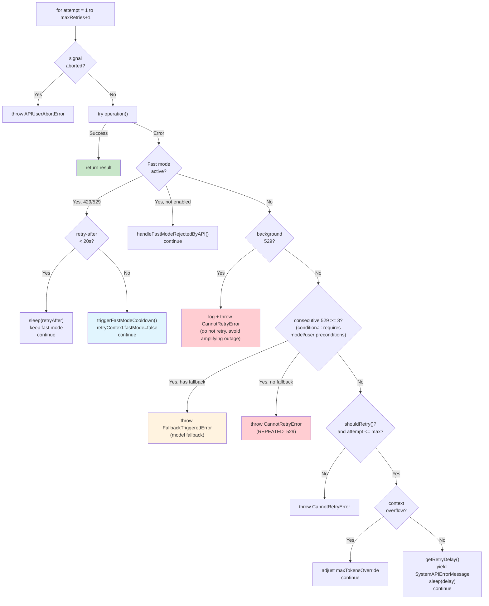

# Chapter 23: Client Transport and API Retry — Robust Design for Unreliable Networks

> This is Chapter 23 of *Deep Dive into Claude Code Source*. We trace a single `messages.create` call from the application layer down into the transport layer, watching how a production-grade AI CLI keeps running under unreliable networks, expired credentials, capacity overload, TLS-intercepting proxies, recycled idle connections, and other compounding sources of uncertainty.

## Why such elaborate error recovery?

When you call a REST API locally, the simplest approach is to fail loud on any error. But Claude Code faces a far messier reality:

1. **Networks are unreliable** — users may sit behind café Wi-Fi, corporate proxies, or VPN tunnels.
2. **API capacity fluctuates** — 529 overload and 429 rate limiting are everyday occurrences for an LLM API, not exceptional events.
3. **Auth tokens expire** — OAuth tokens, AWS credentials, and GCP credentials all have TTLs.
4. **Streaming connections are fragile** — SSE streams can drop mid-flight, time out, or be cut off by a proxy.
5. **Provider differences** — the same code has to work against Anthropic direct, AWS Bedrock, GCP Vertex, and Azure Foundry.
6. **Remote sessions add a second graph** — in Bridge / Teleport scenarios the CLI talks not only to the model API but also to the session service over a bidirectional channel, and every hop can fail independently.

If every error forced a manual retry, the user experience would be a disaster — imagine hitting a 529 ten minutes into an agentic coding task and starting over. Or imagine a remote-session user closing their laptop for 20 minutes and expecting the CLI to silently catch up on every missed event when they wake, instead of throwing `ECONNRESET` and dropping the world.

Claude Code's answer is a **two-mainline + shared-toolset** architecture: one mainline is the general-purpose `withRetry` layer for model-API requests, handling 429/529/auth/context overflow; the other is the transport layer for the session service (WebSocket / SSE / Hybrid tri-state), handling long-lived connection drops, batch uploads, and state merging. Both mainlines share the same error-classification, SSL-hinting, and HTML-sanitization utilities. This chapter peels them apart layer by layer and ends with reusable design patterns. The streaming / non-streaming dual-mode switch and the 404 endpoint fallback live inside `claude.ts` and are covered in the next piece, C25 — this chapter does not unpack them.

---

## 1. withRetry: an AsyncGenerator-driven retry engine

### 1.1 Why an AsyncGenerator?

`withRetry` has an unusual signature — it does not return `Promise<T>`, it returns `AsyncGenerator<SystemAPIErrorMessage, T>`:

```typescript
// services/api/withRetry.ts:170-178
export async function* withRetry<T>(
  getClient: () => Promise<Anthropic>,
  operation: (
    client: Anthropic,
    attempt: number,
    context: RetryContext,
  ) => Promise<T>,
  options: RetryOptions,
): AsyncGenerator<SystemAPIErrorMessage, T> {
```

Why AsyncGenerator instead of a plain `async function`? Because the retry process needs to **stream intermediate state upward** — the wait between attempts, the current attempt number, and the error type all need to surface to the UI layer in real time so the user sees "the system is retrying, please hold" rather than "the system has frozen".

A generator's `yield` fits naturally: yield one `SystemAPIErrorMessage` during each backoff window so the UI can render progress, then `return` the final result on success.

### 1.2 Core constants and retry budget

```typescript
// services/api/withRetry.ts:52-55
const DEFAULT_MAX_RETRIES = 10
const FLOOR_OUTPUT_TOKENS = 3000
const MAX_529_RETRIES = 3
export const BASE_DELAY_MS = 500
```

Four constants define the retry envelope:

| Constant | Value | Meaning |
|---|---|---|
| `DEFAULT_MAX_RETRIES` | 10 | Up to 10 retries by default |
| `MAX_529_RETRIES` | 3 | Three consecutive 529s trigger model fallback |
| `BASE_DELAY_MS` | 500 ms | Base delay for exponential backoff |
| `FLOOR_OUTPUT_TOKENS` | 3000 | Minimum output-token budget when adjusting for context overflow |

`DEFAULT_MAX_RETRIES` can be overridden via the `CLAUDE_CODE_MAX_RETRIES` environment variable (`withRetry.ts:790-793`), which is useful in CI/CD scenarios.

### 1.3 Exponential backoff and Retry-After

The `getRetryDelay` function implements exponential backoff with jitter:

```typescript
// services/api/withRetry.ts:530-548
export function getRetryDelay(
  attempt: number,
  retryAfterHeader?: string | null,
  maxDelayMs = 32000,
): number {
  if (retryAfterHeader) {
    const seconds = parseInt(retryAfterHeader, 10)
    if (!isNaN(seconds)) {
      return seconds * 1000
    }
  }
  const baseDelay = Math.min(
    BASE_DELAY_MS * Math.pow(2, attempt - 1),
    maxDelayMs,
  )
  const jitter = Math.random() * 0.25 * baseDelay
  return baseDelay + jitter
}
```

Two details worth noting:

1. **Retry-After wins** — whatever the server says, wait that long. This is the right HTTP behavior.
2. **25% jitter** — when many clients hit 529 simultaneously and retry, jitter spreads the retries across the window and avoids a "retry storm".

### 1.4 The main loop: a precise state machine

The main loop of `withRetry` is a `for` loop, but the multiple `continue` branches inside it form an implicit state machine. Let's walk the branches in priority order:



#### Branch 1: Fast Mode fallback (withRetry.ts:267-314)

Fast Mode is an accelerated mode (a faster inference path). When 429/529 hits, the system has to decide: hold on Fast Mode for a moment, or drop back to standard speed?

```typescript
// services/api/withRetry.ts:284-304
const retryAfterMs = getRetryAfterMs(error)
if (retryAfterMs !== null && retryAfterMs < SHORT_RETRY_THRESHOLD_MS) {
  // Short wait (< 20s): keep Fast Mode, sleep, retry — reuse the prompt cache
  await sleep(retryAfterMs, options.signal, { abortError })
  continue
}
// Long wait or unknown: drop back to standard speed and enter a cooldown window
const cooldownMs = Math.max(
  retryAfterMs ?? DEFAULT_FAST_MODE_FALLBACK_HOLD_MS, // 30 minutes
  MIN_COOLDOWN_MS,                                     // 10 minutes
)
triggerFastModeCooldown(Date.now() + cooldownMs, cooldownReason)
retryContext.fastMode = false
continue
```

The elegance lives in the **20-second threshold** (`SHORT_RETRY_THRESHOLD_MS`): short waits stay on Fast Mode so the **prompt cache** is preserved (the model name stays the same); long waits fall back to standard mode so the user can keep working instead of staring at a spinner.

#### Branch 2: Background requests bail immediately (withRetry.ts:316-324)

```typescript
// Non-foreground sources bail immediately on 529
if (is529Error(error) && !shouldRetry529(options.querySource)) {
  logEvent('tengu_api_529_background_dropped', { ... })
  throw new CannotRetryError(error, retryContext)
}
```

This is a **counter-intuitive but critical** design. The source comment spells it out:

> "during a capacity cascade each retry is 3-10× gateway amplification, and the user never sees those fail anyway"

Background queries (summary generation, title extraction, the safety classifier, etc.) **amplify a capacity crisis** when they retry — each retry produces a 3-10× amplification at the API gateway. And the user never sees those background-task failures anyway, so giving up is the optimal strategy.

The foreground-query definition lives in the `FOREGROUND_529_RETRY_SOURCES` set (`withRetry.ts:62-82`): the main conversation thread, SDK calls, agent calls, compact operations, and the safety classifier (because auto-mode correctness depends on classifiers finishing).

#### Branch 3: Consecutive 529s trigger model fallback (withRetry.ts:327-365)

This branch **is not a universal mechanism that fires for every model and every user**; it has explicit preconditions:

```typescript
if (
  is529Error(error) &&
  (process.env.FALLBACK_FOR_ALL_PRIMARY_MODELS ||
    (!isClaudeAISubscriber() && isNonCustomOpusModel(options.model)))
) {
  consecutive529Errors++
  if (consecutive529Errors >= MAX_529_RETRIES) {
    if (options.fallbackModel) {
      throw new FallbackTriggeredError(options.model, options.fallbackModel)
    }
    if (process.env.USER_TYPE === 'external' &&
        !process.env.IS_SANDBOX &&
        !isPersistentRetryEnabled()) {
      throw new CannotRetryError(
        new Error(REPEATED_529_ERROR_MESSAGE),
        retryContext,
      )
    }
  }
}
```

To enter this branch you need `FALLBACK_FOR_ALL_PRIMARY_MODELS` to be truthy, **or** the user must not be a Claude AI subscriber (Max/Pro) **and** must be using a non-custom Opus model. The source comment also flags a TODO suggesting the `isNonCustomOpusModel` check is a vestige from when Claude Code hardcoded Opus.

When the precondition holds and the consecutive 529 count hits three, and a `fallbackModel` is configured, the branch throws `FallbackTriggeredError`. That error propagates all the way up to `query.ts`, where the conversation loop performs the actual model swap:

```typescript
// query.ts:894-897
if (innerError instanceof FallbackTriggeredError && fallbackModel) {
  currentModel = fallbackModel
  attemptWithFallback = true
  // Clear the assistant message and re-request with the fallback model
```

This **cross-layer error-propagation pattern** is worth learning: `withRetry` does not switch models directly (it lacks the context); it signals the upper layer via a custom error type, and the upper layer decides.

#### Branch 4: Automatic context-overflow adjustment (withRetry.ts:388-427)

When the API returns `input length and max_tokens exceed context limit`, `withRetry` automatically computes the available room and adjusts `maxTokensOverride`:

```typescript
const overflowData = parseMaxTokensContextOverflowError(error)
if (overflowData) {
  const { inputTokens, contextLimit } = overflowData
  const safetyBuffer = 1000
  const availableContext = Math.max(0, contextLimit - inputTokens - safetyBuffer)
  if (availableContext < FLOOR_OUTPUT_TOKENS) {
    throw error
  }
  retryContext.maxTokensOverride = Math.max(
    FLOOR_OUTPUT_TOKENS,
    availableContext,
    minRequired,
  )
  continue
}
```

`parseMaxTokensContextOverflowError` extracts token counts from the error message via regex. This "pull structured data out of an error string" trick is common in production systems — APIs often embed the relevant numbers in the message but expose no structured fields.

### 1.5 Persistent retry: unattended mode

For internal unattended scenarios, `withRetry` can switch to an entirely different strategy — infinite retry. The capability is gated **twice**: the compile-time `feature('UNATTENDED_RETRY')` must be on (i.e. ant-internal builds) **and** the runtime env var `CLAUDE_CODE_UNATTENDED_RETRY` must be truthy. In other words, this is a feature-gated internal capability, not a public option:

```typescript
// services/api/withRetry.ts:91-104
function isPersistentRetryEnabled(): boolean {
  return feature('UNATTENDED_RETRY')
    ? isEnvTruthy(process.env.CLAUDE_CODE_UNATTENDED_RETRY)
    : false  // In external builds feature() compiles to false; the branch is DCE'd
}
```

When persistent retry is on, the 429/529 backoff strategy becomes:

```typescript
const PERSISTENT_MAX_BACKOFF_MS = 5 * 60 * 1000      // Max backoff: 5 minutes
const PERSISTENT_RESET_CAP_MS = 6 * 60 * 60 * 1000   // Longest wait: 6 hours
const HEARTBEAT_INTERVAL_MS = 30_000                 // Heartbeat every 30 seconds

if (persistent) {
  let remaining = delayMs
  while (remaining > 0) {
    if (options.signal?.aborted) throw new APIUserAbortError()
    yield createSystemAPIErrorMessage(error, remaining, ...)
    const chunk = Math.min(remaining, HEARTBEAT_INTERVAL_MS)
    await sleep(chunk, options.signal, { abortError })
    remaining -= chunk
  }
  if (attempt >= maxRetries) attempt = maxRetries
}
```

Two key design points:

1. **Heartbeat chunking** — a long wait (potentially hours) is sliced into 30-second chunks, and each chunk yields a status message to stdout. This prevents the host environment (e.g. a CI runner) from killing the session for being "idle".
2. **Attempt clamp** — `if (attempt >= maxRetries) attempt = maxRetries` keeps the `for` loop from terminating because `attempt > maxRetries + 1`. The actual backoff uses a separate `persistentAttempt` counter.

---

## 2. shouldRetry: fine-grained judgment on error retriability

Not every error deserves a retry. The `shouldRetry()` function (`withRetry.ts:696-787`) implements a careful decision chain:

```typescript
function shouldRetry(error: APIError): boolean {
  // 1. Mock errors (for tests) are never retried
  if (isMockRateLimitError(error)) return false
  // 2. Persistent mode: 429/529 retry unconditionally
  if (isPersistentRetryEnabled() && isTransientCapacityError(error)) return true
  // 3. CCR (remote container) mode: 401/403 are treated as transient
  if (isEnvTruthy(process.env.CLAUDE_CODE_REMOTE) &&
      (error.status === 401 || error.status === 403)) return true
  // 4. overloaded_error in the message body (the SDK sometimes drops the 529 status code)
  if (error.message?.includes('"type":"overloaded_error"')) return true
  // 5. Context overflow can be recovered by adjusting max_tokens
  if (parseMaxTokensContextOverflowError(error)) return true
  // 6. The x-should-retry response header — explicit server directive
  const shouldRetryHeader = error.headers?.get('x-should-retry')
  if (shouldRetryHeader === 'true' &&
      (!isClaudeAISubscriber() || isEnterpriseSubscriber())) return true
  if (shouldRetryHeader === 'false') {
    const is5xxError = error.status !== undefined && error.status >= 500
    if (!(process.env.USER_TYPE === 'ant' && is5xxError)) return false
  }
  // 7. Connection errors are always retriable
  if (error instanceof APIConnectionError) return true
  // 8. Classify by status code
  if (error.status === 408) return true
  if (error.status === 409) return true
  if (error.status === 429) return !isClaudeAISubscriber() || isEnterpriseSubscriber()
  if (error.status === 401) { clearApiKeyHelperCache(); return true }
  if (error.status && error.status >= 500) return true
  return false
}
```

A few decisions worth highlighting:

**429 is not retried for subscribers** — for Max/Pro users a 429 means the quota is exhausted, likely for hours, and retrying is pointless. Enterprise users typically run on PAYG (pay-as-you-go), so 429 is more often a transient rate limit and worth retrying.

**The `x-should-retry` header** — this is a non-standard response header letting the server explicitly tell the client whether to retry. Far more precise than client-side guessing.

**Double-detection of 529** — the SDK in streaming mode sometimes fails to surface the 529 status code, so the source checks both `error.status === 529` and `error.message?.includes('"type":"overloaded_error"')` (`withRetry.ts:610-621`). This kind of "defensive double check" is common in production code.

---

## 3. Auth error recovery: transparent re-authentication across providers

### 3.1 OAuth 401 auto-refresh

When the API returns 401, the `withRetry` main loop automatically refreshes the OAuth token on the next iteration:

```typescript
// services/api/withRetry.ts:233-251
if (
  client === null ||
  (lastError instanceof APIError && lastError.status === 401) ||
  isOAuthTokenRevokedError(lastError) ||
  isBedrockAuthError(lastError) ||
  isVertexAuthError(lastError) ||
  isStaleConnection
) {
  if (
    (lastError instanceof APIError && lastError.status === 401) ||
    isOAuthTokenRevokedError(lastError)
  ) {
    const failedAccessToken = getClaudeAIOAuthTokens()?.accessToken
    if (failedAccessToken) {
      await handleOAuth401Error(failedAccessToken)
    }
  }
  client = await getClient()
}
```

Note the client-creation strategy: **a new client is built only on the first request, on an auth error, or after a stale connection**. Regular non-auth retries reuse the existing client instance, avoiding needless token refreshes and connection setup.

### 3.2 AWS/GCP credential expiry handling

Bedrock and Vertex credential failures are not always `APIError`s — they can be SDK-level `CredentialsProviderError`s. The source handles them with dedicated detectors:

```typescript
// services/api/withRetry.ts:631-694
function isBedrockAuthError(error: unknown): boolean {
  if (isEnvTruthy(process.env.CLAUDE_CODE_USE_BEDROCK)) {
    if (isAwsCredentialsProviderError(error) ||
        (error instanceof APIError && error.status === 403)) {
      return true
    }
  }
  return false
}

function isVertexAuthError(error: unknown): boolean {
  if (isEnvTruthy(process.env.CLAUDE_CODE_USE_VERTEX)) {
    if (isGoogleAuthLibraryCredentialError(error)) return true
    if (error instanceof APIError && error.status === 401) return true
  }
  return false
}
```

Each provider has different error signatures: AWS throws SDK-level credential errors (`CredentialsProviderError`) or returns 403 at the API; GCP's `google-auth-library` throws a plain `Error` whose message must be matched (`Could not load the default credentials`, `invalid_grant`, etc.).

When a credential error is detected, the corresponding cache is cleared (`clearAwsCredentialsCache()` / `clearGcpCredentialsCache()`), so the next client build re-fetches credentials.

### 3.3 Stale-connection repair

TCP keep-alive connections are sometimes silently closed on the proxy or load balancer side, surfacing as `ECONNRESET` or `EPIPE`:

```typescript
// services/api/withRetry.ts:112-118
function isStaleConnectionError(error: unknown): boolean {
  if (!(error instanceof APIConnectionError)) return false
  const details = extractConnectionErrorDetails(error)
  return details?.code === 'ECONNRESET' || details?.code === 'EPIPE'
}

const isStaleConnection = isStaleConnectionError(lastError)
if (isStaleConnection && getFeatureValue_CACHED_MAY_BE_STALE(
    'tengu_disable_keepalive_on_econnreset', false)) {
  disableKeepAlive()
}
```

`disableKeepAlive()` outright disables keep-alive on the HTTP connection pool (`utils/proxy.ts:29`), ensuring subsequent requests use fresh connections rather than recycling potentially dead ones.

---

## 4. Streaming dual-mode: streaming + non-streaming fallback

Claude Code's API calls default to streaming (SSE) and fall back to non-streaming on failure; some proxies that do not support SSE endpoints return 404 and take the same fallback path. This whole mechanism lives inside `claude.ts` — the `queryModel` mainline, the stream-idle watchdog, the stall monitor, the `executeNonStreamingRequest` wrapper, and the 404 endpoint fallback — a deep stack with many states, which is why it gets its own chapter and stays better aligned with the code.

> This material has been moved to [Chapter 25: DirectConnect and Upstream Proxy](./25-directconnect-and-upstream-proxy.md). This section is kept as an anchor for jumps from the historical table of contents, and as a reminder that streaming fallback, the `withRetry` main loop, and the transport-layer long-lived connections are three distinct code paths — please do not conflate them.

---

## 5. The client transport layer: WebSocket / SSE / Hybrid tri-state

Up to this point everything has been request/response against the model API (`api.anthropic.com/messages`). Claude Code also runs a separate transport path — **the long-lived connection between the client and the session service**. That path is what carries **CCR** (Claude Cloud Runtime, the session cloud runtime) — it hosts every Claude Code session inside a cloud-side worker, and uses this section's WebSocket / SSE / Hybrid implementations to sync the event stream bidirectionally to the local CLI and to a remote browser/phone (Bridge / Teleport). The names you will see below — `CCR v2`, `worker`, `worker_epoch`, `Bridge`, `Teleport` — are roles inside that architecture, unpacked in detail in the next chapter (C24); for this section just treat them as the "other end of the long-lived connection". Its failure modes have nothing in common with the model API: a dropped network is no longer "POST again", it is **disconnect/reconnect, event replay, token refresh, sleep/wake, batch uploads with backpressure, and multi-replica failover**.

The `cli/transports/` directory ships three implementations of a shared `Transport` interface, picked by a lightweight dispatcher driven by environment variables:

```typescript
// cli/transports/transportUtils.ts:16-45
export function getTransportForUrl(url, headers, sessionId, refreshHeaders) {
  if (isEnvTruthy(process.env.CLAUDE_CODE_USE_CCR_V2)) {
    // v2: SSE for reads, HTTP POST for writes
    const sseUrl = new URL(url.href)
    if (sseUrl.protocol === 'wss:') sseUrl.protocol = 'https:'
    else if (sseUrl.protocol === 'ws:') sseUrl.protocol = 'http:'
    sseUrl.pathname = sseUrl.pathname.replace(/\/$/, '') + '/worker/events/stream'
    return new SSETransport(sseUrl, headers, sessionId, refreshHeaders)
  }
  if (url.protocol === 'ws:' || url.protocol === 'wss:') {
    if (isEnvTruthy(process.env.CLAUDE_CODE_POST_FOR_SESSION_INGRESS_V2)) {
      return new HybridTransport(url, headers, sessionId, refreshHeaders)
    }
    return new WebSocketTransport(url, headers, sessionId, refreshHeaders)
  }
  throw new Error(`Unsupported protocol: ${url.protocol}`)
}
```

The dispatch priority is interesting: **SSE beats Hybrid, Hybrid beats WebSocket**. SSE has already explicitly rejected WebSocket URLs (the scheme has to switch to https), and Hybrid is a strict subset of WebSocket — it only swaps "write" for POST while "read" still goes over WS. This "gradually contract toward the safer protocol" migration path lets ops roll out in phases instead of flipping every user to SSE at once.

### 5.1 WebSocketTransport: auto-reconnect and sleep/wake detection

`WebSocketTransport` is the oldest and most complex of the three. It has to handle the Bun built-in WebSocket and the Node `ws` package as two parallel code paths, reconnect on network drops, detect "I slept for 20 minutes" when a laptop wakes and reconnect immediately instead of waiting through a backoff, and call `refreshHeaders()` to get a new token when authentication close code 4003 fires.

Four key constants:

```typescript
// cli/transports/WebSocketTransport.ts:26-42
const DEFAULT_RECONNECT_GIVE_UP_MS = 600_000         // Give up after 10 minutes
const DEFAULT_PING_INTERVAL = 10000                  // Application-level ping every 10s
const DEFAULT_KEEPALIVE_INTERVAL = 300_000           // TCP keep-alive every 5 minutes
const SLEEP_DETECTION_THRESHOLD_MS = DEFAULT_MAX_RECONNECT_DELAY * 2 // 60s
const PERMANENT_CLOSE_CODES = new Set([1002, 4001, 4003])
```

The composition of `PERMANENT_CLOSE_CODES` is the key. `1002` (protocol error) and `4001` (permanent reject) really are unrecoverable, but `4003` (auth failure) is only treated as permanent when **no `refreshHeaders` callback was provided** or **the new and old tokens are identical**:

```typescript
// cli/transports/WebSocketTransport.ts:438-454 (simplified)
const closeCode = event.code
const isPermanent =
  PERMANENT_CLOSE_CODES.has(closeCode) &&
  !(closeCode === 4003 && this.refreshHeaders && newToken !== oldToken)
```

This single line folds "OAuth token refresh" fully into the WebSocket lifecycle — the server uses close code 4003 to say "this token is dead", the client fetches a new one and reconnects seamlessly. From the user's perspective, the session never broke.

**Sleep detection** is another nice detail. When a Mac laptop closes its lid V8's `setInterval` pauses, and on wake every backlogged callback fires at once. If the interval is 5 seconds and the lid was closed for 20 minutes, 240 ping failures fire simultaneously — but in reality the only thing that happened was "I slept for 20 minutes":

```typescript
// cli/transports/WebSocketTransport.ts:476-492
const now = Date.now()
const elapsed = now - this.lastReconnectAttemptTime
if (elapsed > SLEEP_DETECTION_THRESHOLD_MS) {
  // Long gap detected: skip exponential backoff and reconnect immediately
  this.reconnectAttempts = 0
}
if (elapsed < DEFAULT_RECONNECT_GIVE_UP_MS) {
  this.scheduleReconnect()
}
```

`SLEEP_DETECTION_THRESHOLD_MS = 60s` is "twice the maximum normal reconnect delay" — if two reconnect attempts are spaced further apart than that, the machine must have slept, so reset the backoff counter and reconnect immediately rather than crawling back up to 5 minutes.

**Message replay** is implemented via a fixed-capacity `CircularBuffer<StdoutMessage>` (`WebSocketTransport.ts:106` — the `messageBuffer`, capacity `DEFAULT_MAX_BUFFER_SIZE = 1000`, see `WebSocketTransport.ts:22`). Every outbound message that carries a `uuid` field is `add()`-ed into the buffer and recorded as `lastSentId` (`WebSocketTransport.ts:660-664`); on the reconnect handshake the client sends that ID back to the server via the `X-Last-Request-Id` header (`WebSocketTransport.ts:152-156`), and the server replies in the upgrade response with `x-last-request-id` meaning "I have processed up to here":

```typescript
// cli/transports/WebSocketTransport.ts:574-606 (excerpted)
const lastConfirmedIndex = messages.findIndex(
  message => 'uuid' in message && message.uuid === lastId,
)
if (lastConfirmedIndex >= 0) {
  // Server confirmed up to here — clear() + addAll() to keep the unconfirmed tail
  const startIndex = lastConfirmedIndex + 1
  const remaining = messages.slice(startIndex)
  this.messageBuffer.clear()
  this.messageBuffer.addAll(remaining)
}
for (const message of messagesToReplay) {
  this.sendLine(jsonStringify(message) + '\n')
}
```

This "client buffer + server-side confirmation cursor" pattern keeps reconnects from dropping or duplicating messages — a classic at-least-once → exactly-once promotion, safer than the naive "resend every unconfirmed message after reconnect" approach.

### 5.2 SSETransport: one-way stream + sequence tracking + Last-Event-ID

SSE (Server-Sent Events) is a one-way HTTP push, simpler than WebSocket: an `EventSource`-style `text/event-stream` receives events, regular `POST` writes outbound. But SSE has no application-level ping and no close code — every anomaly has to be detected by the client.

```typescript
// cli/transports/SSETransport.ts:21-27
const LIVENESS_TIMEOUT_MS = 45_000
const PERMANENT_HTTP_CODES = new Set([401, 403, 404])
```

`LIVENESS_TIMEOUT_MS = 45s` is the SSE "heartbeat timeout". CCR servers push a `:keepalive` comment every few seconds; the client resets its timer on any received byte, and after 45 seconds with no bytes it actively disconnects and reconnects. `PERMANENT_HTTP_CODES = {401, 403, 404}` are treated as permanent during handshake, skipping reconnect.

**Sequence tracking** is the most important invariant in SSE reconnect scenarios. `readStream()` (`SSETransport.ts:339-415`) parses `seqNum` from each SSE frame's `id` field, records seen sequence numbers in a `seenSequenceNums: Set<number>`, and updates `lastSequenceNum`; on reconnect it tells the server "this is how far I got" via the `from_sequence_num` query parameter or the `Last-Event-ID` header, and the server is responsible for not re-pushing. Note: when the client sees a duplicate `seqNum` it only logs a diagnostic and keeps processing the frame, it does not skip — the real dedup responsibility lives on the server's `from_sequence_num` cursor.

```typescript
// cli/transports/SSETransport.ts:246-265 (excerpted)
if (this.lastSequenceNum > 0) {
  sseUrl.searchParams.set('from_sequence_num', String(this.lastSequenceNum))
  headers['Last-Event-ID'] = String(this.lastSequenceNum)
}
```

```typescript
// cli/transports/SSETransport.ts:357-387 (excerpted)
if (frame.id) {
  const seqNum = parseInt(frame.id, 10)
  if (!isNaN(seqNum)) {
    if (this.seenSequenceNums.has(seqNum)) {
      // Only log a duplicate-seq diagnostic, do not continue — handleSSEFrame
      // still runs; real dedup relies on the server cursor
      logEvent('sse_duplicate_seq', { seqNum })
    }
    this.seenSequenceNums.add(seqNum)
    // Once the set exceeds 1000 entries, purge anything < lastSequenceNum - 200
    if (this.seenSequenceNums.size > 1000) {
      const threshold = this.lastSequenceNum - 200
      for (const s of this.seenSequenceNums) {
        if (s < threshold) this.seenSequenceNums.delete(s)
      }
    }
    if (seqNum > this.lastSequenceNum) this.lastSequenceNum = seqNum
  }
}
```

The `parseSSEFrames` helper is explicitly `export`ed — both because it is the core of SSE frame parsing and because exporting it makes it easy to unit-test all the "partial frame arrives" edge cases (a single event split across TCP packets, the `\n\n` delimiter landing on a chunk boundary, and so on).

**POST writes** go through a 10-retry exponential-backoff loop — same idea as `withRetry`, but not depending on `withRetry` itself, because here there is no need for error classification or the Fast Mode machinery, only a plain "retry on failure, give up on permanent errors" semantics.

### 5.3 HybridTransport: WS read + POST batched write

`HybridTransport` does one thing on top of `WebSocketTransport` — replace "write" with 100 ms-batched HTTP POSTs:

```typescript
// cli/transports/HybridTransport.ts:12-22
const BATCH_FLUSH_INTERVAL_MS = 100
const POST_TIMEOUT_MS = 15_000
const CLOSE_GRACE_MS = 3000
```

Why go to this trouble? Because some corporate proxies are hostile to upstream-only WS frames (firewalls buffer them, drop them, or chunk them along the HTTP 4 KB boundary), while HTTP POST is always compatible. `HybridTransport` shapes upstream traffic into "one POST every 100 ms" and keeps downstream on WS, balancing latency with compatibility.

The actual batching is delegated to a generic class, `SerialBatchEventUploader<T>`:

```typescript
// cli/transports/HybridTransport.ts:79-85 (excerpted)
this.uploader = new SerialBatchEventUploader({
  maxBatchSize: 500,
  // This is deliberately far larger than maxBatchSize — enqueue does not await,
  // and stuffing more than maxQueueSize items at once would deadlock
  maxQueueSize: 100_000,
  // ...
})
```

`maxQueueSize = 100_000` is much larger than `maxBatchSize = 500`, an **anti-backpressure design**. The source comment explains: callers invoke `enqueue()` **without awaiting**, and if a single microtask pushes 600 items into a queue of capacity 500, `enqueue()` will block forever waiting for `processBatch` to drain it — but `processBatch` itself cannot run until the current microtask yields the event loop. So the queue capacity must be substantially larger than any plausible burst, or the system deadlocks.

**The 3-second close grace**: `CLOSE_GRACE_MS = 3000` gives queued writes a best-effort window during shutdown. `close()` (`HybridTransport.ts:171-195`) actually runs in this order: kick off `void Promise.race([uploader.flush(), timeout])` but **do not await**, immediately call `super.close()` to tear down the WebSocket, then `uploader.close()` once the grace expires. That whole stretch is a fire-and-forget safety net — not a "synchronously wait for flush before closing WS". The source comment also notes that the archive write has already been awaited once between archive and close, so this is only a last-line backstop.

### 5.4 SerialBatchEventUploader: a generic serial batch uploader

`SerialBatchEventUploader<T>` is a generic helper, reused by `HybridTransport` (uploading events), `SSETransport` (uploading POST writes), and any other place that needs "batch + serial + retry". Its core abstraction is `RetryableError` — but you have to look closely at the true semantics:

```typescript
// cli/transports/SerialBatchEventUploader.ts:17-33 (excerpted)
/**
 * Throwing this error with retryAfterMs makes the uploader retry after the
 * server-supplied delay. Without retryAfterMs it behaves like a plain thrown
 * Error and uses exponential backoff.
 */
export class RetryableError extends Error {
  constructor(message: string, readonly retryAfterMs?: number) {
    super(message)
  }
}
```

Actual behavior lives in `drain()` (`SerialBatchEventUploader.ts:156-202`): **any** error thrown from `send()` (whether `RetryableError` or a plain `Error`) causes the uploader to `concat` the failing batch back to the head of the `pending` queue and back off (`SerialBatchEventUploader.ts:184-188`). The only difference is the backoff delay: if `RetryableError.retryAfterMs` is supplied it is used (clamped + jittered); otherwise exponential backoff applies. "Permanent failure drops the batch" only fires when `maxConsecutiveFailures` is configured and the consecutive-failure counter hits the threshold (`SerialBatchEventUploader.ts:171-180`), which then invokes the `onBatchDropped` callback and increments `droppedBatches`. In other words, HybridTransport's `postOnce()` uses `return` for non-429 4xx to mean "advance the queue, drop this batch", instead of throwing a plain `Error` — throwing one would actually cause endless retries.

The backoff strategy is unified inside the uploader and clamps the server-provided `retryAfterMs`:

```typescript
// cli/transports/SerialBatchEventUploader.ts:235-247 (excerpted)
const jitter = Math.random() * this.config.jitterMs
if (retryAfterMs !== undefined) {
  // Server-supplied retry-after is clamped to [baseDelayMs, maxDelayMs], then jitter
  const clamped = Math.max(
    this.config.baseDelayMs,
    Math.min(retryAfterMs, this.config.maxDelayMs),
  )
  return clamped + jitter
}
```

`takeBatch()` also carries a `maxBatchBytes` field bounding per-batch byte size — and if a single event throws during serialization (circular references, `BigInt`s, anything not JSON-able), it is **dropped individually** rather than blocking the whole batch, and `droppedBatchCount` is monotonically incremented. This is a "local failures do not propagate" isolation design.

### 5.5 WorkerStateUploader: dual-slot coalescing + RFC 7396 metadata merge

The `PUT /worker` endpoint uploads whole session state, not an event stream. The access pattern is utterly different: **callers may fire 100 state updates within 1 ms** (every keystroke updates cursor position), and the server only cares about "what is the final value", not the intermediate steps.

`WorkerStateUploader` optimizes for this pattern by **always keeping at most one inflight + one pending**:

```typescript
// cli/transports/WorkerStateUploader.ts:40-65 (simplified)
enqueue(patch: Record<string, unknown>): void {
  // A new patch merges straight into pending (never more than 1 slot)
  this.pending = this.pending ? coalescePatches(this.pending, patch) : patch
  this.maybeSend()
}

private maybeSend(): void {
  if (this.inflight || this.closed || !this.pending) return
  const payload = this.pending
  this.pending = null
  this.inflight = this.sendWithRetry(payload).then(() => {
    this.inflight = null
    if (this.pending && !this.closed) this.maybeSend()  // Chain-trigger
  })
}
```

The coalescing function `coalescePatches` is "last-write-wins" for top-level keys, but for the two special keys `external_metadata` and `internal_metadata` it applies **RFC 7396 JSON Merge Patch**:

```typescript
// cli/transports/WorkerStateUploader.ts:106-130 (excerpted)
if ((key === 'external_metadata' || key === 'internal_metadata') &&
    merged[key] && typeof merged[key] === 'object') {
  merged[key] = {
    ...(merged[key] as Record<string, unknown>),
    ...(value as Record<string, unknown>),
  }
}
```

Why merge metadata when every other field is overwritten? Because metadata is a namespace shared across modules — the UI module writes `cursor_position`, the tools module writes `last_tool_use_id`; under last-write-wins each module's legitimate writes would clobber the others. RFC 7396 keeps them independent.

`sendWithRetry` has a subtle "absorb pending on retry" mechanism: before each retry, if `this.pending` is non-empty, it is merged into the in-flight payload before re-sending, guaranteeing **eventual consistency**. If the user changed state five times during the retry, all five changes are merged into the same request rather than queued behind it.

### 5.6 CCRClient: the CCR v2 worker lifecycle protocol

After CCR v2 split "the event stream" into "SSE read + HTTP POST write", `SSETransport` alone is not enough — who reports worker status? who sends heartbeats? who returns acks? That protocol layer is encapsulated in `cli/transports/ccrClient.ts`, the `CCRClient` class.

Its shape is "one `SSETransport` feeding in + four `SerialBatchEventUploader` / `WorkerStateUploader` feeding out":

```typescript
// cli/transports/ccrClient.ts:286-292 (excerpted)
private readonly workerState: WorkerStateUploader
private readonly eventUploader: SerialBatchEventUploader<ClientEvent>
private readonly internalEventUploader: SerialBatchEventUploader<WorkerEvent>
private readonly deliveryUploader: SerialBatchEventUploader<{
  eventId: string
  status: 'received' | 'processing' | 'processed'
}>
```

The four channels target, respectively, `PUT /worker` (state), `POST /worker/events` (user-visible events), `POST /worker/internal-events` (invisible transcript persistence), and `POST /worker/events/delivery` (per-inbound-event ack). Each channel's `send` callback follows the same template (`ccrClient.ts:367-385`): call `this.request()` to get a `RequestResult`, and on failure `throw new RetryableError('...', result.retryAfterMs)` so the `SerialBatchEventUploader` backs off on the server-supplied `Retry-After`.

`request()` itself handles three special status codes (`ccrClient.ts:582-630`): `409` invokes `handleEpochMismatch()` and exits via the `onEpochMismatch` callback (in spawn mode the default is `process.exit(1)`; REPL mode must inject its own callback to avoid killing the user's process); on `401/403` it first checks `decodeJwtExpiry`, and if the token is already expired it gives up immediately, otherwise it increments `consecutiveAuthFailures` and only gives up when `MAX_CONSECUTIVE_AUTH_FAILURES = 10` is reached without recovery (`ccrClient.ts:67-68`); on `429` it parses the `retry-after` header and returns it as `retryAfterMs`, which becomes the precise backoff for `RetryableError`.

`writeEvent()` also has a built-in **`stream_event` 100 ms coalesce window** (`ccrClient.ts:735-751`), which accumulates each content block's text_deltas into a "full-so-far snapshot" before enqueueing — clients that join in the middle of the stream receive a self-contained chunk of complete text, rather than a fragment starting from some delta. The accumulator state is keyed by API message ID, and when `writeEvent` receives the complete `assistant` message it calls `clearStreamAccumulatorForMessage` to release it — a boundary that fires reliably even on abort/error paths.

### 5.7 sessionIngress: JSONL append + optimistic concurrency control

The last piece is `services/api/sessionIngress.ts`, paired with `PUT /session_ingress/.../entry` — appending each transcript message to server-side storage in JSONL form.

It has two distinctive designs. First, **a per-session `sequential` serializer**:

```typescript
// services/api/sessionIngress.ts:42-55
function getOrCreateSequentialAppend(sessionId: string) {
  let sequentialAppend = sequentialAppendBySession.get(sessionId)
  if (!sequentialAppend) {
    sequentialAppend = sequential(
      async (entry, url, headers) =>
        await appendSessionLogImpl(sessionId, entry, url, headers),
    )
    sequentialAppendBySession.set(sessionId, sequentialAppend)
  }
  return sequentialAppend
}
```

Why serial? Because JSONL append uses **optimistic concurrency control** — each PUT carries a `Last-Uuid` header asserting "the last entry I saw was this UUID", and the server validates before accepting. Two concurrent requests guarantee one of them fails. The `sequential` wrapper ensures that at most one PUT per session is in flight at a time.

Second, **smart 409-conflict recovery**:

```typescript
// services/api/sessionIngress.ts:90-141 (simplified)
if (response.status === 409) {
  const serverLastUuid = response.headers['x-last-uuid']
  if (serverLastUuid === entry.uuid) {
    // My entry already IS the server's latest — the earlier PUT succeeded but
    // the response was lost
    lastUuidMap.set(sessionId, entry.uuid)
    return true
  }
  if (serverLastUuid) {
    // Server provided its latest UUID — adopt it and retry
    lastUuidMap.set(sessionId, serverLastUuid as UUID)
  } else {
    // Older endpoint does not return x-last-uuid — fetch the whole session and find the tail
    const logs = await fetchSessionLogsFromUrl(sessionId, url, headers)
    const adoptedUuid = findLastUuid(logs)
    if (adoptedUuid) lastUuidMap.set(sessionId, adoptedUuid)
    else return false
  }
  continue
}
```

The first `if` handles a classic distributed-systems ghost scenario: process A sends a PUT, the server commits it, the response is lost on the wire; A is killed; a new process takes over the same session and reads the old UUID from `lastUuidMap`; the new entry is sent with the stale `Last-Uuid` and the server returns 409. But `x-last-uuid` in the response is the new entry's own UUID — proving the entry actually committed and only the response was lost. This case is treated as success and not resent.

The second `if`/`else` handles a "real conflict": if the server gave its true latest UUID, adopt it; if the older endpoint did not return that header, GET the whole session, find the tail, and retry.

`getTeleportEvents` is the replacement for the legacy CCR session endpoint, paginating in chunks (default 1000/page, up to 100 pages = 100k events), while `getSessionLogsViaOAuth` is kept as the compatibility path for the old endpoint — both coexist during the migration.

---

## 6. Connection-error classification and user-friendly hints

The model-API retry layer and the transport layer share the same low-level error utilities, centralized in `services/api/errorUtils.ts`.

### 6.1 Walking the error cause chain

The Anthropic SDK wraps low-level connection errors in a `cause` property chain. `extractConnectionErrorDetails` walks the chain to find the root cause:

```typescript
// services/api/errorUtils.ts:42-83
export function extractConnectionErrorDetails(error: unknown): ConnectionErrorDetails | null {
  let current: unknown = error
  const maxDepth = 5
  while (current && depth < maxDepth) {
    if (current instanceof Error && 'code' in current && typeof current.code === 'string') {
      const code = current.code
      const isSSLError = SSL_ERROR_CODES.has(code)
      return { code, message: current.message, isSSLError }
    }
    if (current instanceof Error && 'cause' in current && current.cause !== current) {
      current = current.cause
      depth++
    } else {
      break
    }
  }
  return null
}
```

The `maxDepth = 5` guard matters — `cause` chains can form cycles in odd cases, so the `current.cause !== current` check and the depth limit are belt-and-suspenders.

### 6.2 Dedicated handling for SSL errors

Enterprise users frequently hit SSL errors — TLS-intercepting proxies (e.g. Zscaler), expired corporate certificates, self-signed certificates, and so on. The source maintains a set of SSL error codes and provides targeted hints:

```typescript
// services/api/errorUtils.ts:6-29
const SSL_ERROR_CODES = new Set([
  'UNABLE_TO_VERIFY_LEAF_SIGNATURE',
  'SELF_SIGNED_CERT_IN_CHAIN',
  'CERT_HAS_EXPIRED',
  'ERR_TLS_CERT_ALTNAME_INVALID',
  // ... 16 codes total
])
```

These messages are far more useful than raw OpenSSL error codes. The comment explains:

> "enterprise users behind TLS-intercepting proxies see OAuth complete in-browser but the CLI's token exchange silently fails with a raw SSL code. Surfacing the likely fix saves a support round-trip."

`getSSLErrorHint` also returns a dedicated string for OAuth token exchange and other non-model-API scenarios, recommending `NODE_EXTRA_CA_CERTS` or asking IT to allowlist `*.anthropic.com`. The same hint shows up in `/doctor`'s preflight checks, sparing enterprise users from being stuck at "OAuth completed in the browser, the CLI cannot get a token".

### 6.3 HTML error-page sanitization

API gateways (like Cloudflare) sometimes return HTML rather than JSON. Showing the user raw HTML would be disastrous:

```typescript
// services/api/errorUtils.ts:107-116
function sanitizeMessageHTML(message: string): string {
  if (message.includes('<!DOCTYPE html') || message.includes('<html')) {
    const titleMatch = message.match(/<title>([^<]+)<\/title>/)
    if (titleMatch && titleMatch[1]) {
      return titleMatch[1].trim()
    }
    return ''
  }
  return message
}
```

It extracts the `<title>` content from the HTML — a Cloudflare error page's title is typically `"Error 524: A timeout occurred"`, far more useful than the full HTML body.

### 6.4 Nested extraction for deserialized errors

When a transcript is loaded from JSONL on resume, an `APIError` round-tripped through JSON **loses its `.message` property** — the actual message text lives at different nesting depths depending on the provider:

```typescript
// services/api/errorUtils.ts:144-198 (excerpted)
// Bedrock/proxy shape: { error: { message: "..." } }
// Anthropic standard shape: { error: { error: { message: "..." } } }
type NestedAPIError = {
  error?: { message?: string; error?: { message?: string } }
}
```

`extractNestedErrorMessage` first looks at the deeper `error.error.message` (Anthropic standard shape), then falls back to `error.message` (Bedrock shape), then applies HTML sanitization. `formatAPIError` calls it when the raw `.message` is missing, preventing downstream `.length` accesses from crashing. This "unwrap by provider shape" helper is the invisible tax of multi-backend architecture.

### 6.5 Fine-grained handling of 429 rate limits

`getAssistantMessageFromError` has extremely fine-grained handling for 429 (`errors.ts:465-558`), separating multiple sub-cases:

1. **Unified rate-limit headers present** — extract the quota class (5 hours / 7 days / Opus 7 days), overage state, and reset time from the `anthropic-ratelimit-unified-*` headers, and produce a precise error hint.
2. **Overage unavailable** — prompt the user to enable extra usage or switch model.
3. **No quota headers** — extract specifics from the error message body; the SDK sometimes JSON-stringifies the entire response body, requiring a regex to extract the inner `message`.

---

## 7. Resource-leak protection

### 7.1 Stream resource release

SSE streams hold native TLS/socket buffers — memory outside the V8 heap that GC cannot reclaim. The source uses `releaseStreamResources` to make sure they are freed on every exit path:

```typescript
// services/api/claude.ts:1519-1526
function releaseStreamResources(): void {
  cleanupStream(stream)
  stream = undefined
  if (streamResponse) {
    streamResponse.body?.cancel().catch(() => {})
    streamResponse = undefined
  }
}
```

This function is called in three places: the `finally` block (runs on both normal and abnormal exit), when the watchdog times out and actively aborts the stream, and as a defensive backstop after normal completion. The comment cites GitHub issue #32920, identifying this as a real memory leak that was observed in production.

### 7.2 Client request ID

To keep client and server logs correlated even during timeouts, **first-party API requests** carry a client-generated UUID. The ID is injected only when two conditions are met: the first-party Anthropic API is in use (not Bedrock/Vertex/Foundry), and the caller has not already set this header:

```typescript
// services/api/client.ts:364-376
const injectClientRequestId =
  getAPIProvider() === 'firstParty' && isFirstPartyAnthropicBaseUrl()
return (input, init) => {
  const headers = new Headers(init?.headers)
  if (injectClientRequestId && !headers.has(CLIENT_REQUEST_ID_HEADER)) {
    headers.set(CLIENT_REQUEST_ID_HEADER, randomUUID())
  }
  return inner(input, { ...init, headers })
}
```

Third-party providers (Bedrock/Vertex) do not receive this header — they do not log it, and an unknown header could be rejected by a strict proxy (the source cites an inc-4029-class incident).

### 7.3 Transport-layer resource accounting

The transport layer has its own resource-reclamation rules. `WebSocketTransport.close()` clears the ping timer, the keep-alive timer, the reconnect timer, and the `CircularBuffer` all at once — otherwise a long-running Bridge session leaks closure references. `HybridTransport.close()` kicks off a `Promise.race([uploader.flush(), CLOSE_GRACE_MS])` best-effort grace window (fire-and-forget), then immediately tears down the WS and `uploader.close()`s when the grace expires — queued POSTs get a chance to land without blocking the caller. `SSETransport`'s `livenessTimer` is cancelled with `clearTimeout` in `close()`, and `AbortController.abort()` interrupts the pending `fetch()` stream.

`sessionIngress`'s `clearSession(sessionId)` and `clearAllSessions()` are another clean handoff point — when the user runs `/clear`, the `lastUuidMap` and `sequentialAppendBySession` of every sub-agent are emptied, so the next same-name session does not reuse a stale `Last-Uuid` and trigger a phantom conflict.

---

## 8. The full API-call lifecycle

Placing the model-API retry chain and the transport layer on the same diagram reveals the complete shape of Claude Code's outbound communication:


The two mainlines run in parallel: on the left, the retry chain around `messages.create`; on the right, the long-lived connection to the session service. They share the same `signal` (Ctrl-C from the user aborts both), the same error utilities (SSL detection, HTML sanitization, `extractConnectionErrorDetails`), and the same OAuth token refresh path (`handleOAuth401Error` and `refreshHeaders` both pull from `OAuthTokenManager`).

---

## 9. Reusable design patterns

### Pattern 1: AsyncGenerator retry layer

Implement the retry layer as an AsyncGenerator: use `yield` to surface intermediate state (progress, wait time) and `return` for the final result. More elegant than callbacks, easier to flow-control than an event system.

**Where it fits**: any async operation that needs to report status while retrying — API calls, database reconnects, file uploads.

### Pattern 2: Differentiated retry strategies for foreground vs. background

Separate foreground requests (user is waiting on the result) from background requests (summaries, analysis, etc.), and give up on background requests immediately under overload instead of retrying. This dramatically reduces API pressure during capacity events (each retry is a 3-10× amplification).

**Where it fits**: any system that issues requests at multiple priorities — web apps that mix user-interactive traffic with background tasks, microservice systems.

### Pattern 3: Protocol tiering + dispatcher-driven rollout

`getTransportForUrl` does a three-step rollout via environment variables (WebSocket → Hybrid → SSE), with three implementations coexisting under the same `Transport` interface. Ops can migrate enterprise users from WS to POST and then from POST to SSE in phases, rolling back immediately at any step, with zero impact on business code.

**Where it fits**: any long-lived system migrating from an old protocol to a new one — REST to gRPC, polling to SSE, WebSocket to WebTransport.

### Pattern 4: Client buffer + server-side confirmation cursor

`WebSocketTransport`'s `CircularBuffer` + `x-last-request-id` makes reconnects neither drop nor duplicate messages, promoting network-layer at-least-once into business-layer exactly-once. `SSETransport`'s `sequence_num` + `Last-Event-ID` is the same pattern realized differently.

**Where it fits**: any bidirectional channel where "disconnect must resume" — collaborative editing, IM, real-time game state sync, CDC data pipelines.

### Pattern 5: Dual-slot coalescing vs. queue accumulation

`WorkerStateUploader`'s 1-inflight + 1-pending + RFC 7396 merge is the optimal solution for state-style uploads: no matter how frequent callers are, memory stays O(1) and network stays O(1). `SerialBatchEventUploader` is the optimal solution for event-style uploads: events cannot be merged, but they can be batched with backpressure. **State → coalesce, events → batch** is the boundary these two classes carve out, and it deserves a slot in your own toolbox.

**Where it fits**: "only the final value matters" cases like cursor position or online status use the WorkerStateUploader shape; "every entry must be preserved" cases like operation logs or message streams use the SerialBatchEventUploader shape.

### Pattern 6: Cross-layer Error type propagation

`withRetry` does not switch models directly (it lacks the context); it throws `FallbackTriggeredError` and lets `query.ts` decide. `WebSocketTransport` does not refresh the OAuth token directly (it lacks the OAuth manager); it calls back into `refreshHeaders()`. Separating "what I can do" from "what I can decide" is the key to stable abstractions.

**Where it fits**: any layered architecture where a lower layer needs to request a policy decision from an upper layer — a database connection pool asking the app layer to switch tenants, the transport layer asking the upper layer to swap endpoints.

---

---

## Next chapter

[Chapter 24: Bridge IPC and Remote Sessions — the line that connects your local CLI to phones and browsers](./24-bridge-ipc-and-remote-sessions.md)

We change scenes: you are on the subway, but the session has to keep running. See how the 31 files under bridge/ and the rest of remote/ wire the local CLI to phones and browsers.

---
*For the full content please follow https://github.com/luyao618/Claude-Code-Source-Study (a free star is appreciated)*
