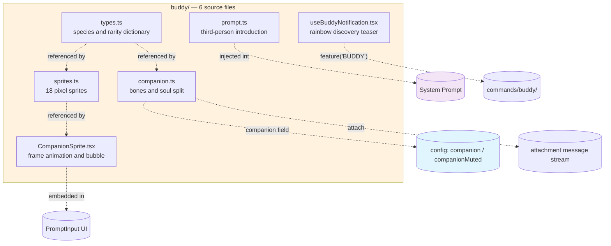

# Chapter 29: Buddy Pet — Raising a Randomly Generated Critter Next to PromptInput

> This is chapter 29 of *Deep Dive into Claude Code Source*. We are going to look at the six source files under `buddy/` and how they quietly hook into the REPL, PromptInput, configuration, attachments, and the message stream — and ultimately squeeze a small animal that blinks, pops speech bubbles, and lets you pat its head with Enter into a terminal that would otherwise be all white text on black.

## Why dedicate a whole chapter to one little animal?

The terminal is precious real estate. Every extra pixel row has to justify itself against the question "why shouldn't this be output instead?" And yet, here Claude Code went and tucked a small pet to the right of the input box: it has a name, blinks occasionally, sprouts hearts when you hit Enter, and just after a conversation ends, pops a rounded speech bubble to comment.

It sounds like a hundred lines of code, but actually slipping a pet into a serious tool runs into these five problems:

1. **Does the same person see the same critter every time they start?** Re-rolling every launch makes it a gimmick; storing the whole thing in the config means the user wipes `~/.claude.json` and that critter is gone forever.
2. **What happens when the terminal is only 80 columns?** Cramming a 12-column-wide animal into a window that already has the scrollbar fighting for space crashes the input box.
3. **Will the model get dragged along and start role-playing as this critter?** Add "you are a duck named Sproink" to the system prompt and the next reply is most likely `*quack*`.
4. **For channels without Buddy enabled, can all this code be kept out of the binary entirely?** An easter-egg feature occupying the critical path is indefensible.
5. **How do you let people discover this hidden feature without bothering those who do not want it?** A bright yellow announcement gets you flamed; tucking it inside `--help` means nobody reads it.

Claude Code's answer can be summed up in one line: **split "bones" from "soul" in storage, route rendering, appearance, declaration, command, and entry into five existing subsystems separately, then put two compile-time gates and one runtime gate around the whole thing so Buddy is shaved down to zero bytes in most builds**. The six files in `buddy/` add up to 1298 lines (`companion.ts` 133, `prompt.ts` 36, `sprites.ts` 514, `types.ts` 148, `CompanionSprite.tsx` 370, `useBuddyNotification.tsx` 97), and each answers one of the five problems above:

- `companion.ts` handles the split and generation of "bones" and "soul"
- `types.ts` holds the small dictionary of species and rarities
- `sprites.ts` holds the ASCII pixel art for 18 species
- `CompanionSprite.tsx` runs the frame animation and the speech bubble
- `prompt.ts` writes the third-person introduction handed to the model
- `useBuddyNotification.tsx` runs the rainbow-colored discovery teaser

This chapter follows the same order: how bones and soul get split (§I), how the 18 species names dodge the bundle scanner (§II), how the 500 ms tick drives blinks and head-pats (§III), how the narrow-screen and full-screen layouts each give a little ground (§IV), how the third-person introduction pins the pet to the "bystander" position (§V), and finally how the `/buddy` entry, rainbow highlighting, footer item, and two compile-time gates make Buddy disappear as a whole (§VI). The last two sections cover design patterns you can lift into your own project (§VII) and a walkthrough for "I want to put a small decoration next to my PromptInput too" (§VIII).

---

## Big picture: how six files plug into five subsystems



---

## I. Bones and soul: half computed, half stored

Open `buddy/types.ts:100-124` and you can see the `Companion` type cleanly split in two:

```typescript
// buddy/types.ts:100-124
export type CompanionBones = {
  rarity: Rarity;
  species: Species;
  eye: Eye;
  hat: Hat;
  shiny: boolean;
  stats: Record<StatName, number>;
};

export type CompanionSoul = {
  name: string;
  personality: string;
};

export type Companion = CompanionBones & CompanionSoul & { hatchedAt: number };
export type StoredCompanion = CompanionSoul & { hatchedAt: number };
```

`Bones` covers rarity, species, eye, hat, shiny flag, and the five stats — all fields that can be recomputed from a stable seed, i.e. derived data. `Soul` has only two members: the name the model gave it, and the personality description the model wrote — neither can be re-derived, so they have to be stored. `hatchedAt` (the hatch timestamp) is an outer field, not part of `Soul`. The on-disk `StoredCompanion` does not persist a single byte of the bones.

Why split this way? The last step of `getCompanion()` in `companion.ts` makes it obvious:

```typescript
// buddy/companion.ts:127-133
export function getCompanion(): Companion | undefined {
  const stored = getGlobalConfig().companion;
  if (!stored) return undefined;
  const { bones } = roll(companionUserId());
  return { ...stored, ...bones };
}
```

Note the spread order: `stored` first, `bones` second. The "bones" you read out are recomputed on the spot every time, not deserialized from disk. This gives two direct wins.

**Win 1: config edits cannot fake bones.** As the comment in the source bluntly puts it — "editing config.companion can't fake a rarity". A user who opens `~/.claude.json` and rewrites `rarity` to `legendary` gets nothing: `bones` will overwrite the field on the next launch.

**Win 2: adding a field needs no migration.** If you add `aura: Color` to `Bones` one day, existing users' config files need no migration; the field appears on the next launch.

Where does the seed for the bones come from? `companionUserId()` at `buddy/companion.ts:119-122` has a three-tier fallback:

```typescript
// buddy/companion.ts:119-122
function companionUserId(): string {
  return getOauthAccountUuid() ?? getMachineId() ?? 'anon';
}
```

The OAuth account UUID takes priority, fall back to the machine ID, fall back to the literal string `'anon'`. The point is a stable identifier that is reproducible across "the same machine, the same account, the same finger".

The seeded PRNG is a textbook Mulberry32:

```typescript
// buddy/companion.ts:16-25
function mulberry32(seed: number) {
  let s = seed >>> 0;
  return function (): number {
    s = (s + 0x6D2B79F5) >>> 0;
    let t = s;
    t = Math.imul(t ^ (t >>> 15), t | 1);
    t ^= t + Math.imul(t ^ (t >>> 7), t | 61);
    return ((t ^ (t >>> 14)) >>> 0) / 4294967296;
  };
}
```

The PRNG state is only 32 bits and the body is four arithmetic lines; the final step divides a 32-bit integer by `4294967296` to normalize to `[0,1)`. The accompanying `hashString` at `buddy/companion.ts:27-37` prefers Bun's built-in non-cryptographic hash and falls back to a five-line FNV-1a implementation. Both functions satisfy "same input always produces same output" and form the foundation of the deterministic derivation.

The seed also gets a pinch of salt:

```typescript
// buddy/companion.ts:84
const SALT = 'friend-2026-401';
```

`roll(userId)` actually uses `hashString(userId + SALT)` as its seed. What is the salt for? The user's UUID is a stable identifier; binding it directly to "which specific animal" is not appropriate. Change the salt and everyone re-hatches — effectively a "server-wide generation reset" switch hidden in the source, with no operations dashboard required.

Finally there is a lightweight cache (`buddy/companion.ts:107-117`): a single-slot memo of the most recent `userId → Bones`. At runtime `userId` does not change, but `getCompanion()` gets called repeatedly by the 500 ms-tick renderer, and the cache avoids recomputing five random rolls every frame. The same file also exports a `rollWithSeed(seed)` that bypasses the cache, kept around for debugging and documentation scenarios where you want "give me a fixed seed, show me what comes out".

---

## II. Eighteen species: hiding behind `String.fromCharCode`

`types.ts` first pieces together the 18 species names via 18 named constants:

```typescript
// buddy/types.ts:17-52 (excerpt)
const duck = (String.fromCharCode(100, 117, 99, 107)) as 'duck';
const goose = (String.fromCharCode(103, 111, 111, 115, 101)) as 'goose';
// ... and blob / cat / dragon / octopus / owl / penguin /
//        turtle / snail / ghost / axolotl / capybara / cactus /
//        robot / rabbit / mushroom / chonk
```

The `SPECIES` array below lines up these 18 constants in order:

```typescript
// buddy/types.ts:54-73
export const SPECIES = [
  duck, goose, blob, cat, dragon, octopus, owl, penguin,
  turtle, snail, ghost, axolotl, capybara, cactus,
  robot, rabbit, mushroom, chonk,
] as const;

export type Species = (typeof SPECIES)[number];
```

The same file has two companion tables: `RARITY_WEIGHTS` assigns 60/25/10/4/1 to the five rarity tiers (summing to exactly 100); `RARITY_STARS` assigns 1 to 5 `★`s to those same five tiers, ready to splice next to the name at render time.

Reading this far you will wonder: why not just write `'duck'`? Why splice character codes with `String.fromCharCode`? The answer lives in the repository's string-scan script. The bundle pipeline has a canary that scans the build artifact and fails the build if any of a predefined set of "internal codenames" (`legendary`, `Sproink`, etc.) shows up in plain text. Buddy is an easter egg that fully opens only in internal builds (`USER_TYPE === 'ant'`); for external releases it either gets dead-code-eliminated completely, or is only active inside a time window after April 2026. **In most external builds it needs to DCE so cleanly that not even string remnants are left.** Writing the names as character-code arrays of constants means TypeScript leaves them alone at compile time, V8 stitches them at runtime, and what the scanner sees is just numeric literals — completely unrecognizable.

### 2.1 Cumulative weights for the five rarity tiers

The weight table 60/25/10/4/1 summing to 100 is not a coincidence. `rollRarity` rolls a single random number in `[0,100)`:

```typescript
// buddy/companion.ts:43-51
function rollRarity(rng: () => number): Rarity {
  const r = rng() * 100;
  let acc = 0;
  for (const [rarity, weight] of Object.entries(RARITY_WEIGHTS)) {
    acc += weight;
    if (r < acc) return rarity as Rarity;
  }
  return 'common';
}
```

Scan the weight table cumulatively and `return` on the first matching interval; the trailing `'common'` is a safety net against floating-point accumulation error.

### 2.2 The stat algorithm: peak / dump / standard three branches

Right next to it is a "floor" guard:

```typescript
// buddy/companion.ts:53-59
const RARITY_FLOOR: Record<Rarity, number> = {
  common: 5,
  uncommon: 15,
  rare: 25,
  epic: 35,
  legendary: 50,
};
```

`RARITY_FLOOR` sets a baseline lower bound of 5 / 15 / 25 / 35 / 50 for the five rarity tiers. These numbers are used in a clever way inside `rollStats`:

`rollStats` at `buddy/companion.ts:62-82` first pulls out `RARITY_FLOOR[rarity]` as the baseline, then rolls the indices of `peak` (the strong stat) and `dump` (the weak stat) once each, using `while (dump === peak)` to re-roll until they differ, then walks the five stats writing values — the `peak` stat is `Math.min(100, floor + 50 + rng*30)`, the `dump` stat is `Math.max(1, floor - 10 + rng*15)`, and the rest are `floor + rng*40`.

The five stats are `DEBUGGING / PATIENCE / CHAOS / WISDOM / SNARK`, a charmingly self-aware list. The floor rises with rarity and bottoms out at 50 for legendary, so a legendary one is instantly recognizable from the stat bars alone. Re-rolling with `while` instead of offset-modulo is what avoids introducing a distribution bias.

### 2.3 The hat is a side-effect of rarity

`rollFrom(rng)` at `buddy/companion.ts:91-102` strings it all together: `rollRarity` first picks a rarity tier, then index rolls into `SPECIES` and `EYES` pick the species and eye; whether a hat exists is determined entirely by the rarity tier — `common` always gets the string `'none'`, non-common rolls an index into `HATS`; next, `shiny = rng() < 0.01` is an independent 1% shiny check; finally `rollStats(rng, rarity)` fills in the five stats.

The hat tier is a hard branch, not a probabilistic gate. Note that the `HATS` array itself includes `'none'` as one of the enum values, so non-common also has a one-in-eight chance of rolling `'none'` — there is no "18% chance of getting a hat" rule. `shiny` is an independent 1% chance **unrelated to rarity**: `buddy/companion.ts:98` literally writes `shiny: rng() < 0.01`, and all five tiers from common to legendary share the same probability — no "only legendaries can be shiny" extra gate. Stats are rolled last as the closing step.

The hat table includes things like `tinyduck` — a tiny appendage that perches on top of the main body. At render time the hat has to dodge the body's own texture, which means the hat and species pixel art negotiate space — something §III picks up.

---

## III. Pixel art, 500 ms ticks, blinks, and head-pats

`sprites.ts` is a dictionary that hardcodes 18 species × 3 frames × 5 rows × 12 columns. Each species is a `string[][]`: 3 frames on the outside, 5 row strings on the inside, 12 columns wide each. Eye positions are uniformly marked with the `{E}` placeholder — because the eye is a bones field, it cannot be hardcoded into the pixel table and has to be substituted at render time using `Bones.eye` (dot, asterisk, closed-eye arc, etc.).

### 3.1 The three postures of hat placement

`renderSprite(bones, frame)` at `buddy/sprites.ts:454-468` does only three things: first `raw.map(line => line.replaceAll('{E}', bones.eye))` substitutes the eye placeholder for the correct character; then `if (bones.hat !== 'none' && !lines[0]!.trim())` writes `HAT_LINES[bones.hat]` into `lines[0]`; finally `if (!lines[0]!.trim() && frames.every(f => !f[0]!.trim()))` calls `lines.shift()` to save one row of height.

Those 14 lines pack three branches, each corresponding to a "hat placement posture":

1. **Eye substitution** — always the first step, replace every `{E}` with the corresponding eye character.
2. **Wear the hat** — only writes the hat in when row 0 was originally `trim()`-empty. When row 0 is already occupied by smoke / antenna / other texture, the source **just gives up on the hat** rather than `unshift`-ing a row to push the animal taller.
3. **Save one row of height** — if `lines[0]` is still blank and that species's `frames.every(f => !f[0]!.trim())` are all blank, `shift()` that row to save space. The source comment explains the `every` check clearly — "Only safe when ALL frames have blank line 0; otherwise heights oscillate" — the point is to keep heights from jumping between frames.

These details determine whether the ASCII rendered per frame occupies exactly the vertical cell count expected, and the right cell count is critical for the PromptInput width math (§IV) that comes next.

### 3.2 Frame animation rhythm constants

A group of constants at the top of `CompanionSprite.tsx` defines the whole rhythm:

```typescript
// constants at the top of buddy/CompanionSprite.tsx
const TICK_MS = 500;
const BUBBLE_SHOW = 20;          // 20 ticks ≈ 10 s
const FADE_WINDOW = 6;           // last 6 ticks dim to signal disappearance
const PET_BURST_MS = 2500;
const IDLE_SEQUENCE = [0, 0, 0, 0, 1, 0, 0, 0, -1, 0, 0, 2, 0, 0, 0];
```

`IDLE_SEQUENCE` is the line in this chapter most worth staring at. It is a length-15 looping sequence that spells out "what to show when the critter has nothing to do": most of the time it is frame 0 (base stance), occasionally cuts to frame 1 or frame 2, with a `-1` interleaved meaning "blink" — at render time `-1` does not pick a frame but draws a `^_^` closed-eye face over the eye row. 15 ticks is exactly a 7.5-second loop — long enough not to feel mechanical, short enough not to make the viewer suspect it has died.

### 3.3 Head-pat and bubble state flow

A `useEffect` mounts a `setInterval(tick, TICK_MS)` that bumps `setFrameIdx(prev => prev + 1)` each tick, and depending on whether `companionReaction` is non-empty, switches to the "excited sequence" — a faster looping sequence of consecutive frame switches — and clears the reaction 10 seconds later to fall back to `IDLE_SEQUENCE`.

Where does the `companionReaction` field come from? In `AppStateStore.ts:168-171` it is listed alongside `companionPetAt` as a top-level app state field:

```typescript
// AppStateStore.ts:168-171
companionReaction?: string;
companionPetAt?: number;
```

`companionReaction` is fed by the REPL at the end of every conversation turn (around `screens/REPL.tsx:2805-2809`): take the latest assistant message's content snippet, hand it to an internal "companion observer" function which picks a line from a set of short-sentence templates as the reaction, and call `setAppState({ companionReaction: '…' })`. `companionPetAt` is written by the PromptInput footer's "press Enter to pat" branch.

The visual for the pat uses a set of `PET_HEARTS` frames:

```typescript
// inside buddy/CompanionSprite.tsx
const PET_HEARTS = [
  '   ♡       ',
  '  ♡ ♡      ',
  ' ♡   ♡     ',
  '♡     ♡    ',
  '            ',
];
```

Within the `PET_BURST_MS` window of 2.5 seconds, each tick swaps a heart frame on top of the animal, and the whole effect looks like a few hearts floating up from the head, spreading, and disappearing.

The bubble is a hand-written React component called `SpeechBubble` (`buddy/CompanionSprite.tsx:43-151`). The text first goes through a 30-column greedy word-wrap — tokenize on whitespace, accumulate words, when over 30 columns `push` the current line to `lines` and start the next line with the current word. After wrapping, an Ink `Box border` wraps it, and a `tail` parameter positions one tail character on the corresponding border: `'right' → '◀'`, `'down' → '▼'`. The whole thing looks like the kind of comic speech bubble pointing at the critter's head. `fading` follows `BUBBLE_SHOW - tick < FADE_WINDOW`; in the final 3 seconds the whole block is wrapped in `dimColor` to tell the reader "look now or it's gone".

30 columns is the inner maximum width of this rounded bubble — add 1 column of border + padding on each side and the whole thing occupies 36 columns. That 36 will show up as a constant in the width math next.

---

## IV. Narrow-screen graceful degradation and the full-screen floating bubble

Terminal width is the biggest uncontrollable variable for this render. In an 80-column window, PromptInput itself takes 60-plus columns on the left; cramming a 12-column animal and a 36-column bubble in on top crashes the input. `CompanionSprite.tsx` tells PromptInput how many columns it wants via an exported function:

```typescript
// buddy/CompanionSprite.tsx:167-175
export function companionReservedColumns(terminalColumns: number, speaking: boolean): number {
  if (!feature('BUDDY')) return 0;
  const companion = getCompanion();
  if (!companion || getGlobalConfig().companionMuted) return 0;
  if (terminalColumns < MIN_COLS_FOR_FULL_SPRITE) return 0;
  const nameWidth = stringWidth(companion.name);
  const bubble = speaking && !isFullscreenActive() ? BUBBLE_WIDTH : 0;
  return spriteColWidth(nameWidth) + SPRITE_PADDING_X + bubble;
}
```

The four gates' order matters, each corresponding to one "I should occupy zero columns" scenario:

- The first gate `feature('BUDDY')` is up front. When the build erases all of Buddy, `companionReservedColumns` also returns 0 directly, and PromptInput's width math will not introduce runtime calls to `getCompanion` / `getGlobalConfig`.
- The second gate `getCompanion()`: never hatched, nothing to occupy columns.
- The third gate `companionMuted`: the user's mute switch.
- The fourth gate `MIN_COLS_FOR_FULL_SPRITE = 100`: the narrow-screen degradation threshold; do not render at all in very narrow terminals.

Only after all four gates does the real width math begin. `spriteColWidth(stringWidth(companion.name))` factors in the visual width of the companion's name — a longer name has to widen the sprite column. Add `SPRITE_PADDING_X = 2` of inner padding. Finally only add `BUBBLE_WIDTH = 36` when `speaking && !isFullscreenActive()`. In full-screen view the bubble uses `CompanionFloatingBubble` and floats over the scrollback rather than taking columns from PromptInput, so it must be subtracted here.

### 4.1 `companionMuted` is mute, not delete

The `companionMuted` field sits next to `companion` in `utils/config.ts:269-271`:

```typescript
// utils/config.ts:269-271
companion?: import('../buddy/types.js').StoredCompanion;
companionMuted?: boolean;
```

`companionMuted: true` is the user's "I know this exists but please stop taking up my screen" switch. It does **not** delete the companion itself — hatch record and name are preserved — it only zeroes out the reserved columns during render.

There is a detail here that is easy to get wrong: **the render paths of an already-hatched companion** (sprite slot, footer item visibility, bubble visibility) all go through this mute switch first; but **the discovery entry and the `/buddy` input highlight do not gate on muted** — the `useBuddyNotification` teaser (`buddy/useBuddyNotification.tsx:43-66`) only checks whether the companion was hatched and the time window, not `companionMuted`; the rainbow highlight on the literal `/buddy`, `findBuddyTriggerPositions` (`buddy/useBuddyNotification.tsx:79-96`), only checks the `feature('BUDDY')` gate. A muted user still sees `/buddy` highlighted in the input because that is a **command-name hint** and is unrelated to companion rendering.

### 4.2 The full-screen floating bubble

The second branch happens in full-screen view. On certain screens (long output replay, the Doctor screen, etc.) Claude Code switches to a `FullscreenLayout` that takes over the entire viewport, with the outer box set to `overflowY: 'hidden'`. In this case the animal body still needs to be drawn in place, but drawing the bubble alongside would clip it in half.

The solution is to split the bubble into a separate `CompanionFloatingBubble` component, and mount it in `FullscreenLayout.bottomFloat` — a slot reserved specifically for escaping overflow clipping:

```typescript
// inside buddy/CompanionSprite.tsx
export function CompanionFloatingBubble() {
  const reaction = useAppState(s => s.companionReaction);
  if (!reaction) return null;
  // render via a portal-like slot on top of the fullscreen outer layer
  return <SpeechBubble text={reaction} tail="down" fading={…} />;
}
```

The two components are mounted separately in the REPL (around `screens/REPL.tsx:276` and below in the same file): the body `<CompanionSprite/>` follows PromptInput, the bubble `<CompanionFloatingBubble/>` follows FullscreenLayout's float slot. They read the same `companionReaction` state, so they are visually identical — just placed at different render-tree positions.

The REPL does one more detail: as soon as the scroll list scrolls up, it clears `companionReaction` and the bubble disappears immediately. The reasoning is straightforward — when the user is reviewing history, popping a reaction tied to the most recent reply is a distraction.

---

## V. Third-person introduction: keep the model from inhabiting this critter

The trickiest part of wiring Buddy into the prompt is: add "You are a duck named Sproink" to the system prompt and the model starts `*quack*`-ing the whole reply, destroying the conversation. `buddy/prompt.ts:7-13` is deliberately written in third person:

It has only two paragraphs. The first is `A small ${species} named ${name} sits beside the user's input box and occasionally comments in a speech bubble. You're not ${name} — it's a separate watcher.` — repeatedly hammering "you are not it". The second handles "what should the model do when the user calls the companion by name": respond in at most one line, do not explain "I am not X" (the user knows), and do not put words in X's mouth (the bubble takes care of that). Together the two paragraphs box in the two most common drifts: role-playing as companion, and stealing companion's lines while ignoring it.

### 5.1 Going through the attachment system, not the system prompt

This text gets packaged via `getCompanionIntroAttachment(messages)` as an attachment injected into the message stream. The signature is `(messages: Message[]) => Attachment[]` — it returns an array, not `Attachment | null`. The body is at `buddy/prompt.ts:15-36`: first three early-return gates `!feature('BUDDY')` / `!getCompanion()` / `getGlobalConfig().companionMuted` — any one truthy returns `[]`; then a double `for` loop scans each message's `attachments`, and on `att.type === 'companion_intro' && att.name === companion.name` returns `[]`; if all gates pass, it returns a single-element array `[{ type: 'companion_intro', name, species }]`.

The dedup step is not coarse-grained by attachment type — it scans the message stream for a same-name `companion_intro`. This means if the user swaps companions and the new name differs, the old intro does not count, and the new intro will still inject once.

Scheduling is handled together with the rest by `utils/attachments.ts`: `maybe('companion_intro', getCompanionIntroAttachment(messages))` rides on the same schedule as other "attach if applicable" attachments (around `utils/attachments.ts:866-867`). The final render to a model-visible string is at `utils/messages.ts:4232-4235`:

```typescript
// utils/messages.ts:4232-4235
case 'companion_intro':
  return companionIntroText(attachment.name, attachment.species);
```

The whole chain has no special-cased system-prompt concatenation — it rides on Claude Code's own attachment system, reusing `maybe()`, reusing the messages render, reusing the dedup logic. Buddy adds no "framework" of its own here; it is just a new attachment type.

---

## VI. Entry, rainbow, footer, and two compile-time gates

### 6.1 Opening a time gate via local date

The discovery entry's design is in `useBuddyNotification.tsx`. `buddy/useBuddyNotification.tsx:12-21` provides two judgment functions `isBuddyTeaserWindow()` and `isBuddyLive()`, both of which first carry a literal comparison `if ('external' === 'ant') return true`, then use `new Date()` to grab the current time and compare year/month/day. `isBuddyTeaserWindow` returns `d.getFullYear() === 2026 && d.getMonth() === 3 && d.getDate() <= 7` — April 1 to 7, 2026; `isBuddyLive` returns `d.getFullYear() > 2026 || (d.getFullYear() === 2026 && d.getMonth() >= 3)` — April 2026 onward.

Both checks use **local date** — `getFullYear() / getMonth() / getDate()`, not `getUTC*`. The source comment (`buddy/useBuddyNotification.tsx:9-10`) spells out the reasoning:

> Local date, not UTC — 24h rolling wave across timezones. Sustained Twitter buzz instead of a single UTC-midnight spike, gentler on soul-gen load.

"Twitter buzz" in the original comment is literally Twitter discussion volume — spreading "discovering the easter egg" across 24 time zones for slow fermentation has more viral impact than everyone piling in at the same second.

Spreading a 24-hour rolling wave across local time zones lets East Asia and the US West Coast hatch on different rhythms, avoiding a single UTC-midnight spike. `isBuddyTeaserWindow` decides "do we show the discovery announcement": open to everyone for the week of April 1 to 7, 2026 (`getDate() <= 7`), or persistently open for specific channels (`'external' === 'ant'`). `isBuddyLive` decides "is the `/buddy` command itself available": yes from April 2026 onward.

The two timelines are split, which means "first a teaser for a week so people discover, then keep the command around" can be expressed purely via time functions, with no external flag service required.

### 6.2 Rainbow-colored discovery notification

The teaser uses Claude Code's general notification system. The component mounts a `useEffect`, whose body sequentially passes three early-return gates:

```typescript
// buddy/useBuddyNotification.tsx:43-66
useEffect(() => {
  if (!feature('BUDDY')) return;
  const config = getGlobalConfig();
  if (config.companion || !isBuddyTeaserWindow()) return;
  addNotification({
    key: 'buddy-teaser',
    jsx: <RainbowText text="/buddy" />,
    priority: 'immediate',
    timeoutMs: 15000,
  });
  return () => removeNotification('buddy-teaser');
}, [addNotification, removeNotification]);
```

Note the source here **only checks whether `config.companion` is already hatched, not `companionMuted`** — the popup condition for the discovery entry is "never raised one yet", not "user has not muted it", since you cannot mute what you never raised. If all three gates pass, `addNotification` posts one notification: the body is four rainbow-colored characters `/buddy`, colored per-character via `getRainbowColor(i)` and concatenated into one `<Text>`, with no longer copy. The effect returns a cleanup function `removeNotification('buddy-teaser')`.

The order of the three gates matters equally. `feature('BUDDY')` is first — at build time, when it returns a constant `false`, the entire `useEffect` is erased from the artifact; the window and hatched-status filters trim runtime population. The rainbow uses `getRainbowColor` to color a string character by character across the color wheel — the same utility Claude Code already uses for new-version announcements.

### 6.3 Footer integration looks only at config, no longer calls `getCompanion()`

The footer integration is in PromptInput's visibility expression:

```typescript
// components/PromptInput/PromptInput.tsx:309-316
const {
  companion: _companion,
  companionMuted
} = feature('BUDDY') ? getGlobalConfig() : {
  companion: undefined,
  companionMuted: undefined
};
const companionFooterVisible = !!_companion && !companionMuted;
```

What gets read here is `companion` already stored in `getGlobalConfig()` — **not** another call to `getCompanion()` that would recompute. The footer's visibility only cares about the config-level "has this companion been hatched and not muted"; it does not need to re-run the cached random rolls in `companion.ts`.

Likewise, the whole destructuring expression is wrapped in `feature('BUDDY') ?`. At build time, when Buddy is erased, the right-hand placeholder object destructures both `_companion` and `companionMuted` to `undefined`, `companionFooterVisible` is permanently `false`, and that footer item disappears from the compiled artifact.

The `'companion'` footer variant is added to the `FooterItem` union type around `AppStateStore.ts:87`. Its "focus + Enter" behavior maps to `onSubmit('/buddy')` — focusing the companion footer item and pressing Enter is equivalent to typing `/buddy`. This is not just a discovery entry but also the entry for "mouse users and trackpad users who can pet this critter without typing".

### 6.4 Rainbow highlighting at `/buddy` trigger positions

When `/buddy` is typed into the input, PromptInput uses `findBuddyTriggerPositions` to find every `/buddy\b` position and overlays a rainbow highlight.

The body at `buddy/useBuddyNotification.tsx:79-97` is a standard `while ((m = re.exec(text)) !== null)` loop: first pass the `feature('BUDDY')` gate, then use `/\/buddy\b/g` to walk the text, pushing each match's `{ start: m.index, end: m.index + m[0].length }` into an array and returning it.

This visual hint plugs into PromptInput's own colored-character render pipeline. The return value is an array of `{ start, end }` interval objects, **not** `[number, number]` tuples. The function is stateless, which makes it easy to unit-test.

### 6.5 Two compile-time gates cut the whole subtree

The outermost master switch has two compile-time gates:

```typescript
// commands.ts:118-120 and below in the same file
const buddy = feature('BUDDY') && require('./commands/buddy/index.js').default;
// …
const allCommands = [
  /* …other commands… */
  ...(buddy ? [buddy] : []),
];
```

`feature('BUDDY')` is the "compile-time feature flag" covered in [chapter 22](./22-feature-flag-and-compile-time-optimization.md) — at build time, depending on the current channel, it folds to `true` or `false`; combined with `require(…)`'s lazy resolve and the tree-shaker, the entire buddy command subtree completely disappears from artifacts built with `feature('BUDDY') === false`. Add to that the `'external' === 'ant'` literal comparison in `useBuddyNotification.tsx` and the whole expression is replaced by a constant boolean at build time, with the remaining code compressed away as a dead branch.

One gate is the feature master switch controlled by `feature('BUDDY')`, the other is the channel side gate opened by the `'external' === 'ant'` literal. This "compile-time double gating" matches the pattern of `migrateFennecToOpus()` seen in chapter 22 — an ordinary `if` is a constant condition to the compiler and an explicit channel-intent signal to the source reader.

---

## VII. Portable design patterns

Looking back, what `buddy/`'s six files do right can be said in one sentence: **take a feature that ought to span configuration, rendering, prompt, commands, and notifications — five subsystems — and break it into five chunks that each plug into the corresponding subsystem's existing extension point, building no "framework" of its own**.

- The config side adds only two fields: `companion` (soul) and `companionMuted` (switch); not one byte of bones is stored
- The render side uses Ink's existing Box plus a hand-written 30-column wrap, no animation library; the 500 ms tick is a hand-cranked `setInterval`
- The prompt side borrows the attachment system to add a `companion_intro` type, reusing `maybe()` scheduling and reusing the messages render
- The command side uses `feature('BUDDY')` and `require(…)`'s lazy resolution to compile-time excise the entire subtree
- The notification side borrows the existing `addNotification` to ride the same discovery channel as version announcements

Pulling back, three patterns from this implementation are portable for anyone embedding a "non-serious feature" inside a "serious tool".

### Pattern 1: bones-and-soul split — derived data does not get stored

Any "random generation + personalized display" feature can ask itself one question: which fields can be recomputed from a stable seed? Which must be produced once by a human or model and can never be re-derived?

Claude Code puts everything recomputable into `Bones` and stores nothing of it; only the irreversible `name` and `personality` are persisted as `StoredCompanion`. This pays off in three direct ways:

1. **Config files cannot be tampered into impossible states** — `getCompanion()`'s last step `{...stored, ...bones}` always overwrites forged fields with the computed bones.
2. **Adding new fields requires no migration** — the day you add `aura` to `Bones`, existing config files do not change; the next launch fills it in.
3. **"Server-wide regeneration" is one line of code: change `SALT`** — `SALT = 'friend-2026-401'` to `'friend-2027-1'`, everyone re-hatches on next launch, no operations dashboard required.

Applicable scenarios: any seeded-random generative feature — avatars, skins, traits, equipment, world seeds.

### Pattern 2: declare in third person via the attachment system — do not touch system prompt

Adding "there is an X next to you" for the model, the most intuitive approach is to patch the system prompt. But system prompt is a globally shared resource, and adding things means thinking about long-term token cost, collisions with other sections, prompt cache boundaries, etc.

Buddy does not touch a line of system prompt — it assembles a `companion_intro` attachment in `getCompanionIntroAttachment(messages)`, riding `maybe()` scheduling and `utils/messages.ts`'s render dispatch, crammed onto the same path as file attachments, clipboard attachments, and todo attachments. Dedup is implemented by scanning the message stream for the same-name attachment; swapping the companion auto-reintroduces. The whole thing has no "framework" of its own — it is just a new attachment-type enum value.

Applicable scenarios: any need to "conditionally append a piece of background description for the model based on current session state" — persona setup, current task summary, user-preference hints.

### Pattern 3: compile-time gate + literal-comparison gate, double layered

`feature('BUDDY')` is a Bun-bundler-folded compile-time feature flag; combined with `require()`'s lazy resolve, it can ensure that "an unenabled feature's whole subtree physically disappears from the artifact". But that only handles "channel master switch".

Buddy layers on top of it a `'external' === 'ant'` literal comparison — also a compile-time constant condition, but the semantic is not "feature on/off as a whole" but "side gate for a specific channel". Stacked, the channel matrix becomes a 2D table: master switch × channel side gate. All judgments are folded away at compile time; not one byte of runtime bytecode is left.

Applicable scenarios: any project that needs to "build multiple channel editions from the same source" — internal/external, paid/free, A/B test branches.

---

## VIII. Walkthrough: wiring an "easter-egg decoration next to PromptInput" the Buddy way

Suppose you want to slip another thing next to PromptInput — "today's weather icon", "a small flag for the current git branch", "a small counter for the todo list". Follow the way the six files in `buddy/` are wired in:

1. **Config side**: in `utils/config.ts`'s global config type, add two fields — `{feature}` stores the generated stable data and `{feature}Muted` is the user's mute switch. Anything recomputable is not stored.
2. **Generation side**: write a pure-function module like `companion.ts` — seeded PRNG + a pinch of salt + a small cache. All derived fields are computed-and-spliced on the spot in `get{Feature}()`.
3. **Render side**: imitate `CompanionSprite.tsx` to write a `{Feature}Sprite` component, exporting a `{feature}ReservedColumns(cols, ...)` function that tells PromptInput how many columns to reserve. Copy the four-gate prelude of the body (feature flag → exists → muted → narrow-screen threshold) from the 9-line snippet in §IV.
4. **Full-screen branch**: if your decoration has a "could be clipped by fullscreen" floating element (bubble, tooltip), split into two components like `CompanionFloatingBubble` and mount into `FullscreenLayout.bottomFloat`.
5. **Prompt side (optional)**: if you want the model aware of the decoration, imitate `getCompanionIntroAttachment` to write an attachment returner, ride `maybe()` scheduling, and add a new attachment-type enum value. Third-person phrasing and the anti-roleplay prompt template copy directly from §V.
6. **Entry side**: imitate `useBuddyNotification.tsx` to write a `useEffect` with three gates — `feature('YOUR_FLAG')` + state check + time window; the notification uses the existing `addNotification` + the rainbow `<RainbowText>`.
7. **Compile gate**: in `commands.ts`, follow the form of `commands.ts:118-122`:
   ```typescript
   const yourFeat = feature('YOUR_FLAG')
     ? (require('./commands/your-feat/index.js') as typeof import('./commands/your-feat/index.js')).default
     : null
   ```
   then conditionally spread into the commands array (`...(yourFeat ? [yourFeat] : [])`). At every hot path (PromptInput destructure, first line of `reservedColumns`), wrap with `feature('YOUR_FLAG') ? … : …` to ensure that, when disabled, the dead code folds away and physically disappears from the compiled artifact.

You should not need to create any "framework files" — every hookup point is an existing Claude Code extension slot. If you find yourself writing a "generic decoration system abstract class", you have probably wired it wrong: go back and trace the six files in `buddy/` again.

---

---

## Next chapter preview

[Chapter 30: Doctor screen and Output Style experience — fitting a CLI with a self-check dashboard and a wardrobe system](./30-doctor-screen-and-output-style-experience.md)

We will see how Claude Code uses a "full-viewport takeover" special layout to carry diagnostic information, and how the Output Style system lets the same message stream render in radically different visual styles in different contexts.

---
*The full content is at https://github.com/luyao618/Claude-Code-Source-Study (a free star would be appreciated)*
