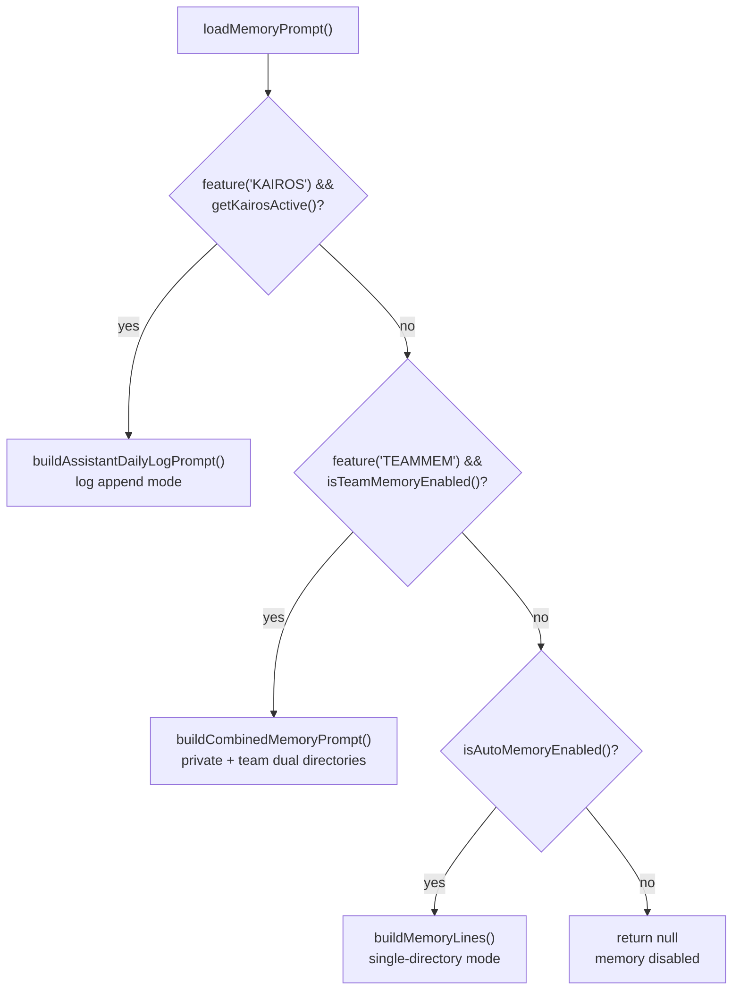

# Chapter 31: Memory Subsystem Overview - The Multi-Layer Architecture of AI Memory

> This chapter dives deep into Claude Code's memory system. We will see how an AI Agent builds persistent memory across a single session, multiple projects, and even team collaboration on top of the inherently stateless LLM conversation model.

## Why Does an AI Agent Need Memory?

LLMs naturally have "goldfish memory": every conversation starts from zero. If the user told Claude last time, "I prefer bun over npm," it forgets in the next conversation. If the user corrected Claude three times in a project, saying "do not mock the database," it may still mock it the fourth time.

This is not merely a user-experience issue. It directly affects an AI Agent's efficiency. An agent without memory is always a beginner: it has to relearn user preferences, fall into the same traps, and re-explore the same codebase every time.

Claude Code's solution is a **seven-layer memory architecture**:

| Layer | Name | Lifecycle | Storage Location | Core Responsibility |
|------|------|---------|---------|---------|
| 1 | `CLAUDE.md` instruction files | Permanent | Project directory / user directory | Static instructions and rules |
| 2 | Auto Memory (`memdir`) | Cross-session | `~/.claude/projects/<slug>/memory/` | Automatically extracted persistent knowledge |
| 3 | Background Extract Memories | Cross-session, asynchronously extracted | Same `memdir`, triggered from a background worker | **Asynchronously** extract candidate memories from the transcript during the conversation and persist them |
| 4 | Session Memory | Single session | `~/.claude/projects/<slug>/<sessionId>/session-memory/summary.md` | Structured notes for the current session |
| 5 | Agent Memory | Cross-session | Three scope directories | Dedicated memory for a specific Agent |
| 6 | Relevant Memories | Injected on demand for each user turn | Memory, as an Attachment | Relevant memories recalled on demand |
| 7 | Auto Dream | Triggered when the session is idle | Writes back to `memdir` / Agent memory | Consolidate, deduplicate, and rewrite memories from multiple sessions, like "dreaming" |

The appendix section separately covers something that is **not part of the memory layer** but is often asked about alongside it: paginated replay of remote session history. It reads session transcripts rather than memory, so it is included at the end as supplementary material.

Each layer addresses memory needs at a different timescale and granularity. Next, we will go through the layers one by one.

---

## 1. `CLAUDE.md` - Hierarchical Discovery of Static Instructions

`CLAUDE.md` is Claude Code's earliest and most basic form of "memory." Strictly speaking, it is not memory autonomously written by AI; it is a **human-authored instruction file**. Still, its discovery and loading mechanism is worth analyzing in depth.

### 1.1 Four Types and Their Loading Order

```typescript
// utils/claudemd.ts:1-9
// Files are loaded in the following order:
// 1. Managed memory (eg. /etc/claude-code/CLAUDE.md) - Global instructions for all users
// 2. User memory (~/.claude/CLAUDE.md) - Private global instructions for all projects
// 3. Project memory (CLAUDE.md, .claude/CLAUDE.md, .claude/rules/*.md) - Instructions checked into the codebase
// 4. Local memory (CLAUDE.local.md) - Private project-specific instructions
//
// Files are loaded in reverse order of priority, i.e. the latest files are highest priority
```

There is an elegant design detail here: **loading order is the inverse of priority**. Managed memory is loaded first but has the lowest priority; Local memory is loaded last but has the highest priority. This is because LLMs pay more attention to content that appears **later** in the message, due to recency bias, so higher-priority content is placed later.

### 1.2 Directory Traversal and Deduplication

The core logic of `getMemoryFiles()` starts from the current working directory and **walks upward level by level** to the filesystem root. In each directory, it tries to read `CLAUDE.md`, `.claude/CLAUDE.md`, and `.claude/rules/*.md`:

```typescript
// utils/claudemd.ts:850-934
// Then process Project and Local files
const dirs: string[] = []
let currentDir = originalCwd
while (currentDir !== parse(currentDir).root) {
  dirs.push(currentDir)
  currentDir = dirname(currentDir)
}
// Process from root downward to CWD
for (const dir of dirs.reverse()) {
  // CLAUDE.md (Project)
  // .claude/CLAUDE.md (Project)
  // .claude/rules/*.md (Project)
  // CLAUDE.local.md (Local)
}
```

Notice `dirs.reverse()`: the code first pushes the CWD, and after reversing, traversal runs from the root toward the CWD. This ensures files closer to the CWD have higher priority.

### 1.3 `@include` Directives and Safety Constraints

`CLAUDE.md` supports `@path` syntax for referencing external files, allowing instructions to be organized modularly:

```markdown
@./coding-standards.md
@~/global-rules.md
```

Includes are protected by strict safety constraints. Only 70+ text file extensions are supported through `TEXT_FILE_EXTENSIONS`, preventing binary files from being loaded into context. Includes also have cycle detection and a depth limit. Notably, the function comment for `processMemoryFile()` says "includes first, then main file," but the actual implementation is **parent before children** (`claudemd.ts:663-664`: it runs `result.push(memoryFile)` before recursively processing included files). This mismatch between comment and code is a trace of an outdated comment after later code changes. It is not a bug or an intentional design choice. Runtime behavior follows the code: the parent file enters the array first, and included child files follow it.

### 1.4 Injection into the System Prompt

Finally, loaded `CLAUDE.md` content is injected into the user context message through `getUserContext()`:

```typescript
// context.ts:155-188
export const getUserContext = memoize(async () => {
  const claudeMd = shouldDisableClaudeMd
    ? null
    : getClaudeMds(filterInjectedMemoryFiles(await getMemoryFiles()))
  setCachedClaudeMdContent(claudeMd || null)
  return {
    ...(claudeMd && { claudeMd }),
    currentDate: `Today's date is ${getLocalISODate()}.`,
  }
})
```

Pay attention to `filterInjectedMemoryFiles()`: it is not a simple pass-through. When the GrowthBook feature gate `tengu_moth_copse` is enabled, this function **filters out AutoMem and TeamMem files**, meaning `MEMORY.md` indexes are no longer injected into the user context:

```typescript
// utils/claudemd.ts:1142-1151
export function filterInjectedMemoryFiles(files: MemoryFileInfo[]): MemoryFileInfo[] {
  const skipMemoryIndex = getFeatureValue_CACHED_MAY_BE_STALE('tengu_moth_copse', false)
  if (!skipMemoryIndex) return files
  return files.filter(f => f.type !== 'AutoMem' && f.type !== 'TeamMem')
}
```

This means `MEMORY.md` index injection has **two paths**:

- **Traditional path** (`tengu_moth_copse` disabled): `MEMORY.md` is always injected into the user context through `getMemoryFiles()` -> `getUserContext()`.
- **New path** (`tengu_moth_copse` enabled): the `MEMORY.md` index is no longer injected into the user context; memory relies entirely on asynchronous prefetch by `startRelevantMemoryPrefetch()` plus Attachment injection. See section 6.

At the same time, `tengu_moth_copse` also affects the `skipIndex` parameter in `loadMemoryPrompt()`. When enabled, the memory instructions in the System Prompt no longer include `MEMORY.md` index content or the "two-step save" flow; instead, the AI is instructed to write topic files directly.

`getMemoryFiles()` itself is wrapped in `memoize`: it is cached at session scope and loaded only once per session, unless an operation such as compaction explicitly clears the cache.

---

## 2. Auto Memory (`memdir`) - The AI's Persistent Knowledge Base

Auto Memory is the core of Claude Code's memory system. It lets the AI **autonomously learn and remember** knowledge across sessions. Unlike `CLAUDE.md`, which is written by humans, the content in `memdir` is entirely generated and maintained by AI.

### 2.1 Directory Structure and Path Resolution

```
~/.claude/projects/<sanitized-git-root>/memory/
|-- MEMORY.md                  # Index file (<=200 lines), injectable into context, gate-controlled
|-- user_role.md               # User-role memory
|-- feedback_testing.md        # Feedback memory: testing preferences
|-- project_auth_rewrite.md    # Project memory: authentication rewrite context
|-- reference_linear.md        # Reference memory: pointer to external system
|-- team/                      # Team-shared memory (feature('TEAMMEM'))
|   |-- MEMORY.md
|   `-- ...
`-- logs/                      # Assistant-mode logs (feature('KAIROS'))
    `-- 2026/03/2026-03-15.md
```

Path resolution has three priority levels (`paths.ts:223-235`):

```typescript
// memdir/paths.ts:223-235
export const getAutoMemPath = memoize(
  (): string => {
    const override = getAutoMemPathOverride() ?? getAutoMemPathSetting()
    if (override) return override
    const projectsDir = join(getMemoryBaseDir(), 'projects')
    return (
      join(projectsDir, sanitizePath(getAutoMemBase()), AUTO_MEM_DIRNAME) + sep
    ).normalize('NFC')
  },
  () => getProjectRoot(), // memoize key: recalculate when projectRoot changes
)
```

1. **Environment variable override**: `CLAUDE_COWORK_MEMORY_PATH_OVERRIDE`, for Cowork/SDK scenarios.
2. **Settings override**: `autoMemoryDirectory`, only from trusted `policy` / `flag` / `local` / `user` sources. **`projectSettings` is excluded** to prevent a malicious repository from using `.claude/settings.json` to point the memory directory at `~/.ssh`.
3. **Default path**: based on a sanitized Git root. `sanitizePath()` replaces non-alphanumeric characters with hyphens, for example `/Users/foo/my-project` -> `-Users-foo-my-project`, and appends a hash suffix only when the path exceeds filesystem length limits to guarantee uniqueness (`sessionStoragePortable.ts:311-318`).

`getAutoMemBase()` uses `findCanonicalGitRoot()` to ensure all Git worktrees **share the same memory directory**, avoiding separate memory copies for different worktrees of the same repository.

### 2.2 A Closed Taxonomy of Four Memory Types

Auto Memory uses a strict four-type taxonomy. Each type has a clear write timing and usage scenario (`memoryTypes.ts:14-19`):

```typescript
// memdir/memoryTypes.ts:14-19
export const MEMORY_TYPES = ['user', 'feedback', 'project', 'reference'] as const
```

| Type | Meaning | When to Write | What Not to Save |
|------|------|---------|--------------|
| `user` | User role, preferences, and knowledge level | When user information is learned | Negative evaluations |
| `feedback` | Behavioral corrections plus positive confirmations | When the user corrects or confirms an approach | Corrections only, while ignoring confirmations |
| `project` | Project context, decisions, and deadlines | When project information is learned that cannot be inferred from code | Information inferable from `git log` |
| `reference` | Pointers to external systems | When the location of an external resource is learned | The concrete content of the system; store only the pointer |

The taxonomy has a key principle: "What NOT to save" is just as important. `WHAT_NOT_TO_SAVE_SECTION` explicitly excludes five categories: code patterns, Git history, debugging plans, content already present in `CLAUDE.md`, and temporary task status. All of these can be **derived** from the current project state and do not need to be stored redundantly.

Even more notable is this rule (`memoryTypes.ts:193-194`):

> These exclusions apply even when the user explicitly asks you to save. If they ask you to save a PR list or activity summary, ask what was *surprising* or *non-obvious* about it - that is the part worth keeping.

Even if the user **explicitly asks** to save something, the AI should ask, "What about it was surprising or non-obvious?" This is a representative example of using Prompt design to constrain AI behavior.

### 2.3 `MEMORY.md` Index and Truncation Protection

`MEMORY.md` is the memory index file. In the traditional path, it is injected into context through `getMemoryFiles()` -> `getUserContext()`. When the `tengu_moth_copse` gate is enabled, it is no longer injected into the user context and is replaced by the Relevant Memories prefetch mechanism. See section 6. In both paths, `MEMORY.md` has strict size limits (`memdir.ts:35-38`):

```typescript
// memdir/memdir.ts:34-38
export const ENTRYPOINT_NAME = 'MEMORY.md'
export const MAX_ENTRYPOINT_LINES = 200
export const MAX_ENTRYPOINT_BYTES = 25_000
```

`truncateEntrypointContent()` implements double protection: first truncate by line count, 200 lines, then truncate by byte count, 25 KB. It cuts at the last newline to avoid truncating a line in the middle. When content exceeds the limit, a WARNING is appended, reminding the AI to keep the index concise.

### 2.4 Memory Instruction Injection in the System Prompt

`loadMemoryPrompt()` is the entrypoint for injecting memory instructions into the System Prompt (`memdir.ts:419-507`). It dispatches through three paths based on enabled state:



It is registered as a cached System Prompt section through `systemPromptSection('memory', ...)` (`constants/prompts.ts:495`). This means the memory instruction content is **cache-friendly** during a session: as long as `MEMORY.md` content does not change, this section does not change, so the Prompt Cache hit rate is not affected.

### 2.5 `DIR_EXISTS_GUIDANCE` - Prompt Optimization Driven by Real Behavior

One design detail is small but highly revealing (`memdir.ts:116-118`):

```typescript
// memdir/memdir.ts:116-118
export const DIR_EXISTS_GUIDANCE =
  'This directory already exists - write to it directly with the Write tool (do not run mkdir or check for its existence).'
```

The source comment explains the reason: _Shipped because Claude was burning turns on `ls`/`mkdir -p` before writing._ Before writing memory, the AI wasted one or two tool calls checking whether the directory existed. The fix was not to change code logic, but to tell the AI in the Prompt: "the directory already exists; write directly." At the code level, `ensureMemoryDirExists()` guarantees that this promise is true.

This is a typical **Prompt-code co-design** pattern: code guarantees a precondition, and the Prompt informs the AI that the precondition is already satisfied, eliminating unnecessary verification steps.

### 2.6 Team Memory - Syncing Private Memory to the Whole Team

Private Auto Memory solves "remembering things across my own sessions," but team collaboration also needs "everyone sharing the same conventions." Claude Code implements this separately under `services/teamMemorySync/`: five files, `index.ts` with 1,256 lines, `watcher.ts` with 387 lines, `secretScanner.ts` with 324 lines, `types.ts` with 156 lines, and `teamMemSecretGuard.ts` with 44 lines. The whole system is controlled by the feature gate `tengu_herring_clock` plus `feature('TEAMMEM')`.

The `team` directory is a child of the `auto` directory (`memdir/teamMemPaths.ts:84-86`):

```typescript
// memdir/teamMemPaths.ts:84-86
export function getTeamMemPath(): string {
  return (join(getAutoMemPath(), 'team') + sep).normalize('NFC')
}
```

It is placed as a subdirectory rather than a sibling so that one `mkdir -p team/` also creates the `auto` directory, as explained by the comment in `memdir.ts:455-458`. But nesting also expands the attack surface. If a server-provided key contains `..` or URL-encoded traversal, it could write into `~/.ssh/`. `teamMemPaths.ts` uses an entire `validateTeamMemKey()` function to prevent this. It rejects null bytes, URL-encoded traversal, full-width dot characters after Unicode NFKC normalization, backslashes, absolute paths, and, most importantly, runs `resolve` followed by another `realpath` check. This prevents a repository from hiding a symlink to `~/.ssh/authorized_keys` and bypassing a pure string-prefix comparison (`teamMemPaths.ts:108-171`).

The sync channel is a pair of HTTP endpoints (`teamMemorySync/index.ts:8-12`):

```text
GET  /api/claude_code/team_memory?repo={owner/repo}             -> full fetch
GET  /api/claude_code/team_memory?repo={owner/repo}&view=hashes -> checksum metadata only
PUT  /api/claude_code/team_memory?repo={owner/repo}             -> incremental upsert push
```

Repository identity is determined by the Git remote URL. This means a privately forked repository does not pollute the upstream team's memory store. **Pull** is "server wins": each key is overwritten locally with the server version. **Push** is a delta: the client computes `sha256:<hex>` for each local file and uploads only keys whose hash differs from `serverChecksums`. File deletion is not propagated backward: deleting a local copy does not delete it on the server, and the next pull brings it back (`index.ts:14-19`). This is intentionally "least destructive" semantics: accidental deletion is more costly than accidental addition.

The push path has two inconspicuous but crucial size limits (`index.ts:71-89`): 250 KB per entry, as the client mirror of the server-side `claude_code_team_memory_limits`, and 200 KB per PUT body. The latter comment is candid: before a request reaches the application layer, an API gateway rejects bodies over 256-512 KB with an unstructured HTML 413, so the application-layer structured 413 containing `extra_details.max_entries` is never received. Therefore, the watcher batches requests on the client at 200 KB, and the server's upsert merge combines multiple PUTs.

`watcher.ts` watches the `team` directory with `fs.watch`; writes trigger a push after a two-second debounce (`watcher.ts:35`). It also maintains a `pushSuppressedReason` gate. Once it encounters `no_oauth` / `no_repo` or a permanent 4xx error, excluding 409 and 429, it shuts down to avoid this scenario: another session writes to the shared directory, my watcher is triggered, and I retry forever. The comment records a real incident: from Mar 14 to 16, one `no_oauth` device sent 167K push events in 2.5 days (`watcher.ts:45-51`). This gate is the direct result of that postmortem.

Before push, there is another inconspicuous but critical layer: secret scanning (`secretScanner.ts`, 324 lines). Files matching patterns such as OpenAI keys, AWS keys, or GitHub PATs are skipped and returned as `SkippedSecretFile`. Secrets inside team memory are more dangerous than secrets inside private memory, because team memory is distributed to every organization member.

But push-time scanning is only the last gate. If the watcher discovers a secret only after the debounce fills, the file has already been written to disk, and a process crash or restart could leave plaintext in the Git working tree. `teamMemSecretGuard.ts:15-44` moves this defense **before write**. `checkTeamMemSecrets()` is synchronously called by the `validateInput` path of `FileWriteTool` / `FileEditTool`. It first uses `isTeamMemPath()` to identify target paths, then runs `scanForSecrets()`. On a hit, it returns an error string with a label, so the tool call never executes. The whole layer is wrapped in `feature('TEAMMEM')`; when the build flag is disabled, the function immediately returns `null`, and callers do not need to add their own gate.

---

## 3. Background Extract Memories - Automatically Extracting Memory from Conversation

Where does Auto Memory content come from? Beyond the AI actively writing it during conversation, Claude Code also has a **background extraction system**. It runs automatically after each conversation turn and distills information worth remembering from the conversation.

### 3.1 Trigger Mechanism: Fire-and-Forget in `stopHooks`

The extractor is initialized through `initExtractMemories()` and is called fire-and-forget from `handleStopHooks`, at the end of the conversation loop (`extractMemories.ts:598-603`):

```typescript
// services/extractMemories/extractMemories.ts:598-603
export async function executeExtractMemories(
  context: REPLHookContext,
  appendSystemMessage?: AppendSystemMessageFn,
): Promise<void> {
  await extractor?.(context, appendSystemMessage)
}
```

### 3.2 Closure-Scoped State and Mutual Exclusion

`initExtractMemories()` manages state in **closure scope** rather than module-level variables, following the same pattern as `confidenceRating.ts`. This lets tests call `initExtractMemories()` in `beforeEach` and get a fresh closure.

Core state includes:

- `lastMemoryMessageUuid`: a cursor marking the last processed message.
- `inProgress`: a mutex preventing parallel execution.
- `pendingContext`: if a new trigger arrives while extraction is in progress, it **stashes the latest context** and performs a trailing run after the current extraction finishes.

```typescript
// services/extractMemories/extractMemories.ts:556-564
if (inProgress) {
  logForDebugging('[extractMemories] extraction in progress - stashing for trailing run')
  pendingContext = { context, appendSystemMessage }
  return
}
```

This is an elegant **coalescing pattern**: it does not queue every request, but keeps only the latest one, because the latest context contains the most messages.

### 3.3 Mutual Exclusion Between the Main Agent and the Extraction Agent

A key design decision: when the main Agent has **already written memory itself**, background extraction **skips and advances the cursor** (`extractMemories.ts:348-360`):

```typescript
// services/extractMemories/extractMemories.ts:348-360
if (hasMemoryWritesSince(messages, lastMemoryMessageUuid)) {
  logForDebugging('[extractMemories] skipping - conversation already wrote to memory files')
  const lastMessage = messages.at(-1)
  if (lastMessage?.uuid) {
    lastMemoryMessageUuid = lastMessage.uuid
  }
  return
}
```

`hasMemoryWritesSince()` scans `tool_use` blocks in assistant messages and checks whether any `Edit` / `Write` operation targets a path inside `isAutoMemPath()`. This avoids races where the main Agent and the background Agent write the same memory file at the same time.

### 3.4 Permission Sandbox for the Forked Agent

The extraction Agent uses `createAutoMemCanUseTool()` to create strict permission constraints (`extractMemories.ts:171-222`):

- **Allowed**: `FileRead`, `Grep`, `Glob`, read-only access to any path.
- **Allowed**: `Bash`, but only read-only commands such as `ls`, `find`, `grep`, `cat`, `stat`, and similar commands.
- **Allowed**: `FileEdit` / `FileWrite`, **only inside** `memoryDir`.
- **Denied**: MCP, Agent, write-capable Bash, and all other tools.

This ensures that even if the background Agent's Prompt is attacked by injection, it cannot affect the filesystem outside the memory directory.

### 3.5 The Extraction Prompt's Efficient Two-Step Strategy

The extraction Prompt guides the Agent to use a **two-step parallel** strategy (`extractMemories/prompts.ts:39`):

> turn 1 - issue all FileRead calls in parallel for every file you might update;
> turn 2 - issue all FileWrite/FileEdit calls in parallel.

It also limits `maxTurns` to 5 to prevent the Agent from falling into a verification rabbit hole and repeatedly reading code to validate memory accuracy.

---

## 4. Session Memory - Structured Notes for the Current Session

Session Memory solves a different problem: when a conversation grows long and needs auto-compaction, how do we preserve the key session context?

### 4.1 Structured Template

Session Memory uses a fixed ten-section Markdown template (`services/SessionMemory/prompts.ts:11-41`):

```typescript
// services/SessionMemory/prompts.ts:11-41
export const DEFAULT_SESSION_MEMORY_TEMPLATE = `
# Session Title
_A short and distinctive 5-10 word descriptive title..._

# Current State
_What is actively being worked on right now?..._

# Task specification
_What did the user ask to build?..._

# Files and Functions
_What are the important files?..._

# Workflow
_What bash commands are usually run?..._

# Errors & Corrections
_Errors encountered and how they were fixed..._

# Codebase and System Documentation
_What are the important system components?..._

# Learnings
_What has worked well? What has not?..._

# Key results
_If the user asked a specific output..._

# Worklog
_Step by step, what was attempted, done?..._
`
```

Each section has a fixed heading and an italic description line. The AI may only modify content after the description line. This **immutable template, mutable content** design keeps the structure stable.

### 4.2 Dual-Threshold Trigger Mechanism

Session Memory is not updated every turn. Instead, it uses a dual-threshold controller (`sessionMemory.ts:134-181`):

```typescript
// services/SessionMemory/sessionMemory.ts:134-181
export function shouldExtractMemory(messages: Message[]): boolean {
  const currentTokenCount = tokenCountWithEstimation(messages)
  // 1. Initialization threshold: context token count reaches minimumMessageTokensToInit (default 10000)
  if (!isSessionMemoryInitialized()) {
    if (!hasMetInitializationThreshold(currentTokenCount)) return false
    markSessionMemoryInitialized()
  }
  // 2. Token growth threshold: growth since the last extraction reaches minimumTokensBetweenUpdate (default 5000)
  const hasMetTokenThreshold = hasMetUpdateThreshold(currentTokenCount)
  // 3. Tool call count threshold: toolCallsBetweenUpdates (default 3)
  const hasMetToolCallThreshold = toolCallsSinceLastUpdate >= getToolCallsBetweenUpdates()

  // Trigger condition: token threshold AND (tool call threshold OR natural pause with no tool call)
  return (hasMetTokenThreshold && hasMetToolCallThreshold) ||
         (hasMetTokenThreshold && !hasToolCallsInLastTurn)
}
```

The key constraint is that **the token threshold is required**. Even if the tool call threshold is satisfied, extraction does not trigger unless the token count has grown. This prevents over-extraction.

### 4.3 Coordination with Compaction

Session Memory's core value appears during compaction. When auto-compaction triggers, Session Memory provides a lower-cost alternative to asking the LLM to summarize again. `sessionMemoryCompact.ts`, already covered in detail in chapter 7, can directly reuse the Session Memory already extracted in the background as the post-compaction summary, **avoiding an extra API call during compaction that would make the model reread the entire conversation and write a summary**. Maintaining Session Memory itself certainly costs API calls, but that cost is "asynchronously extracting an incremental summary when the token threshold triggers," while the cost saved during compaction is "synchronously summarizing the entire session." The two are not in the same order of magnitude in timing, call count, or number of tokens read, so the net gain is clear.

After extraction completes, the system waits through `waitForSessionMemoryExtraction()`, with a 15-second timeout, to ensure compaction receives the latest notes.

### 4.4 Section Size Control

Each section has a soft limit of 2,000 tokens, and the whole file has a hard limit of 12,000 tokens (`prompts.ts:8-9`):

```typescript
// services/SessionMemory/prompts.ts:8-9
const MAX_SECTION_LENGTH = 2000
const MAX_TOTAL_SESSION_MEMORY_TOKENS = 12000
```

`generateSectionReminders()` appends warnings at the end of the update Prompt, asking the AI to compress oversized sections. `truncateSessionMemoryForCompact()` performs hard truncation when injecting the compact message, preventing an oversized Session Memory from consuming the entire post-compaction token budget.

---

## 5. Agent Memory - Dedicated Memory for Each Agent

In addition to main-conversation memory, Claude Code provides a separate memory space for **custom Agents**. This allows an Agent to accumulate domain-specific knowledge of its own.

### 5.1 Three Scopes

```typescript
// tools/AgentTool/agentMemory.ts:12-13
export type AgentMemoryScope = 'user' | 'project' | 'local'
```

| Scope | Default Path | Version Controlled | Use Case |
|-------|------|---------|---------|
| `user` | `<memoryBase>/agent-memory/<type>/` | No | Cross-project general knowledge |
| `project` | `<cwd>/.claude/agent-memory/<type>/` | Yes | Project-specific knowledge shared with the team |
| `local` | `<cwd>/.claude/agent-memory-local/<type>/` | No | Local, machine-specific knowledge that is not shared |

Here `<memoryBase>` defaults to `~/.claude/`, but when `CLAUDE_CODE_REMOTE_MEMORY_DIR` is set, it redirects to the remote mount path. In remote mode, `local` scope is also redirected to `<remoteDir>/projects/<sanitized-root>/agent-memory-local/<type>/`, not the local `cwd` directory (`agentMemory.ts:29-44`).

The difference between the three scopes is reflected in code comments (`agentMemory.ts:142-156`):

```typescript
// tools/AgentTool/agentMemory.ts:142-156
case 'user':
  scopeNote = '- Since this memory is user-scope, keep learnings general since they apply across all projects'
case 'project':
  scopeNote = '- Since this memory is project-scope and shared via version control, tailor your memories to this project'
case 'local':
  scopeNote = '- Since this memory is local-scope (not checked into version control), tailor to this project and machine'
```

### 5.2 Fire-and-Forget Directory Creation

Agent Memory is loaded in `loadAgentMemoryPrompt()`, which internally calls `ensureMemoryDirExists()`. But there is an engineering detail here: `loadAgentMemoryPrompt()` is called on the synchronous React render path in `AgentDetail.tsx`, so it cannot be `async`. The solution is **fire-and-forget** (`agentMemory.ts:164-165`):

```typescript
// tools/AgentTool/agentMemory.ts:164-165
// Fire-and-forget: this runs at agent-spawn time inside a sync
// getSystemPrompt() callback. The spawned agent won't try to Write
// until after a full API round-trip, by which time mkdir will have completed.
void ensureMemoryDirExists(memoryDir)
```

The comment explains why this is safe: from Agent spawn to actual file writing, there must be at least one complete API round trip, from hundreds of milliseconds to several seconds, while `mkdir` takes only microseconds.

---

## 6. Relevant Memories - Intelligent On-Demand Memory Injection

The previous four layers are about "how to store memory." The final layer answers "when and how to recall memory": not by stuffing all memory into context, but by **injecting only memories relevant to the current query**.

### 6.1 Two-Stage Recall: Scan -> Select

Recall happens in two steps (`memdir/findRelevantMemories.ts:39-75`):

**Stage 1: scan (`scanMemoryFiles`)**

```typescript
// memdir/memoryScan.ts:35-77
export async function scanMemoryFiles(
  memoryDir: string, signal: AbortSignal,
): Promise<MemoryHeader[]> {
  const entries = await readdir(memoryDir, { recursive: true })
  const mdFiles = entries.filter(f => f.endsWith('.md') && basename(f) !== 'MEMORY.md')
  // Read the first 30 frontmatter lines of each file in parallel
  const headerResults = await Promise.allSettled(
    mdFiles.map(async (relativePath) => {
      const { content, mtimeMs } = await readFileInRange(filePath, 0, FRONTMATTER_MAX_LINES)
      const { frontmatter } = parseFrontmatter(content, filePath)
      return { filename, filePath, mtimeMs, description, type }
    }),
  )
  // Sort by modification time descending, keeping at most 200
  return results.sort((a, b) => b.mtimeMs - a.mtimeMs).slice(0, MAX_MEMORY_FILES)
}
```

This is a clever **single-pass scan** design: `readFileInRange` internally performs `stat` to get `mtimeMs`, so reading and sorting do not require two rounds of syscalls. In the common case, N <= 200, this **halves the number of syscalls**.

**Stage 2: select (`selectRelevantMemories`)**

```typescript
// memdir/findRelevantMemories.ts:77-141
async function selectRelevantMemories(
  query: string, memories: MemoryHeader[], signal: AbortSignal,
  recentTools: readonly string[],
): Promise<string[]> {
  const manifest = formatMemoryManifest(memories)
  const result = await sideQuery({
    model: getDefaultSonnetModel(),
    system: SELECT_MEMORIES_SYSTEM_PROMPT,
    messages: [{ role: 'user', content: `Query: ${query}\n\nAvailable memories:\n${manifest}${toolsSection}` }],
    max_tokens: 256,
    output_format: { type: 'json_schema', schema: { ... } },
  })
  return parsed.selected_memories.filter(f => validFilenames.has(f))
}
```

A **lightweight side query** runs on the Sonnet model. It passes the user query and a memory manifest, filenames plus descriptions, asking the model to select up to five relevant files. The selector Prompt emphasizes being **selective and discerning**.

There is also a counterintuitive detail: if some tools were used recently, those tools' **reference documentation** should not be recalled, because the AI is already using the tool; however, related **known issues and caveats** should still be recalled, because precisely when the tool is in use is when those warnings matter most.

### 6.2 Prefetch + Attachment Injection

Relevant memory recall is **asynchronously prefetched** (`attachments.ts:2392`) and runs in parallel with the main conversation:

```
user submits query -> startRelevantMemoryPrefetch() -> [sideQuery runs in parallel]
                                                   |
query() assembles messages <- await prefetch result <- selected memories
                                                   |
                                      injected as a 'relevant_memories' Attachment
```

Injected memory content includes a **precomputed freshness marker** (`memoryAge.ts:15-20`):

```typescript
// memdir/memoryAge.ts:15-20
export function memoryAge(mtimeMs: number): string {
  const d = memoryAgeDays(mtimeMs)
  if (d === 0) return 'today'
  if (d === 1) return 'yesterday'
  return `${d} days ago`
}
```

Why precompute instead of computing at render time? If `memoryAge()` were recalculated on every API call, "saved 3 days ago" could become "saved 4 days ago." Different bytes would cause a **Prompt Cache miss**. Precomputation keeps bytes stable across turns.

### 6.3 Session-Level Deduplication and Total Size Control

To prevent the same memory from being injected repeatedly, the system performs session-level deduplication by scanning message history (`attachments.ts:2251-2266`):

```typescript
// utils/attachments.ts:2251-2266
export function collectSurfacedMemories(messages: ReadonlyArray<Message>) {
  const paths = new Set<string>()
  let totalBytes = 0
  for (const m of messages) {
    if (m.type === 'attachment' && m.attachment.type === 'relevant_memories') {
      for (const mem of m.attachment.memories) {
        paths.add(mem.path)
        totalBytes += mem.content.length
      }
    }
  }
  return { paths, totalBytes }
}
```

`alreadySurfaced` filters out paths already shown **before** the side query, letting the selector spend its five slots on new candidates. At the same time, `totalBytes` enforces a session-level total size limit to prevent accumulated memory injection from consuming too much context.

One subtle detail is that the system scans `messages` rather than tracking state on `toolUseContext`. This means when compaction happens and old attachment messages are deleted, `surfacedPaths` naturally resets, and those memories can be **reasonably reinjected** into the post-compaction context.

---

## 7. Auto Dream - Background Memory Consolidation

The final component is Auto Dream, analogous to human memory consolidation during sleep. After enough sessions have accumulated, the system automatically runs the `/dream` Skill to organize and optimize memory.

### 7.1 Triple Gate

Auto Dream uses a lowest-cost-first gate chain (`autoDream.ts:95-100`):

```typescript
// services/autoDream/autoDream.ts:95-100
function isGateOpen(): boolean {
  if (getKairosActive()) return false  // KAIROS mode uses its own dream
  if (getIsRemoteMode()) return false
  if (!isAutoMemoryEnabled()) return false
  return isAutoDreamEnabled()
}
```

After passing this chain, it also has:

1. **Time gate**: at least 24 hours since the last consolidation, controlled by `minHours`, default 24.
2. **Session gate**: at least five new sessions during that period, controlled by `minSessions`, default 5.
3. **Lock gate**: no other process is currently consolidating, enforced by a file lock.

### 7.2 Lock and Rollback

```typescript
// services/autoDream/autoDream.ts:261-270
} catch (e: unknown) {
  if (abortController.signal.aborted) {
    logForDebugging('[autoDream] aborted by user')
    return
  }
  failDreamTask(taskId, setAppState)
  // Rewind mtime so time-gate passes again
  await rollbackConsolidationLock(priorMtime)
}
```

If consolidation fails, it **rolls back the lock's `mtime`**, allowing the time gate to pass again so the next session can retry. If the user manually kills the dream task, the `kill()` method on `DreamTask` also rolls back `mtime`, preventing a "dream" from being permanently interrupted. Chapter 16 covers this in detail.

---

## 8. Memory System Architecture Overview

```mermaid
graph TD
    subgraph "Write paths"
        A["Main Agent conversation"] -->|user says 'remember this'| W1["write directly to memdir"]
        A -->|end of each turn| W2["extractMemories\nbackground extraction Agent"]
        A -->|during the session| W3["Session Memory\nstructured notes"]
        A -->|after enough sessions| W4["Auto Dream\nmemory consolidation"]
        AGENT["Custom Agent"] -->|runtime| W5["Agent Memory\ndedicated memory"]
    end

    subgraph "Storage layer"
        W1 --> S1["~/.claude/projects/.../memory/\n(MEMORY.md + topic files)"]
        W2 --> S1
        W3 --> S2["~/.claude/projects/.../<sessionId>/\nsession-memory/summary.md"]
        W4 --> S1
        W5 --> S3["agent-memory/\n(user/project/local)"]
        CLAUDE["CLAUDE.md system"] --> S4["project directory + ~/.claude/\n(multi-level traversal)"]
    end

    subgraph "Read paths"
        S4 -->|getUserContext()| R1["System Prompt\nuser context message"]
        S1 -->|"MEMORY.md (traditional path)"| R1
        S1 -->|"topic files + MEMORY.md (new path)"| R2["Relevant Memories\nsideQuery selection + Attachment injection"]
        S2 -->|during compaction| R3["Session Memory Compact\nno extra API summary"]
        S3 -->|loadAgentMemoryPrompt()| R4["Agent System Prompt\nmemory section"]
    end

    style W2 fill:#e8f5e9
    style R2 fill:#e1f5fe
    style R3 fill:#fff3e0
```

---

## 9. Transferable Design Patterns

### Pattern 1: Taxonomy-Driven Memory Quality

Do not let the AI freely store anything. Define a **closed taxonomy** (`user` / `feedback` / `project` / `reference`), with explicit write conditions and exclusion rules for each type. It is especially important to define "what should not be stored": information derivable from current state does not need memory.

**Applicable scenarios**: knowledge-base design for any AI Agent, document quality control in RAG systems.

### Pattern 2: Index-Content Separation + Intelligent Recall

Split memory into a **lightweight index** (`MEMORY.md`, <= 200 lines) and **detailed content recalled on demand**, meaning topic files. The index can remain resident in context, or a feature gate can switch the system to fully on-demand recall. A lightweight model, Sonnet or Haiku, performs a side query to select up to five relevant files for injection. This is far more efficient than "stuffing all memory into context."

**Applicable scenarios**: knowledge-intensive Agents, enterprise documentation assistants, and RAG systems that need to manage large amounts of context.

### Pattern 3: Background Extraction + Main Agent Mutual Exclusion

Do not perform memory extraction in the main conversation flow, because it adds latency. Use a fire-and-forget background Agent instead. Decide whether to skip by scanning whether the main Agent has already written memory, enforcing mutual exclusion. Use closure-scoped state to manage the cursor and coalescing logic.

**Applicable scenarios**: any system that needs background processing while sharing resources with the main flow, such as log analysis, cache prewarming, and data synchronization.

---

## Appendix: The Last Piece of the Puzzle - Paginated Replay of Remote Session History

> Note: this section is not about a memory layer. It is the **replay interface for the session event stream**. The "seven layers" in the opening table all belong to the memory subsystem itself. This section is separated out because readers often conflate "where did we leave off last time?" with "what did I ask it to remember last time?" The data paths are completely different: memory is written to the local filesystem and extracted or consolidated in the background; `sessionHistory` goes through remote HTTP and returns an SDK message stream. They are discussed together here so the full set of data sources for the Resume Conversation screen can be explained in one place.

The first nine sections cover "memory on the local filesystem." Claude Code also supports saving session state to the cloud and continuing the conversation on another device. The remote mode of the Resume Conversation screen uses this path. The module responsible for pulling a cloud session's event stream back to local is `assistant/sessionHistory.ts`. The entire module is only 87 lines, clean enough to read in full, but it is called out here because it defines "what counts as accessible history for this session."

The API design uses typical reverse pagination (`sessionHistory.ts:7-22`):

```typescript
// assistant/sessionHistory.ts:7-22
export const HISTORY_PAGE_SIZE = 100

export type HistoryPage = {
  /** Chronological order within the page. */
  events: SDKMessage[]
  /** Oldest event ID in this page -> before_id cursor for next-older page. */
  firstId: string | null
  /** true = older events exist. */
  hasMore: boolean
}
```

`fetchLatestEvents()` uses `anchor_to_latest=true` to retrieve the newest page, while `fetchOlderEvents()` uses the `before_id` cursor to page toward older events (`sessionHistory.ts:73-87`). Each page has 100 events. All requests carry a 15-second timeout and `validateStatus: () => true`, degrading HTTP errors to "return `null`" rather than throwing. A failure to fetch history should not crash the REPL; in the worst case, it degrades to "older history is not visible."

It also carries a fixed beta header (`sessionHistory.ts:39`):

```typescript
'anthropic-beta': 'ccr-byoc-2025-07-29',
```

The same `ccr-byoc-2025-07-29` is promoted to the constant `CCR_BYOC_BETA` in `utils/teleport/api.ts:19`, and is used consistently by all cloud-session requests in `bridge/createSession.ts`, `bridge/remoteBridgeCore.ts`, `utils/teleport.tsx`, `commands/remote-setup/api.ts`, and other files. You can understand it as a label meaning "this request belongs to the remote Resume API family." The source code does not contain additional comments on the exact semantics of this header; behavioral details are governed by the server-side contract and are not expanded here.

This module and the memory system discussed earlier are not the same kind of component. The former is "the AI writes and reads autonomously"; the latter is "server-side replay of the conversation event stream." But together, they answer the same question: "What did the AI know before this session began?" `memdir` provides cross-session semantic sediment; `sessionHistory` provides the individual events before resuming the current session. In the Resume Conversation screen, both are activated: `memdir` enters the System Prompt through `loadMemoryPrompt()`, `sessionHistory` paginates historical SDK messages back into the `messages` array, and only then does the query loop begin its first turn.

---

---

## Next Chapter Preview

[Chapter 32: Command System Overview - Slash Command Aggregation and Extension Architecture](./32-command-system-overview.md)

We will dive into `commands.ts` and `commands/`, 86 top-level directories plus 15 top-level files for 101 top-level entries, and uncover how Claude Code unifies built-in commands, user-defined Skills, Plugin commands, and Workflow commands into one type system.

---
*For the full content, follow https://github.com/luyao618/Claude-Code-Source-Study. A free star would be appreciated.*
