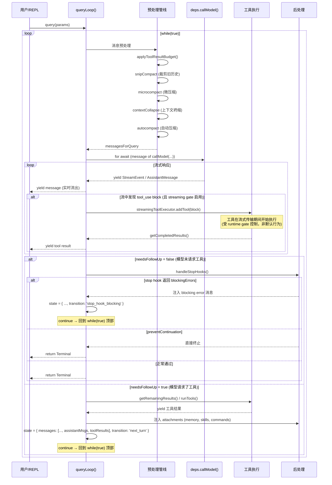

# 第 5 章：QueryEngine 与对话主循环 — 一次完整 AI 交互的心跳

> 本章是《深入 Claude Code 源码》系列第 5 章。我们将深入 `query.ts` 这个 1729 行的核心文件，揭示一次完整的 AI 对话是如何被驱动的——从消息组装、API 调用、工具执行到错误恢复，理解这个 Agent 运行时的"心跳"。

## 为什么需要理解对话循环？

如果把 Claude Code 比作一个人体，那 `query.ts` 就是它的**心脏**——对话循环的编排入口。当然，心脏需要血管系统才能工作：重试逻辑在 `services/api/withRetry.ts`，工具执行在 `services/tools/`，停止钩子在 `query/stopHooks.ts`，环境配置在 `query/config.ts`。本章会覆盖这个完整的"循环系统"，而不仅仅是 `query.ts` 一个文件。每一次用户提问，都会触发这个循环：

```
用户输入 → 组装消息 → 调用 API → 模型返回 → 执行工具 → 结果回传 → 模型继续...
```

这个循环看似简单，但实际的工程复杂度远超预期。一个生产级的 AI 对话循环需要处理：

- **流式响应**：模型的回复是逐 token 流回的，工具调用可能在流的中途就开始执行
- **多层压缩**：对话历史可能随时超出上下文窗口，需要多种策略自动压缩
- **错误恢复**：API 过载、上下文太长、输出被截断……每种错误都有专门的恢复路径
- **模型降级**：主模型不可用时，自动切换到 fallback 模型
- **并发工具执行**：只读工具可以并行，写入工具必须串行

本章将从宏观到微观，层层展开这个循环的设计。

---

## 一、全局视角：AsyncGenerator 驱动的状态机

### 1.1 query() 的签名

`query.ts` 的核心是两个嵌套的 AsyncGenerator 函数：

```typescript
// query.ts:219-239
export async function* query(
  params: QueryParams,
): AsyncGenerator<
  | StreamEvent
  | RequestStartEvent
  | Message
  | TombstoneMessage
  | ToolUseSummaryMessage,
  Terminal
> {
  const consumedCommandUuids: string[] = []
  const terminal = yield* queryLoop(params, consumedCommandUuids)
  // 正常退出时通知已消费的命令
  for (const uuid of consumedCommandUuids) {
    notifyCommandLifecycle(uuid, 'completed')
  }
  return terminal
}
```

`query()` 是一个薄包装层，真正的逻辑在 `queryLoop()` 中。这个分层设计的目的是：**命令生命周期通知只在正常退出时执行**。如果 `queryLoop()` 抛出异常或被 `.return()` 关闭，`for...of` 循环不会执行——这正是预期行为，因为异常意味着命令没有成功完成。

### 1.2 为什么用 AsyncGenerator？

`query()` 返回 `AsyncGenerator` 而非 `Promise`，这是一个关键的架构决策。AsyncGenerator 让对话循环可以：

1. **流式产出事件**：每个中间结果（流式 token、工具执行进度、压缩通知）通过 `yield` 逐个产出，调用方（REPL 或 SDK）实时消费
2. **双向通信**：调用方可以通过 `.return()` 随时终止循环（如用户按 Ctrl+C）
3. **延迟计算**：只在调用方拉取时才推进循环，天然的背压控制

### 1.3 QueryParams：对话循环的输入契约

```typescript
// query.ts:181-199
export type QueryParams = {
  messages: Message[]           // 对话历史
  systemPrompt: SystemPrompt    // 系统提示词
  userContext: { [k: string]: string }   // 用户上下文（注入到消息前面）
  systemContext: { [k: string]: string } // 系统上下文（追加到系统提示词后面）
  canUseTool: CanUseToolFn      // 权限检查函数
  toolUseContext: ToolUseContext // 运行时上下文容器
  fallbackModel?: string        // 降级模型
  querySource: QuerySource      // 查询来源标识
  maxTurns?: number             // 最大轮次限制
  taskBudget?: { total: number } // API task_budget
  deps?: QueryDeps              // 依赖注入（测试用）
}
```

其中 `QueryDeps` 是一个精心设计的依赖注入接口：

```typescript
// query/deps.ts:21-31
export type QueryDeps = {
  callModel: typeof queryModelWithStreaming  // API 调用
  microcompact: typeof microcompactMessages // 微压缩
  autocompact: typeof autoCompactIfNeeded   // 自动压缩
  uuid: () => string                        // UUID 生成
}
```

生产环境使用 `productionDeps()` 返回真实实现，测试环境则注入 fake。这比 `spyOn` 模块 mock 更干净——`callModel` 和 `autocompact` 在 6-8 个测试文件中被 spy，依赖注入消除了这些重复样板。

### 1.4 State：循环的可变状态

每次迭代共享的可变状态被封装在一个 `State` 类型中：

```typescript
// query.ts:204-217
type State = {
  messages: Message[]                    // 当前消息数组
  toolUseContext: ToolUseContext          // 工具执行上下文
  autoCompactTracking: AutoCompactTrackingState | undefined
  maxOutputTokensRecoveryCount: number   // 输出截断恢复计数
  hasAttemptedReactiveCompact: boolean   // 是否已尝试反应式压缩
  maxOutputTokensOverride: number | undefined
  pendingToolUseSummary: Promise<ToolUseSummaryMessage | null> | undefined
  stopHookActive: boolean | undefined
  turnCount: number                      // 轮次计数
  transition: Continue | undefined       // 上一次迭代为何继续
}
```

注意 `transition` 字段——它记录了**上一次迭代为什么 `continue`**。这不仅仅用于调试，还用于控制恢复逻辑：比如 `collapse_drain_retry` 后如果仍然 413（上下文太长），就不再重复 drain 而是 fall through 到 reactive compact。

循环中有 **7+ 个 `continue` 站点**，每个站点都通过 `state = { ... }` 写入新状态。但需要注意，这不是一个高度形式化的单层闭环状态机——它更像是**主循环 + 若干恢复 continue 点 + 多个早退出口**的混合结构。除了下表中的 `continue` 站点，还有 `attemptWithFallback` 驱动的内层 `while` 循环、异常路径、abort 早退（`return { reason: 'aborted_streaming' }`）以及多种正常终止分支（`return { reason: 'completed' / 'image_error' / 'prompt_too_long' / ... }`）：

| continue 站点 | transition.reason | 触发条件 |
|---|---|---|
| 上下文坍缩排空 | `collapse_drain_retry` | prompt-too-long 时排空暂存的坍缩摘要 |
| 反应式压缩重试 | `reactive_compact_retry` | 413 错误触发全量压缩后重试 |
| 输出 token 升级 | `max_output_tokens_escalate` | 8k 默认限制命中，升级到 64k |
| 输出截断多轮恢复 | `max_output_tokens_recovery` | 输出被截断，注入恢复消息重试（最多 3 次）|
| Stop Hook 阻塞 | `stop_hook_blocking` | 停止钩子返回阻塞错误 |
| Token Budget 续行 | `token_budget_continuation` | token 预算未耗尽，继续执行 |
| 工具执行后下一轮 | `next_turn` | 正常的工具结果回传 |

---

## 二、循环的完整时序

下面用一个 Mermaid 时序图展示一次**包含工具调用**的完整对话循环：



---

## 三、消息预处理管线

在每次 API 调用之前，消息需要经过一条多阶段的预处理管线。这条管线的设计遵循一个原则：**越轻量的压缩越先执行，越重的压缩越后执行**。

### 3.1 管线各阶段

```typescript
// query.ts:365-468（简化）
// 1. 工具结果预算裁剪
messagesForQuery = await applyToolResultBudget(messagesForQuery, ...)

// 2. 历史裁剪（snip compact）
if (feature('HISTORY_SNIP')) {
  const snipResult = snipModule!.snipCompactIfNeeded(messagesForQuery)
  messagesForQuery = snipResult.messages
}

// 3. 微压缩（microcompact）
const microcompactResult = await deps.microcompact(messagesForQuery, ...)
messagesForQuery = microcompactResult.messages

// 4. 上下文坍缩（context collapse）
if (feature('CONTEXT_COLLAPSE') && contextCollapse) {
  const collapseResult = await contextCollapse.applyCollapsesIfNeeded(...)
  messagesForQuery = collapseResult.messages
}

// 5. 自动压缩（autocompact）
const { compactionResult } = await deps.autocompact(messagesForQuery, ...)
```

**为什么这个顺序很重要？**

- **snip** 和 **microcompact** 是本地操作，不需要 API 调用，零网络成本。它们先执行，可能就让 token 数降到了 autocompact 的阈值以下
- **context collapse** 在 autocompact 之前执行，原因是：如果坍缩就足以将 token 数降到阈值以下，就不需要 autocompact 的全量摘要，保留了更细粒度的上下文
- **autocompact** 最重——它需要一次完整的 API 调用来生成对话摘要

### 3.2 系统提示词的最终组装

```typescript
// query.ts:449-451
const fullSystemPrompt = asSystemPrompt(
  appendSystemContext(systemPrompt, systemContext),
)
```

`systemContext` 被追加到系统提示词末尾，而 `userContext` 在调用 API 时被前置到消息数组的开头（`prependUserContext(messagesForQuery, userContext)`）。这种分离确保了：
- **systemContext**（如 MCP 指令、Agent 规则）作为系统提示词的一部分，享受 prompt cache
- **userContext**（如会话特定的上下文）作为用户消息，不影响系统提示词的缓存命中率

---

## 四、API 调用与流式响应处理

### 4.1 调用模型

API 调用通过 `deps.callModel()` 发起。`callModel` 的生产实现是 `queryModelWithStreaming`（定义在 `services/api/claude.ts:752`），它本身也是一个 AsyncGenerator：

```typescript
// services/api/claude.ts:752-780
export async function* queryModelWithStreaming({
  messages, systemPrompt, thinkingConfig, tools, signal, options,
}: { ... }): AsyncGenerator<
  StreamEvent | AssistantMessage | SystemAPIErrorMessage,
  void
> {
  return yield* withStreamingVCR(messages, async function* () {
    yield* queryModel(messages, systemPrompt, thinkingConfig, tools, signal, options)
  })
}
```

`withStreamingVCR` 是一个"录像带"中间件——在调试模式下录制/回放 API 响应，用于测试和问题复现。

### 4.2 `withRetry`：面向不可靠网络的重试层

在 `queryModel` 内部，真正的 API 调用被 `withRetry` 包裹。`withRetry` 本身也是一个 AsyncGenerator——它通过 `yield` 产出重试状态消息（如 "API error, retrying in 2s..."），调用方可以在 UI 上实时显示：

```typescript
// services/api/withRetry.ts:170-178
export async function* withRetry<T>(
  getClient: () => Promise<Anthropic>,
  operation: (client: Anthropic, attempt: number, context: RetryContext) => Promise<T>,
  options: RetryOptions,
): AsyncGenerator<SystemAPIErrorMessage, T> {
  const maxRetries = getMaxRetries(options)
  // ...
  for (let attempt = 1; attempt <= maxRetries + 1; attempt++) {
    // ...
  }
}
```

重试策略有几个关键设计：

**1. 区分前台与后台查询**

```typescript
// services/api/withRetry.ts:62-82
const FOREGROUND_529_RETRY_SOURCES = new Set<QuerySource>([
  'repl_main_thread',
  'sdk',
  'agent:custom',
  'compact',
  // ...
])
```

529（过载）错误只对**前台查询**重试。后台查询（如标题生成、工具摘要）立即放弃——在容量级联时，每次重试都是 3-10 倍的网关放大，而用户根本看不到这些后台任务的失败。

**2. 指数退避 + Retry-After**

```typescript
// services/api/withRetry.ts:530-548
export function getRetryDelay(
  attempt: number,
  retryAfterHeader?: string | null,
  maxDelayMs = 32000,
): number {
  if (retryAfterHeader) {
    const seconds = parseInt(retryAfterHeader, 10)
    if (!isNaN(seconds)) return seconds * 1000
  }
  const baseDelay = Math.min(BASE_DELAY_MS * Math.pow(2, attempt - 1), maxDelayMs)
  const jitter = Math.random() * 0.25 * baseDelay
  return baseDelay + jitter
}
```

基础延迟 500ms，指数增长到 32s 上限，加 25% 抖动。如果 API 返回了 `Retry-After` header，则优先遵循服务端指示。

**3. 529 连续 3 次后的 Fallback 路径（有条件门槛）**

```typescript
// services/api/withRetry.ts:326-365
if (
  is529Error(error) &&
  (process.env.FALLBACK_FOR_ALL_PRIMARY_MODELS ||
    (!isClaudeAISubscriber() && isNonCustomOpusModel(options.model)))
) {
  consecutive529Errors++
  if (consecutive529Errors >= MAX_529_RETRIES) {
    if (options.fallbackModel) {
      throw new FallbackTriggeredError(options.model, options.fallbackModel)
    }
    // 无 fallback 模型时，对外部用户直接报错
    if (process.env.USER_TYPE === 'external' && !isPersistentRetryEnabled()) {
      throw new CannotRetryError(new Error(REPEATED_529_ERROR_MESSAGE), retryContext)
    }
  }
}
```

注意这里的门槛：**不是所有 529 都计入 fallback 计数器**。只有在满足特定模型/订阅条件时（`FALLBACK_FOR_ALL_PRIMARY_MODELS` 环境变量，或者非 Claude AI 订阅用户使用非自定义 Opus 模型），529 才会递增 `consecutive529Errors`。源码中的 TODO 注释也暗示 `isNonCustomOpusModel` 检查可能是 Claude Code 早期硬编码 Opus 模型时的历史遗留。满足条件且连续 3 次后，抛出 `FallbackTriggeredError`，交由 `queryLoop()` 中的 fallback 处理逻辑接管（见下文 5.1）。

**4. Persistent Retry 模式**

对于无人值守会话（`CLAUDE_CODE_UNATTENDED_RETRY`），429/529 无限重试，退避上限 5 分钟，并每 30 秒 yield 一个心跳消息防止宿主环境判定会话空闲：

```typescript
// services/api/withRetry.ts:96-98
const PERSISTENT_MAX_BACKOFF_MS = 5 * 60 * 1000    // 5 分钟
const PERSISTENT_RESET_CAP_MS = 6 * 60 * 60 * 1000 // 6 小时
const HEARTBEAT_INTERVAL_MS = 30_000                 // 30 秒
```

### 4.3 流式响应处理

`queryLoop()` 通过 `for await...of` 消费流式响应：

```typescript
// query.ts:659-863（核心流程简化）
for await (const message of deps.callModel({ ... })) {
  // 1. 处理流式降级
  if (streamingFallbackOccured) {
    // 清空所有已收集的消息，重置工具执行器
    // yield tombstone 标记已废弃的消息
  }

  // 2. 暂扣可恢复的错误消息
  let withheld = false
  if (isPromptTooLongMessage(message)) withheld = true
  if (isWithheldMaxOutputTokens(message)) withheld = true
  if (!withheld) yield yieldMessage  // 正常消息实时流出

  // 3. 收集 assistant 消息和 tool_use blocks
  if (message.type === 'assistant') {
    assistantMessages.push(message)
    const toolBlocks = message.message.content.filter(c => c.type === 'tool_use')
    if (toolBlocks.length > 0) {
      toolUseBlocks.push(...toolBlocks)
      needsFollowUp = true
    }
  }

  // 4. 流式工具执行：工具在 API 流式传输期间就开始执行
  if (streamingToolExecutor) {
    for (const toolBlock of msgToolUseBlocks) {
      streamingToolExecutor.addTool(toolBlock, message)
    }
    for (const result of streamingToolExecutor.getCompletedResults()) {
      yield result.message
      toolResults.push(...)
    }
  }
}
```

这段代码中有一个重要概念：**暂扣（withhold）**。当收到 prompt-too-long 或 max_output_tokens 等可恢复的错误时，不立即 yield 给调用方——而是等流结束后尝试恢复。如果恢复成功，调用方**永远不会看到这个错误**；如果恢复失败，再 yield 出去。

> 源码注释解释了为什么必须暂扣 max_output_tokens 错误（`query.ts:166-179`）：如果提前 yield 给 SDK 调用方（如 Cowork/Desktop），它们会在看到 error 字段时终止会话——而此时恢复循环可能还在成功运行。

---

## 五、错误恢复：7 层防御

### 5.1 Fallback 模型切换

当 `withRetry` 抛出 `FallbackTriggeredError` 时，`queryLoop()` 的内层 `try...catch` 接管：

```typescript
// query.ts:893-953（简化）
} catch (innerError) {
  if (innerError instanceof FallbackTriggeredError && fallbackModel) {
    currentModel = fallbackModel

    // 1. 为已废弃的 assistant 消息生成 tool_result 错误块
    yield* yieldMissingToolResultBlocks(assistantMessages, 'Model fallback triggered')

    // 2. 清空所有已收集的状态
    assistantMessages.length = 0
    toolResults.length = 0
    toolUseBlocks.length = 0

    // 3. 丢弃流式工具执行器的挂起结果
    if (streamingToolExecutor) {
      streamingToolExecutor.discard()
      streamingToolExecutor = new StreamingToolExecutor(...)
    }

    // 4. 剥离 thinking 签名块（防止跨模型 400 错误）
    if (process.env.USER_TYPE === 'ant') {
      messagesForQuery = stripSignatureBlocks(messagesForQuery)
    }

    // 5. 通知用户
    yield createSystemMessage(
      `Switched to ${renderModelName(fallbackModel)} due to high demand...`
    )

    attemptWithFallback = true
    continue  // 重新执行内层 while 循环
  }
  throw innerError
}
```

注意第 4 步的 `stripSignatureBlocks()`——这是一个精妙的细节。Thinking 签名是模型绑定的：capybara 模型产生的 protected-thinking block 如果回放给 opus 模型会触发 400 错误。所以降级时必须剥离。

### 5.2 Prompt-Too-Long（413）的三级恢复

当 API 返回 prompt-too-long 错误时，恢复策略按成本递增的顺序尝试：

```
Level 1: Context Collapse Drain（零 API 成本）
    ↓ 失败
Level 2: Reactive Compact（一次 API 调用做全量摘要）
    ↓ 失败
Level 3: Surface Error（向用户报告错误）
```

```typescript
// query.ts:1085-1183（简化）
if (isWithheld413) {
  // Level 1: 排空暂存的上下文坍缩摘要
  if (feature('CONTEXT_COLLAPSE') && state.transition?.reason !== 'collapse_drain_retry') {
    const drained = contextCollapse.recoverFromOverflow(messagesForQuery, querySource)
    if (drained.committed > 0) {
      state = { ..., transition: { reason: 'collapse_drain_retry' } }
      continue  // 重试 API 调用
    }
  }
}

if (isWithheld413 || isWithheldMedia) {
  // Level 2: 反应式压缩
  const compacted = await reactiveCompact.tryReactiveCompact({
    hasAttempted: hasAttemptedReactiveCompact,
    // ...
  })
  if (compacted) {
    state = { ..., hasAttemptedReactiveCompact: true, transition: { reason: 'reactive_compact_retry' } }
    continue
  }

  // Level 3: 恢复失败，暴露错误
  yield lastMessage
  return { reason: 'prompt_too_long' }
}
```

`hasAttemptedReactiveCompact` 标志位防止无限循环：如果压缩后再次 413，说明压缩后的上下文仍然太长，继续压缩无意义。

### 5.3 Max-Output-Tokens 的两阶段恢复

当模型输出被截断时（`stop_reason === 'max_output_tokens'`），恢复分两步：

**阶段 1：升级输出限制**

如果当前使用的是 8k 默认限制（`CAPPED_DEFAULT_MAX_TOKENS`），先尝试升级到 64k（`ESCALATED_MAX_TOKENS`），不注入任何恢复消息，纯粹重试同一请求：

```typescript
// query.ts:1199-1221
if (capEnabled && maxOutputTokensOverride === undefined) {
  state = { ..., maxOutputTokensOverride: ESCALATED_MAX_TOKENS,
    transition: { reason: 'max_output_tokens_escalate' } }
  continue
}
```

**阶段 2：多轮恢复**

如果 64k 也不够，注入一条恢复消息让模型从断点继续，最多 3 次：

```typescript
// query.ts:1223-1251
if (maxOutputTokensRecoveryCount < MAX_OUTPUT_TOKENS_RECOVERY_LIMIT) {
  const recoveryMessage = createUserMessage({
    content: `Output token limit hit. Resume directly — no apology, no recap...`,
    isMeta: true,
  })
  state = {
    messages: [...messagesForQuery, ...assistantMessages, recoveryMessage],
    maxOutputTokensRecoveryCount: maxOutputTokensRecoveryCount + 1,
    transition: { reason: 'max_output_tokens_recovery', attempt: ... },
    // ...
  }
  continue
}
```

恢复消息的措辞很有讲究——**"no apology, no recap"**。如果不加这一条提示，模型会在每次恢复时说"抱歉，让我继续之前的工作"，白白吐出额外的输出 token。

---

## 六、工具执行

### 6.1 两种执行模式

模型返回 `tool_use` block 后，有两种执行路径：

```typescript
// query.ts:1380-1382
const toolUpdates = streamingToolExecutor
  ? streamingToolExecutor.getRemainingResults()
  : runTools(toolUseBlocks, assistantMessages, canUseTool, toolUseContext)
```

| 模式 | 实现 | 特点 |
|------|------|------|
| Streaming Tool Execution | `StreamingToolExecutor` | 工具在 API 流式传输期间就开始执行 |
| Batch Tool Execution | `runTools()` | 等 API 响应完成后批量执行 |

Streaming 模式通过 Statsig Feature Gate（`tengu_streaming_tool_execution2`）控制。在这种模式下，每个 `tool_use` block 一到达就被加入执行队列：

```typescript
// query.ts:838-844
if (streamingToolExecutor && !toolUseContext.abortController.signal.aborted) {
  for (const toolBlock of msgToolUseBlocks) {
    streamingToolExecutor.addTool(toolBlock, message)
  }
}
```

### 6.2 并发安全分区

无论哪种模式，工具执行都遵循相同的并发规则。`toolOrchestration.ts` 中的 `partitionToolCalls()` 将工具调用分为两类批次：

```typescript
// services/tools/toolOrchestration.ts:91-100
function partitionToolCalls(toolUseMessages, toolUseContext): Batch[] {
  return toolUseMessages.reduce((acc, toolUse) => {
    const tool = findToolByName(toolUseContext.options.tools, toolUse.name)
    const isConcurrencySafe = tool?.isConcurrencySafe(parsedInput)
    // ...
  }, [])
}
```

- **Concurrent-safe 批次**（如 Grep、Glob、FileRead）：使用 `runToolsConcurrently()` 并行执行，最大并发度 10
- **Non-concurrent 批次**（如 FileEdit、BashTool）：使用 `runToolsSerially()` 串行执行

分区算法保持工具的原始顺序——连续的 read-only 工具合并为一个并发批次，遇到写入工具就开始新的串行批次：

```
[Grep, Glob, FileRead, FileEdit, Grep, FileRead]
 └── 并发批次 ──┘  └─ 串行 ─┘  └── 并发批次 ──┘
```

### 6.3 StreamingToolExecutor 的丢弃与取消机制

当发生流式降级（streaming fallback）或模型切换时，已经在执行的工具结果必须被丢弃：

```typescript
// services/tools/StreamingToolExecutor.ts:69-71
discard(): void {
  this.discarded = true
}
```

`discard()` 的作用是让失败尝试的工具结果**整体沉没**——设置标志位后，`getCompletedResults()` 和 `getRemainingResults()` 都直接返回空（`StreamingToolExecutor.ts:412-415, 453-456`），不再产出任何结果。调用方随后创建一个全新的 `StreamingToolExecutor` 实例来服务降级后的请求。

真正生成合成错误 `tool_result`（synthetic error message）的是另一套机制——`getAbortReason()`（`StreamingToolExecutor.ts:210-231`）。当工具执行期间检测到 abort 信号时，`getAbortReason()` 根据 `this.discarded`、`this.hasErrored`、`abortController.signal.aborted` 返回不同的取消原因（`streaming_fallback`、`sibling_error`、`user_interrupted`），然后 `executeTool()` 用这个原因创建合成的错误块（`StreamingToolExecutor.ts:276-291`）。

这两套机制的分工是：
- **`discard()`**：在流结束后调用，让已完成但未 yield 的结果**沉默消失**
- **`getAbortReason()`**：在工具执行过程中检查，为正在运行或排队的工具生成**符合 API 协议的 tool_result 错误块**

---

## 七、附件注入：Memory、Skill、Command

工具执行完成后、下一次循环开始前，`queryLoop()` 会注入一系列"附件"（attachment messages）：

```typescript
// query.ts:1580-1628（简化）
// 1. 通用附件（文件变更通知、queued commands 等）
for await (const attachment of getAttachmentMessages(
  null, updatedToolUseContext, null, queuedCommandsSnapshot,
  [...messagesForQuery, ...assistantMessages, ...toolResults], querySource,
)) {
  yield attachment
  toolResults.push(attachment)
}

// 2. Memory 预取结果
if (pendingMemoryPrefetch?.settledAt !== null && pendingMemoryPrefetch?.consumedOnIteration === -1) {
  const memoryAttachments = filterDuplicateMemoryAttachments(
    await pendingMemoryPrefetch.promise,
    toolUseContext.readFileState,
  )
  for (const memAttachment of memoryAttachments) {
    const msg = createAttachmentMessage(memAttachment)
    yield msg
    toolResults.push(msg)
  }
  pendingMemoryPrefetch.consumedOnIteration = turnCount - 1
}

// 3. Skill 发现结果
if (skillPrefetch && pendingSkillPrefetch) {
  const skillAttachments = await skillPrefetch.collectSkillDiscoveryPrefetch(pendingSkillPrefetch)
  for (const att of skillAttachments) {
    const msg = createAttachmentMessage(att)
    yield msg
    toolResults.push(msg)
  }
}
```

其中 Memory 预取使用了 ES2024 的 `using` 关键字（显式资源管理）：

```typescript
// query.ts:301-304
using pendingMemoryPrefetch = startRelevantMemoryPrefetch(
  state.messages, state.toolUseContext,
)
```

`using` 确保无论循环如何退出（正常返回、异常、`.return()`），预取资源都会被正确清理（dispose）。预取在循环入口处启动，在每次迭代的后处理阶段**非阻塞地**消费——如果预取还没完成就跳过，下一次迭代再消费。

---

## 八、QueryConfig：不可变的环境快照

`queryLoop()` 入口处会快照一次环境配置：

```typescript
// query/config.ts:15-27
export type QueryConfig = {
  sessionId: SessionId
  gates: {
    streamingToolExecution: boolean  // Statsig gate
    emitToolUseSummaries: boolean    // 环境变量
    isAnt: boolean                   // 内部用户
    fastModeEnabled: boolean         // 快速模式
  }
}
```

为什么要快照？因为 Statsig Feature Gate 的值在会话期间可能变化（`CACHED_MAY_BE_STALE`），但对话循环的一次执行应该保持一致的行为。快照将"当前 gate 值"固化为不可变数据，避免了循环中途 gate 翻转导致的不一致问题。

注意 `QueryConfig` **刻意排除了 `feature()` gate**。源码注释（`query/config.ts:14`）解释了原因：`feature()` 是编译期常量，必须保持内联在 `if (feature('...'))` 中，这样 Bun 的 Dead Code Elimination 才能将整个分支从构建产物中删除。如果把 `feature()` 的值存入 `QueryConfig`，就破坏了 DCE 的条件——编译器无法确定 `config.gates.someFeature` 是 `true` 还是 `false`。

---

## 九、`feature()` 在 query.ts 中的运用

`query.ts` 顶部有多处 `feature()` 门控的条件加载：

```typescript
// query.ts:15-21
const reactiveCompact = feature('REACTIVE_COMPACT')
  ? (require('./services/compact/reactiveCompact.js') as typeof import('./services/compact/reactiveCompact.js'))
  : null
const contextCollapse = feature('CONTEXT_COLLAPSE')
  ? (require('./services/contextCollapse/index.js') as typeof import('./services/contextCollapse/index.js'))
  : null
```

这些 `feature() + require()` 组合确保了：

1. **外部版不包含这些模块的代码**——`feature()` 为 `false` 时，`require()` 被 DCE 删除
2. **使用 `require()` 而非 `import`**——静态 `import` 无论条件如何都会被 bundler 纳入依赖图
3. **类型安全通过 `as typeof import()` 保留**——不丢失 TypeScript 类型信息

在 `query.ts` 中，通过 `feature()` 门控的模块有：

| feature gate | 模块 | 功能 |
|---|---|---|
| `REACTIVE_COMPACT` | `reactiveCompact.js` | 413 错误后的反应式压缩 |
| `CONTEXT_COLLAPSE` | `contextCollapse/index.js` | 上下文坍缩（分段摘要） |
| `HISTORY_SNIP` | `snipCompact.js` | 历史消息裁剪 |
| `EXPERIMENTAL_SKILL_SEARCH` | `skillSearch/prefetch.js` | 技能发现预取 |
| `TEMPLATES` | `jobs/classifier.js` | 模板任务分类 |
| `BG_SESSIONS` | `taskSummary.js` | 后台会话摘要 |
| `TOKEN_BUDGET` | `tokenBudget.js` | Token 预算控制 |

---

## 十、可迁移的设计模式

### 模式 1：AsyncGenerator 状态机

用 `while(true)` + `yield` + `state = { ..., transition }` 实现显式状态机。`transition` 字段记录跳转原因，既方便调试，又能在后续迭代中根据前一次的跳转原因决定行为（如避免重复恢复）。

**适用场景**：任何需要多轮交互、错误恢复、可中断的长运行任务。相比递归调用（早期 Claude Code 就是递归版），`while(true)` 状态机没有栈溢出风险，且 `State` 的所有字段一目了然。

### 模式 2：暂扣-恢复（Withhold-Recover）

在流式处理中，对可恢复的错误**不立即向调用方报告**——先暂扣，尝试恢复。恢复成功则调用方无感知；恢复失败再暴露错误。这避免了下游消费者对中间状态的错误反应。

**适用场景**：任何流式 API 的消费层。例如前端 WebSocket 消息处理、数据管道中的错误重试等。

### 模式 3：依赖注入的最小接口

`QueryDeps` 只有 4 个方法（`callModel`、`microcompact`、`autocompact`、`uuid`），使用 `typeof realFunction` 保持签名同步。这比 mock 整个模块或使用 DI 框架轻量得多。

**适用场景**：任何需要单元测试的核心业务逻辑。关键是只注入**真正需要被替换的 I/O 边界**，而不是所有依赖。

---

## 十一、回到门面：QueryEngine 这一层在做什么？

前面九节讲的都是"一次 turn 里发生了什么"，但 `query()` 这个内核并不是 SDK 调用方直接面对的入口。介于 SDK 与 `query()` 之间，还有一层 1295 行的门面——`QueryEngine.ts`。这一层的存在感不像 `query.ts` 那么强，但它承担了几件 `query()` 故意不管的事。

### 11.1 一次会话 vs 一次 turn

`query()` 是无状态的——同一段消息数组可以被反复喂给它，它每次都从头开始一轮 `while(true)`。会话级状态（哪些消息已经持久化、当前累计的 token 用量、用户主动拒绝过哪些工具调用）则被收拢在 `QueryEngine` 类里：

```typescript
// QueryEngine.ts:184-207（精简）
export class QueryEngine {
  private config: QueryEngineConfig
  private mutableMessages: Message[]
  private abortController: AbortController
  private permissionDenials: SDKPermissionDenial[]
  private totalUsage: NonNullableUsage
  private discoveredSkillNames = new Set<string>()
  private loadedNestedMemoryPaths = new Set<string>()
  // ...
}
```

注释把这条边界写得很直白：**一个 conversation 一个 `QueryEngine`，每次 `submitMessage()` 启动同一会话内的新一轮 turn**（`QueryEngine.ts:175-183`）。换句话说，门面层的可变状态是"跨 turn 共享、跨 conversation 隔离"——`mutableMessages` 在多次 turn 之间累积，`discoveredSkillNames` 在每次 `submitMessage` 入口处清零，防止长会话里 Set 无限增长。

### 11.2 submitMessage：把一次 turn 喂给内核之前

`submitMessage()` 方法本身也是 AsyncGenerator（`QueryEngine.ts:209-1156`），它在调用 `query()` 之前做了一串"非 query 关心、但每次 turn 都得做"的准备工作：

1. **系统提示词组装**（`QueryEngine.ts:284-325`）：`fetchSystemPromptParts()` 取回基础系统提示词，再叠加 SDK 调用方传入的 `customSystemPrompt` / `appendSystemPrompt`，按需注入 memory 机制说明。
2. **权限闭包二次包装**（`QueryEngine.ts:244-271`）：原 `canUseTool` 被包成 `wrappedCanUseTool`，多出一步"把所有 deny 决策记到 `permissionDenials` 数组里"，最终随 `result` 消息一并报告给 SDK。
3. **`processUserInput` 两次构造**（`QueryEngine.ts:335-395, 492-527`）：因为 slash command 可能在第一次构造之后改写消息或切换模型，所以 context 要在 slash command 处理完之后再重建一次，让后续 `query()` 调用拿到的是最终生效的 `mainLoopModel`。
4. **会话持久化的两段写**（`QueryEngine.ts:450-463, 717-732`）：用户消息写入 transcript 是 **API 调用之前**就发生的——注释里解释，如果等到 assistant 消息回来再写，进程在中途被杀（Cowork/Desktop "Stop" 按钮）时 transcript 会只剩下队列操作记录，`--resume` 会报"No conversation found"。

做完这一切，才轮到 `for await (const message of query({ ... }))`（`QueryEngine.ts:675-1049`），把准备好的消息数组、系统提示词、wrapped canUseTool、`fallbackModel`、`maxTurns`、`taskBudget` 一起喂给内核。

### 11.3 内核 yield 出来的消息，门面怎么消化？

`query()` 产出的事件类型共 9 种（`tombstone` / `assistant` / `progress` / `user` / `stream_event` / `attachment` / `stream_request_start` / `system` / `tool_use_summary`），与 `submitMessage()` 中那段 `switch (message.type)`（`QueryEngine.ts:757-969`）的 case 分支以及 `query.ts:219-227` 的 yield 联合类型一一对齐。SDK 调用方并不希望直接面对这套内部表示，这段 switch 就是做"内核事件 → SDK 消息"的翻译：

- `compact_boundary` 系统消息触发一次额外的 transcript 截断（`QueryEngine.ts:701-715, 922-942`）——把已经被压缩走的旧消息从 `mutableMessages` 里 splice 掉，让 GC 能回收。
- `attachment` 里 `type === 'max_turns_reached'` 是 query 给门面的"我撞墙了"信号，门面把它翻成 `subtype: 'error_max_turns'` 的 `result` 消息直接 return。
- `stream_event` 里的 `message_delta` 是唯一能拿到真实 `stop_reason` 的地方——内核早期 yield 的 assistant 消息上 `stop_reason` 还是 `null`，门面要在这里捕获（`QueryEngine.ts:802-808`）。
- 用户传入 `includePartialMessages: true` 才会把 `stream_event` 透传出去，否则它只用于内部 usage 统计。

### 11.4 终止分支：四种"结束方式"

`submitMessage` 的退出分支同样不在 `query()` 的视野里。除了正常返回的 `success`，门面在循环里还会主动 `return`：

| subtype | 触发条件 | 锚点 |
|---|---|---|
| `error_max_turns` | 内核 yield 出 `max_turns_reached` attachment | `QueryEngine.ts:842-873` |
| `error_max_budget_usd` | 每条消息后检查 `getTotalCost() >= maxBudgetUsd` | `QueryEngine.ts:972-1002` |
| `error_max_structured_output_retries` | 配置了 `jsonSchema` 且 `SyntheticOutputTool` 调用次数超 `MAX_STRUCTURED_OUTPUT_RETRIES`（默认 5） | `QueryEngine.ts:1004-1048` |
| `error_during_execution` | 循环跑完但 `isResultSuccessful()` 否决（最后一条不是合法的 assistant/user 消息） | `QueryEngine.ts:1082-1118` |

最后那条 `error_during_execution` 里塞的 `errors[]` 用了一个**引用式水位线**：`errorLogWatermark = getInMemoryErrors().at(-1)`（`QueryEngine.ts:669`）——直接拿数组对象引用而不是索引下标，是为了规避日志环形缓冲区在 turn 期间被 `shift()` 后索引滑动的问题；如果引用已经被挤出缓冲区，`lastIndexOf` 返回 -1，逻辑会安全 fallback 到"全量倒出"。

### 11.5 ask()：一次性会话的便利封装

如果调用方不需要多 turn，只想一次问答完事，`ask()` 函数（`QueryEngine.ts:1186-1295`）就是 `new QueryEngine() + submitMessage()` 的便利封装。注释里把这两者的关系写得很直白：`QueryEngine` 是把核心逻辑从 `ask()` 里抽出来的独立类，目标是让 headless/SDK 路径与 REPL "in a future phase" 共用（`QueryEngine.ts:176-178`）——目前 REPL 是否已切换并不在本章源码可证伪的范围内。

`ask()` 自己只多做一件事：把 `HISTORY_SNIP` feature 对应的 `snipReplay` 回调注入到 `QueryEngineConfig` 里（`QueryEngine.ts:1276-1284`）。这是一段精心设计的隔离——`QueryEngine` 类本身不引用 `snipCompactIfNeeded`，所以 feature 关闭时 DCE 能把整条压缩链路从外部构建里抹掉。

---

## 十二、`query/` 子模块全景：四个小文件各自封装的一件事

当前 `query/` 目录只有 4 个文件，合计 652 行（`config.ts:46` + `deps.ts:40` + `stopHooks.ts:473` + `tokenBudget.ts:93`），`query.ts` 本身仍有 1729 行；横切关注点被搬到这 4 个文件后，每个文件都解决一个 `query.ts` 内部讲不干净的问题。

### 12.1 `query/config.ts`：会话期内的环境冰封术

`buildQueryConfig()`（`query/config.ts:29-46`）做的事只有一件——把 Statsig gate、环境变量、session id 这三类"理论上可变、但一次循环里希望保持一致"的值快照成一个 `QueryConfig` 对象：

```typescript
// query/config.ts:15-27
export type QueryConfig = {
  sessionId: SessionId
  gates: {
    streamingToolExecution: boolean
    emitToolUseSummaries: boolean
    isAnt: boolean
    fastModeEnabled: boolean
  }
}
```

为什么不直接在循环里读 `getFeatureValue_CACHED_MAY_BE_STALE`？因为函数名里那个 `MAY_BE_STALE` 是字面意思——Statsig 的本地缓存可能在一次 turn 中途被后台请求刷新。如果循环开头进入了 streaming tool execution 分支，循环中段 gate 翻转，下游的 `discard()` / `getAbortReason()` 逻辑就会与 `streamingToolExecutor` 是否被初始化的事实不一致。`buildQueryConfig` 把这些值在 `queryLoop` 入口处一次性冰封（`query.ts:295`），杜绝中途漂移。

子模块顶部的注释明确把 `feature()` 排除在外（`query/config.ts:14`）：编译期 `feature('X')` 必须保持内联在 `if (feature('X'))` 里，bundler 才能把整个分支删掉；如果搬进 `QueryConfig.gates`，DCE 就失效了。这是"Statsig gate 进 config，`feature()` gate 不进 config"这条规则的源头。

### 12.2 `query/deps.ts`：四个口子的依赖注入

`QueryDeps` 类型只列了 4 个口子：

```typescript
// query/deps.ts:21-31
export type QueryDeps = {
  callModel: typeof queryModelWithStreaming
  microcompact: typeof microcompactMessages
  autocompact: typeof autoCompactIfNeeded
  uuid: () => string
}
```

`productionDeps()`（`query/deps.ts:33-40`）返回的就是这四个真实函数；测试时调用方传一个自己拼的 fake 即可。注释里写得很清楚：选 4 个口子是因为它们"被 6-8 个测试文件 spy"，再多就成了 DI 框架，再少又覆盖不全。`uuid` 也被列入这一组——它的作用是让测试能给 `queryTracking.chainId` 一个确定值（`query.ts:353`），不必去 mock `crypto`。

### 12.3 `query/stopHooks.ts`：循环不肯走的时候发生什么

`handleStopHooks()`（`query/stopHooks.ts:65-473`）是这一组里最厚的一个，函数本体跨度 409 行（`stopHooks.ts` 文件总长 473 行）只做一件事：在 `query()` 准备结束这一 turn 时，跑一遍"用户想不想阻止结束"的所有钩子，并按结果决定循环是 return 还是 continue。

它返回的结果类型是：

```typescript
// query/stopHooks.ts:60-63
type StopHookResult = {
  blockingErrors: Message[]
  preventContinuation: boolean
}
```

`blockingErrors` 非空时，`queryLoop` 会把这些错误消息注入到 messages 末尾，并以 `transition: { reason: 'stop_hook_blocking' }` 重新 continue 一轮——这就是前面 §一·1.4 表格里那条 stop hook continue 站点的来源。`preventContinuation` 则是 `executeStopFailureHooks` 之外的"软停止"信号，让循环正常退出但不再启动下一轮 turn。

`handleStopHooks` 还兼管几件 query 不肯沾边的事：

- **`saveCacheSafeParams`**（`query/stopHooks.ts:96-98`）：把当前 turn 的 messages/systemPrompt/userContext 快照成"可缓存的参数"存到磁盘，给 REPL 的 `/btw` 命令和 SDK 的 `side_question` 控制请求用。
- **`executeTaskCompletedHooks` / `executeTeammateIdleHooks`**：teammate 模式专属的两类钩子，触发条件是当前 agent 被识别为 teammate（`isTeammate(getAgentName())`）。
- **`feature('EXTRACT_MEMORIES')` 与 `feature('TEMPLATES')`**：两条编译期门控的延伸链路——分别是停止时回收记忆、把 turn 结果分类成 template job，外部构建里整段被 DCE。

把这些塞回 `query.ts` 会让主循环再厚出近 500 行，且这些动作之间没有依赖；拆到子模块里之后，`query.ts` 调用处就剩一个 `yield* handleStopHooks(...)`。

### 12.4 `query/tokenBudget.ts`：93 行的预算续行裁判

`checkTokenBudget()`（`query/tokenBudget.ts:45-93`）是 `TOKEN_BUDGET` feature 启用时才被调用的小裁判，输入是当前 turn 用了多少 token、预算总量是多少，输出是"继续给模型一条 nudge 消息"还是"停下"：

```typescript
// query/tokenBudget.ts:3-4
const COMPLETION_THRESHOLD = 0.9
const DIMINISHING_THRESHOLD = 500
```

两条阈值各自管一件事：`COMPLETION_THRESHOLD` 是"已经吃掉预算的 90% 就不再 nudge"，`DIMINISHING_THRESHOLD` 是"连续两次 delta 都小于 500 token 视为收益递减、强制停止"。`isDiminishing` 还要求 `continuationCount >= 3`——保证至少给了模型 3 次续行机会，避免短回复被误判成 diminishing。

`BudgetTracker` 本身（`query/tokenBudget.ts:6-11`）只有 4 个字段：续行次数、上次 delta、上次累计、起始时间戳。这种"小到一眼能读完"的状态对象，是这一组子模块共同的风格——它们都拒绝引入框架，每个文件都能在一屏内读完。

---

---

## 下一章预告

[第 6 章：System Prompt 与 Output Style 注入 — 精密控制模型行为的提示词体系](./06-SystemPrompt与OutputStyle注入.md)

我们将深入 constants/prompts.ts 与 systemPromptSections.ts，揭示 Claude Code 如何将数千字的系统提示词分段组装、分区缓存，并解析 Output Style 如何作为可拔插的人格层注入这套体系。

---
*全部内容请关注 https://github.com/luyao618/Claude-Code-Source-Study (求一颗免费的小星星)*
