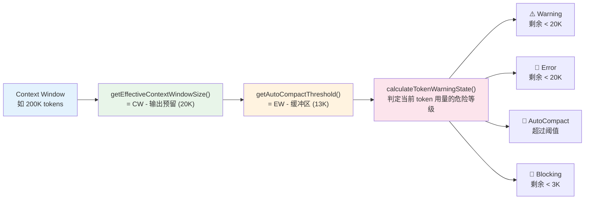

# 第 7 章：上下文压缩家族 — 无限对话的秘密

> 本章是《深入 Claude Code 源码》系列第 7 章。我们将深入分析 Claude Code 如何在有限的 context window 内支撑无限长度的对话——从 token 预算管理、多级压缩策略，到文件状态缓存与 compact 后恢复的设计。
>
> **范围说明**：上下文的"构建"（System Prompt 组装、CLAUDE.md 注入、git status 获取）已在第 6 章中覆盖，缓存策略的横切视角将在第 8 章中展开。本章聚焦于上下文构建完成后的**压缩、清理与恢复**——即当 context window 不够用时，Claude Code 如何在不中断对话的情况下释放空间并重建必要的工作上下文。

## 为什么上下文管理如此重要？

LLM 的 context window 是有限的。Claude 的模型通常有 200K token 的窗口（部分模型支持 1M），看起来很大，但在实际使用中消耗极快：

- 一次 System Prompt 可能占 5K-15K token
- 用户附带的 CLAUDE.md 文件可能占 3K-10K token
- 每次工具调用的结果（如读取一个 500 行文件）可能占 2K-5K token
- 一次完整的 agentic loop（读文件 → 分析 → 编辑 → 运行测试）可能消耗 30K-50K token

在一个真实的编程会话中，用户可能连续工作数小时，产生上百个工具调用。如果不做任何上下文管理，context window 很快就会耗尽，对话将被迫中断。

Claude Code 的解决方案是一套**多层次的上下文压缩与恢复体系**——从最轻量的 Microcompact（清理工具结果）到最重量级的 Full Compact（用模型总结整个对话），形成了一个完整的上下文压力梯度响应系统。

---

## 一、Token 预算管理：三个关键函数

上下文管理的基础是精确的 token 预算计算。三个核心函数定义了整个系统的运行边界。



### 1.1 getEffectiveContextWindowSize() — 实际可用空间

**文件**：`services/compact/autoCompact.ts:33-49`

```typescript
const MAX_OUTPUT_TOKENS_FOR_SUMMARY = 20_000

export function getEffectiveContextWindowSize(model: string): number {
  const reservedTokensForSummary = Math.min(
    getMaxOutputTokensForModel(model),
    MAX_OUTPUT_TOKENS_FOR_SUMMARY,
  )
  let contextWindow = getContextWindowForModel(model, getSdkBetas())

  // 支持通过环境变量覆盖（用于测试）
  const autoCompactWindow = process.env.CLAUDE_CODE_AUTO_COMPACT_WINDOW
  if (autoCompactWindow) {
    const parsed = parseInt(autoCompactWindow, 10)
    if (!isNaN(parsed) && parsed > 0) {
      contextWindow = Math.min(contextWindow, parsed)
    }
  }

  return contextWindow - reservedTokensForSummary
}
```

这个函数计算的是**实际可用于输入的 token 空间**。关键逻辑：

- 从模型的 context window（如 200K）中减去输出预留（`MAX_OUTPUT_TOKENS_FOR_SUMMARY = 20_000`）
- 20K 的预留值来源于 p99.99 统计：compact 总结输出的最大值为 17,387 token

以一个 200K context window 的模型为例：`effectiveContextWindow = 200,000 - 20,000 = 180,000`

### 1.2 getAutoCompactThreshold() — 自动压缩触发线

**文件**：`services/compact/autoCompact.ts:72-91`

```typescript
export const AUTOCOMPACT_BUFFER_TOKENS = 13_000

export function getAutoCompactThreshold(model: string): number {
  const effectiveContextWindow = getEffectiveContextWindowSize(model)
  const autocompactThreshold =
    effectiveContextWindow - AUTOCOMPACT_BUFFER_TOKENS

  // 支持百分比覆盖（用于测试）
  const envPercent = process.env.CLAUDE_AUTOCOMPACT_PCT_OVERRIDE
  if (envPercent) {
    const parsed = parseFloat(envPercent)
    if (!isNaN(parsed) && parsed > 0 && parsed <= 100) {
      const percentageThreshold = Math.floor(
        effectiveContextWindow * (parsed / 100),
      )
      return Math.min(percentageThreshold, autocompactThreshold)
    }
  }

  return autocompactThreshold
}
```

Auto-compact 触发线 = 有效窗口 - 13K 缓冲。以 200K 模型为例：`167,000 = 180,000 - 13,000`。

这个 13K 缓冲区是刻意留出的——它确保在检测到需要 compact 后，仍有足够空间完成当前 turn 的工具调用和模型响应。

### 1.3 calculateTokenWarningState() — 四级告警体系

**文件**：`services/compact/autoCompact.ts:93-145`

```typescript
export const WARNING_THRESHOLD_BUFFER_TOKENS = 20_000
export const ERROR_THRESHOLD_BUFFER_TOKENS = 20_000
export const MANUAL_COMPACT_BUFFER_TOKENS = 3_000

export function calculateTokenWarningState(
  tokenUsage: number,
  model: string,
): {
  percentLeft: number
  isAboveWarningThreshold: boolean
  isAboveErrorThreshold: boolean
  isAboveAutoCompactThreshold: boolean
  isAtBlockingLimit: boolean
} {
  const autoCompactThreshold = getAutoCompactThreshold(model)
  const threshold = isAutoCompactEnabled()
    ? autoCompactThreshold
    : getEffectiveContextWindowSize(model)

  const warningThreshold = threshold - WARNING_THRESHOLD_BUFFER_TOKENS
  const errorThreshold = threshold - ERROR_THRESHOLD_BUFFER_TOKENS
  const blockingLimit =
    getEffectiveContextWindowSize(model) - MANUAL_COMPACT_BUFFER_TOKENS

  return {
    percentLeft: Math.max(0, Math.round(((threshold - tokenUsage) / threshold) * 100)),
    isAboveWarningThreshold: tokenUsage >= warningThreshold,
    isAboveErrorThreshold: tokenUsage >= errorThreshold,
    isAboveAutoCompactThreshold:
      isAutoCompactEnabled() && tokenUsage >= autoCompactThreshold,
    isAtBlockingLimit: tokenUsage >= blockingLimit,
  }
}
```

以 200K 模型为例的四级告警（auto-compact 启用时）：

| 级别 | 阈值 | Token 值 | 含义 |
|------|------|---------|------|
| Warning | threshold - 20K | ~147K | UI 显示黄色警告 |
| Error | threshold - 20K | ~147K | UI 显示红色警告 |
| **AutoCompact** | threshold | **~167K** | **触发自动压缩** |
| **Blocking** | effective - 3K | **~177K** | **禁止新查询，必须手动 /compact** |

值得注意的是，Warning 和 Error 阈值在当前源码中**完全相同**（都是 20K 缓冲），这意味着两者总是同时触发。在 `TokenWarning.tsx` 中，UI 使用 `isAboveErrorThreshold ? "error" : "warning"` 判断颜色，但由于两个阈值相等，实际上总是直接显示红色（error）。分开定义这两个常量是为未来独立调整留下了扩展空间。

---

## 二、Microcompact — 最轻量的上下文清理

在 auto-compact 触发之前，系统会先尝试更轻量的 Microcompact。Microcompact 不会调用模型来总结对话，而是**直接清理旧的工具调用结果**来释放空间。

### 2.1 设计思路

工具调用结果（如文件内容、命令输出、搜索结果）在刚返回时对模型理解上下文至关重要，但随着对话推进，它们的价值递减——模型已经"消化"了这些信息并做出了决策。Microcompact 的策略就是**保留最近的 N 个工具结果，清理更早的**。

### 2.2 可清理的工具类型

**文件**：`services/compact/microCompact.ts:41-50`

```typescript
const COMPACTABLE_TOOLS = new Set<string>([
  FILE_READ_TOOL_NAME,
  ...SHELL_TOOL_NAMES,
  GREP_TOOL_NAME,
  GLOB_TOOL_NAME,
  WEB_SEARCH_TOOL_NAME,
  WEB_FETCH_TOOL_NAME,
  FILE_EDIT_TOOL_NAME,
  FILE_WRITE_TOOL_NAME,
])
```

这些是**允许清理其历史结果的高占用工具**。列表中包含读取类（FileRead、Grep、Glob）、Shell 命令、网络请求，也包含写入类（FileEdit、FileWrite）——它们的 `tool_result` 往往包含大量操作反馈文本，在后续 turn 中信息价值递减。注意 AgentTool 等工具的结果不在此列——它们的输出通常是高度浓缩的总结，清理后信息损失大。

### 2.3 本地 Microcompact 的两条路径

`microcompactMessages()` 函数（`services/compact/microCompact.ts:253-293`）内部有两条本地路径，按优先级短路选择：

**路径 1：Time-based Microcompact**

**文件**：`services/compact/microCompact.ts:446-530`

当用户离开一段时间后回来（gap > 阈值），服务端的 prompt cache 已经过期，此时无需保护缓存，直接构造新的消息对象替换旧的工具结果内容：

```typescript
function maybeTimeBasedMicrocompact(
  messages: Message[],
  querySource: QuerySource | undefined,
): MicrocompactResult | null {
  const trigger = evaluateTimeBasedTrigger(messages, querySource)
  if (!trigger) return null

  // ... 收集可清理的工具 ID，保留最近 N 个
  const keepSet = new Set(compactableIds.slice(-keepRecent))
  const clearSet = new Set(compactableIds.filter(id => !keepSet.has(id)))

  // 构造新的消息对象，替换内容为占位文本
  const result: Message[] = messages.map(message => {
    // ...
    return { ...block, content: TIME_BASED_MC_CLEARED_MESSAGE }
    // '[Old tool result content cleared]'
  })
}
```

这种方式通过 `{ ...block, content: ... }` 和 `{ ...message, message: { ...message.message, content: newContent } }` **构造新的 Message / content 对象**返回，而非原地修改（mutate）原始消息。因为 cache 已经冷了，没有需要保护的前缀，所以可以放心地替换内容。

**路径 2：Cached Microcompact（cache_edits API）**

**文件**：`services/compact/microCompact.ts:305-399`

当 prompt cache 仍然温热时，不能替换消息内容（那会改变 prompt 前缀，破坏缓存命中），而是通过 Anthropic API 的 `cache_edits` 机制，在 API 层面删除指定工具的 `tool_result`：

```typescript
async function cachedMicrocompactPath(
  messages: Message[],
  querySource: QuerySource | undefined,
): Promise<MicrocompactResult> {
  // ... 注册工具结果到追踪状态
  const toolsToDelete = mod.getToolResultsToDelete(state)

  if (toolsToDelete.length > 0) {
    // 创建 cache_edits 指令，由 API 层发送
    const cacheEdits = mod.createCacheEditsBlock(state, toolsToDelete)
    pendingCacheEdits = cacheEdits

    // 本地消息不变！cache_reference 和 cache_edits 在 API 层添加
    return {
      messages, // 未修改
      compactionInfo: { pendingCacheEdits: { ... } },
    }
  }
}
```

关键区别：这种路径**不修改本地消息**。删除操作通过 API 的 `cache_edits` 参数传递，由服务端在缓存层执行。这保留了 prompt cache 的命中率。

### 2.4 API-level Context Management — 独立的并行机制

**文件**：`services/compact/apiMicrocompact.ts`

除了上述两条本地 microcompact 路径外，还有一套**独立的 API 层上下文管理机制**。它不在 `microcompactMessages()` 的选择链中，而是通过 `services/api/claude.ts` 在构建 API 请求时注入 `context_management` 配置参数，将上下文清理策略声明式地委托给 Anthropic API 服务端执行：

```typescript
// services/api/claude.ts:1633 — 在 API 请求构建时调用
const contextManagement = getAPIContextManagement({
  hasThinking,
  isRedactThinkingActive,
  clearAllThinking,
})
// 作为请求参数传递给 API
```

`getAPIContextManagement()` 返回一组声明式策略：

```typescript
export function getAPIContextManagement(options?: {
  hasThinking?: boolean
  isRedactThinkingActive?: boolean
  clearAllThinking?: boolean
}): ContextManagementConfig | undefined {
  const strategies: ContextEditStrategy[] = []

  // 清理旧的 thinking 块
  if (hasThinking && !isRedactThinkingActive) {
    strategies.push({
      type: 'clear_thinking_20251015',
      keep: clearAllThinking
        ? { type: 'thinking_turns', value: 1 }
        : 'all',
    })
  }

  // 清理旧的工具结果（ant-only）
  if (useClearToolResults) {
    strategies.push({
      type: 'clear_tool_uses_20250919',
      trigger: { type: 'input_tokens', value: triggerThreshold },
      clear_at_least: { type: 'input_tokens', value: triggerThreshold - keepTarget },
      clear_tool_inputs: TOOLS_CLEARABLE_RESULTS,
    })
  }

  return { edits: strategies }
}
```

**与本地 microcompact 的关系**：这两套机制**并行存在，互不排斥**。本地 microcompact 在客户端发送请求前清理或标记消息；API-level context management 则是在请求参数中声明清理策略，由服务端在处理请求时执行。它们可以同时生效——客户端做一轮粗清理，服务端再做一轮精细清理。

---

## 三、Full Compact — 用模型总结对话

当 Microcompact 不够用，token 用量达到 auto-compact 阈值时，系统触发 Full Compact——**用模型自己来总结之前的对话**。

### 3.1 触发流程

**文件**：`services/compact/autoCompact.ts:241-351`

```typescript
export async function autoCompactIfNeeded(
  messages: Message[],
  toolUseContext: ToolUseContext,
  cacheSafeParams: CacheSafeParams,
  // ...
): Promise<{ wasCompacted: boolean; compactionResult?: CompactionResult }> {
  // 1. 熔断器：连续失败 3 次后停止尝试
  if (tracking?.consecutiveFailures >= MAX_CONSECUTIVE_AUTOCOMPACT_FAILURES) {
    return { wasCompacted: false }
  }

  // 2. 检查是否需要 compact
  const shouldCompact = await shouldAutoCompact(messages, model, querySource)
  if (!shouldCompact) return { wasCompacted: false }

  // 3. 优先尝试 Session Memory Compact
  const sessionMemoryResult = await trySessionMemoryCompaction(...)
  if (sessionMemoryResult) return { wasCompacted: true, ... }

  // 4. 回退到传统的 Full Compact
  const compactionResult = await compactConversation(messages, ...)
  return { wasCompacted: true, compactionResult, consecutiveFailures: 0 }
}
```

几个重要的工程细节：

**熔断器（Circuit Breaker）**：连续失败 3 次后停止尝试。注释揭示了这个设计的背景：

> BQ 2026-03-10: 1,279 sessions had 50+ consecutive failures (up to 3,272) in a single session, wasting ~250K API calls/day globally.

没有熔断器时，context 不可恢复地超限的 session 会在每个 turn 都发起注定失败的 compact 请求，全球每天浪费约 25 万次 API 调用。

**递归保护**：`shouldAutoCompact()` 会检查 `querySource`，防止 compact 自身（`'compact'`）或 session memory（`'session_memory'`）触发新的 compact，避免无限递归。

除了这两条最直接的递归保护，源码在 `shouldAutoCompact()` 里还排布了几道针对新一代上下文机制的护栏（`services/compact/autoCompact.ts:174-223`），它们都属于"看似与 compact 无关、一旦同时点火就会互相拆台"那一类隐患：

- **`marble_origami` 这个 ctx-agent**：开启了 `CONTEXT_COLLAPSE` 之后，contextCollapse 自己也是一个 forked agent（querySource = `marble_origami`）。如果它在工作过程中又触发 autocompact，`runPostCompactCleanup` 会顺手调用 `resetContextCollapse()`，把主线程那一份模块级 collapse log 全部清掉。源码注释把这个连锁反应讲得很直白——所以这条 querySource 直接被列入"绝不再触发 autocompact"的黑名单。
- **`REACTIVE_COMPACT` 反应式模式**：当 `tengu_cobalt_raccoon` gate 打开时，全局策略是"前置不再 proactive 压缩，等 API 真的返回 prompt-too-long 再由 reactive compact 兜底"，因此 `shouldAutoCompact()` 直接返回 `false`，把决策权完全交给第 5 章里讲过的 413 恢复链。
- **`CONTEXT_COLLAPSE` 启用时的让位**：collapse 自己在 90% 触发承诺、95% 触发阻塞生成，而 autocompact 的阈值落在 effective 减去 13K 的位置（200K 模型上即 167K，相当于 93%）——恰好夹在这两条线中间。如果不让位，autocompact 通常会抢在 collapse 之前点火，把 collapse 即将保住的细粒度上下文一刀切掉。这里通过 `isContextCollapseEnabled()` 二次判定（而不是直接看 feature flag），是为了让 `CLAUDE_CONTEXT_COLLAPSE` 环境变量这种本地覆盖也能生效。

这一串护栏背后的共同主题是：**当一个进程里同时活着多种上下文管理子系统时，谁先点火谁就赢，而点火顺序错了会发生静默的状态破坏**。把所有"我现在不该跑"的判定收拢到 `shouldAutoCompact()` 一个入口，比让每个子系统各自试探安全得多。

### 3.2 Session Memory Compact — 免调用的压缩

**文件**：`services/compact/sessionMemoryCompact.ts`

这是 compact 的一个创新路径：不调用模型生成总结，而是**直接使用 Session Memory 系统已有的对话记忆**作为压缩后的总结。

Session Memory 是一个独立的后台系统（将在第 31 章详述），它在对话过程中持续异步提取关键信息到磁盘文件。当 compact 触发时，如果 Session Memory 已经有内容，就直接用它作为总结，跳过昂贵的 API 调用：

```typescript
export async function trySessionMemoryCompaction(
  messages: Message[],
  agentId?: AgentId,
  autoCompactThreshold?: number,
): Promise<CompactionResult | null> {
  // 等待正在进行的 session memory 提取完成
  await waitForSessionMemoryExtraction()

  const sessionMemory = await getSessionMemoryContent()
  if (!sessionMemory || await isSessionMemoryEmpty(sessionMemory)) {
    return null // 回退到传统 compact
  }

  // 计算保留多少最近的消息
  const startIndex = calculateMessagesToKeepIndex(messages, lastSummarizedIndex)
  const messagesToKeep = messages.slice(startIndex)

  // 直接用 session memory 作为总结，无需 API 调用
  return createCompactionResultFromSessionMemory(
    messages, sessionMemory, messagesToKeep, ...
  )
}
```

`calculateMessagesToKeepIndex` 使用一组可配置的阈值决定保留多少最近消息：

- **最少保留 10K token** 或 **5 条有文本的消息**（取较大者）
- **最多保留 40K token**（硬上限）
- 还会确保不拆分 `tool_use` / `tool_result` 配对

### 3.3 传统 Full Compact — compactConversation()

**文件**：`services/compact/compact.ts:387-586`

当 Session Memory Compact 不可用时，执行传统的 Full Compact：

1. **执行 PreCompact hooks**——允许用户自定义的 hook 脚本在 compact 前运行
2. **构建总结请求**——将对话历史和总结 prompt 发给模型
3. **流式获取总结**——模型生成对话总结
4. **处理 prompt_too_long**——如果连 compact 请求本身都超限，会截断最旧的消息重试
5. **重建上下文**——清理文件缓存，重新注入关键附件

### 3.4 Compact Prompt — 模型如何被指导生成总结

**文件**：`services/compact/prompt.ts`

Compact prompt 的设计非常讲究。它要求模型按 9 个维度进行结构化总结：

```
1. Primary Request and Intent — 用户的请求和意图
2. Key Technical Concepts — 关键技术概念
3. Files and Code Sections — 涉及的文件和代码片段
4. Errors and fixes — 遇到的错误和修复
5. Problem Solving — 问题解决过程
6. All user messages — 所有用户消息（非工具结果）
7. Pending Tasks — 待完成的任务
8. Current Work — 当前进行的工作
9. Optional Next Step — 可选的下一步
```

一个精妙的设计是 **`<analysis>` 标签**——模型被要求先在 `<analysis>` 中整理思路，然后在 `<summary>` 中给出正式总结。之后，`formatCompactSummary()` 函数会**剥离 `<analysis>` 部分**，只保留 `<summary>` 注入到后续上下文中：

```typescript
// services/compact/prompt.ts:311-335
export function formatCompactSummary(summary: string): string {
  let formattedSummary = summary
  // 剥离 analysis — 它是提升总结质量的草稿，正式总结完成后无信息价值
  formattedSummary = formattedSummary.replace(
    /<analysis>[\s\S]*?<\/analysis>/, '',
  )
  // 提取并格式化 summary
  const summaryMatch = formattedSummary.match(/<summary>([\s\S]*?)<\/summary>/)
  if (summaryMatch) {
    formattedSummary = formattedSummary.replace(
      /<summary>[\s\S]*?<\/summary>/,
      `Summary:\n${summaryMatch[1]?.trim()}`,
    )
  }
  return formattedSummary.trim()
}
```

这实质上是一种 **chain-of-thought 然后剥离** 的技巧：让模型在生成最终总结前先深入思考，但不把思考过程注入后续上下文（节省 token）。

prompt.ts 实际上准备了三个版本的 compact 提示词，对应三种不同的"压缩对象"：`BASE_COMPACT_PROMPT` 总结整段对话（`services/compact/prompt.ts:61`）；`PARTIAL_COMPACT_PROMPT` 只总结"较新的那一段消息"（前面早期消息保留原样，`services/compact/prompt.ts:145`）；`PARTIAL_COMPACT_UP_TO_PROMPT` 则是"总结这一段并放到会话开头，新消息会在你看不到的后面继续"（`services/compact/prompt.ts:208`）。三者共享同一套九节骨架，只是叙事视角不同——`getPartialCompactPrompt()` 根据传入的 `direction: 'from' | 'up_to'` 选一个模板（`services/compact/prompt.ts:274-291`），唯一的调用方是 `compact.ts:840` 走 partial compact 时构造提示词。多模板设计的好处是，partial compact 不必硬塞一个不自然的"请总结全部，但其实只总结一半"的指令，而是按方向直接选对应视角的模板。注意：microCompact 与 apiMicrocompact 各自维护独立的工具调用裁剪提示词，sessionMemoryCompact 则完全绕过 compact prompt——它直接读取 Session Memory 文件作为总结来源（`services/compact/sessionMemoryCompact.ts:514-580` 的 `trySessionMemoryCompaction()`），共用的只是 `getCompactUserSummaryMessage()` 这层"把总结包成 user 消息"的尾部封装（`services/compact/sessionMemoryCompact.ts:42`）。

另一个细节是末尾的 `getCompactUserSummaryMessage()`（`services/compact/prompt.ts:337-374`）。它负责把模型吐出来的总结包成一条 user 消息塞回新会话，可选地拼接"transcript 路径"、"recent messages 已被保留"、"不要再问任何问题，直接继续"这几段尾语。其中那段"直接续工"对 proactive / KAIROS 自治模式还有一段专门的扩展（`services/compact/prompt.ts:361-368`）——它会额外加一句"这次唤醒不是首次启动，你 compact 前就已经在自主工作了，沿着 summary 接着干，不要跟用户打招呼"，避免自治 agent 在 compact 后变成一个突然 say hi 的礼貌助手。

另一个值得注意的设计：prompt 开头有一段强力的 **NO_TOOLS_PREAMBLE**，反复强调模型不要调用工具：

```
CRITICAL: Respond with TEXT ONLY. Do NOT call any tools.
- Tool calls will be REJECTED and will waste your only turn — you will fail the task.
```

注释解释了原因：compact 使用 `maxTurns: 1` 的 forked agent 执行，模型如果尝试调用工具会被拒绝，导致白白浪费 API 调用。在 Sonnet 4.6 上这个问题的发生率从 0.01% 上升到了 2.79%，所以增加了这个前置强调。

### 3.5 Compact 后的上下文重建

Compact 不仅仅是压缩——压缩完后需要**重建模型继续工作所需的上下文**：

```typescript
// compact.ts:531-585 (简化)
// 1. 清理文件缓存
context.readFileState.clear()
context.loadedNestedMemoryPaths?.clear()

// 2. 并行生成后续附件
const [fileAttachments, asyncAgentAttachments] = await Promise.all([
  createPostCompactFileAttachments(preCompactReadFileState, context, 5),
  createAsyncAgentAttachmentsIfNeeded(context),
])

// 3. 恢复关键上下文
// - 最近读取的文件（最多 5 个，每个最多 5K token）
// - Plan 附件（如果在 plan mode 中）
// - 已调用的 Skill 内容（每个最多 5K token）
// - Deferred Tools / Agent / MCP 指令的增量附件
```

文件恢复有严格的 token 预算控制：`POST_COMPACT_TOKEN_BUDGET = 50_000`，`POST_COMPACT_MAX_TOKENS_PER_FILE = 5_000`，`POST_COMPACT_MAX_FILES_TO_RESTORE = 5`。这确保 compact 后的上下文不会因为恢复附件而再次膨胀。

---

## 四、FileStateCache — 文件读写安全状态追踪

**文件**：`utils/fileStateCache.ts`

FileStateCache 的核心职责不是"避免重复读取"，而是**追踪文件的读取状态与可编辑性**，并在 compact 后作为**文件恢复的索引依据**。它回答的核心问题是：模型当前对哪些文件有什么程度的认知？是否可以安全地编辑它们？

```typescript
export type FileState = {
  content: string
  timestamp: number
  offset: number | undefined
  limit: number | undefined
  // True when this entry was populated by auto-injection (e.g. CLAUDE.md) and
  // the injected content did not match disk (stripped HTML comments, stripped
  // frontmatter, truncated MEMORY.md). The model has only seen a partial view;
  // Edit/Write must require an explicit Read first. `content` here holds the
  // RAW disk bytes (for getChangedFiles diffing), not what the model saw.
  isPartialView?: boolean
}
```

```typescript
export class FileStateCache {
  private cache: LRUCache<string, FileState>

  constructor(maxEntries: number, maxSizeBytes: number) {
    this.cache = new LRUCache<string, FileState>({
      max: maxEntries,
      maxSize: maxSizeBytes,
      sizeCalculation: value => Math.max(1, Buffer.byteLength(value.content)),
    })
  }
  // ...
}
```

几个设计要点：

1. **读写安全守卫**：`isPartialView` 标记是这个缓存最关键的语义。当文件内容是被截断注入的（如 CLAUDE.md 去掉 HTML 注释、截断的 MEMORY.md），这个标记告诉 FileEdit/FileWrite 工具必须先做一次完整的 Read，不能基于缓存的部分内容进行编辑。源码注释明确说明：`content` 字段存储的是**原始磁盘内容**（用于 `getChangedFiles` 差异比对），不是模型看到的内容。

2. **Compact 后文件恢复索引**：Full Compact 后，`readFileState.clear()` 清除所有缓存，然后 `createPostCompactFileAttachments()`（`services/compact/compact.ts:1415-1464`）从 compact 前的 `preCompactReadFileState` 中挑选最近的文件重新注入。FileStateCache 在这里充当了"恢复索引"——它知道哪些文件是模型最近读取过的，按时间戳排序后选择最重要的恢复。

3. **双重限制**：`max` 限制条目数（默认 100），`maxSize` 限制总大小（默认 25MB）。这防止大量大文件导致内存膨胀。

4. **路径标准化**：所有 key 在存取时都经过 `normalize()`，确保 `/foo/../bar` 和 `/bar` 命中同一条缓存。

5. **Agent 隔离**：`createSubagentContext()` 会 `cloneFileStateCache()`，确保子 Agent 的文件读取不污染父级的缓存状态。

---

## 五、compactWarningState — 用 Store 模式管理告警状态

**文件**：`services/compact/compactWarningState.ts`

这是一个有趣的小模块——它复用了第 33 章介绍的极简 Store 来管理 compact 告警的抑制状态：

```typescript
import { createStore } from '../../state/store.js'

export const compactWarningStore = createStore<boolean>(false)

export function suppressCompactWarning(): void {
  compactWarningStore.setState(() => true)
}

export function clearCompactWarningSuppression(): void {
  compactWarningStore.setState(() => false)
}
```

为什么需要抑制？因为 compact 成功后，我们不再有准确的 token 计数（要等下次 API 响应才知道），如果继续显示告警会造成误导。所以 compact 成功后设置抑制，直到下次 microcompact 开始时清除。

这个模块同时展示了 Store 模式的复用性——同一个 35 行 Store 实现，既用于管理全局 AppState，也用于管理局部的 UI 状态。

值得一提的是，告警状态的 **React 订阅 hook 被刻意拆到了另一个文件** `services/compact/compactWarningHook.ts:1-16`：

```typescript
export function useCompactWarningSuppression(): boolean {
  return useSyncExternalStore(
    compactWarningStore.subscribe,
    compactWarningStore.getState,
  )
}
```

这个 hook 只有 7 行有效代码，单独成文件是为了**让 `compactWarningState.ts` 保持 React-free**——`microCompact.ts` 在每个 turn 的预处理阶段都会读写这个 store，如果状态文件 import 了 React，那么整条 print-mode 启动路径都会被迫把 React 拖进模块图，这是源码注释里直接写明的考量。这种"状态文件零依赖、订阅 hook 拆出去"的拆法在第 33 章 Store 模式之外又添了一个小的样本。

---

## 六、postCompactCleanup — 压缩后的缓存清理

**文件**：`services/compact/postCompactCleanup.ts`

Compact 后需要清理大量缓存和追踪状态。这个清理函数揭示了 Claude Code 中**有多少模块级缓存**：

```typescript
export function runPostCompactCleanup(querySource?: QuerySource): void {
  const isMainThreadCompact =
    querySource === undefined ||
    querySource.startsWith('repl_main_thread') ||
    querySource === 'sdk'

  resetMicrocompactState()          // Microcompact 追踪状态
  clearSystemPromptSections()       // System Prompt 分段缓存
  clearClassifierApprovals()        // 分类器审批缓存
  clearSpeculativeChecks()          // 推测性权限检查缓存
  clearBetaTracingState()           // 遥测追踪状态
  clearSessionMessagesCache()       // Session 消息缓存

  // 只有主线程 compact 才清理这些（子 Agent 共享模块级状态）
  if (isMainThreadCompact) {
    getUserContext.cache.clear?.()   // 用户上下文缓存
    resetGetMemoryFilesCache('compact') // CLAUDE.md 文件缓存
  }
}
```

`isMainThreadCompact` 的判断尤其重要——子 Agent 和主线程运行在同一个进程中，共享模块级状态。如果子 Agent compact 时清理了主线程的缓存（如 getUserContext 缓存），会导致主线程状态损坏。注释中记录了这个教训。

与 `postCompactCleanup` 并排坐着的还有一个 63 行的小文件 `services/compact/grouping.ts`，它本身和清理逻辑无关，但属于同一类"为了让 compact 家族跑得动而存在的胶水模块"，顺带一提。它只导出一个 `groupMessagesByApiRound()`，把 `Message[]` 按"API 往返边界"切组——遇到 `message.id` 与上一个 assistant 不同的新 assistant 消息就开新一组。这替换的是早期那套"只在真实用户提示处切分"的人工 turn 分组：那种分组对 REPL 够用，但对 SDK/CCR/eval 这类"整段会话只有一条人类提示、其余全是 agentic loop"的调用方就退化成"只有一组"，reactive compact 想压缩中段也无从下刀。改成按 API 往返切分后，单提示词 agent 会话的中间轮次也能被独立摘要。`services/compact/grouping.ts:18-21` 的注释还交代了它为什么会被单拎出来：原本 inline 在 `compact.ts` 里时，`compact.ts ↔ compactMessages.ts` 之间形成了 import cycle（CC-1180），在 CI shard-2 上暴露了一个潜伏的 `ws` 模块 CJS/ESM 解析竞态——拆出来仅仅是为了**改变模块初始化顺序**。这种"为了打破循环依赖而生的纯结构性模块"在长链路项目里并不罕见，但很少有源码会在注释里把因果链交代得这么直白。

---

## 七、可迁移的设计模式

### 模式 1：多级压力梯度响应

不要等到资源耗尽才采取行动。设计一组从轻量到重量级的干预措施，在不同的压力等级触发不同的响应：

- **低压**：Time-based 清理（几乎零成本）
- **中压**：Cached Microcompact（利用 API 原生能力）
- **高压**：Full Compact（用模型总结，昂贵但有效）
- **极限**：Blocking（禁止新请求，强制用户手动干预）

**适用场景**：任何有资源限制的系统——内存管理、数据库连接池、磁盘空间、API 配额。

### 模式 2：熔断器 + 连续失败计数

当某个操作连续失败超过阈值时，停止重试。这避免了"在已知无法成功的操作上浪费资源"的陷阱。

```
失败 → 计数器 +1 → 超过阈值 → 熔断（停止尝试）
成功 → 计数器归零
```

Claude Code 的实践：3 次连续 compact 失败后熔断，因为统计显示有些 session 会连续失败数千次，每天浪费 25 万次 API 调用。

**适用场景**：任何可能连续失败的重试逻辑——API 调用、数据库重连、任务队列。

### 模式 3：Chain-of-Thought 然后剥离

让模型在生成最终输出前先在指定标签（如 `<analysis>`）中进行详细推理，然后在后处理中剥离推理过程，只保留最终结果（`<summary>`）。这兼顾了输出质量和 token 经济性。

**适用场景**：任何需要模型生成高质量摘要/总结的场景，特别是当总结会被注入后续 prompt 时。

---

---

## 下一章预告

[第 8 章：Prompt Cache 横切 — 跨模块的缓存策略如何降低 API 成本](./08-PromptCache横切.md)

我们将从横切视角审视 Prompt Cache 如何贯穿 System Prompt、对话循环和上下文管理三个模块，以及 Fork Agent 如何通过精密的参数对齐实现跨进程缓存共享。

---
*全部内容请关注 https://github.com/luyao618/Claude-Code-Source-Study (求一颗免费的小星星)*
