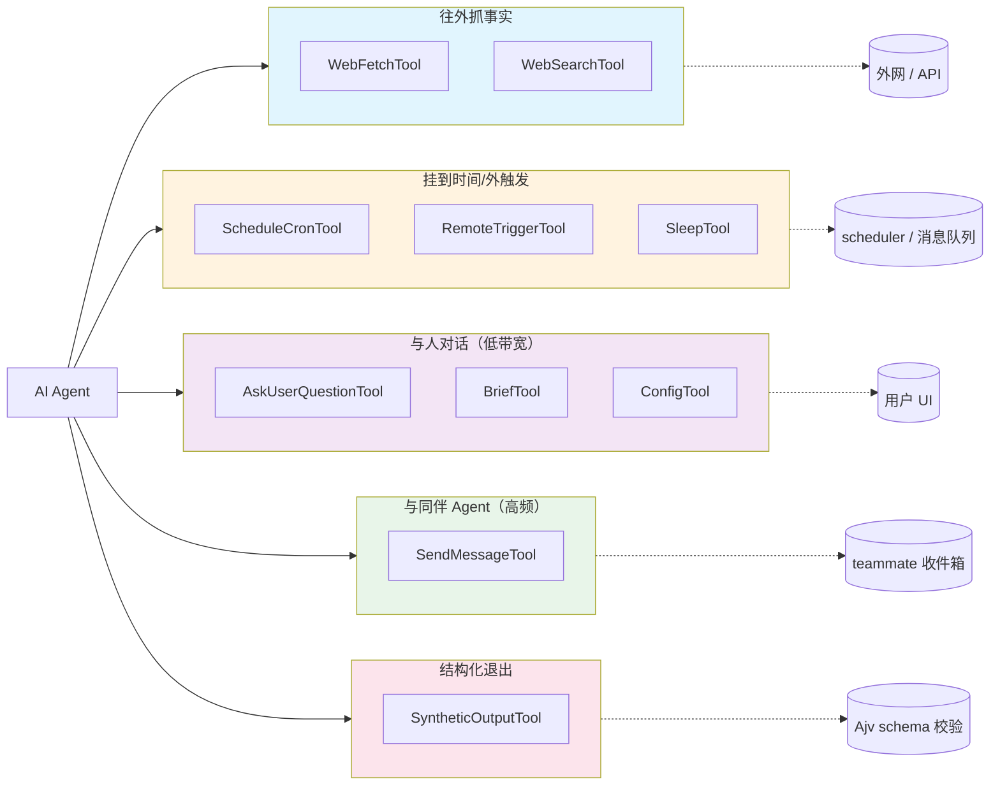

# 第 13 章：通信、调度、问询与合成工具 — Agent 与外部世界之间的十条窄通道

> 本章是《深入 Claude Code 源码》系列对工具家族的第三次深入。前两篇分别讲了 `Tool` 协议骨架，以及文件、代码与 LSP 一族围绕"先读后写"这条暗规的工程一致性。这一篇把镜头掉转 180°：不再看 Agent 怎么动本地代码，而是看它怎么开口——怎么往外抓一段网页、怎么把自己挂到 cron 上、怎么和另一个 Agent 互相通讯、怎么向用户问一道选择题、怎么交一份机器可读的最终答卷。

## 为什么把这十把工具放在一篇里讲？

照 `tools/` 目录看，这十个工具看上去毫无共性：`WebFetchTool` 在网络栈最外层、`SleepTool` 只是个 `setTimeout` 包装、`SyntheticOutputTool` 是个 Ajv schema 校验器、`SendMessageTool` 单文件 917 行。把它们硬塞进同一章，乍看像是把杂物间的东西按"反正都不是文件工具"塞进了同一个抽屉。

但读完源码会发现它们共用同一条暗线 —— **每一把工具都在替 Agent 凿开一条对话之外的窄通道**。`BashTool` 改本地状态、`FileEdit` 改文件、`LSPTool` 看诊断，这些都是 Agent 在自己脚下的世界里活动。本章这十个工具不同：它们要么把 Agent 的注意力投射到 Agent 看不见的地方，比如一个 URL 背后、一个未来时刻、另一个 Agent 的收件箱、用户视野里的某块 UI；要么把 Agent 的"声音"压缩成对方能消费的固定格式。每一条通道都很窄——窄到工具签名里塞不下太多自由度，窄到必须靠 Tool 协议的回执来对账。

也正因为都在凿窄通道，这十把工具的设计里都重复着同一组工程克制：明确的超时上限、明确的缓存策略、对外不暴露的预审名单、给二级模型读的安全提示词。把它们放在一起讲，是想把这条暗线显形——而不是给每个工具都单写一节，让读者读到第八个的时候已经记不清前面六个的差异。

本章按四组叙事来讲：

1. **往外抓一段事实** — `WebFetchTool` 与 `WebSearchTool`
2. **把自己挂到时间或外触发上** — `ScheduleCron` 三件套、`RemoteTriggerTool`、`SleepTool`
3. **与人之间的低带宽通道** — `AskUserQuestionTool`、`BriefTool`、`ConfigTool`
4. **与同伴 Agent 的高频通道与结构化收尾** — `SendMessageTool`、`SyntheticOutputTool`

读完之后你应该能回答这几个问题：为什么 `WebFetch` 在打 HTTP 之前要先打一次 `anthropic.com`？为什么 cron 工具会建议你避开整点和半点？为什么 `AskUserQuestion` 限制最多四题、每题最多四个选项？为什么 `SyntheticOutput` 要把 schema 编译结果缓存在 WeakMap 里？

---

## 全景图：十把工具按"通道方向"分四组



---

## 一、往外抓一段事实：WebFetch 与 WebSearch

### 1.1 WebFetch：URL 背后那条比想象中长的链

`tools/WebFetchTool/WebFetchTool.ts` 这个工具读起来很朴素：`searchHint: 'fetch a URL and process its contents'`，`maxResultSizeChars: 100_000`，`shouldDefer: true`，权限按 `domain:${hostname}` 这一颗粒度记忆。一个外部用户看到工具描述里的"输入一个 URL，返回它的内容"会以为这是个 fetch 加 turndown 的两步流水线。但 `tools/WebFetchTool/utils.ts:347-481` 的 `getURLMarkdownContent` 拉开后会看见完全不同的一条链。

走完这条链，一次"看似简单的 URL 抓取"会经过：URL 长度白名单（≤ 2000 字符）、用户名密码字段拒绝、必须含点号的域名形状检查（`utils.ts:139-169`）、然后是一次去 `https://api.anthropic.com/api/web/domain_info?domain=...` 的 **preflight 域名白名单查询**。

这次 preflight 的实现很克制：

```typescript
// tools/WebFetchTool/utils.ts:176-203
export async function checkDomainBlocklist(
  domain: string,
): Promise<DomainCheckResult> {
  if (DOMAIN_CHECK_CACHE.has(domain)) {
    return { status: 'allowed' }
  }
  try {
    const response = await axios.get(
      `https://api.anthropic.com/api/web/domain_info?domain=${encodeURIComponent(domain)}`,
      { timeout: DOMAIN_CHECK_TIMEOUT_MS },
    )
    if (response.status === 200) {
      if (response.data.can_fetch === true) {
        DOMAIN_CHECK_CACHE.set(domain, true)
        return { status: 'allowed' }
      }
      return { status: 'blocked' }
    }
    return { status: 'check_failed', error: ... }
  } catch (e) {
    return { status: 'check_failed', error: e as Error }
  }
}
```

注意 `DOMAIN_CHECK_CACHE` 只缓存 `allowed`、不缓存 `blocked`——前者掉错了无伤大雅，后者掉错了就成了实质的安全旁路。这是个反复出现的安全设计模式：失败要快、放行要稳。

preflight 通过后才是真正的 HTTP——`utils.ts:262-329` 的 `getWithPermittedRedirects`：最多 10 MB、60 秒超时、`maxRedirects: 0`、重定向由这个函数自己递归实现，最大十跳。`Accept` 头里同时列了 `text/markdown` 和 `text/html`，`User-Agent` 走一个自定义函数。

最关键的一段是同源重定向校验：

```typescript
// tools/WebFetchTool/utils.ts:212-243（节选）
function isPermittedRedirect(from: URL, to: URL): boolean {
  if (from.protocol !== to.protocol) return false
  if (from.port !== to.port) return false
  if (to.username || to.password) return false
  // hostname must match after stripping leading "www."
  const stripWWW = (h: string) => h.replace(/^www\./, '')
  return stripWWW(from.hostname) === stripWWW(to.hostname)
}
```

注释里的理由很直接：自动跟随重定向相当于把"信任 example.com"这件事委托给 example.com 自己去决定，而 example.com 上随便挂一个开放重定向就足以让 Claude Code 实质上去抓 attacker.com。所以代码选了一个不舒服但安全的折中——只允许同源加减 `www.` 的重定向静默跟随，其他情况返回 `RedirectInfo`，把控制权交回工具层，让用户重新批准新 URL。

#### 资源回收的两个细节

抓完之后会经过两个看不见的资源回收点：

- **rawBuffer 释放**：拿到响应之后立刻把 axios 持有的 `ArrayBuffer` 设成 null，让 GC 在 turndown 建 DOM 树前先收掉那份 10 MB。`utils.ts:428-432` 的注释解释 turndown 的 DOM 树是 HTML 大小的 3–5 倍。
- **turndown 服务 lazy singleton**：用一个 Promise 缓住，第一次抓 HTML 才把 `@mixmark-io/domino` 这个 1.4 MB 量级的依赖搬进堆，之后所有页面复用同一个实例。

这两个细节都不在工具表面，但它们解释了为什么 `WebFetch` 在 IDE 内嵌进程里能频繁调用而不让常驻内存爆掉。

#### 喂给小模型，而不是主模型

抓到的 Markdown 不会直接交给主模型。它会先被截到 `MAX_MARKDOWN_LENGTH = 100_000` 以内（`utils.ts:128`），然后丢给 Haiku 这一档小模型，让小模型按用户在工具调用里给出的自然语言 `prompt` 抽一段答案出来。`makeSecondaryModelPrompt` 会根据宿主是否在预审名单内发不同的系统提示——预审过的允许直接引用原文段落，没预审过的强制小模型把任何引用压到 125 字符以内。这条 125 字符红线是个安全设计：未预审域可能在内容里塞 prompt injection，把小模型的引用宽度卡死，让 injection payload 截不下来。

#### 预审名单是个攻击面

预审名单本身（`tools/WebFetchTool/preapproved.ts`）也值得一提：它不是扁平的字符串集合，而是按"光宿主名"和"宿主名 + 路径前缀"两类拆开做 O(1) 查找。路径前缀的匹配强制对齐到路径段边界，避免 `github.com/foo` 把 `github.com/foobar` 也判为预审。这种小心翼翼的写法在工具层很常见——一旦一个 host 被预审，它在 `checkPermissions` 里就被直接 auto-allow，无需用户批准：

```typescript
// tools/WebFetchTool/WebFetchTool.ts:108-118
const parsedUrl = new URL(url)
if (isPreapprovedHost(parsedUrl.hostname, parsedUrl.pathname)) {
  return {
    behavior: 'allow',
    updatedInput: input,
    decisionReason: { type: 'other', reason: 'Preapproved host' },
  }
}
```

并且在二级模型提示词里跳过 125 字符引用限制。匹配宽一寸都是个攻击面。**注意**：域名 preflight 是否跳过只取决于 settings 里的 `skipWebFetchPreflight`（`utils.ts:386-398`），不会因为宿主在预审名单里就绕过。

#### 在企业网络里不至于退化成"什么都不工作但没人知道为什么"

`WebFetch` 还在多层处理"网络环境就是不让我访问"这类边界。比如域名 preflight 走的是 `api.anthropic.com`，企业出口防火墙可能把这个端点也封了。这时 `checkDomainBlocklist` 会返回 `check_failed`，工具层抛 `DomainCheckFailedError`，回执里指明"无法验证是否安全"——而不是闷头放行。企业用户如果确认自己内网安全、要硬走，可以在 settings 里打开 `skipWebFetchPreflight`，但那是 opt-out 而不是 opt-in。

再比如某些出口代理在 403 响应里挂 `X-Proxy-Error: blocked-by-allowlist`，工具层会专门嗅到这个 header 抛 `EgressBlockedError`（`utils.ts:316-325`），让回执里清楚地说"是出口被拦了，不是站点 404"。

最后是一处不显眼的工程克制：URL 缓存按"原始 URL"键控，不按升级到 https 之后或重定向落点 URL 键控（`utils.ts:468-481`）。Agent 反复用同一个 `http://` 拼写抓同一个站点不会绕开 15 分钟缓存。同时还专门为域名 preflight 单独留了一份缓存——因为 URL 缓存是按完整 URL 键控的，同一个域名的两条不同路径会触发两次相同的 preflight，把它们合并掉省下的不是流量而是延迟。

### 1.2 WebSearch：让模型自己开搜索

`WebSearchTool` 的实现路径和 `WebFetchTool` 是一组镜像关系。`WebFetch` 是把"网"这件事拆给本地 axios + turndown 走，搜索结果之后才走模型；`WebSearch` 走的是另一条路：把 `web_search_20250305` 这个 beta 工具直接塞到一次向 Anthropic API 的对话里，让上游服务端跑搜索，本地这一侧只是组装一段 user message + 解析回来的 content blocks。

工具 schema 里有一个写死的 8：

```typescript
// tools/WebSearchTool/WebSearchTool.ts:76-83
function makeToolSchema(input: Input): BetaWebSearchTool20250305 {
  return {
    type: 'web_search_20250305',
    name: 'web_search',
    allowed_domains: input.allowed_domains,
    blocked_domains: input.blocked_domains,
    max_uses: 8, // Hardcoded to 8 searches maximum
  }
}
```

`max_uses: 8` 没在常量表里，源码注释也没解释。从上下文可以推出：这是为了上限掉一次工具调用里能花的搜索次数——避免模型陷入"再搜一次也许就有了"的死循环，把单次工具调用的费用钉住。

`isEnabled` 这段是另一组克制（`WebSearchTool.ts:168-193`）：firstParty 提供商无脑开；Vertex AI 只在模型名包含 `claude-opus-4` / `claude-sonnet-4` / `claude-haiku-4` 时才开（早期模型在 Vertex 上还没出 web search 能力）；Foundry 全开。"看 provider + 看模型 family"的双重判断在 `tools/` 目录里是个反复出现的模式——同样的 Tool 对象到了不同部署形态下不一定都注册进 ToolSearch。

`call` 里有一段流式 progress 抠取逻辑值得单独说。`web_search_20250305` 是 server-side 工具，它的 `query` 字段是通过流式 `input_json_delta` 一点点过来的。`WebSearchTool.ts:320-360` 用一段手写正则从拼到一半的 JSON 里把 `query` 抠出来——目的只是为了在 UI 上能尽早显示"Claude 正在搜：…"，而不是等整段 JSON 拼完。正则后面接 `jsonParse('"' + queryMatch[1] + '"')` 走真正的 JSON 解析处理转义字符，但能用 try/ignore 包住失败——progress 是优化而不是契约，错了没关系。

结果格式化（`makeOutputFromSearchResponse`，`WebSearchTool.ts:86-150`）把流回来的 content blocks 按 `text → server_tool_use → web_search_tool_result → text+citations` 分段。最后 `mapToolResultToToolResultBlockParam` 在拼回给主模型的 `tool_result` 里加了一段固定的 REMINDER：

```typescript
// tools/WebSearchTool/WebSearchTool.ts:426-427（节选）
content: results +
  '\n\nREMINDER: You MUST include the sources above in your response ' +
  'to the user using markdown hyperlinks.'
```

和 `prompt.ts` 那段 `CRITICAL REQUIREMENT` 互相呼应。两次叮嘱不冗余——一次给模型读工具描述时看，一次工具回执的尾巴上拍在脸上——加在一起才能让模型在最终回复里把 Sources 链接保留下来。

---

## 二、把自己挂到时间与外触发上：ScheduleCron、RemoteTrigger、Sleep

### 2.1 ScheduleCron 三件套：把 cron 当成一种 Agent 通讯

`tools/ScheduleCronTool/` 下不是一个工具而是三个：`CronCreate`、`CronDelete`、`CronList`，外加一份共享的 `prompt.ts`。从形态上它们是 Tool family 的标准结构（三个 leaf 共享一个 prompt），处理的事情却远比"调度一个 cron 任务"复杂。

最关键的一段是 `prompt.ts` 顶上的开关函数：

```typescript
// tools/ScheduleCronTool/prompt.ts:36-45
export function isKairosCronEnabled(): boolean {
  return feature('AGENT_TRIGGERS')
    ? !isEnvTruthy(process.env.CLAUDE_CODE_DISABLE_CRON) &&
        getFeatureValue_CACHED_WITH_REFRESH(
          'tengu_kairos_cron',
          true,
          KAIROS_CRON_REFRESH_MS,
        )
    : false
}
```

`feature('AGENT_TRIGGERS')` 是**构建期** flag，决定整段 cron 模块图要不要被 bundle 进去。`tengu_kairos_cron` 是**运行期** GrowthBook flag，作为 fleet-wide kill switch；缓存 5 分钟，意味着 flag 翻了之后本地最多 5 分钟内还在按旧值跑，避免每次工具枚举都打一次 GrowthBook。`CLAUDE_CODE_DISABLE_CRON` 是本地优先级最高的环境变量逃生口。`isDurableCronEnabled()` 再叠一层运行期开关，控制"任务能不能写到磁盘活过当前会话"这一更敏感的能力。

`CronCreate` 自己处理三件事：cron 表达式（标准 5 字段，分时日月周）、`recurring` 布尔（一次性 vs 持续）、`durable` 布尔（写不写到 `.claude/scheduled_tasks.json`）。最大作业数被钉死 50（`MAX_JOBS`）是个硬上限——超过就拒绝，理由是再多就和真正的 cron daemon 抢资源、超出 hooks UI 能管理的颗粒度。

对 teammate 角色还有一条额外约束：teammate 不能创建 durable 任务，只能创建会话内的 ephemeral 任务。`CronList` 和 `CronDelete` 都有对偶——teammate 只能看见和删除自己创建的任务，主控才能看全局、删任何人的。cron 这个能力按角色分级：单机自己用是完全权限，进入多 Agent 协作时自动降权。

#### 那段"避开整点"的提示词

`prompt.ts` 里有一段读完会笑出来的工程细节：

```text
// tools/ScheduleCronTool/prompt.ts:103-110（节选）
## Avoid the :00 and :30 minute marks when the task allows it

Every user who asks for "9am" gets `0 9`, and every user who asks for
"hourly" gets `0 *` — which means requests from across the planet land
on the API at the same instant. When the user's request is approximate,
pick a minute that is NOT 0 or 30:
  "every morning around 9" → "57 8 * * *" or "3 9 * * *"
  "hourly" → "7 * * * *"
```

整点和半点是人类直觉里最爱写的 cron 时刻，全世界 Agent 都往那里堆就会形成 thundering herd。这条建议没在底层做硬校验（cron 写 `0 * * * *` 不会被拒绝），但作为"教模型怎么用这个工具"的软提示，它把一个 distributed-systems 教科书级的失败模式提前压住了。

这一族工具是个清晰的反例——读者很容易把提示词工程窄化成"给主模型写 System Prompt"，其实给工具写 description 才是大头：模型不会去读 cron(5) man page，它读的就是 `prompt.ts` 这百来行。

### 2.2 RemoteTriggerTool：让 claude.ai 替我拍一下肩

`tools/RemoteTriggerTool/RemoteTriggerTool.ts` 是一把更窄的工具。它要做的事是：让本地的 Claude Code 进程能去操作 claude.ai 服务端上的"远程触发器"。允许的动作有 5 个：`list`、`get`、`create`、`update`、`run`。

实现路径很克制：用 OAuth token 走 `claude.ai` 的 beta 端点 `ccr-triggers-2026-01-30`（这个常量字符串本身就是 beta gate 的载体），20 秒超时，直接写在调用点上：

```typescript
// tools/RemoteTriggerTool/RemoteTriggerTool.ts:135-141
const res = await axios.request({
  method,
  url,
  headers,
  data,
  timeout: 20_000,
  signal: context.abortController.signal,
  validateStatus: () => true,
})
```

`isEnabled` 是双闸：`tools/RemoteTriggerTool/RemoteTriggerTool.ts:57-62` 同时要求 `tengu_surreal_dali` 这个 GrowthBook flag 为 true，并且 `isPolicyAllowed('allow_remote_sessions')` 通过——前者是"产品还没正式 GA、先按用户群灰度"，后者是企业 / MDM 策略侧的硬开关。两层都打开，工具才上线。

这把工具值得单独说，是因为它是 Agent 第一次能"把任务交给自己之外的另一个 Claude 实例"的入口。前面 `SendMessage` 是同一个 Multi-Agent 会话内部的同伴通讯；`RemoteTrigger` 是真正跨会话、跨机器、把任务委托给 claude.ai 后端跑。这条通道一开，本地 Agent 就能在自己进程结束之后还有别的 Agent 替自己干活。

### 2.3 SleepTool：最简单的工具也要把"为什么是它"说清楚

`tools/SleepTool/prompt.ts` 整个文件 17 行，工具本身是个 `setTimeout` 包装，但提示词写得比工具本身还克制：

```typescript
// tools/SleepTool/prompt.ts:7-17
export const SLEEP_TOOL_PROMPT = `Wait for a specified duration. The user can interrupt the sleep at any time.

Use this when the user tells you to sleep or rest, when you have nothing to do, or when you're waiting for something.

You may receive <${TICK_TAG}> prompts — these are periodic check-ins. Look for useful work to do before sleeping.

You can call this concurrently with other tools — it won't interfere with them.

Prefer this over \`Bash(sleep ...)\` — it doesn't hold a shell process.

Each wake-up costs an API call, but the prompt cache expires after 5 minutes of inactivity — balance accordingly.`
```

为什么强调 concurrent-safe？因为 `BashTool` 这种长跑工具是被并发跑的，如果 `SleepTool` 不 concurrent-safe，模型在等 build 跑完时调一次 sleep 就会把整个工具栈卡住。`isConcurrencySafe() => true` 这一条让 sleep 真的只占自己那一槽。

为什么强调要优先于 `Bash(sleep ...)`？因为后者会占住一个 shell 进程，前者只是一个 `setTimeout`。

为什么强调"每次醒来都要花一次 API 调用、prompt cache 5 分钟过期"？因为这两条共同决定了 sleep 的隐性成本：睡 1 分钟唤醒一次和睡 6 小时唤醒一次的费用天差地别，而 cache 一旦过期，下一次唤醒主模型要重新建立上下文。把它们摆在台面上让模型自己权衡，比在 system prompt 里塞一段"sleep 要谨慎"更精准。

---

## 三、与人之间的低带宽通道：AskUserQuestion、Brief、Config

### 3.1 AskUserQuestionTool：一次最多四题、每题最多四选

`tools/AskUserQuestionTool/AskUserQuestionTool.tsx` 是这一族里最贴近 UI 的工具。它在 chip-style UI 上画 1–4 道题，每道题给用户 2–4 个选项加一个永远存在的"自由文本"出口。`multiSelect` 字段可选。工具的输入 schema（`AskUserQuestionTool.tsx:62-67`）只有 `questions`、`answers`、`annotations`、`metadata` 四项，**没有** `previewFormat` 这个调用参数——预览渲染格式由 `getQuestionPreviewFormat()`（`AskUserQuestionTool.tsx:117-124`）从外部配置读出来，可为 `markdown` 或 `html`，html 那一档会被 HTML fragment validator 校验，明确拒绝 `<html>`、`<body>`、`<script>`、`<style>` 这些会越过 UI 沙箱的标签。

这把工具最容易被误用的地方是"它看起来像菜单"。提示词把方向掰回来：这不是给用户出选择题用的，是 Agent 在确实不知道用户偏好时主动"问一句"——比如 UI 颜色二选一、文案两版投票、要不要继续这条思路。一次发 4 个问题、每题 4 个答案，对话节奏就已经被打断到忍不住要骂人了，所以工具签名的硬上限就是 4 × 4。

#### 一个按会话拓扑禁用的工具

`AskUserQuestion` 在 channels 场景下会被自动禁用：

```typescript
// tools/AskUserQuestionTool/AskUserQuestionTool.tsx:135-145
isEnabled() {
  // When --channels is active the user is likely on Telegram/Discord, not
  // watching the TUI. The multiple-choice dialog would hang with nobody at
  // the keyboard. Channel permission relay already skips
  // requiresUserInteraction() tools (interactiveHandler.ts) so there's
  // no alternate approval path.
  if ((feature('KAIROS') || feature('KAIROS_CHANNELS'))
      && getAllowedChannels().length > 0) {
    return false;
  }
  return true;
}
```

源码注释把原因写得很直白：channels 启用意味着用户在 Telegram / Discord / TUI relay 那一头，根本没有人坐在终端前去点 chip，多选 dialog 会无人作答而挂死。这是"工具是否暴露不只是 isEnabled，而是 isEnabled × 当前会话拓扑"的一个例子——按 channels 是否启用判断，而不是按"是否多 Agent"判断。

#### Plan 模式下不要说 "the plan"

提示词里还有一处小细节专门提到 plan 模式：

```text
// tools/AskUserQuestionTool/prompt.ts:43（节选）
IMPORTANT: Do not reference "the plan" in your questions
(e.g., "Do you have feedback about the plan?",
 "Does the plan look good?") because the user cannot see the plan
in the UI until you call ExitPlanMode.
```

因为 plan 在 UI 上还没显示给用户，再说一次"the plan"反而把上下文从屏幕引到不存在的占位词。改成"是否进入实施"这样的具体动词。这是个看了源码才知道为什么的细节。

### 3.2 BriefTool：Agent 的"广播喇叭"

`tools/BriefTool/BriefTool.ts` 工具名叫 `SendUserMessage`，别名 `Brief`。注释一上来就强调：this is the primary visible output channel。意思是 Agent 平时打字回用户走 assistant message，但在某些场景下——典型是被 cron / hook / 远程触发起来的 proactive 任务——Agent 没有正在进行的对话回合，它的输出会被丢掉。`SendUserMessage` 是这种场景下把消息真正推到用户视野的唯一通道。

输入字段除了 `message` 本身，还有一个 `status` 选 `normal` 或 `proactive`。`normal` 是 Agent 主动响应正在进行的请求；`proactive` 是 Agent 自己定时醒来、或者被某个 hook 触发后第一次说话。两种在 UI 上会有不同的样式：proactive 一般有个图标 + 浅色背景，提醒用户"这不是你问的"。

`prompt.ts` 里 `BRIEF_PROACTIVE_SECTION` 专门给 proactive 用法定了个 ack → work → checkpoint → result 的 4 段式结构——让用户在突然弹出的通知里能一眼看到"它准备干什么、干了什么、结果如何"，而不是看到一段没头没尾的工作日志。

#### entitlement + flag 的双层判断

`isBriefEntitled` 和 `isBriefEnabled` 是分开两层判断的：前者是账号层面有没有 entitlement、后者再叠一层运行期 flag。这种"entitlement + flag"是 Kairos 系列功能的统一模式——entitlement 决定能不能给某个用户开，flag 决定要不要在这一批用户里再灰度。`KAIROS_BRIEF_REFRESH_MS = 5 * 60 * 1000` 和 cron 工具用的是一模一样的常量，5 分钟 cache 减少打 entitlement 端点的次数。

每一次 `Brief` 调用都会打 `tengu_brief_send` 分析事件，让运营侧能跟踪这把"广播喇叭"被滥用的程度——这是个隐含的 governance 信号：如果某个 Agent 一小时发 30 条 Brief，运营会去看是不是触发器配错了。

### 3.3 ConfigTool：唯一一把"读自动放行、写要批准"的工具

`tools/ConfigTool/ConfigTool.ts` 的工作是读写 Claude Code 自己的 settings——`SUPPORTED_SETTINGS` 表里列了数十项，从外观 theme 到 voice 输入到 MCP 行为开关都在里面。这把工具的权限策略有个少见的非对称：`get` 子命令自动放行，`set` 子命令必走批准。读 settings 不算敏感；写 settings 可能改 Agent 自己的行为，必须用户确认。

#### voice mode 的真实路径

如果模型尝试把 `voiceEnabled` 设为 true，工具会在真正写 settings 之前走一串能力检查：

```typescript
// tools/ConfigTool/ConfigTool.ts:254-291（节选）
const {
  checkRecordingAvailability,
  checkVoiceDependencies,
  requestMicrophonePermission,
} = await import('../../services/voice.js')

const recording = await checkRecordingAvailability()
if (!recording.available) {
  return { data: { success: false, error: recording.reason ?? '...' } }
}
if (!isVoiceStreamAvailable()) {
  return { data: { success: false, error: '... requires Claude.ai account ...' } }
}
const deps = await checkVoiceDependencies()
if (!deps.available) {
  return { data: { success: false,
    error: 'No audio recording tool found.' +
      (deps.installCommand ? ` Run: ${deps.installCommand}` : '') } }
}
if (!(await requestMicrophonePermission())) {
  // ...写一段平台相关的"去哪儿授权"指引
}
```

具体实现在 `services/voice.ts:236-327`：优先用 native `audio-capture-napi`（基于 cpal，跨 macOS / Windows / Linux），缺失时 Linux 走 `arecord` 试探（对 WSL2+WSLg / WSL1 / 纯 headless Linux 各有分支），再 fallback 到 SoX `rec`，并按包管理器输出安装指引；Windows 无 native 模块时直接拒绝；macOS 上靠"真录一段"探测来代替不可靠的 TCC API；远端环境（`isRunningOnHomespace()` 或 `CLAUDE_CODE_REMOTE` 真值）一律判为无设备。任何一步失败都不写 settings，而是回一段定位明确的说明。

这是工具层"宁可多走一步也不让用户陷入'设置说开了但实际不工作'的坑"的标准动作。

#### 三个值在用一个 sentinel

`remoteControlAtStartup` 这个字段默认值不是 `false` 而是字符串 `"default"`，因为 `false` / `true` 都会被当成显式用户偏好生效，而 `"default"` 表示"按运行期判断"。这是 settings 系统里给"未设置"留一个 sentinel 而不是用 null 的常见技巧。

`generatePrompt`（`ConfigTool/prompt.ts`）会从 `SUPPORTED_SETTINGS` 表动态生成提示词。新增一个 settings 不用动 prompt 文件，只要在 `SUPPORTED_SETTINGS` 表里加一行，工具描述就自动跟上。这种"提示词从源码 metadata 派生"的写法在 `tools/` 目录里很常见，是避免文档漂移的本地手段。

---

## 四、与同伴 Agent 的高频通道：SendMessageTool

`tools/SendMessageTool/SendMessageTool.ts` 是这一族里最大的文件，917 行。它要做的事很简单：把一段消息送到另一个 Agent 的收件箱里。难的是"另一个 Agent"在多 Agent 拓扑里有四种可能的住址。

#### 四种地址 scheme

`to` 字段是必填的：

```typescript
// tools/SendMessageTool/SendMessageTool.ts:67-86（节选）
const inputSchema = lazySchema(() =>
  z.object({
    to: z.string().describe(
      feature('UDS_INBOX')
        ? 'Recipient: teammate name, "*" for broadcast, ' +
          '"uds:<socket-path>" for a local peer, or ' +
          '"bridge:<session-id>" for a Remote Control peer (use ListPeers to discover)'
        : 'Recipient: teammate name, or "*" for broadcast to all teammates',
    ),
    summary: z.string().optional(),
    message: z.union([z.string(), StructuredMessage()]),
  }),
)
```

四种地址被 `validateInput` 和 `call` 路由到不同分支：bridge 走 `postInterClaudeMessage`，uds 走 `sendToUdsSocket`，名字或 `"*"` 走团内 mailbox。

#### 广播要扣线性成本

广播（`to: "*"`）在工具描述里被显式标了成本：

```text
// tools/SendMessageTool/prompt.ts:34
| `"*"` | Broadcast to all teammates — expensive (linear in team size),
          use only when everyone genuinely needs it |
```

N 个同伴就意味着 N 路投递、N 次唤醒，所以工具描述把它规约成"只在真的全员都需要知道时才用"。结构化消息还多一条额外约束：`SendMessageTool.ts:678-683` 直接拒绝 `to: "*"` 的结构化消息——协议消息按定义是点对点的请求/回执，没有"广播一份 shutdown_response"这种语义。

#### 结构化消息升级了"Agent 间通讯"

`StructuredMessage` 是一套 discriminated union。除了普通的自由文本消息，`SendMessage` 还能发三类结构化消息：

- `shutdown_request` / `shutdown_response` — 请求某个同伴优雅关停 + 回执
- `plan_approval_response` — plan 模式下 team-lead 回给 teammate 的批准 / 拒绝回执（对应的 `plan_approval_request` 不走 `SendMessageTool` 输入 schema：它由 `tools/ExitPlanModeTool/ExitPlanModeV2Tool.ts:263-295` 在 teammate plan-mode-required 场景下直接写入 team-lead mailbox）

这三类消息有自己的 JSON schema，对方 Agent 收到后会按协议响应，而不是把它当成普通对话续聊。这把"Agent 间通讯"从纯文本升级到了"协议消息 + 自由文本"双轨。

在多 Agent 模式下，subagent 还多了一条隐形规则：如果一个 in-process 的 subagent 因为没事干而 idle 了，主控发 `SendMessage` 给它会自动把它从 idle 中唤醒。这条 auto-resume 让"派生 subagent → subagent 干完睡了 → 主控发现还有后续任务"这条工作流不需要在外面写额外的状态机。

#### bridge 跨 session 的三层护栏

跨 session 这一档多了一层校验：`SendMessageTool.ts:631-654` 在 `validateInput` 阶段就拒绝把结构化消息送上 bridge——协议消息只在团内有意义，跨 session 一律 plain text；同时显式检查 `getReplBridgeHandle()` 和 `isReplBridgeActive()`，让"bridge 未连接 / 处于 outbound-only 模式"的情况立刻报错而不是闷头投递。

`call` 在真正下发前还会再 re-check 一遍 bridge 状态（`SendMessageTool.ts:741-774`），注释里写明这是为了堵 `checkPermissions` 阻塞等批准期间 bridge 掉线的时间窗，通过后直接调 `postInterClaudeMessage(addr.target, input.message)`。源码里并没有专门针对消息正文做"本机敏感路径扫描"——bridge 的安全护栏靠的是结构化消息阻断、连接状态校验和用户批准这三层，而不是路径黑名单。

---

## 五、收口：SyntheticOutputTool 的结构化退出

`tools/SyntheticOutputTool/SyntheticOutputTool.ts` 在这十个工具里最特别——它不在"出去"，而在"回来"。工具名常量叫 `StructuredOutput`，输入是一段任意 JSON：

```typescript
// tools/SyntheticOutputTool/SyntheticOutputTool.ts:11-26
const inputSchema = lazySchema(() => z.object({}).passthrough())
// ...
export function isSyntheticOutputToolEnabled(opts: {
  isNonInteractiveSession: boolean
}): boolean {
  return opts.isNonInteractiveSession
}
```

`passthrough()` 意味着工具自己不限制字段。Agent 调用前必须先告诉工具一份动态 JSON schema，工具用 Ajv 校验输入是否符合 schema，符合就把 JSON 当成最终答案返回，不符合就拒绝。

#### 为什么只在非交互模式下开？

`isSyntheticOutputToolEnabled` 只在 `isNonInteractiveSession` 时返回 true——也就是 Agent 是从 CLI 的 `--print` 一次性调用起来、没有人在前面看对话的情境。

交互模式下 Agent 的"最终答案"是给屏幕前的人看的散文；在脚本调用情境下，调用方需要的是一段能 `JSON.parse` 的字符串，让外层程序拿去做下一步。`SyntheticOutput` 是把这种"机器可读出口"显式声明出来。

#### WeakMap 缓 schema compile

实现里最值得读的一段是 schema 的 Ajv compile 不每次都跑。`SyntheticOutputTool` 用一个 `WeakMap<object, ValidateFunction>` 缓住 compile 结果，key 是 schema 对象的引用。一次脚本化运行可能会反复调 `StructuredOutput` 30 到 80 次（典型的 evaluation harness 模式），每次都重新 compile 同一份 schema 是个非零开销。WeakMap 的好处是它不阻止 schema 对象被 GC 回收，这对内存边界更友好。

`SyntheticOutput` 这把工具在书里这么靠后才出现并不是因为它边缘，而是它在哲学上是这一章的合上：前面所有工具都是 Agent 在和外面世界打窄通道，`SyntheticOutput` 是 Agent 自己往外打的最后一条窄通道——一份结构化的、可被脚本消费的回执。

---

## 六、这一族的共同形状

回看这十把工具，可以抽出五条共通的工程纹理。

#### 第一条：feature gate 至少两层

| 工具 | gate 1 | gate 2 |
|---|---|---|
| ScheduleCron 三件套 | `feature('AGENT_TRIGGERS')` 构建期 | `tengu_kairos_cron` 运行期 |
| Brief | `isBriefEntitled` 账号 entitlement | `isBriefEnabled` 运行期 |
| RemoteTrigger | `tengu_surreal_dali` GrowthBook flag | `allow_remote_sessions` policy gate |
| AskUserQuestion | 工具一直暴露 | channels 启用 + 有 allowed channel 时 `isEnabled() => false` |
| SyntheticOutput | 非交互模式判定 | — |

每一把对话之外的通道都不会因为代码里有就一定开。`WebFetch` 走的不是 feature gate 而是更细一层的"安全 preflight 可由 settings opt-out"：默认会做 domain blocklist 预检，但 `tools/WebFetchTool/utils.ts:383-398` 允许通过 `skipWebFetchPreflight` 设置跳过这一步，把"是否信任来源"的决定权交给部署方。

#### 第二条：超时与缓存大多走显式常量

`WebFetch` 的 `FETCH_TIMEOUT_MS = 60_000`、`DOMAIN_CHECK_TIMEOUT_MS = 10_000`、`CACHE_TTL_MS = 15min`、`MAX_HTTP_CONTENT_LENGTH = 10MB`、`MAX_REDIRECTS = 10`；`ScheduleCron` 的 `MAX_JOBS = 50`、`KAIROS_CRON_REFRESH_MS = 5min`；Brief 的 `KAIROS_BRIEF_REFRESH_MS = 5min`。这一族里大多数关键阈值都能 grep 到一个有名字的常量，方便运维侧调参数时知道动哪里、动了之后影响什么。

也有少数地方仍然把数字直接写在调用点上——比如 `RemoteTriggerTool.ts:135-141` 的 `timeout: 20_000`、`WebSearchTool.ts:76-83` 的 `max_uses: 8` ——可以视作未来"提名常量"的候选位点。

#### 第三条：提示词不仅讲怎么用还讲为什么不要那样用

- `AskUserQuestion` 提示词："不要在题面里说 the plan"
- `ScheduleCron` 提示词："避开 :00 和 :30"
- `WebSearch` 提示词与回执："MUST 包含 Sources"
- `Brief` 提示词：proactive 的 4 段式结构
- `SleepTool` 提示词："每次醒来都要花一次 API 调用、prompt cache 5 分钟过期"

每一处都是读源码才看得见的"反例教学"。这些 caveat 比工具签名本身还重要——模型按签名能调通工具，按 caveat 才能调对。

#### 第四条：权限分级跟着会话拓扑走

- `AskUserQuestion` 在 channels 启用 + 有 allowed channel 时自动消失，防止 Telegram / Discord / TUI relay 那一端无人作答
- Cron 工具对 teammate 角色降权：不能 durable、不能看别人的任务、不能删别人的任务
- `SendMessage` 的广播被明确标"线性成本"提醒慎用，结构化消息进一步禁止 `to: "*"` 和 bridge 跨 session
- `ConfigTool` 的 `set` 必须批准、`get` 自动放行

"同一把工具在不同拓扑下行为不同"是工具层而不是权限层处理的——读 `Tool.ts` 不够，必须读到 `isEnabled()`、`validateInput()` 和 `checkPermissions()` 的实现才看得见。

#### 第五条：回执里夹一句话

`WebSearch` 的 tool_result 尾巴上加 "REMINDER: include sources"；`WebFetch` 让小模型对未预审域强制 125 字符引用上限；`SyntheticOutput` 的拒绝消息里写明 schema 出错的具体位置。这些都不是"返回值"——它们是工具借回执把约束注入下一轮主模型上下文的暗道。比起在系统提示词里塞另一段警告，"把约束附着在工具结果上"的方式生效更准，因为它只在工具真的被用了之后才出现。

---

把这五条放在一起看，这一章十把工具其实没那么散——它们都在解决同一个工程题：**怎么在不让 Agent 飞走的前提下，给它一条向外伸的窄通道**。每一条通道的窄宽度都经过校准，每一条都在缝隙里塞进了一点"如果你滥用我，我会怎么挡你"的工程兜底。只读工具描述、只读源码常量、只读它们的组合关系，任何单一视角都看不全；把三层叠起来读才能看到工具家族真正的设计取舍——那也是把它们放在同一章里讲的理由。

---

## 七、可迁移的设计模式

把这十把工具的工程心得抽离出来，下面四条模式适用于任何"AI Agent 要凿一条对外通道"的场景。

### 模式 1：双层 feature gate — 构建期与运行期分别拦一次

不要只用一个 flag 决定一把工具是否开启。Claude Code 的做法是构建期 `feature('AGENT_TRIGGERS')` 决定代码是否进 bundle，运行期 `tengu_kairos_cron` GrowthBook 决定是否真的暴露给模型——两层都过才放行。账号 entitlement（`isBriefEntitled`）和会话拓扑（channels 启用就让 `AskUserQuestion` 的 `isEnabled()` 返回 `false`）也走同一思路。

**关键要点**：
- 构建期 gate 控代码体积与攻击面，运行期 gate 控灰度与回滚。
- 拓扑相关的 gate 放在 `isEnabled()` 而不是 `validateInput()` 里——这样工具在不该用的环境里直接消失，模型不会看到一把"看上去能调但调了就报错"的工具。

**适用场景**：任何 SaaS 化或可灰度发布的 Agent 平台、需要按用户角色/会话类型动态裁剪工具集的多租户 Agent 系统。

### 模式 2：把约束附着在 tool_result 上，而不是堆进 system prompt

`WebSearch` 的回执尾巴上挂 "REMINDER: include sources"；`WebFetch` 给未预审域强制 125 字符引用上限；`SyntheticOutput` 的拒绝消息里写明 schema 出错的具体位置。这些都不是返回值，是工具借回执把约束注入下一轮主模型上下文的暗道。比"在 system prompt 里再加一段警告"准——因为它只在工具真的被用了之后才出现，正好打在模型短期记忆最热的位置。

**实战示例**：自研一把 `QueryDatabaseTool`，与其在 system prompt 里写"调用结果如果超过 50 行请分页"，不如在 tool_result 末尾追加一句 `"NOTE: result truncated to 50 rows, call with offset=50 to continue"`。模型对刚刚自己调过的工具回执远比对几千 token 之外的系统提示敏感。

**适用场景**：任何需要在多轮对话里持续提醒模型某条约束的 Agent；尤其当约束依赖具体调用结果时（"超过 N 条就分页"、"未预审来源就限制引用长度"）。

### 模式 3：预审名单 + settings opt-out 的双轨

`WebFetch` 同时维护两条独立的安全机制：预审 host 名单（`tools/WebFetchTool/WebFetchTool.ts:108-118` 在权限阶段 auto-allow，缩短用户摩擦），以及 `skipWebFetchPreflight` settings（`tools/WebFetchTool/utils.ts:383-398` 让部署方整体跳过 domain blocklist 预检）。两条轨各管一段：名单管"哪些是我们提前点头的"，settings 管"信任决定权要不要交回部署方"。

**实战示例**：在企业网部署 Agent 调外部 API 时，可以照搬这套结构——内置一份默认 allowlist（公司常用域名），同时给运维一个 `skipAllowlistEnforcement` 设置。默认状态既减少误伤，也保留破墙能力。

**适用场景**：任何会调用外部资源（HTTP、文件系统、数据库连接）的 Agent，尤其是需要在内网/外网/沙箱多种环境里复用同一份工具代码的场景。

### 模式 4：广播线性成本要让模型自己看见

`SendMessage` 的 prompt（`tools/SendMessageTool/prompt.ts:34`）把广播 `to: "*"` 的成本明确写成"O(N) where N is the number of agents"，并加一句"prefer targeted messages when possible"。这不是 runtime 限制，是把成本曲线写进模型可读的位置，让模型在决策时把"我喊一嗓子"和"我点名一个人"区别对待。

**实战示例**：自研一把 `BroadcastNotificationTool`，与其只在文档里写"广播很贵"，不如在 prompt 里给出形如 `"Cost: 1 unit per recipient. Default recipient list has 47 entries."` 的具体数字。模型会按数字调用频率。

**适用场景**：任何提供"群发 / 全表扫描 / fanout 调度"语义的工具——只要存在"廉价单点 vs 昂贵广播"的对比，就值得把成本写到 prompt 里而不是文档里。

---

---

## 下一章预告

[第 14 章：Agent 系统与 Sub-Agent 调用 — 从单体到多智能体协作](./14-Agent系统与SubAgent调用.md)

我们进入 Agent 子系统，看 AgentDefinition 的数据结构与加载机制、runAgent() 的完整生命周期，以及 createSubagentContext() 如何实现 context 隔离与选择性共享。

---
*全部内容请关注 https://github.com/luyao618/Claude-Code-Source-Study (求一颗免费的小星星)*
