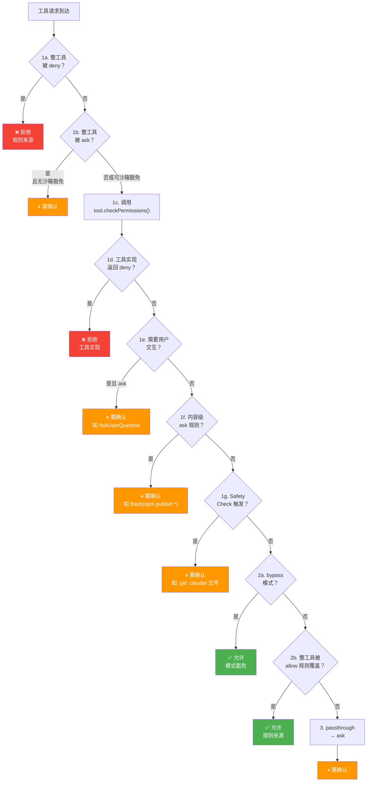
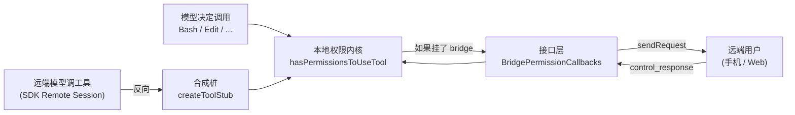
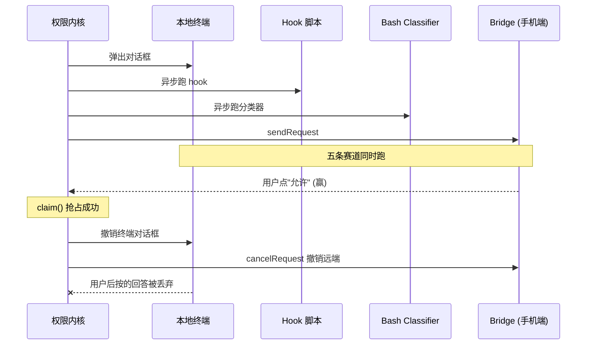

# 第 16 篇：权限系统 — AI 安全的最后一道防线

> 本篇是《深入 Claude Code 源码》系列第 16 篇。我们将深入权限系统的完整架构：从权限模式、规则体系、决策管线到 AI Classifier 辅助判断，揭示一个生产级 AI Agent 如何在"自动化"与"安全"之间找到平衡。

## 为什么权限系统是 AI 产品中最关键的模块？

传统 CLI 工具的权限模型很简单——用户敲什么命令就执行什么命令，责任完全在用户。但 AI Agent 改变了这个范式：**模型自主决定执行什么操作**。用户说"帮我重构这个项目"，模型可能决定删除文件、执行 shell 命令、修改配置——这些操作的风险程度天差地别。

这意味着，AI 产品的权限系统面临独特的挑战：

1. **操作不可预测**：用户无法提前知道模型会调用哪些工具、传入什么参数
2. **风险谱系宽广**：从读取文件（无害）到 `rm -rf /`（灾难性），所有操作都通过同一个工具接口
3. **效率与安全的矛盾**：每次都弹确认对话框会让用户抓狂，但完全自动化又有安全风险

Claude Code 的权限系统用 **多层防线 + 渐进式信任** 的方式解决了这个矛盾。本篇将从三个层面解析：

1. **权限模式（Permission Mode）**：用户的全局信任级别
2. **规则系统（Permission Rules）**：细粒度的 allow/deny/ask 规则
3. **决策管线（Permission Pipeline）**：`hasPermissionsToUseTool()` 的完整判定流程

---

## 一、权限模式：用户的全局信任级别

### 1.1 七种权限模式

Claude Code 定义了七种权限模式，代表用户对 AI 操作的不同信任程度：

```typescript
// types/permissions.ts:16-22
export const EXTERNAL_PERMISSION_MODES = [
  'acceptEdits',
  'bypassPermissions',
  'default',
  'dontAsk',
  'plan',
] as const

// types/permissions.ts:28-29
export type InternalPermissionMode = ExternalPermissionMode | 'auto' | 'bubble'
export type PermissionMode = InternalPermissionMode
```

每种模式的语义如下：

| 模式 | 信任级别 | 行为 |
|------|---------|------|
| `default` | 最低 | 每个非只读操作都需要用户确认 |
| `plan` | 只读 | 只能读取和搜索，写入操作需要确认 |
| `acceptEdits` | 中等 | 工作目录内的文件编辑自动允许，其他操作仍需确认 |
| `bypassPermissions` | 高 | 跳过大部分权限检查（但 safety check 仍然生效） |
| `dontAsk` | 特殊 | 不弹出确认对话框，需要确认的操作自动拒绝 |
| `auto` | 内部 | 用 AI Classifier 自动判断操作安全性（仅限 Anthropic 内部） |
| `bubble` | 内部 | 类型系统中定义但不在用户可达的运行时模式集合中 |

注意 `auto` 模式是通过 `feature('TRANSCRIPT_CLASSIFIER')` 编译期门控的——外部构建中这个模式的代码会被 DCE 完全移除：

```typescript
// types/permissions.ts:33-36
export const INTERNAL_PERMISSION_MODES = [
  ...EXTERNAL_PERMISSION_MODES,
  ...(feature('TRANSCRIPT_CLASSIFIER') ? (['auto'] as const) : ([] as const)),
] as const satisfies readonly PermissionMode[]
```

### 1.2 模式切换：Shift+Tab 循环

用户可以通过 Shift+Tab 在模式之间循环切换。切换顺序不是简单的线性，而是根据**用户类型和可用性**动态决定的：

```typescript
// utils/permissions/getNextPermissionMode.ts:34-78
export function getNextPermissionMode(
  toolPermissionContext: ToolPermissionContext,
): PermissionMode {
  switch (toolPermissionContext.mode) {
    case 'default':
      // 内部用户跳过 acceptEdits 和 plan — auto 模式替代了它们
      if (process.env.USER_TYPE === 'ant') {
        if (toolPermissionContext.isBypassPermissionsModeAvailable) {
          return 'bypassPermissions'
        }
        if (canCycleToAuto(toolPermissionContext)) {
          return 'auto'
        }
        return 'default'
      }
      return 'acceptEdits'

    case 'acceptEdits':
      return 'plan'

    case 'plan':
      if (toolPermissionContext.isBypassPermissionsModeAvailable) {
        return 'bypassPermissions'
      }
      // ...
      return 'default'

    // ...
  }
}
```

外部用户的典型切换路径是：`default → acceptEdits → plan → default`（或加上 `bypassPermissions`）。内部用户则简化为 `default → bypassPermissions → auto → default`。

---

## 二、规则系统：细粒度的 allow/deny/ask

权限模式是"粗粒度"的全局控制，而规则系统提供了**针对具体工具和操作的细粒度控制**。

### 2.1 规则的数据结构

每条权限规则由三个部分组成：

```typescript
// types/permissions.ts:75-79
export type PermissionRule = {
  source: PermissionRuleSource       // 规则来自哪里
  ruleBehavior: PermissionBehavior   // allow | deny | ask
  ruleValue: PermissionRuleValue     // 匹配哪个工具/操作
}

// types/permissions.ts:67-70
export type PermissionRuleValue = {
  toolName: string       // 工具名称，如 "Bash", "FileEdit", "mcp__server1"
  ruleContent?: string   // 可选的内容匹配，如 "npm install", "python:*"
}
```

规则的来源（source）有 8 种。需要注意的是，`PERMISSION_RULE_SOURCES` 定义的顺序是**搜索/遍历顺序**，而不是严格的"高优先级覆盖低优先级"的语义——`getAllowRules()` / `getDenyRules()` 等函数遍历所有来源后 flatMap 成一个数组，查找时返回**第一个匹配**的规则：

```typescript
// permissions.ts:109-114
const PERMISSION_RULE_SOURCES = [
  ...SETTING_SOURCES,  // userSettings, projectSettings, localSettings,
                       // flagSettings, policySettings（后覆盖前）
  'cliArg',            // 命令行参数 --allowedTools
  'command',           // 斜杠命令设置
  'session',           // 当前会话中用户的临时授权
] as const satisfies readonly PermissionRuleSource[]
```

其中 `SETTING_SOURCES` 本身的合并语义是"后覆盖前"（`utils/settings/constants.ts:6` 注释明确写了 "later sources override earlier ones"），即 `policySettings` > `flagSettings` > `localSettings` > `projectSettings` > `userSettings`。但权限规则的实际匹配是**所有来源的规则 flatMap 后按序扫描**，第一个匹配就返回——这与 settings 的覆盖语义有微妙区别。

### 2.2 规则的存储格式

规则存储在 settings.json 文件中，格式是 `ToolName(ruleContent)`：

```json
{
  "permissions": {
    "allow": [
      "Bash(npm install:*)",
      "Bash(git status)",
      "FileEdit",
      "mcp__server1"
    ],
    "deny": [
      "Bash(rm -rf:*)",
      "Bash(curl:*)"
    ],
    "ask": [
      "Bash(npm publish:*)"
    ]
  }
}
```

规则解析由 `permissionRuleValueFromString()` 处理，支持转义括号：

```typescript
// utils/permissions/permissionRuleParser.ts:93-133
export function permissionRuleValueFromString(
  ruleString: string,
): PermissionRuleValue {
  const openParenIndex = findFirstUnescapedChar(ruleString, '(')
  if (openParenIndex === -1) {
    return { toolName: normalizeLegacyToolName(ruleString) }
  }
  // ... 解析 "Bash(npm install)" => { toolName: 'Bash', ruleContent: 'npm install' }
  const toolName = ruleString.substring(0, openParenIndex)
  const rawContent = ruleString.substring(openParenIndex + 1, closeParenIndex)
  const ruleContent = unescapeRuleContent(rawContent)
  return { toolName: normalizeLegacyToolName(toolName), ruleContent }
}
```

注意 `normalizeLegacyToolName()` 会将旧工具名映射到新名——比如 `Task` → `Agent`，`KillShell` → `TaskStop`，确保旧配置不会失效。还有一个容易忽略的细节：`Bash()` 和 `Bash(*)` 在解析时都会被归约为 `{ toolName: 'Bash' }`（没有 `ruleContent`），即"整工具级别"的规则，与 `Bash` 等价（`permissionRuleParser.ts:124-127`）。

### 2.3 多源规则加载与企业管控

规则从多个配置源加载，但企业管理员可以通过 `allowManagedPermissionRulesOnly` 限制磁盘加载阶段仅使用受管规则。不过需要注意，这个限制作用于 `loadAllPermissionRulesFromDisk()`——初始化时通过 CLI `--allowedTools` / `--disallowedTools` 传入的规则仍然会被写入 context 的 `cliArg` source，后续由 `syncPermissionRulesFromDisk()` 在设置变更时清理非 policy 来源：

```typescript
// utils/permissions/permissionsLoader.ts:120-133
export function loadAllPermissionRulesFromDisk(): PermissionRule[] {
  // 企业管控模式：只使用 policySettings 中的规则
  if (shouldAllowManagedPermissionRulesOnly()) {
    return getPermissionRulesForSource('policySettings')
  }

  // 普通模式：从所有启用的源加载
  const rules: PermissionRule[] = []
  for (const source of getEnabledSettingSources()) {
    rules.push(...getPermissionRulesForSource(source))
  }
  return rules
}
```

### 2.4 Shell 命令的三种匹配模式

Bash 工具的权限规则支持三种匹配方式，由 `parsePermissionRule()` 解析：

```typescript
// utils/permissions/shellRuleMatching.ts:25-37
export type ShellPermissionRule =
  | { type: 'exact'; command: string }      // 精确匹配: "git status"
  | { type: 'prefix'; prefix: string }      // 前缀匹配: "npm:*"（传统语法）
  | { type: 'wildcard'; pattern: string }   // 通配符匹配: "git *"
```

通配符匹配通过 `matchWildcardPattern()` 实现，它将 `*` 转换为正则表达式的 `.*`，支持 `\*` 转义字面星号：

```typescript
// utils/permissions/shellRuleMatching.ts:90-154
export function matchWildcardPattern(
  pattern: string, command: string, caseInsensitive = false,
): boolean {
  // 1. 处理 \* 和 \\ 转义序列
  // 2. 转义正则特殊字符
  // 3. 将 * 转换为 .*
  // 特殊优化：当模式以 ' *' 结尾且只有一个通配符时，
  // 使 trailing space-and-args 可选，让 'git *' 同时匹配 'git add' 和 'git'
  const unescapedStarCount = (processed.match(/\*/g) || []).length
  if (regexPattern.endsWith(' .*') && unescapedStarCount === 1) {
    regexPattern = regexPattern.slice(0, -3) + '( .*)?'
  }
  const regex = new RegExp(`^${regexPattern}$`, flags)
  return regex.test(command)
}
```

---

## 三、决策管线：hasPermissionsToUseTool() 的完整流程

这是权限系统的核心——每次模型请求使用工具时，都会经过 `hasPermissionsToUseTool()` 函数的完整判定管线。这个管线分为**内层决策**（`hasPermissionsToUseToolInner`）和**外层包装**两部分。

### 3.1 决策结果类型

管线返回三种可能的决策：

```typescript
// types/permissions.ts:241-246
export type PermissionDecision =
  | PermissionAllowDecision   // behavior: 'allow' — 允许执行
  | PermissionAskDecision     // behavior: 'ask'   — 需要用户确认
  | PermissionDenyDecision    // behavior: 'deny'  — 直接拒绝
```

此外，工具内部的 `checkPermissions()` 还可以返回 `passthrough`——表示"我没有意见，交给通用权限系统决定"：

```typescript
// types/permissions.ts:251-266
export type PermissionResult =
  | PermissionDecision
  | {
      behavior: 'passthrough'
      message: string
      // ...
    }
```

### 3.2 内层决策管线（7 步）

`hasPermissionsToUseToolInner()` 是权限检查的核心，按照严格的优先级顺序执行：



对应的代码（`permissions.ts:1158-1319`）：

```typescript
async function hasPermissionsToUseToolInner(
  tool, input, context,
): Promise<PermissionDecision> {
  let appState = context.getAppState()

  // === 阶段 1：规则检查（deny > ask > 工具内部 > safety）===

  // 1a. 整工具被 deny 规则封禁
  const denyRule = getDenyRuleForTool(appState.toolPermissionContext, tool)
  if (denyRule) {
    return { behavior: 'deny', /* ... */ }
  }

  // 1b. 整工具被 ask 规则标记
  const askRule = getAskRuleForTool(appState.toolPermissionContext, tool)
  if (askRule) {
    // 特殊处理：沙箱模式下的 Bash 可以跳过
    const canSandboxAutoAllow = tool.name === BASH_TOOL_NAME
      && SandboxManager.isSandboxingEnabled()
      && SandboxManager.isAutoAllowBashIfSandboxedEnabled()
      && shouldUseSandbox(input)
    if (!canSandboxAutoAllow) {
      return { behavior: 'ask', /* ... */ }
    }
  }

  // 1c. 委托工具实现检查（每个工具可以有自己的权限逻辑）
  let toolPermissionResult: PermissionResult = { behavior: 'passthrough', /* ... */ }
  try {
    const parsedInput = tool.inputSchema.parse(input)
    toolPermissionResult = await tool.checkPermissions(parsedInput, context)
  } catch (e) { /* ... */ }

  // 1d. 工具实现返回 deny
  if (toolPermissionResult?.behavior === 'deny') return toolPermissionResult

  // 1e. 工具需要用户交互（即使 bypass 模式也不跳过）
  if (tool.requiresUserInteraction?.() && toolPermissionResult?.behavior === 'ask') {
    return toolPermissionResult
  }

  // 1f. 内容级 ask 规则（如 Bash(npm publish:*)），bypass 模式也不跳过
  if (toolPermissionResult?.behavior === 'ask'
    && toolPermissionResult.decisionReason?.type === 'rule'
    && toolPermissionResult.decisionReason.rule.ruleBehavior === 'ask') {
    return toolPermissionResult
  }

  // 1g. Safety check — 写入 .git/、.claude/、.vscode/ 等危险路径
  // bypass 模式不跳过此步骤
  if (toolPermissionResult?.behavior === 'ask'
    && toolPermissionResult.decisionReason?.type === 'safetyCheck') {
    return toolPermissionResult
  }

  // === 阶段 2：模式检查 ===

  // 2a. bypassPermissions 模式 — 跳过剩余检查
  appState = context.getAppState()  // 重新获取最新状态！
  const shouldBypassPermissions =
    appState.toolPermissionContext.mode === 'bypassPermissions'
    || (appState.toolPermissionContext.mode === 'plan'
      && appState.toolPermissionContext.isBypassPermissionsModeAvailable)
  if (shouldBypassPermissions) {
    return { behavior: 'allow', /* ... */ }
  }

  // 2b. 整工具被 allow 规则覆盖
  const alwaysAllowedRule = toolAlwaysAllowedRule(appState.toolPermissionContext, tool)
  if (alwaysAllowedRule) {
    return { behavior: 'allow', /* ... */ }
  }

  // === 阶段 3：默认 → ask ===
  // passthrough 转换为 ask，让用户决定
  return toolPermissionResult.behavior === 'passthrough'
    ? { ...toolPermissionResult, behavior: 'ask' }
    : toolPermissionResult
}
```

**关键设计决策**：注意步骤 1f 和 1g 在步骤 2a（bypass 检查）**之前**。这意味着：

- 用户显式配置的 `ask` 规则，**即使在 bypass 模式下也会触发确认**
- Safety check（保护 `.git/`、`.claude/` 等危险路径），**在 bypass 模式下也不会被跳过**

但 safety check 并非铁墙一块——在 **auto 模式**中，safety check 结果会根据其 `classifierApprovable` 属性区分处理（`permissions.ts:526-548`）：标记为 `classifierApprovable: true` 的 safety check（如 `.claude/`、`.git/` 下的敏感文件路径）会继续进入 Classifier 流程，由 Classifier 看到完整上下文后判断是否安全放行；而 `classifierApprovable: false` 的（如 Windows 路径绕过尝试）则即使在 auto 模式下也必须走人工确认。

此外，文件写入工具的 `checkWritePermissionForTool()` 中，session 级别的 `.claude/**` allow 规则可以在 safety check **之前**生效（`filesystem.ts:1252-1300`），允许用户在当前会话中临时授权 Claude 编辑自身配置——但该豁免被严格限定为 session source、必须匹配 `.claude/` 前缀、且禁止 `..` 路径穿越。

这是一个"防御纵深"的设计——bypass 模式跳过的是通用的"未配置规则时的默认 ask"，而不是用户刻意设置的安全屏障。但"纵深"不意味着"绝对不可穿透"，而是在每层设置了精确的豁免条件。

### 3.3 外层包装：模式级变换

`hasPermissionsToUseTool()` 是外层包装，对内层返回的 `ask` 决策进行模式级变换：

```typescript
// permissions.ts:473-956（简化版）
export const hasPermissionsToUseTool = async (tool, input, context, ...) => {
  const result = await hasPermissionsToUseToolInner(tool, input, context)

  // allow 时重置连续拒绝计数
  if (result.behavior === 'allow') { /* ... */ return result }

  // 对 ask 结果进行模式变换
  if (result.behavior === 'ask') {
    const mode = appState.toolPermissionContext.mode

    // dontAsk 模式：ask → deny（不弹对话框，直接拒绝）
    if (mode === 'dontAsk') {
      return { behavior: 'deny', message: DONT_ASK_REJECT_MESSAGE(tool.name) }
    }

    // auto 模式：ask → 调用 AI Classifier 判断
    if (mode === 'auto') {
      // ... 详见下一节
    }

    // headless/后台 agent：ask → 先尝试 Hook，否则 deny
    if (appState.toolPermissionContext.shouldAvoidPermissionPrompts) {
      const hookDecision = await runPermissionRequestHooksForHeadlessAgent(...)
      if (hookDecision) return hookDecision
      return { behavior: 'deny', message: AUTO_REJECT_MESSAGE(tool.name) }
    }
  }

  return result
}
```

---

## 四、Auto Mode：AI Classifier 辅助安全判断

Auto 模式是权限系统中最有技术含量的部分——它用一个**独立的 AI 模型**来判断主模型请求的操作是否安全。

### 4.1 三层快速通道（避免不必要的 Classifier 调用）

Classifier API 调用是昂贵的，因此在调用它之前，系统会先检查三个快速通道：

```typescript
// permissions.ts:600-686（简化版）

// 快速通道 1：acceptEdits 模拟
// 如果操作在 acceptEdits 模式下会被允许（如工作目录内的文件编辑），直接放行
if (tool.name !== AGENT_TOOL_NAME && tool.name !== REPL_TOOL_NAME) {
  const acceptEditsResult = await tool.checkPermissions(parsedInput, {
    ...context,
    getAppState: () => ({
      ...state,
      toolPermissionContext: { ...state.toolPermissionContext, mode: 'acceptEdits' },
    }),
  })
  if (acceptEditsResult.behavior === 'allow') {
    // 直接放行，不调用 Classifier
    return { behavior: 'allow', decisionReason: { type: 'mode', mode: 'auto' } }
  }
}

// 快速通道 2：安全工具白名单
if (classifierDecisionModule.isAutoModeAllowlistedTool(tool.name)) {
  return { behavior: 'allow', /* ... */ }
}

// 快速通道 3：不符合快速通道 → 调用 Classifier
const classifierResult = await classifyYoloAction(context.messages, action, ...)
```

安全工具白名单定义在 `classifierDecision.ts` 中：

```typescript
// utils/permissions/classifierDecision.ts:56-80
const SAFE_YOLO_ALLOWLISTED_TOOLS = new Set([
  FILE_READ_TOOL_NAME,      // 读文件——只读操作
  GREP_TOOL_NAME,           // 搜索——只读
  GLOB_TOOL_NAME,           // 文件查找——只读
  TODO_WRITE_TOOL_NAME,     // TODO 管理——元数据
  TASK_CREATE_TOOL_NAME,    // 任务创建——元数据
  ASK_USER_QUESTION_TOOL_NAME,  // 问用户问题——UI 交互
  ENTER_PLAN_MODE_TOOL_NAME,    // 进入 Plan 模式——模式切换
  // ...
])
```

### 4.2 Denial Tracking：连续拒绝熔断

当 Classifier 连续多次拒绝操作时，系统的处理方式取决于运行环境（`permissions.ts:984-1058`）：

- **交互式 CLI**：回退到让用户手动审批（弹出确认对话框），而不是无限循环拒绝
- **Headless 模式**（后台 Agent、远程调用）：直接抛出 `AbortError` 中止整个 Agent——因为没有用户可以审批，继续重试只是浪费 token

```typescript
// utils/permissions/denialTracking.ts:1-45
export type DenialTrackingState = {
  consecutiveDenials: number
  totalDenials: number
}

export const DENIAL_LIMITS = {
  maxConsecutive: 3,    // 连续拒绝 3 次 → 回退到用户确认（CLI）或 abort（headless）
  maxTotal: 20,         // 总拒绝 20 次 → 回退到用户确认（CLI）或 abort（headless）
} as const

export function shouldFallbackToPrompting(state: DenialTrackingState): boolean {
  return (
    state.consecutiveDenials >= DENIAL_LIMITS.maxConsecutive ||
    state.totalDenials >= DENIAL_LIMITS.maxTotal
  )
}
```

每次 Classifier 允许操作时，连续拒绝计数会被重置：

```typescript
export function recordSuccess(state: DenialTrackingState): DenialTrackingState {
  if (state.consecutiveDenials === 0) return state  // 无变化时返回同一引用（优化）
  return { ...state, consecutiveDenials: 0 }
}
```

### 4.3 Classifier 不可用时的 Fail-Closed 策略

当 Classifier API 调用失败时，系统通过 GrowthBook Feature Flag 控制是"fail closed"（拒绝）还是"fail open"（回退到用户确认）：

```typescript
// permissions.ts:845-876
if (classifierResult.unavailable) {
  if (getFeatureValue_CACHED_WITH_REFRESH(
    'tengu_iron_gate_closed', true, 30 * 60 * 1000,
  )) {
    // Fail closed：拒绝操作
    return { behavior: 'deny', message: buildClassifierUnavailableMessage(...) }
  }
  // Fail open：回退到正常权限处理（让用户确认）
  return result
}
```

---

## 五、文件系统路径验证：多维安全检查

文件操作是 AI Agent 最常见的操作类型，路径验证是权限系统中最复杂的部分之一。

### 5.1 isPathAllowed() 的五步验证

```typescript
// utils/permissions/pathValidation.ts:141-263（简化版）
export function isPathAllowed(
  resolvedPath, context, operationType, precomputedPathsToCheck?,
): PathCheckResult {
  // 1. Deny 规则优先（最高优先级）
  const denyRule = matchingRuleForInput(resolvedPath, context, permissionType, 'deny')
  if (denyRule) return { allowed: false, decisionReason: { type: 'rule', rule: denyRule } }

  // 2. 内部可编辑路径（plan 文件、scratchpad、agent memory）
  if (operationType !== 'read') {
    const internalEditResult = checkEditableInternalPath(resolvedPath, {})
    if (internalEditResult.behavior === 'allow') return { allowed: true, /* ... */ }
  }

  // 2.5. 写操作安全检查（Windows 路径、Claude 配置文件、危险文件）
  if (operationType !== 'read') {
    const safetyCheck = checkPathSafetyForAutoEdit(resolvedPath, ...)
    if (!safetyCheck.safe) return { allowed: false, /* ... */ }
  }

  // 3. 工作目录检查
  if (pathInAllowedWorkingPath(resolvedPath, context, ...)) {
    if (operationType === 'read' || context.mode === 'acceptEdits') {
      return { allowed: true }
    }
  }

  // 3.7. 沙箱写白名单（工作目录外的额外允许写入目录）
  if (operationType !== 'read' && !isInWorkingDir
    && isPathInSandboxWriteAllowlist(resolvedPath)) {
    return { allowed: true, /* ... */ }
  }

  // 4. Allow 规则
  const allowRule = matchingRuleForInput(resolvedPath, context, permissionType, 'allow')
  if (allowRule) return { allowed: true, /* ... */ }

  // 5. 默认拒绝
  return { allowed: false }
}
```

### 5.2 路径安全验证：防止 TOCTOU 攻击

`validatePath()` 在路径验证前会做多项安全检查，**防止 shell 展开与验证之间的 TOCTOU 漏洞**：

```typescript
// utils/permissions/pathValidation.ts:373-463
export function validatePath(path, cwd, toolPermissionContext, operationType) {
  const cleanPath = expandTilde(path.replace(/^['"]|['"]$/g, ''))

  // SECURITY: 阻止 UNC 路径（可能泄漏凭证）
  if (containsVulnerableUncPath(cleanPath)) {
    return { allowed: false, reason: 'UNC network paths require manual approval' }
  }

  // SECURITY: 拒绝 ~user、~+、~- 等 tilde 变体
  // expandTilde 只处理 ~ 和 ~/，其他变体会导致验证与 shell 执行路径不一致
  if (cleanPath.startsWith('~')) {
    return { allowed: false, reason: 'Tilde expansion variants require manual approval' }
  }

  // SECURITY: 拒绝包含 shell 展开语法的路径
  // $VAR, ${VAR}, $(cmd), %VAR% 在验证时是字面量，但 shell 执行时会展开
  if (cleanPath.includes('$') || cleanPath.includes('%') || cleanPath.startsWith('=')) {
    return { allowed: false, reason: 'Shell expansion syntax requires manual approval' }
  }

  // SECURITY: 写操作不允许 glob 模式
  // 写工具使用字面路径，但验证只检查 glob 的基目录 → 可能绕过检查
  if (GLOB_PATTERN_REGEX.test(cleanPath) && (operationType === 'write' || 'create')) {
    return { allowed: false, reason: 'Glob patterns are not allowed in write operations' }
  }
  // ...
}
```

### 5.3 危险删除路径检测

`isDangerousRemovalPath()` 防止删除根目录、家目录、系统目录等灾难性路径：

```typescript
// utils/permissions/pathValidation.ts:331-367
export function isDangerousRemovalPath(resolvedPath: string): boolean {
  // 通配符删除: *, /path/*
  if (forwardSlashed === '*' || forwardSlashed.endsWith('/*')) return true
  // 根目录
  if (normalizedPath === '/') return true
  // Windows 驱动器根: C:\, D:\
  if (WINDOWS_DRIVE_ROOT_REGEX.test(normalizedPath)) return true
  // 家目录
  if (normalizedPath === normalizedHome) return true
  // 根目录的直接子节点: /usr, /tmp, /etc
  if (dirname(normalizedPath) === '/') return true
  // Windows 驱动器直接子节点: C:\Windows, C:\Users
  if (WINDOWS_DRIVE_CHILD_REGEX.test(normalizedPath)) return true
  return false
}
```

---

## 六、危险权限检测：Auto Mode 入口的安全门卫

当用户切换到 Auto 模式时，系统会**自动剥离危险的 allow 规则**（`stripDangerousPermissionsForAutoMode()`，`permissionSetup.ts:510-555`）。这是因为 Auto 模式依赖 Classifier 来判断安全性——如果存在绕过 Classifier 的 allow 规则，模型就能不经审查地执行危险操作。

危险权限检测覆盖三类工具（`isDangerousClassifierPermission()`，`permissionSetup.ts:272-285`）：

1. **Bash**：`isDangerousBashPermission()` — 检测脚本解释器、package runner、shell 等
2. **PowerShell**：`isDangerousPowerShellPermission()` — 额外检测 `iex`、`Invoke-Command`、`Start-Process`、`Add-Type` 等 PS 特有的代码执行入口
3. **Agent/Task**：`isDangerousTaskPermission()` — **任何** Agent allow 规则都被视为危险，因为子 Agent 可以绕过 Classifier 执行委托攻击（delegation attack）

以 Bash 为例：

```typescript
// utils/permissions/permissionSetup.ts:94-147
export function isDangerousBashPermission(
  toolName: string, ruleContent: string | undefined,
): boolean {
  if (toolName !== BASH_TOOL_NAME) return false

  // 工具级 allow（无内容）= 允许所有命令 → 危险！
  if (ruleContent === undefined || ruleContent === '' || ruleContent === '*') {
    return true
  }

  // 检查危险模式：python:*, node:*, bash:*, ssh:*, sudo:* 等
  for (const pattern of DANGEROUS_BASH_PATTERNS) {
    if (content === lowerPattern) return true       // 精确匹配
    if (content === `${lowerPattern}:*`) return true // 前缀语法
    if (content === `${lowerPattern}*`) return true  // 通配符
    if (content === `${lowerPattern} *`) return true // 空格通配
    if (content.startsWith(`${lowerPattern} -`) && content.endsWith('*')) return true
  }
  return false
}
```

被剥离的规则会暂存在 `strippedDangerousRules` 中，退出 Auto 模式时通过 `restoreDangerousPermissions()` 恢复——用户在 default 模式下的 `Bash(python:*)` 规则不会永久丢失。

危险模式列表包括了所有能执行任意代码的入口：

```typescript
// utils/permissions/dangerousPatterns.ts:18-42
export const CROSS_PLATFORM_CODE_EXEC = [
  'python', 'python3', 'python2',   // 脚本解释器
  'node', 'deno', 'tsx',
  'ruby', 'perl', 'php', 'lua',
  'npx', 'bunx',                     // 包运行器
  'npm run', 'yarn run', 'pnpm run', 'bun run',
  'bash', 'sh',                      // Shell
  'ssh',                             // 远程执行
] as const

export const DANGEROUS_BASH_PATTERNS: readonly string[] = [
  ...CROSS_PLATFORM_CODE_EXEC,
  'zsh', 'fish', 'eval', 'exec',
  'env', 'xargs', 'sudo',
  // 内部用户还包括：gh, curl, wget, git, kubectl, aws, gcloud 等
]
```

---

## 七、Headless Agent 的权限处理

后台运行的 Agent（如 fork 出来的子 Agent、远程调用的 Agent）没有 UI 界面，无法弹出确认对话框。权限系统为这种场景提供了专门的处理路径：

```typescript
// permissions.ts:400-471
async function runPermissionRequestHooksForHeadlessAgent(
  tool, input, toolUseID, context, ...
): Promise<PermissionDecision | null> {
  // 尝试通过 PermissionRequest Hook 获取决策
  for await (const hookResult of executePermissionRequestHooks(
    tool.name, toolUseID, input, context, ...
  )) {
    if (hookResult.permissionRequestResult?.behavior === 'allow') {
      // Hook 允许 → 放行（并持久化权限更新）
      return { behavior: 'allow', /* ... */ }
    }
    if (hookResult.permissionRequestResult?.behavior === 'deny') {
      // Hook 拒绝 → 如果设置了 interrupt，还会中断整个 Agent
      if (decision.interrupt) {
        context.abortController.abort()
      }
      return { behavior: 'deny', /* ... */ }
    }
  }
  // 没有 Hook 提供决策 → 返回 null，调用者自动拒绝
  return null
}
```

这个设计让企业用户可以通过 Hook 脚本实现自定义的权限策略——比如调用内部审批系统、发送 Slack 通知等。

---

## 八、可迁移的设计模式

### 模式 1：防御纵深（Defense in Depth）

权限检查不是单层的"允许/拒绝"，而是多层串联的管线。每层有自己的职责：deny 规则 → 工具内部检查 → safety check → 模式检查 → allow 规则。**关键是某些层（safety check、content-specific ask）在高信任模式下仍然生效，但也留有精确的豁免条件**——比如 auto 模式下 `classifierApprovable` 的 safety check 会交给 Classifier 评估，而非一刀切拒绝。

**适用场景**：任何需要安全控制的系统。将"高风险安全规则"与"可配置的信任级别"分离，但给每层的"不可跳过"规则设计精确的豁免接口，避免过于僵化导致无法工作。

### 模式 2：渐进式信任 + 快速通道

Auto 模式不是对每个操作都调用昂贵的 Classifier API，而是先通过三层快速通道（acceptEdits 模拟 → 安全工具白名单 → 最后才调 Classifier）过滤掉大部分安全的操作。这让 Classifier 只处理真正需要判断的边缘情况。

**适用场景**：任何使用 AI 做安全判断的系统。将判断成本与风险级别对齐——低风险操作用规则快速放行，高风险操作才动用昂贵的推理资源。

### 模式 3：Denial Tracking 与熔断

连续拒绝 3 次或总拒绝 20 次后触发熔断：交互式场景回退到用户确认，headless 场景直接 abort。这避免了 Agent 陷入"尝试-被拒绝-重试"的无效循环。这是一个简单但有效的**熔断器模式**——当自动化系统持续失败时，根据运行环境选择合适的降级策略。

**适用场景**：任何 AI Agent 的自动决策系统。当自动判断连续失败时，不应该无限重试——有人在时降级到人工干预，无人在时果断中止。

---

## 九、远程权限回灌：手机和 Web 怎么批准本地工具

前面八节都默认"问"和"答"发生在同一台电脑上：模型想跑工具，本地 CLI 弹个对话框，用户在终端按 yes/no。新版多了一个更有意思的场景——你在咖啡店掏出手机，claude.ai 推来一条通知："是否允许在你笔记本上执行 `rm node_modules`？"你点一下允许，几秒之后家里那台电脑上的工具就真的跑起来了。

把这条链路想象成一个对讲机：本地 CLI 想问问题，远程那头的人有权回答。能架起这部对讲机，靠的是新增的三个落点，本节就来逐个拆开。

### 9.1 三个新落点：接口层、本地协调层、回灌入口

整条回灌链路的角色分工，可以用一张图先看个全貌：



三个落点对应的源码很短，可以这样理解它们的角色：

第一处是**接口层**，落在 `bridge/bridgePermissionCallbacks.ts:1-43`。这个文件只有 43 行，给"对讲机"画了一份最小的协议：怎么把问题发出去、怎么收回答、怎么取消提问。值得一提的是它没有用裸 `as` 把消息强转成业务类型，而是写了一个类型守卫专门校验回包合不合法——跨进程消息一旦相信"对面会发对的"，运行时就会无声无息出 bug，这份小心是必要的。

第二处是**本地协调层**，落在 `hooks/useReplBridge.tsx:369-585`。它负责"在本地这边坐镇"：每个发出去的问题分一个 `requestId`，远端回包了再按 id 找回原来等着的那段代码。它做完之后会把对讲机的引用挂到全局状态里，权限内核需要时直接取。

第三处是**反向回灌入口**，落在 `remote/remotePermissionBridge.ts:1-78`。前两个文件解决的是"本地工具想问远端用户"；这个文件解决的是反过来的麻烦：远端模型在云端调了一个工具，但本地 CLI 必须帮它弹出确认对话框——而本地此刻既不知道这工具长什么样，也没有完整的对话上下文。它的解法是"现场捏一个最小可信对象"塞给本地确认队列，§9.5 会展开。

### 9.2 入口分流：注入与开关

桥能不能起作用，关键就一行代码——`hooks/useCanUseTool.tsx:165`：

```typescript
bridgeCallbacks: feature("BRIDGE_MODE") ? appState.replBridgePermissionCallbacks : undefined,
```

这里有两个意图。一是**有条件注入**：只有当应用层确实搭好了对讲机，权限内核才能拿到非空的 `bridgeCallbacks`。二是**编译期门控**：`feature("BRIDGE_MODE")` 是个常量，对外构建里这一支会被打包工具整段裁掉，连同 `replBridgePermissionCallbacks` 字段一起从代码里彻底消失——外部用户的权限对话框完全跑在本地，远程协议表面是零。这跟第一节讲的 `auto` 模式同样靠 feature flag 编译期门控，思路一致：可选能力不存在比"运行时判空"更安全。

### 9.3 多路竞速：谁先回答谁算

到这里就要回答全章最有意思的一个问题：**同一个权限请求，可能同时有五条路径试图给出答复**——本地终端用户、手机端用户、第三方 channel（Telegram / iMessage / Discord）里的用户、PermissionRequest hook 脚本，以及 Bash classifier。谁先回包就以谁为准，其它的当场作废。

但"先回包就算"这事并不像听起来那么简单。先看一个错误写法：

```typescript
if (!isResolved()) {
  await doSomething()   // ← 危险：这段窗口里，别人可能先 resolve 了
  resolve(answer)
}
```

`isResolved()` 检查和 `resolve()` 写入之间的 `await`，给了别的赛道一个完整的"插队窗口"。两条路径同时跑到 `resolve()`，最后写谁的答案完全看运气。

`PermissionContext.ts:75-94` 用一个叫 `claim()` 的小函数把这扇门关上。它做的是一次**原子的 check-and-mark**：

```typescript
// 简化语义示意：claim 是个原子的"先检查后置位"
let claimed = false
function claim(): boolean {
  if (claimed) return false
  claimed = true
  return true
}
```

规矩是：任何一条赛道在调 `resolve()` 之前必须先 `claim()`；赢的一方继续走，输的一方直接 return。注释也写得很硬：

> Use this in async callbacks BEFORE awaiting, to close the window
> between the `isResolved()` check and the actual `resolve()` call.

加入桥之后，一次典型权限请求的时序大致是：



注意图里两条"撤销"线很重要。任何一条赛道赢下之后，必须主动通知**所有还在等待的赛道**："别问了，已经有答案了。" 否则远端用户那边会留下一个孤儿提示框，本地工具明明已经跑完，他还在那盯着是否允许——这是最让用户困惑的"幽灵提示"问题。`interactiveHandler.ts:92-298` 把这条规矩落到代码里：六条赢家路径（本地三个回调、async hook、async classifier、recheckPermission），每一条都显式做了一次撤销。

### 9.4 一个反直觉的小动作：recheckPermission 也要 claim

有一种情况乍看不需要抢占：用户还在盯着对话框时，外部状态变了——比如手机端把权限模式从 `default` 切到了 `acceptEdits`，本来需要确认的操作现在应该自动允许。`useReplBridge` 会主动调一个叫 `recheckPermission` 的回调，让权限内核重新跑一遍 `hasPermissionsToUseTool()`，看看现在算不算自动通过。

直觉上这应该是个安全的"补刀"动作。但代码偏偏要在最后一步再 `claim()` 一次：

```typescript
// interactiveHandler.ts:204-231（节选示意）
async recheckPermission() {
  if (isResolved()) return
  const fresh = await hasPermissionsToUseTool(/* ... */)
  if (fresh.behavior === 'allow') {
    if (!claim()) return       // ← 关键：await 之后再抢一次
    bridgeCallbacks?.cancelRequest(bridgeRequestId)
    resolveOnce(ctx.buildAllow(/* ... */))
  }
}
```

为什么？因为 `hasPermissionsToUseTool()` 是 `await` 的，本地这边等结果的同时，手机端用户完全可能直接点了"允许"，远端的回包甚至已经先到了。如果不重新 `claim`，本地这边一句 `resolveOnce` 拍下去，本地和远端就各自认定"我赢了"，对一条权限请求做出两次互斥的决定。

把这个细节抽象成一条**远程权限回灌的一致性规则**：

> 任何在网络往返中间引入 `await` 的本地决策，最后一步都必须重新原子 `claim` 一次。

### 9.5 反向回灌：远端工具调用怎么变成本地对话框

§9.3 讲的是"本地工具想问远端用户"，本节反过来：远端的模型在云端调了一个工具，希望让本地 CLI 的主人点头同意——这就是 `remote/remotePermissionBridge.ts` 的活。

麻烦在哪儿？本地 CLI 此时几乎什么都没有：没有 `AssistantMessage` 上下文，可能连这个工具的实现都没加载（远端的 MCP 工具尤其如此）。但本地的权限确认队列又需要一个完整的 `Tool` 对象和一段 `AssistantMessage` 才肯接活。

解法是"现场捏一个最小可信桩"。`createToolStub()` 拼出一个迷你 `Tool`，关键字段就三处：

```typescript
// remote/remotePermissionBridge.ts:53-78（节选）
{
  isReadOnly: () => false,        // 一定走完整权限管线
  needsPermissions: () => true,   // 始终需要用户确认
  call: async () => ({ data: '' }) // 占位：本地不会真的执行
}
```

这三行各自承担一个小职责：

- `isReadOnly: false` 和 `needsPermissions: true` 是**双保险**——既然本地不认识这个工具，干脆一律按"必须用户拍板"处理，避免某个远端 MCP 工具被错判为只读而被直接放行（呼应 `Tool.ts(needsPermission)` 的接口契约）。
- `call: () => ({ data: '' })` 是**占位函数**：本地永远不会真的去跑它，真正执行发生在远端容器；本地的活只到"用户点了允许"为止，决定通过 SDK control 通道回送给远端，由远端的执行器接力。

`createSyntheticAssistantMessage()` 则补出一段最小的对话上下文，`message.id` 形如 `remote-${requestId}`，方便日志追溯哪些确认来自远端。`hooks/useRemoteSession.ts:338-340`、`hooks/useDirectConnect.ts:94-96`、`hooks/useSSHSession.ts:98-100` 三处入口都做同一件事：收到远端的权限请求，调一次这两个工厂，把结果塞进本地的 ToolUseConfirm 队列——之后走的就是完全标准的本地确认流程。

这个设计的回报很直接：第 5 节讲的文件系统安全检查、第 6 节的危险权限检测、第 7 节的 headless 兜底，**都不需要为远程会话单独写一套**。`hasPermissionsToUseTool()` 内层管线对桩工具一视同仁。"远端事实 → 本地最小可信桩 → 复用本地全套安全管线"——这是整个反向回灌设计最值钱的一句话。

### 9.6 三条 handler 支线：interactive / coordinator / swarmWorker

到这里还剩一个收尾问题：除了普通的交互式确认，coordinator 工作进程和 swarm 子 agent 也要处理权限，它们的运行环境根本没有终端 UI——这怎么办？

新版的做法是把权限确认按角色拆成三条独立 handler，全部住在 `hooks/toolPermission/handlers/` 目录下：

| Handler | 行数 | 谁用 | 特点 |
|---------|------|------|------|
| `interactiveHandler.ts` | 536 | 主 agent | 多路竞速主线，含 bridge / hook / classifier 全套 |
| `coordinatorHandler.ts` | 65 | coordinator 进程 | 只跑 hook → classifier，没有 UI；走不通就回退给主流程 |
| `swarmWorkerHandler.ts` | 159 | swarm 子 agent | classifier 先试，否则通过 mailbox 把请求转发给 leader |

三条 handler 共享同一个 `PermissionContext`（见 `PermissionContext.ts:96-348`）。这个 context 是用 `Object.freeze` 冻起来的不可变对象，把工具、输入、合成消息这些常量字段，再加上记录决策、运行 hook、构造 allow/deny 等一组方法**预先绑死**在里面。三条 handler 都拿这同一份 context 干活。

这种共享带来一个实在的收益：远程权限回灌相关的那几件麻烦事——注入 `bridgeCallbacks`、用 `claim()` 抢占、用 `cancelRequest` 撤销——**只需要在 `interactiveHandler` 里写一遍**，coordinator 和 swarmWorker 完全不用 copy-paste 一份。它们各自的特殊路径（顺序跑 hook、用 mailbox 转发）也天然就和远程协议解耦——这是把"运行时分支"换成"handler 文件分裂"换来的清爽。

---

## 下一篇预告

[第 17 篇：Settings 系统 — 多层配置的合并之道](./17-Settings-系统.md)

我们将深入 Claude Code 的多层配置系统——从 local settings 到 enterprise managed settings，6 层配置如何合并、MDM 集成如何工作、配置变更如何被检测和验证。

---

*全部内容请关注 https://github.com/luyao618/Claude-Code-Source-Study (求一颗免费的小星星)*
