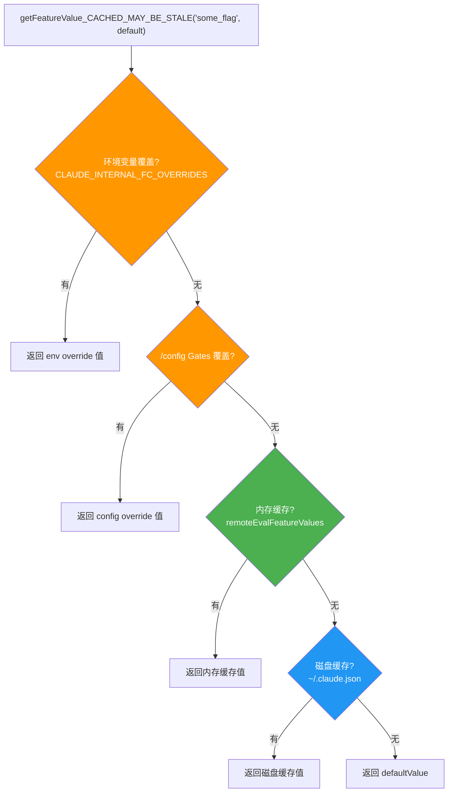
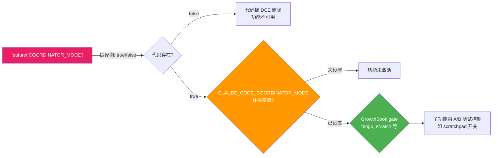

# 第 22 章：Feature Flag 与编译期优化 — 同一份代码构建两个产品

> 本章揭示 Claude Code 如何用一套代码库同时维护内部版和外部版两个产品。你将看到 Bun 的 `feature()` 编译期常量折叠、`process.env.USER_TYPE` 构建时 `--define` 常量、`MACRO.*` 构建时值注入、以及 GrowthBook A/B 测试平台如何在不同的时间维度上协同工作。

## 为什么需要多层 Feature Flag？

假设你是一家 AI 公司的工程师，你的产品既有面向公众的开源版本，也有内部员工使用的增强版本。内部版有更多实验性功能（语音模式、多 Agent 协调器、后台任务引擎），但你不想维护两个独立的代码仓库。

Claude Code 面临的正是这个问题。它的解决方案是**三层 Feature Flag 体系**，每层解决不同的问题：

| 层级 | 机制 | 决策时机 | 目的 |
|------|------|---------|------|
| 编译期 | `feature()` from `bun:bundle` | 构建时 | 从产物中物理删除内部代码分支 |
| 编译期 | `process.env.USER_TYPE` (`--define`) | 构建时 | 内部/外部身份门控，同样触发 DCE |
| 运行时 | GrowthBook A/B 测试 | 进程运行中 | 渐进式发布、实验、Kill Switch |

前两者都在构建时决策，但分工不同：`feature()` 是**功能级开关**（一个 flag 控制一个完整特性），`USER_TYPE` 是**身份级开关**（区分内部员工与外部用户）。运行时的 GrowthBook 则支持不重启进程就能开关功能。

---

> **章内导读**：§一 编译期 `feature()` 与 DCE（含 90 个 flag 全景与分类速查表）→ §二 构建时身份常量 `USER_TYPE` → §三 `MACRO.*` 常量注入 → §四 运行时 GrowthBook A/B → §五 三层协同的完整门控链路 → §六 防止 flag 翻转破坏系统 → §七 可迁移模式。§一–§四 是「四层门控机制」分别展开，§五 把它们串成一条链路。

## 一、编译期：`feature()` 与 Dead Code Elimination

### 1.1 核心机制

`feature()` 是从 `bun:bundle` 导入的编译期函数。它在 Bun 构建时被替换为 `true` 或 `false` 字面量，然后 Bun 的 bundler 会对 `if (false) { ... }` 分支执行 Dead Code Elimination（DCE），将整个分支及其依赖从产物中物理删除。

```typescript
// entrypoints/cli.tsx:1
import { feature } from 'bun:bundle';
```

这意味着在外部构建中，被 `feature()` 关闭的代码**不存在于最终的 JS 文件中** —— 不是被 `if (false)` 跳过，而是被完全删除。这比运行时检查强得多：攻击者无法通过修改环境变量来启用这些功能，因为相关代码根本不在产物里。

### 1.2 feature() 的两种搭配：require() 与动态 import()

`feature()` 实现 DCE 的**核心约束**是：它必须保持 inline（内联在条件判断中），使 bundler 能在编译期对整个分支做常量折叠。源码注释明确写道：

> `feature() must stay inline for build-time dead code elimination` — `cli.tsx:110`

在这个约束下，`feature()` 可以搭配**两种**模块加载方式：

**方式一：条件 `require()`** —— 用于**模块顶层**的条件加载（`tools.ts`、`commands.ts`）：

```typescript
// tools.ts:25-28
const SleepTool =
  feature('PROACTIVE') || feature('KAIROS')
    ? require('./tools/SleepTool/SleepTool.js').SleepTool
    : null
```

**方式二：分支内的动态 `import()`** —— 用于**函数体内**的条件加载（`cli.tsx` 的快速路径）：

```typescript
// entrypoints/cli.tsx:100-106
if (feature('DAEMON') && args[0] === '--daemon-worker') {
  const { runDaemonWorker } = await import('../daemon/workerRegistry.js');
  await runDaemonWorker(args[1]);
  return;
}
```

两者的共同点是：都不是**顶层静态 `import` 声明**。ES Module 的静态 `import` 语句会被模块系统无条件解析和加载，无论它们是否在会执行的代码路径中 —— bundler 无法删除静态 `import` 的依赖树。而 `require()` 和 `await import()` 都是运行时调用表达式，编译器确认 `feature(...)` 为 `false` 后，整个分支（包括其中的模块加载调用）都会被删除。

**选择哪种方式取决于上下文**：`require()` 适用于模块顶层（同步、可赋值给 `const`），`await import()` 适用于 async 函数体内（异步、更自然的代码流）。

这种模式在 `tools.ts` 中最为密集，因为工具注册是 feature flag 使用最集中的地方：

```typescript
// tools.ts:29-41 — 连续的条件注册
const cronTools = feature('AGENT_TRIGGERS')
  ? [
      require('./tools/ScheduleCronTool/CronCreateTool.js').CronCreateTool,
      require('./tools/ScheduleCronTool/CronDeleteTool.js').CronDeleteTool,
      require('./tools/ScheduleCronTool/CronListTool.js').CronListTool,
    ]
  : []
const RemoteTriggerTool = feature('AGENT_TRIGGERS_REMOTE')
  ? require('./tools/RemoteTriggerTool/RemoteTriggerTool.js').RemoteTriggerTool
  : null
const MonitorTool = feature('MONITOR_TOOL')
  ? require('./tools/MonitorTool/MonitorTool.js').MonitorTool
  : null
```

### 1.3 90 个 Feature Flag 的全景

**90 这个数字是怎么数出来的？** —— 直接对源码仓库（`/Users/yao/work/code/awesome-project/claude-code-cli`）跑一次：

```bash
grep -rhoE "feature\(['\"]([A-Z_0-9]+)['\"]\)" --include="*.ts" --include="*.tsx" . \
  | sed -E "s/feature\(['\"]([A-Z_0-9]+)['\"]\)/\1/" \
  | sort | uniq -c | sort -rn | wc -l
```

得到 **90 个**独立 flag。下面先看高频 Top 16（使用次数 ≥ 16），随后给出剩下 74 个 flag 的**分类速查表**——按主题域分组，每组给出 flag 名 + 使用次数，方便按特性家族而非字母序检索。

注：这里频繁出现的 `KAIROS`（希腊语「恰当时机」）出现 156 次，几乎是第二名的 1.5 倍——它对应的是 Claude Code 的**「Assistant 助手 / 聊天」模式**，一个内部大型实验功能（入口在 `assistant/index.ts`、`assistant/gate.ts`、`commands/assistantChat.tsx` 等），其下还派生出 5 个 `KAIROS_*` 子 flag（详见下面的速查表）。

| Feature Flag | 使用次数 | 功能领域 |
|-------------|---------|---------|
| `KAIROS` | 156 | Assistant 助手/聊天模式 |
| `TRANSCRIPT_CLASSIFIER` | 110 | 权限自动分类 |
| `TEAMMEM` | 53 | 团队记忆 |
| `VOICE_MODE` | 49 | 语音交互 |
| `BASH_CLASSIFIER` | 49 | Bash 命令安全分类 |
| `KAIROS_BRIEF` | 39 | Assistant 简报模式 |
| `PROACTIVE` | 37 | 主动模式（SleepTool 等） |
| `COORDINATOR_MODE` | 32 | 多 Agent 协调器 |
| `BRIDGE_MODE` | 29 | IDE 远程桥接 |
| `CONTEXT_COLLAPSE` | 23 | 上下文折叠 |
| `KAIROS_CHANNELS` | 21 | Assistant 频道 |
| `EXPERIMENTAL_SKILL_SEARCH` | 21 | 实验性技能搜索 |
| `UDS_INBOX` | 18 | Unix 域套接字消息 |
| `BUDDY` | 18 | Buddy 模式 |
| `HISTORY_SNIP` | 16 | 历史片段剪辑 |
| `CHICAGO_MCP` | 16 | Computer Use MCP |

这些 flag 中，`KAIROS`（希腊语「恰当时机」）出现 154 次，几乎是第二名的 1.5 倍 —— 它对应的是 Claude Code 的「助手」（Kairos Assistant）模式，本质上是一个把 Claude Code 内核当成"主动型聊天助手"使用的内部大型实验功能：相比默认的请求-响应循环，它会在更多触发点主动开口（如长任务结束、idle 提醒、定时简报），并依赖 `KAIROS_BRIEF`、`KAIROS_CHANNELS`、`KAIROS_GITHUB_WEBHOOKS` 等一系列同前缀的子 flag 协同。所以严格来说 `KAIROS` 不是"助手模式"这么宽泛，而是"主动型助手"的总开关。

#### 1.3.1 剩余 74 个 flag 的分类速查表

按主题域分组（**逐个列出**，不再让读者自行 grep）。"次"指 `feature('X')` 在源码中的出现次数。下方各组合计 74 个唯一 flag（`BUDDY` 已在 Top 16 中、未在此重复计数）。

**Assistant / KAIROS 家族（除 KAIROS、KAIROS_BRIEF、KAIROS_CHANNELS 外的 3 个）**

| Flag | 次 | 用途 |
|---|---|---|
| `KAIROS_PUSH_NOTIFICATION` | 4 | Assistant 推送通知 |
| `KAIROS_GITHUB_WEBHOOKS` | 4 | Assistant 监听 GitHub Webhook |
| `KAIROS_DREAM` | 1 | Assistant 模式下的 Dream/记忆整理 |

**Coordinator / 多 Agent / Workflow（6 个）**

| Flag | 次 | 用途 |
|---|---|---|
| `WORKFLOW_SCRIPTS` | 10 | 工作流脚本（LocalWorkflowTask） |
| `MONITOR_TOOL` | 13 | MonitorTool（与 MonitorMcpTask 配合） |
| `FORK_SUBAGENT` | 5 | Fork subagent 上下文分叉 |
| `VERIFICATION_AGENT` | 4 | Verification 内置 Agent |
| `BUILTIN_EXPLORE_PLAN_AGENTS` | 1 | Explore/Plan 内置 Agent 总开关 |
| `COWORKER_TYPE_TELEMETRY` | 2 | Coworker 类型遥测 |

**Cron / 自动化触发（2 个）**

| Flag | 次 | 用途 |
|---|---|---|
| `AGENT_TRIGGERS` | 11 | ScheduleCronTool 三件套 |
| `AGENT_TRIGGERS_REMOTE` | 2 | 远程触发器 |

**Compact / 上下文管理（5 个）**

| Flag | 次 | 用途 |
|---|---|---|
| `CACHED_MICROCOMPACT` | 12 | 缓存 microcompact 链路 |
| `REACTIVE_COMPACT` | 5 | 响应式压缩 |
| `TOKEN_BUDGET` | 9 | Token 预算管理 |
| `COMPACTION_REMINDERS` | 1 | 压缩提醒注入 |
| `PROMPT_CACHE_BREAK_DETECTION` | 9 | Prompt cache 断裂检测 |

**Memory / 记忆（3 个）**

| Flag | 次 | 用途 |
|---|---|---|
| `EXTRACT_MEMORIES` | 7 | 后台 extract memories |
| `MEMORY_SHAPE_TELEMETRY` | 3 | 记忆形态遥测 |
| `AGENT_MEMORY_SNAPSHOT` | 2 | Agent memory 快照 |

**MCP / 工具扩展（3 个）**

| Flag | 次 | 用途 |
|---|---|---|
| `MCP_SKILLS` | 9 | MCP server 暴露的 Skills |
| `MCP_RICH_OUTPUT` | 3 | MCP 富文本输出 |
| `WEB_BROWSER_TOOL` | 4 | WebBrowserTool 注册 |

**Bridge / 远程会话 / 直连（5 个）**

| Flag | 次 | 用途 |
|---|---|---|
| `DIRECT_CONNECT` | 5 | DirectConnect 上游代理 |
| `SSH_REMOTE` | 4 | SSH 远程会话 |
| `BG_SESSIONS` | 11 | 后台会话管理（ps/logs/attach） |
| `DAEMON` | 3 | daemon 子命令与 worker |
| `LODESTONE` | 6 | Lodestone 远程基础设施 |

**CCR / 客户端连接（3 个）**

| Flag | 次 | 用途 |
|---|---|---|
| `CCR_MIRROR` | 4 | CCR 镜像传输 |
| `CCR_AUTO_CONNECT` | 3 | CCR 自动连接 |
| `CCR_REMOTE_SETUP` | 1 | CCR 远程初始化 |

**TREE_SITTER（2 个）**

| Flag | 次 | 用途 |
|---|---|---|
| `TREE_SITTER_BASH` | 3 | tree-sitter Bash 解析（主路径） |
| `TREE_SITTER_BASH_SHADOW` | 5 | tree-sitter Bash 影子模式（diff 旧解析） |

**用户设置同步（2 个）**

| Flag | 次 | 用途 |
|---|---|---|
| `UPLOAD_USER_SETTINGS` | 2 | 用户设置上传 |
| `DOWNLOAD_USER_SETTINGS` | 5 | 用户设置下载 |

**UI / 终端 / 输入输出（9 个，另含 `BUDDY` 已在 Top 16）**

| Flag | 次 | 用途 |
|---|---|---|
| `BUDDY` | (见 Top 16) | Buddy 宠物（跨主题域，归 UI 一族） |
| `TERMINAL_PANEL` | 5 | 终端面板 |
| `QUICK_SEARCH` | 5 | 快速搜索面板 |
| `MESSAGE_ACTIONS` | 5 | 消息动作菜单 |
| `HISTORY_PICKER` | 4 | 历史选择器 UI |
| `CONNECTOR_TEXT` | 8 | 连接器文本渲染 |
| `TEMPLATES` | 6 | 模板系统 |
| `STREAMLINED_OUTPUT` | 1 | 精简输出 |
| `AUTO_THEME` | 3 | 自动主题 |
| `NATIVE_CLIPBOARD_IMAGE` | 2 | 原生剪贴板图片粘贴 |

**Power user / Ultraplan / Review（3 个）**

| Flag | 次 | 用途 |
|---|---|---|
| `ULTRAPLAN` | 10 | Ultraplan 远程深度规划 |
| `REVIEW_ARTIFACT` | 4 | Review artifact 渲染 |
| `ULTRATHINK` | 1 | UltraThink 深度思考模式 |

**遥测 / 调试 / 实验（10 个）**

| Flag | 次 | 用途 |
|---|---|---|
| `SHOT_STATS` | 10 | shot 统计 |
| `ENHANCED_TELEMETRY_BETA` | 2 | 增强遥测 beta |
| `PERFETTO_TRACING` | 1 | Perfetto 性能追踪 |
| `SLOW_OPERATION_LOGGING` | 1 | 慢操作日志 |
| `OVERFLOW_TEST_TOOL` | 2 | OverflowTestTool（压测用） |
| `BREAK_CACHE_COMMAND` | 2 | breakCache 命令 |
| `HARD_FAIL` | 2 | 硬失败模式 |
| `ANTI_DISTILLATION_CC` | 1 | 反蒸馏 |
| `DUMP_SYSTEM_PROMPT` | 1 | --dump-system-prompt 快速路径 |
| `ABLATION_BASELINE` | 1 | 消融实验基线（见 §1.5） |

**命令归属 / 集成（5 个）**

| Flag | 次 | 用途 |
|---|---|---|
| `COMMIT_ATTRIBUTION` | 12 | commit 自动归属 |
| `HOOK_PROMPTS` | 1 | Hook prompt 拼装 |
| `FILE_PERSISTENCE` | 3 | 文件持久化层 |
| `AWAY_SUMMARY` | 2 | 离开总结 |
| `SKIP_DETECTION_WHEN_AUTOUPDATES_DISABLED` | 1 | 自动更新关掉时跳过检测 |

**Skill / 自定义（3 个）**

| Flag | 次 | 用途 |
|---|---|---|
| `SKILL_IMPROVEMENT` | 1 | Skill 改进流 |
| `RUN_SKILL_GENERATOR` | 1 | Skill 生成器 |
| `NEW_INIT` | 2 | 新版 init 流 |

**Power shell / 平台特化（5 个）**

| Flag | 次 | 用途 |
|---|---|---|
| `POWERSHELL_AUTO_MODE` | 2 | PowerShell 自动模式 |
| `IS_LIBC_MUSL` | 1 | 检测 musl libc |
| `IS_LIBC_GLIBC` | 1 | 检测 glibc |
| `NATIVE_CLIENT_ATTESTATION` | 1 | 原生客户端认证头 |
| `ALLOW_TEST_VERSIONS` | 2 | 允许测试版本 |

**杂项（5 个）**

| Flag | 次 | 用途 |
|---|---|---|
| `BYOC_ENVIRONMENT_RUNNER` | 1 | Bring-Your-Own-Compute runner |
| `SELF_HOSTED_RUNNER` | 1 | 自托管 runner |
| `UNATTENDED_RETRY` | 1 | 无人值守重试 |
| `TORCH` | 1 | Torch 调试探针 |
| `BUILDING_CLAUDE_APPS` | 1 | 构建 Claude apps 工作流 |

合计：Top 16（16 个唯一 flag，其中 `BUDDY` 同时归入下方"UI"组但**不重复计数**） + 下方各主题组共 74 个唯一 flag = 90，正好覆盖完整集合。这张速查表的目的是：**当你在源码里看到 `feature('XYZ')` 时，可以一眼定位它属于哪条产品线**，而不必把整张表重新 grep 一遍。

### 1.4 feature() 的全栈影响

`feature()` 不仅控制工具和命令的注册，还深入到入口点的**快速路径**、**对话循环**、**System Prompt** 等核心链路。以 `entrypoints/cli.tsx` 为例：

```typescript
// entrypoints/cli.tsx:53
// Ant-only: eliminated from external builds via feature flag.
if (feature('DUMP_SYSTEM_PROMPT') && args[0] === '--dump-system-prompt') {
  // ... 整个 --dump-system-prompt 快速路径
  return;
}

// entrypoints/cli.tsx:100
if (feature('DAEMON') && args[0] === '--daemon-worker') {
  // ... daemon worker 快速路径
  return;
}

// entrypoints/cli.tsx:165
if (feature('DAEMON') && args[0] === 'daemon') {
  // ... daemon 子命令快速路径
  return;
}

// entrypoints/cli.tsx:185
if (feature('BG_SESSIONS') && (args[0] === 'ps' || args[0] === 'logs' || ...)) {
  // ... 后台会话管理快速路径
  return;
}
```

在外部构建中，这些 `if` 块全部被 DCE 删除。用户永远不会看到 `claude daemon`、`claude ps`、`claude attach` 等子命令 —— 因为解析它们的代码根本不存在。

在 `query.ts`（对话循环）中同样大量使用：

```typescript
// query.ts:15-18
const reactiveCompact = feature('REACTIVE_COMPACT')
  ? require('./services/compact/reactiveCompact.js') : null
const contextCollapse = feature('CONTEXT_COLLAPSE')
  ? require('./services/compact/contextCollapse.js') : null
```

### 1.5 编译期 + 运行时双重门控：Ablation Baseline

一个特别精巧的用法是 `cli.tsx` 中的 Ablation Baseline。**先解释一下名字** —— 在内部实验流水线里，开发者需要一个"什么花哨功能都关掉"的基线版本来对比一个新功能到底带来了多大效果，这种"去掉某条件作为对照组"的做法在机器学习里叫"消融实验"（Ablation Study），所以这里的"基线"指的就是"实验对照组"。对外部读者来说，它的意义在于：这是一个**编译期 `feature()` 和运行时环境变量组合使用**的范本，外部构建里这整段会被 DCE 删掉，所以你不会真的在你的 `claude` 里遇到它，但模式本身可以借鉴。

```typescript
// entrypoints/cli.tsx:16-26
// Harness-science L0 ablation baseline. Inlined here (not init.ts) because
// BashTool/AgentTool/PowerShellTool capture DISABLE_BACKGROUND_TASKS into
// module-level consts at import time — init() runs too late. feature() gate
// DCEs this entire block from external builds.
if (feature('ABLATION_BASELINE') && process.env.CLAUDE_CODE_ABLATION_BASELINE) {
  for (const k of [
    'CLAUDE_CODE_SIMPLE',
    'CLAUDE_CODE_DISABLE_THINKING',
    'DISABLE_INTERLEAVED_THINKING',
    'DISABLE_COMPACT',
    'DISABLE_AUTO_COMPACT',
    'CLAUDE_CODE_DISABLE_AUTO_MEMORY',
    'CLAUDE_CODE_DISABLE_BACKGROUND_TASKS',
  ]) {
    process.env[k] ??= '1';
  }
}
```

注释解释了为什么它必须在 `cli.tsx`（而非 `init.ts`）中 —— 因为 BashTool 等工具在 `import` 时就会捕获环境变量到模块级常量中，`init()` 运行时已经太晚了。而 `feature('ABLATION_BASELINE')` 确保这段代码在外部构建中被完全删除。

---

## 二、构建时身份常量：`process.env.USER_TYPE`

### 2.1 USER_TYPE 也是编译期常量

一个容易误解的关键事实：`process.env.USER_TYPE` **不是**普通的运行时环境变量 —— 它是通过 Bun 的 `--define` 在构建时注入的**编译期常量**。源码中的大量注释明确了这一点：

```
// utils/envUtils.ts:137-138
// USER_TYPE is build-time --define'd; in external builds this block is
// DCE'd so the require() and namespace allowlist never appear in the bundle.

// constants/prompts.ts:617-619
// DCE: `process.env.USER_TYPE === 'ant'` is build-time --define. It MUST be
// inlined at each callsite (not hoisted to a const) so the bundler can
// constant-fold it to `false` in external builds and eliminate the branch.

// components/MemoryUsageIndicator.tsx:8
// USER_TYPE is a build-time constant, so the hook call below is either always
// present or always absent — React hook ordering rules are satisfied.
```

在外部构建中，`process.env.USER_TYPE` 被替换为字面量 `"external"`。这意味着 `process.env.USER_TYPE === 'ant'` 会被常量折叠为 `false`，后续的 DCE 与 `feature()` 效果**完全一致** —— 条件分支中的代码（包括 `require()` 的模块）会被从产物中物理删除。

实际的构建产物验证了这一点（`commands/ultraplan.tsx:56`）：

```typescript
// 构建后的外部产物中，USER_TYPE 已被替换为 "external"
const ULTRAPLAN_INSTRUCTIONS: string = "external" === 'ant' && process.env.ULTRAPLAN_PROMPT_FILE
  ? readFileSync(process.env.ULTRAPLAN_PROMPT_FILE, 'utf8').trimEnd()
  : DEFAULT_INSTRUCTIONS;
```

`"external" === 'ant'` 永远为 `false`，bundler 可以安全删除整个 true-branch。

### 2.2 USER_TYPE 的使用约束

源码注释强调了一个重要约束：`USER_TYPE` **必须在每个调用点内联**，不能提升为 `const`：

```typescript
// constants/prompts.ts:617-619 的注释
// It MUST be inlined at each callsite (not hoisted to a const) so the bundler
// can constant-fold it to `false` in external builds and eliminate the branch.
```

如果写成 `const isAnt = process.env.USER_TYPE === 'ant'`，然后在多处使用 `if (isAnt)`，bundler **可能无法**将 `isAnt` 追溯到编译期常量，从而失去 DCE 能力。

这解释了为什么代码中到处重复 `process.env.USER_TYPE === 'ant'` 而不提取为变量 —— 这不是代码风格问题，而是**DCE 正确性要求**。React hooks 的使用甚至需要 biome-ignore 注释来豁免 hook 规则检查，因为编译期常量保证了 hook 调用的稳定性：

```typescript
// hooks/useIssueFlagBanner.ts:100
// biome-ignore lint/correctness/useHookAtTopLevel: process.env.USER_TYPE is a compile-time constant
```

### 2.3 feature() vs USER_TYPE 的分工

既然两者都能实现 DCE，为什么需要两套机制？

- **`feature()`**：**功能级**开关。89 个独立的 flag，每个控制一个特定功能（`KAIROS`、`COORDINATOR_MODE`、`VOICE_MODE`）。内部构建中也可以选择性关闭某些 feature。
- **`USER_TYPE`**：**身份级**开关。只有 `'ant'` / `"external"` 两个值，控制的是「这是不是内部员工」这个全局身份问题。

以 `tools.ts:getAllBaseTools()` 为例，两种模式并存：

```typescript
// tools.ts:193-250 — getAllBaseTools() 中的条件注册
export function getAllBaseTools(): Tools {
  return [
    AgentTool,                  // 无条件注册
    BashTool,                   // 无条件注册
    // ...
    // USER_TYPE 构建时身份门控（外部构建中 DCE 删除）
    ...(process.env.USER_TYPE === 'ant' ? [ConfigTool] : []),
    ...(process.env.USER_TYPE === 'ant' ? [TungstenTool] : []),
    // feature() 构建时功能门控（外部构建中 DCE 删除）
    ...(WebBrowserTool ? [WebBrowserTool] : []),   // feature('WEB_BROWSER_TOOL')
    ...(OverflowTestTool ? [OverflowTestTool] : []),// feature('OVERFLOW_TEST_TOOL')
  ]
}
```

### 2.4 INTERNAL_ONLY_COMMANDS：注册级门控

命令系统有一个显式的内部命令集合，在 `commands.ts:225-254` 中定义：

```typescript
// commands.ts:225-254
export const INTERNAL_ONLY_COMMANDS = [
  backfillSessions,
  breakCache,
  bughunter,
  commit,
  commitPushPr,
  ctx_viz,
  goodClaude,
  issue,
  initVerifiers,
  // ...还有 feature() 门控的命令
  ...(forceSnip ? [forceSnip] : []),       // feature('HISTORY_SNIP')
  ...(ultraplan ? [ultraplan] : []),       // feature('ULTRAPLAN')
  ...(subscribePr ? [subscribePr] : []),   // feature('KAIROS_GITHUB_WEBHOOKS')
  // ...共 20+ 个内部命令
].filter(Boolean)
```

这些命令只在 `COMMANDS()` 函数中按 `USER_TYPE` 条件注入：

```typescript
// commands.ts:343-345
...(process.env.USER_TYPE === 'ant' && !process.env.IS_DEMO
  ? INTERNAL_ONLY_COMMANDS
  : []),
```

**需要注意的边界**：`INTERNAL_ONLY_COMMANDS` 数组中的命令（如 `backfillSessions`、`commit`、`bughunter` 等）是通过**顶层静态 `import`** 引入的。这意味着它们的模块代码**仍然存在于外部构建的 bundle 中** —— 只是不会被注册到命令列表里，用户无法调用它们。真正实现代码级 DCE 的是那些通过 `feature()` + `require()` 条件加载的命令（如 `forceSnip`、`ultraplan`），这些在外部构建中连模块代码都不存在。

`!process.env.IS_DEMO` 是额外的二级门控 —— 即使是内部用户，在 Demo 模式下也不显示这些命令。

---

## 三、`MACRO.*` — 构建时常量注入

### 3.1 七个构建时常量

除了 `feature()` 的布尔门控，项目还通过 `MACRO.*` 注入**构建时确定的字符串/值常量**。搜索整个代码库，共发现 7 个 MACRO 常量：

| 常量 | 用途 | 使用场景 |
|------|------|---------|
| `MACRO.VERSION` | 版本号 | `--version` 输出、API 请求头、更新检查 |
| `MACRO.BUILD_TIME` | 构建时间戳 | 遥测元数据 |
| `MACRO.PACKAGE_URL` | npm 包地址 | 自动更新、安装路径 |
| `MACRO.NATIVE_PACKAGE_URL` | 原生包地址 | 原生安装器 |
| `MACRO.ISSUES_EXPLAINER` | 反馈渠道说明 | System Prompt、错误提示 |
| `MACRO.FEEDBACK_CHANNEL` | 反馈频道链接 | 安全警告 |
| `MACRO.VERSION_CHANGELOG` | 版本变更日志 | 发布说明 |

### 3.2 MACRO.VERSION 的零开销使用

`MACRO.VERSION` 是最频繁使用的构建时常量。它在 `--version` 快速路径中实现了**零 import 返回**：

```typescript
// entrypoints/cli.tsx:37-42
if (args.length === 1 && (args[0] === '--version' || args[0] === '-v' || args[0] === '-V')) {
  // MACRO.VERSION is inlined at build time
  console.log(`${MACRO.VERSION} (Claude Code)`);
  return;
}
```

编译后，`MACRO.VERSION` 被替换为实际的版本字符串（如 `"1.0.34"`），`${MACRO.VERSION}` 变成一个纯字符串字面量。这意味着 `--version` 路径不需要 import 任何模块，不需要读取 `package.json`，甚至不需要字符串拼接 —— 编译时就已经完成了。

### 3.3 MACRO.ISSUES_EXPLAINER 在 System Prompt 中的使用

`MACRO.ISSUES_EXPLAINER` 让内部版和外部版的 System Prompt 指向不同的反馈渠道：

```typescript
// constants/prompts.ts:218
`To give feedback, users should ${MACRO.ISSUES_EXPLAINER}`,
```

内部构建可能指向 Slack 频道，外部构建指向 GitHub Issues —— 同一行代码，不同的构建产物。

### 3.4 MACRO 与 feature() 的区别

`MACRO.*` 和 `feature()` 都是编译期机制，但语义不同：

- **`feature()`**：布尔值，用于代码分支的 DCE（删除整个代码块）
- **`MACRO.*`**：任意值，用于常量替换（将占位符替换为具体值）

两者可以组合使用：

```typescript
// constants/system.ts:78,82,91
const version = `${MACRO.VERSION}.${fingerprint}`
// ...
const cch = feature('NATIVE_CLIENT_ATTESTATION') ? ' cch=00000;' : ''
const header = `x-anthropic-billing-header: cc_version=${version}; cc_entrypoint=${entrypoint};${cch}${workloadPair}`
```

这段代码同时使用了 `feature()` 决定是否包含客户端认证标记，和 `MACRO.VERSION`（:78）注入版本号。

---

## 四、运行时：GrowthBook A/B 测试平台

### 4.1 为什么还需要运行时 Feature Flag？

编译期和模块加载期的 flag 有一个共同的限制：**修改后必须重新构建或重启进程**。但很多场景需要在不重启的情况下控制功能：

- **渐进式发布**：先对 10% 的用户开放新功能
- **Kill Switch**：紧急关闭有问题的功能
- **A/B 测试**：对比不同配置的效果
- **长会话配置刷新**：用户可能在一个 Claude Code 会话中工作数小时

Claude Code 使用 **GrowthBook**（一个开源的 A/B 测试平台）来解决这些需求。

### 4.2 核心 API：`getFeatureValue_CACHED_MAY_BE_STALE()`

这是 GrowthBook 在 Claude Code 中**最核心的读取 API**（`services/analytics/growthbook.ts:734-775`）：

```typescript
// services/analytics/growthbook.ts:734-775
export function getFeatureValue_CACHED_MAY_BE_STALE<T>(
  feature: string,
  defaultValue: T,
): T {
  // 1. 环境变量覆盖（最高优先级，用于测试工具链）
  const overrides = getEnvOverrides()
  if (overrides && feature in overrides) {
    return overrides[feature] as T
  }
  // 2. 本地配置覆盖（/config Gates 面板设置）
  const configOverrides = getConfigOverrides()
  if (configOverrides && feature in configOverrides) {
    return configOverrides[feature] as T
  }

  if (!isGrowthBookEnabled()) {
    return defaultValue
  }

  // 3. 内存中的 remote eval 缓存（最新鲜）
  if (remoteEvalFeatureValues.has(feature)) {
    return remoteEvalFeatureValues.get(feature) as T
  }

  // 4. 磁盘缓存（跨进程持久化）
  try {
    const cached = getGlobalConfig().cachedGrowthBookFeatures?.[feature]
    return cached !== undefined ? (cached as T) : defaultValue
  } catch {
    return defaultValue
  }
}
```

函数名中的 `_CACHED_MAY_BE_STALE` 是一个**命名约定**，明确告诉调用者：返回值可能是过时的（来自上一个进程的磁盘缓存）。这种诚实的命名避免了调用者对数据新鲜度的错误假设。

### 4.3 四级优先级链

GrowthBook 值的解析遵循严格的优先级链：



环境变量覆盖仅对内部用户开放（`process.env.USER_TYPE === 'ant'`），用于测试工具链（eval harnesses）确保实验配置的确定性：

```typescript
// services/analytics/growthbook.ts:170-192
function getEnvOverrides(): Record<string, unknown> | null {
  if (!envOverridesParsed) {
    envOverridesParsed = true
    if (process.env.USER_TYPE === 'ant') {
      const raw = process.env.CLAUDE_INTERNAL_FC_OVERRIDES
      if (raw) {
        try {
          envOverrides = JSON.parse(raw) as Record<string, unknown>
        } catch { /* ... */ }
      }
    }
  }
  return envOverrides
}
```

### 4.4 初始化与刷新机制

GrowthBook 客户端的生命周期经过精心设计（`growthbook.ts:490-617`）：

**初始化**：使用 Remote Eval 模式（`remoteEval: true`），GrowthBook 服务端为当前用户预计算所有 feature 值，客户端只需接收结果。初始化有 5 秒超时，失败时降级到磁盘缓存。

**周期性刷新**：初始化成功后设置定时器 —— 内部用户 20 分钟刷新一次，外部用户 6 小时刷新一次：

```typescript
// services/analytics/growthbook.ts:1012-1016
const GROWTHBOOK_REFRESH_INTERVAL_MS =
  process.env.USER_TYPE !== 'ant'
    ? 6 * 60 * 60 * 1000  // 6 hours
    : 20 * 60 * 1000       // 20 min (for ants)
```

**磁盘同步**：每次成功获取 payload 后，`syncRemoteEvalToDisk()` 将完整的 feature 值集合写入 `~/.claude.json` 的 `cachedGrowthBookFeatures` 字段，供下一次进程启动时作为磁盘缓存使用。

**Auth 变更重建**：当用户登录/登出时，`refreshGrowthBookAfterAuthChange()` 会销毁并重建整个客户端 —— 因为 GrowthBook SDK 的 `apiHostRequestHeaders` 在创建后无法更新。

### 4.5 实验曝光跟踪

GrowthBook 的 A/B 测试需要记录用户被分配到了哪个实验组。Claude Code 的实现有一个精巧的延迟曝光机制：

```typescript
// services/analytics/growthbook.ts:84,89
// Track features accessed before init that need exposure logging
const pendingExposures = new Set<string>()

// Track features that have already had their exposure logged this session (dedup)
const loggedExposures = new Set<string>()
```

当 `_CACHED_MAY_BE_STALE` 在 GrowthBook 初始化完成**之前**被调用时（很常见，因为很多启动路径需要读取 flag），feature 名被加入 `pendingExposures`。初始化完成后，补发这些曝光事件。而 `loggedExposures` 确保每个 feature 每个 session 只记录一次，避免热路径（如渲染循环中的 `isAutoMemoryEnabled`）产生大量重复事件。

### 4.6 GrowthBook 在实际功能中的使用

GrowthBook 被广泛用于控制各种运行时行为。以几个典型场景为例：

```typescript
// utils/toolSchemaCache.ts:5-7 — 问题说明
// GrowthBook gate flips (tengu_tool_pear, tengu_fgts), MCP reconnects, or
// dynamic content in tool.prompt() all cause this churn.
```

这段注释揭示了一个实际问题：GrowthBook 门控的翻转会导致工具 Schema 变化，进而破坏 Prompt Cache。项目通过 `toolSchemaCache` 将工具 Schema 在 session 级别锁定，防止 mid-session 的 GrowthBook 刷新导致缓存失效。

```typescript
// constants/system.ts:56-57 — Kill Switch
function isAttributionHeaderEnabled(): boolean {
  if (isEnvDefinedFalsy(process.env.CLAUDE_CODE_ATTRIBUTION_HEADER)) return false
  return getFeatureValue_CACHED_MAY_BE_STALE('tengu_attribution_header', true)
}
```

这是一个 Kill Switch 模式：默认开启 attribution header，但可以通过 GrowthBook 远程关闭 —— 无需发布新版本。

---

## 五、三层协同：一个功能的完整门控链路

让我们以 Coordinator Mode（多 Agent 协调模式）为例，看各层 Flag 如何协同工作。

### 第一层：编译期 `feature()` — 代码存在性

```typescript
// tools.ts:120-122
const coordinatorModeModule = feature('COORDINATOR_MODE')
  ? (require('./coordinator/coordinatorMode.js') as typeof import('./coordinator/coordinatorMode.js'))
  : null
```

外部构建中，`feature('COORDINATOR_MODE')` 为 `false`，整个 coordinator 模块被 DCE 删除。

### 第二层：运行时环境变量 — 功能激活

```typescript
// main.tsx:1872
if (feature('COORDINATOR_MODE') && isEnvTruthy(process.env.CLAUDE_CODE_COORDINATOR_MODE)) {
  // 启动协调器模式
}
```

即使在内部构建中，用户也需要显式设置环境变量才能启用协调器。`feature()` 在编译期被替换为 `true`，但 `isEnvTruthy()` 仍在运行时检查。

### 第三层：GrowthBook — 子功能细粒度控制

在 coordinator 模块内部，GrowthBook 控制着子功能的开关。例如，scratchpad（草稿区）功能通过 GrowthBook gate 门控：

```typescript
// coordinator/coordinatorMode.ts:25-27
function isScratchpadGateEnabled(): boolean {
  return checkStatsigFeatureGate_CACHED_MAY_BE_STALE('tengu_scratch')
}
```

这里调用名带 `Statsig`、所在文件却叫 `growthbook.ts`，并不是命名错误，而是**迁移期的兼容层**：项目历史上用 Statsig 做实验平台，现在正在迁到 GrowthBook，`services/analytics/growthbook.ts:792-836` 的注释明确写道这个函数是"MIGRATION ONLY"——它先查 GrowthBook 缓存，未命中再回退到 `config.cachedStatsigGates`。也就是说，Statsig 是"上一代"实验平台、GrowthBook 是"这一代"，两者通过这种命名前缀 + 旧缓存兜底的方式共存在同一个文件里，直到所有 gate 完成迁移。

这展示了三层如何嵌套：`feature()` 决定 coordinator 代码是否存在 → 环境变量决定 coordinator 是否激活 → GrowthBook（含 Statsig 兼容回退）决定 coordinator 内部的 scratchpad 子功能是否启用。



---

## 六、防止 Flag 翻转破坏系统

Feature Flag 最大的风险是 mid-session 翻转导致不一致状态。Claude Code 采用了多种防御措施。

### 6.1 Latch 模式（单向锁存）

在 Prompt Cache 系统中（第 8 章详述），多个 flag 使用 **Latch 模式**：一旦开启就不再关闭：

> AFK header / cache editing header / fast mode header 一旦开启不关闭，防止 mid-session 翻转破坏缓存。

### 6.2 toolSchemaCache：Session 级工具 Schema 锁定

```typescript
// utils/toolSchemaCache.ts:5-8,18
// GrowthBook gate flips (tengu_tool_pear, tengu_fgts), MCP reconnects,
// or dynamic content in tool.prompt() all cause this churn. Memoizing
// per-session locks the schema bytes at first render.
const TOOL_SCHEMA_CACHE = new Map<string, CachedSchema>()
```

工具 Schema 在 session 首次渲染后被缓存到 Map 中。后续的 GrowthBook 刷新不会改变已缓存的 Schema —— 这保护了 Prompt Cache 的字节级一致性。

### 6.3 QueryConfig 刻意排除 feature()

```
// query/config.ts — 第 5 章提到的设计
// QueryConfig 是不可变环境快照，刻意排除 feature() gate 以保留 DCE
```

`QueryConfig` 在查询开始时拍摄快照，确保整个对话循环中配置不变。它不直接引用 `feature()` 调用，而是在构造时捕获 feature 门控的结果，避免 mid-turn 翻转。

---

## 七、可迁移的设计模式

### 模式 1：编译期 DCE — 同一份代码构建多版本

**核心思想**：使用编译期常量折叠 + 条件 `require()` 或分支内动态 `import()` 实现零成本的代码分叉。

```typescript
// 模式模板（模块顶层用 require）
import { feature } from 'build-system' // Bun/Webpack/Rollup 都有类似机制

const PremiumFeature = feature('PREMIUM')
  ? require('./premium/feature.js').PremiumFeature
  : null

// 模式模板（函数体内用动态 import）
if (feature('PREMIUM') && args[0] === 'premium') {
  const { premiumMain } = await import('./premium/main.js')
  await premiumMain()
  return
}
```

**关键约束**：不能用顶层静态 `import`（bundler 无法删除其依赖树）。`require()` 和 `await import()` 都可以，视上下文选择。

**适用场景**：SaaS 产品的免费版/付费版、开源项目的社区版/企业版。

### 模式 2：诚实命名的缓存 API

**核心思想**：在函数名中明确标注数据新鲜度的语义。

```typescript
// 好的命名
getFeatureValue_CACHED_MAY_BE_STALE()   // 可能过时
getDynamicConfig_BLOCKS_ON_INIT()        // 会阻塞
checkGate_CACHED_OR_BLOCKING()           // 先快后慢
getFeatureValue_DEPRECATED()             // 已废弃

// 坏的命名
getFeatureValue()  // 阻塞还是非阻塞？新鲜还是过时？
```

这种命名法看起来冗长，但它防止了调用者对行为的错误假设 —— 在一个有 30+ 个消费点的 API 中，这种清晰度是值得的。

### 模式 3：多层 Feature Flag 分离关注点

**核心思想**：按**粒度和灵活性**分层 —— 编译期常量最严格（代码物理删除）、运行时 Flag 最灵活（可热更新）。

```
编译期 feature()      ──── 功能边界：按特性裁剪产物
编译期 USER_TYPE      ──── 身份边界：按内部/外部裁剪产物
运行时 GrowthBook     ──── 业务边界：渐进发布、A/B 测试、Kill Switch
```

**反模式**：把所有 flag 都放在运行时（安全风险）或都放在编译期（失去灵活性）。

---

---

## 下一章预告

[第 23 章：客户端传输与 API 重试 — 面向不可靠网络的鲁棒设计](./23-客户端传输与API重试.md)

我们将沿着一次 messages.create 调用从应用层进入传输层，看一个生产级 AI CLI 如何在不可靠网络下保持稳定运行，并把视野铺到客户端传输层的 20 个文件与 HybridTransport / SSETransport / WebSocketTransport 等实现。

---
*全部内容请关注 https://github.com/luyao618/Claude-Code-Source-Study (求一颗免费的小星星)*
