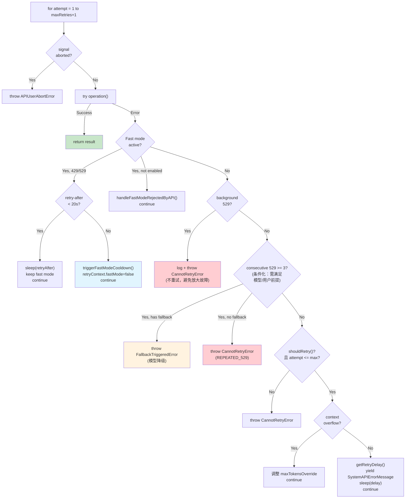
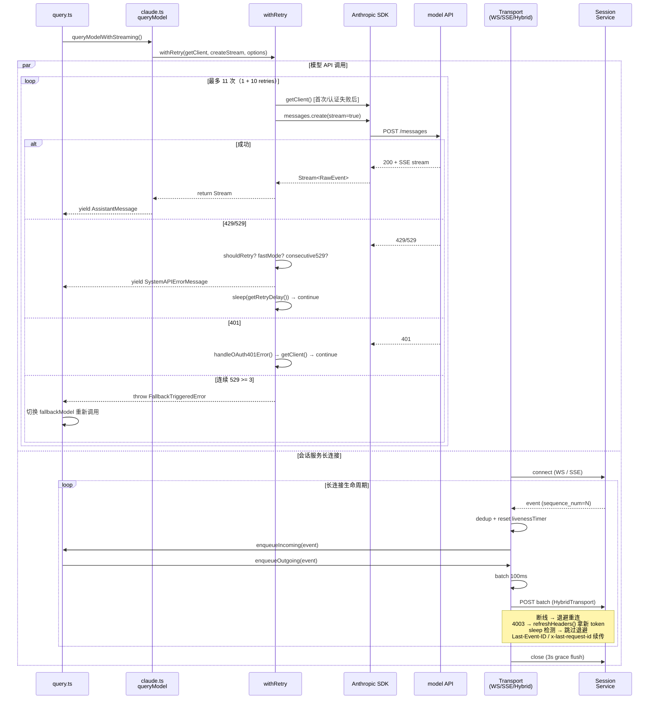

# 第 23 章：客户端传输与 API 重试 — 面向不可靠网络的鲁棒设计

> 本章是《深入 Claude Code 源码》系列第 23 章。我们将沿着一次 `messages.create` 调用从应用层进入传输层，看一个生产级 AI CLI 如何在不可靠网络、过期凭证、容量过载、TLS 拦截代理、空闲连接被回收等多重不确定性下保持稳定运行。

## 为什么需要如此复杂的错误恢复？

当你在本地调用一个 REST API 时，最简单的做法是失败就报错。但 Claude Code 面对的是一个远比这复杂的现实：

1. **网络不可靠** — 用户可能在咖啡馆 WiFi、企业代理、VPN 隧道后面使用
2. **API 容量波动** — 529 过载和 429 限流是 LLM API 的常态，不是异常
3. **认证令牌过期** — OAuth token、AWS credential、GCP credential 都有 TTL
4. **流式连接脆弱** — SSE 流可能在中途断开、超时、或被代理截断
5. **多 Provider 差异** — 同一份代码要兼容 Anthropic 直连、AWS Bedrock、GCP Vertex、Azure Foundry 四种后端
6. **远程会话有第二张图** — Bridge / Teleport 场景下，CLI 不仅要和模型 API 对话，还要和会话服务做双向通信，链路上的每一段都可能独立出问题

如果每种错误都让用户手动重试，用户体验将是灾难性的 —— 想象你在一个需要 10 分钟的 agentic 编程任务中途遇到一次 529，不得不从头开始。再想象远程会话用户的笔记本盖上 20 分钟，醒来时希望 CLI 自动追上中间漏掉的所有事件，而不是抛出 `ECONNRESET` 让一切归零。

Claude Code 的解决方案是一套**两条主线 + 一组共享工具**的架构：一条是面向模型 API 的 `withRetry` 通用重试层，处理 429/529/认证/上下文溢出；另一条是面向会话服务的传输层（WebSocket / SSE / Hybrid 三态），处理长连接断线、批量上传、状态合并；两条主线共享同一套错误分类、SSL 提示、HTML 清洗工具。本章按这个层次逐段拆解，最后给出可迁移的设计模式。流式与非流式的双模式切换、404 端点降级在源码里属于 `claude.ts` 的内部职责，下一篇 C25 会专门处理，本章不再展开。

---

## 一、withRetry：AsyncGenerator 驱动的重试引擎

### 1.1 为什么用 AsyncGenerator？

`withRetry` 的函数签名非常独特 —— 它不是返回 `Promise<T>`，而是返回 `AsyncGenerator<SystemAPIErrorMessage, T>`：

```typescript
// services/api/withRetry.ts:170-178
export async function* withRetry<T>(
  getClient: () => Promise<Anthropic>,
  operation: (
    client: Anthropic,
    attempt: number,
    context: RetryContext,
  ) => Promise<T>,
  options: RetryOptions,
): AsyncGenerator<SystemAPIErrorMessage, T> {
```

为什么是 AsyncGenerator 而不是简单的 `async function`？因为重试过程中需要**向上游发送中间状态** —— 每次重试前的等待时间、当前是第几次尝试、错误类型等信息需要实时反馈给 UI 层，让用户知道"系统正在重试，请稍候"而不是"系统卡死了"。

Generator 的 `yield` 天然适合这个场景：每次重试等待期间 yield 一条 `SystemAPIErrorMessage`，UI 层消费这些消息并展示进度。正常完成时通过 `return` 返回最终结果。

### 1.2 核心常量与重试预算

```typescript
// services/api/withRetry.ts:52-55
const DEFAULT_MAX_RETRIES = 10
const FLOOR_OUTPUT_TOKENS = 3000
const MAX_529_RETRIES = 3
export const BASE_DELAY_MS = 500
```

四个关键常量定义了重试的边界：

| 常量 | 值 | 含义 |
|------|------|------|
| `DEFAULT_MAX_RETRIES` | 10 | 默认最多重试 10 次 |
| `MAX_529_RETRIES` | 3 | 连续 529 过载最多 3 次就触发模型降级 |
| `BASE_DELAY_MS` | 500ms | 指数退避的基础延迟 |
| `FLOOR_OUTPUT_TOKENS` | 3000 | context overflow 调整时的最小输出 token 数 |

`DEFAULT_MAX_RETRIES` 可以通过环境变量 `CLAUDE_CODE_MAX_RETRIES` 覆盖（`withRetry.ts:790-793`），这在 CI/CD 等场景下很有用。

### 1.3 指数退避与 Retry-After

延迟计算函数 `getRetryDelay` 实现了带抖动的指数退避策略：

```typescript
// services/api/withRetry.ts:530-548
export function getRetryDelay(
  attempt: number,
  retryAfterHeader?: string | null,
  maxDelayMs = 32000,
): number {
  if (retryAfterHeader) {
    const seconds = parseInt(retryAfterHeader, 10)
    if (!isNaN(seconds)) {
      return seconds * 1000
    }
  }
  const baseDelay = Math.min(
    BASE_DELAY_MS * Math.pow(2, attempt - 1),
    maxDelayMs,
  )
  const jitter = Math.random() * 0.25 * baseDelay
  return baseDelay + jitter
}
```

这个设计有两个值得注意的细节：

1. **Retry-After 优先级最高** —— 服务器说等多久就等多久，这是 HTTP 协议的正确实践
2. **25% 抖动** —— 当大量客户端同时遇到 529 并重试时，抖动可以将重试请求分散到时间窗口中，避免"重试风暴"

### 1.4 主循环：一个精密的状态机

`withRetry` 的主循环是一个 `for` 循环，但内部包含多个 `continue` 分支，形成了一个隐式的状态机。让我们按优先级拆解各个处理分支：



#### 分支 1：Fast Mode 降级（withRetry.ts:267-314）

Fast Mode 是一个加速模式（使用更快的推理路径）。当遇到 429/529 时，系统需要决定：是等一会儿继续用 Fast Mode，还是切回标准速度？

```typescript
// services/api/withRetry.ts:284-304
const retryAfterMs = getRetryAfterMs(error)
if (retryAfterMs !== null && retryAfterMs < SHORT_RETRY_THRESHOLD_MS) {
  // 短等待（< 20 秒）：保持 Fast Mode，等一下再试，复用 prompt cache
  await sleep(retryAfterMs, options.signal, { abortError })
  continue
}
// 长等待或未知：切回标准速度，进入冷却期
const cooldownMs = Math.max(
  retryAfterMs ?? DEFAULT_FAST_MODE_FALLBACK_HOLD_MS, // 30 分钟
  MIN_COOLDOWN_MS,                                     // 10 分钟
)
triggerFastModeCooldown(Date.now() + cooldownMs, cooldownReason)
retryContext.fastMode = false
continue
```

设计精妙之处在于 **20 秒阈值**（`SHORT_RETRY_THRESHOLD_MS`）的选择：短等待时保持 Fast Mode 可以**复用 prompt cache**（同一个模型名不变），而长等待时切回标准模式可以让用户继续工作而不是干等。

#### 分支 2：后台请求立即放弃（withRetry.ts:316-324）

```typescript
// Non-foreground sources bail immediately on 529
if (is529Error(error) && !shouldRetry529(options.querySource)) {
  logEvent('tengu_api_529_background_dropped', { ... })
  throw new CannotRetryError(error, retryContext)
}
```

这是一个**反直觉但极其重要**的设计。源码注释写得非常清楚：

> "during a capacity cascade each retry is 3-10× gateway amplification, and the user never sees those fail anyway"

后台查询（摘要生成、标题提取、安全分类器等）的重试会**放大容量危机** —— 每次重试都会在 API 网关产生 3-10 倍的放大效应。而用户根本看不到这些后台任务的失败，所以直接放弃是最优策略。

前台查询的定义在 `FOREGROUND_529_RETRY_SOURCES` 集合中（`withRetry.ts:62-82`），包括主对话线程、SDK 调用、Agent 调用、compact 操作，以及安全分类器（auto mode 的正确性依赖这些分类器完成）。

#### 分支 3：连续 529 触发模型降级（withRetry.ts:327-365）

这个分支**不是对所有模型和用户都生效的通用机制**，而是有明确的前提条件：

```typescript
if (
  is529Error(error) &&
  (process.env.FALLBACK_FOR_ALL_PRIMARY_MODELS ||
    (!isClaudeAISubscriber() && isNonCustomOpusModel(options.model)))
) {
  consecutive529Errors++
  if (consecutive529Errors >= MAX_529_RETRIES) {
    if (options.fallbackModel) {
      throw new FallbackTriggeredError(options.model, options.fallbackModel)
    }
    if (process.env.USER_TYPE === 'external' &&
        !process.env.IS_SANDBOX &&
        !isPersistentRetryEnabled()) {
      throw new CannotRetryError(
        new Error(REPEATED_529_ERROR_MESSAGE),
        retryContext,
      )
    }
  }
}
```

进入这个分支需要满足：`FALLBACK_FOR_ALL_PRIMARY_MODELS` 环境变量为真，**或者**用户不是 Claude AI 订阅用户（Max/Pro）**且**使用的是非自定义 Opus 模型。源码注释中还标注了 TODO，认为 `isNonCustomOpusModel` 检查可能是 Claude Code 早期硬编码 Opus 时的遗留产物。

当条件满足且连续 529 达到 3 次时，如果配置了 `fallbackModel`，则抛出 `FallbackTriggeredError`。这个错误会一路传播到 `query.ts`，由对话循环层执行实际的模型切换：

```typescript
// query.ts:894-897
if (innerError instanceof FallbackTriggeredError && fallbackModel) {
  currentModel = fallbackModel
  attemptWithFallback = true
  // 清除 assistant 消息，用 fallback 模型重新请求
```

这种**跨层协作的错误传播模式**值得学习：`withRetry` 不直接切换模型（它没有这个上下文），而是通过自定义 Error 类型通知上层做决策。

#### 分支 4：Context Overflow 自动调整（withRetry.ts:388-427）

当 API 返回 `input length and max_tokens exceed context limit` 错误时，`withRetry` 会自动计算可用空间并调整 `maxTokensOverride`：

```typescript
const overflowData = parseMaxTokensContextOverflowError(error)
if (overflowData) {
  const { inputTokens, contextLimit } = overflowData
  const safetyBuffer = 1000
  const availableContext = Math.max(0, contextLimit - inputTokens - safetyBuffer)
  if (availableContext < FLOOR_OUTPUT_TOKENS) {
    throw error
  }
  retryContext.maxTokensOverride = Math.max(
    FLOOR_OUTPUT_TOKENS,
    availableContext,
    minRequired,
  )
  continue
}
```

`parseMaxTokensContextOverflowError` 通过正则从错误消息中提取 token 数字。这种"从错误消息中提取结构化数据"的技巧在生产系统中很常见 —— API 通常会在错误消息中包含关键数字，但不提供结构化字段。

### 1.5 Persistent Retry：无人值守模式

对于内部无人值守场景，`withRetry` 可以切换到一个完全不同的策略 —— 无限重试。但这个能力受**双重门控**保护：编译期 `feature('UNATTENDED_RETRY')` 必须打开（即 ant 内部构建），**且**运行时环境变量 `CLAUDE_CODE_UNATTENDED_RETRY` 为真。这意味着它是一个受 feature gate 保护的内部能力，而非公开特性：

```typescript
// services/api/withRetry.ts:91-104
function isPersistentRetryEnabled(): boolean {
  return feature('UNATTENDED_RETRY')
    ? isEnvTruthy(process.env.CLAUDE_CODE_UNATTENDED_RETRY)
    : false  // 外部构建中 feature() 编译为 false，整个分支被 DCE
}
```

当 persistent retry 启用后，429/529 的退避策略变为：

```typescript
const PERSISTENT_MAX_BACKOFF_MS = 5 * 60 * 1000      // 最大退避 5 分钟
const PERSISTENT_RESET_CAP_MS = 6 * 60 * 60 * 1000   // 最长等待 6 小时
const HEARTBEAT_INTERVAL_MS = 30_000                 // 每 30 秒心跳

if (persistent) {
  let remaining = delayMs
  while (remaining > 0) {
    if (options.signal?.aborted) throw new APIUserAbortError()
    yield createSystemAPIErrorMessage(error, remaining, ...)
    const chunk = Math.min(remaining, HEARTBEAT_INTERVAL_MS)
    await sleep(chunk, options.signal, { abortError })
    remaining -= chunk
  }
  if (attempt >= maxRetries) attempt = maxRetries
}
```

两个关键设计：

1. **心跳分块** —— 将长等待（可能几小时）切分为 30 秒的小块，每块都通过 `yield` 向 stdout 输出状态。这是为了防止宿主环境（如 CI runner）因为没有输出而判定会话空闲并杀掉进程。
2. **attempt 钳制** —— `if (attempt >= maxRetries) attempt = maxRetries` 让 `for` 循环永远不会因为 `attempt > maxRetries + 1` 而退出。实际的退避用独立的 `persistentAttempt` 计数器计算。

---

## 二、shouldRetry：错误可重试性的精细判断

并非所有错误都值得重试。`shouldRetry()` 函数（`withRetry.ts:696-787`）实现了一个精细的判断链：

```typescript
function shouldRetry(error: APIError): boolean {
  // 1. Mock 错误（测试用）永不重试
  if (isMockRateLimitError(error)) return false
  // 2. Persistent 模式：429/529 无条件重试
  if (isPersistentRetryEnabled() && isTransientCapacityError(error)) return true
  // 3. CCR（远程容器）模式：401/403 视为暂态错误
  if (isEnvTruthy(process.env.CLAUDE_CODE_REMOTE) &&
      (error.status === 401 || error.status === 403)) return true
  // 4. 消息体中的 overloaded_error（SDK 有时不传 529 状态码）
  if (error.message?.includes('"type":"overloaded_error"')) return true
  // 5. Context overflow 可以通过调整 max_tokens 恢复
  if (parseMaxTokensContextOverflowError(error)) return true
  // 6. x-should-retry 响应头 —— 服务器显式指令
  const shouldRetryHeader = error.headers?.get('x-should-retry')
  if (shouldRetryHeader === 'true' &&
      (!isClaudeAISubscriber() || isEnterpriseSubscriber())) return true
  if (shouldRetryHeader === 'false') {
    const is5xxError = error.status !== undefined && error.status >= 500
    if (!(process.env.USER_TYPE === 'ant' && is5xxError)) return false
  }
  // 7. 连接错误总是可重试
  if (error instanceof APIConnectionError) return true
  // 8. 按状态码分类
  if (error.status === 408) return true
  if (error.status === 409) return true
  if (error.status === 429) return !isClaudeAISubscriber() || isEnterpriseSubscriber()
  if (error.status === 401) { clearApiKeyHelperCache(); return true }
  if (error.status && error.status >= 500) return true
  return false
}
```

这里有几个值得关注的设计决策：

**429 对订阅用户不重试** —— Max/Pro 用户的 429 意味着配额用完了，可能要等几小时才会重置，重试没有意义。但 Enterprise 用户通常使用 PAYG（按量计费），429 更可能是短暂的速率限制，值得重试。

**`x-should-retry` 头** —— 这是一个非标准的响应头，让服务器可以显式告诉客户端是否应该重试。这比客户端猜测要精确得多。

**529 的双重检测** —— SDK 在流式模式下有时无法正确传递 529 状态码，所以源码同时检查 `error.status === 529` 和 `error.message?.includes('"type":"overloaded_error"')`（`withRetry.ts:610-621`）。这种"防御性双重检查"在生产代码中很常见。

---

## 三、认证错误恢复：多 Provider 的透明重认证

### 3.1 OAuth 401 自动刷新

当 API 返回 401 时，`withRetry` 主循环会在下次迭代时自动刷新 OAuth token：

```typescript
// services/api/withRetry.ts:233-251
if (
  client === null ||
  (lastError instanceof APIError && lastError.status === 401) ||
  isOAuthTokenRevokedError(lastError) ||
  isBedrockAuthError(lastError) ||
  isVertexAuthError(lastError) ||
  isStaleConnection
) {
  if (
    (lastError instanceof APIError && lastError.status === 401) ||
    isOAuthTokenRevokedError(lastError)
  ) {
    const failedAccessToken = getClaudeAIOAuthTokens()?.accessToken
    if (failedAccessToken) {
      await handleOAuth401Error(failedAccessToken)
    }
  }
  client = await getClient()
}
```

注意 client 的创建策略：**只在首次请求、认证错误、或 stale connection 后才创建新 client**。正常的非认证类重试复用已有的 client 实例，避免不必要的 token 刷新和连接建立开销。

### 3.2 AWS/GCP 凭证过期处理

AWS Bedrock 和 GCP Vertex 的凭证错误并不总是 `APIError` —— 它们可能是 SDK 层面的 `CredentialsProviderError`。源码通过专门的检测函数处理：

```typescript
// services/api/withRetry.ts:631-694
function isBedrockAuthError(error: unknown): boolean {
  if (isEnvTruthy(process.env.CLAUDE_CODE_USE_BEDROCK)) {
    if (isAwsCredentialsProviderError(error) ||
        (error instanceof APIError && error.status === 403)) {
      return true
    }
  }
  return false
}

function isVertexAuthError(error: unknown): boolean {
  if (isEnvTruthy(process.env.CLAUDE_CODE_USE_VERTEX)) {
    if (isGoogleAuthLibraryCredentialError(error)) return true
    if (error instanceof APIError && error.status === 401) return true
  }
  return false
}
```

每种 Provider 的错误特征不同：AWS 在 SDK 层抛出凭证错误（`CredentialsProviderError`）或 API 层返回 403；GCP 的 `google-auth-library` 抛出普通 `Error`，需要通过消息匹配识别（`Could not load the default credentials`、`invalid_grant` 等）。

当检测到凭证错误时，对应的缓存会被清除（`clearAwsCredentialsCache()` / `clearGcpCredentialsCache()`），下次创建 client 时会重新获取凭证。

### 3.3 Stale Connection 修复

TCP keep-alive 连接有时会在代理或负载均衡器侧被静默关闭，导致 `ECONNRESET` 或 `EPIPE` 错误：

```typescript
// services/api/withRetry.ts:112-118
function isStaleConnectionError(error: unknown): boolean {
  if (!(error instanceof APIConnectionError)) return false
  const details = extractConnectionErrorDetails(error)
  return details?.code === 'ECONNRESET' || details?.code === 'EPIPE'
}

const isStaleConnection = isStaleConnectionError(lastError)
if (isStaleConnection && getFeatureValue_CACHED_MAY_BE_STALE(
    'tengu_disable_keepalive_on_econnreset', false)) {
  disableKeepAlive()
}
```

`disableKeepAlive()` 直接禁用 HTTP 连接池的 keep-alive（`utils/proxy.ts:29`），确保后续请求使用新连接而不是复用可能已经断开的旧连接。

---

## 四、流式双模式：Streaming + Non-Streaming Fallback

Claude Code 的 API 调用默认走流式（SSE），失败时自动降级到非流式；某些不支持 SSE 端点的代理返回 404 时也会走相同的降级路径。这一组机制涉及 `claude.ts` 内部的 `queryModel` 主流程、Stream Idle Watchdog、Stall 监控、`executeNonStreamingRequest` 包装、以及 404 端点降级，链路深、状态多，单独成章更易维持代码与叙事的对齐度。

> 这部分内容已迁移到[第 34 章：DirectConnect 与上游代理](./25-DirectConnect-与上游代理.md)。本节作为占位锚点保留，便于从历史目录直接跳转，并提示读者：流式降级与本章的 `withRetry` 主循环、传输层长连接是三条互不相同的代码路径，请勿混淆。

## 客户端传输层：WebSocket / SSE / Hybrid 三态

到此为止讨论的都是面向模型 API（`api.anthropic.com/messages`）的请求-响应往返。但 Claude Code 还有一条独立的传输路径 —— **客户端与会话服务的长连接**。Bridge、Teleport、远程容器都依赖它在浏览器、容器、CLI 之间双向同步事件。它的失败模式和模型 API 完全不同：断网不再是"重发一次 POST"那么简单，而是要面对**断线重连、事件重放、token 刷新、休眠唤醒、批量上传与背压、多副本切换**。

`cli/transports/` 目录维护了三个共享 `Transport` 接口的实现，由一个轻量级 dispatcher 根据环境变量挑选：

```typescript
// cli/transports/transportUtils.ts:16-45
export function getTransportForUrl(url, headers, sessionId, refreshHeaders) {
  if (isEnvTruthy(process.env.CLAUDE_CODE_USE_CCR_V2)) {
    // v2: SSE for reads, HTTP POST for writes
    const sseUrl = new URL(url.href)
    if (sseUrl.protocol === 'wss:') sseUrl.protocol = 'https:'
    else if (sseUrl.protocol === 'ws:') sseUrl.protocol = 'http:'
    sseUrl.pathname = sseUrl.pathname.replace(/\/$/, '') + '/worker/events/stream'
    return new SSETransport(sseUrl, headers, sessionId, refreshHeaders)
  }
  if (url.protocol === 'ws:' || url.protocol === 'wss:') {
    if (isEnvTruthy(process.env.CLAUDE_CODE_POST_FOR_SESSION_INGRESS_V2)) {
      return new HybridTransport(url, headers, sessionId, refreshHeaders)
    }
    return new WebSocketTransport(url, headers, sessionId, refreshHeaders)
  }
  throw new Error(`Unsupported protocol: ${url.protocol}`)
}
```

调度优先级有意思：**SSE 优先于 Hybrid，Hybrid 优先于 WebSocket**。原因是 SSE 已经显式拒绝了 WebSocket URL（必须切到 https），而 Hybrid 是 WebSocket 的子集 —— 它只把"写"换成 POST，"读"仍走 WS。这种"逐步收缩到更安全协议"的迁移路径让运维可以分阶段灰度，而不是一次性把所有用户切到 SSE。

### 5.1 WebSocketTransport：自动断线重连与休眠唤醒

`WebSocketTransport` 是三种传输里历史最久、也最复杂的一个。它要同时处理 Bun 内置 WebSocket 与 Node 上的 `ws` 包两条代码路径，要在网络中断时重连、在笔记本休眠时识别"我睡了 20 分钟"并直接重连而非干等，还要在认证失败码 4003 上调用 `refreshHeaders()` 拿新 token 再试。

四组关键常量：

```typescript
// cli/transports/WebSocketTransport.ts:26-42
const DEFAULT_RECONNECT_GIVE_UP_MS = 600_000         // 重连放弃门槛：10 分钟
const DEFAULT_PING_INTERVAL = 10000                  // 应用层 ping：10 秒
const DEFAULT_KEEPALIVE_INTERVAL = 300_000           // TCP keep-alive：5 分钟
const SLEEP_DETECTION_THRESHOLD_MS = DEFAULT_MAX_RECONNECT_DELAY * 2 // 60s
const PERMANENT_CLOSE_CODES = new Set([1002, 4001, 4003])
```

`PERMANENT_CLOSE_CODES` 的成员设计是关键。`1002`（协议错误）、`4001`（永久拒绝）属于真正不可恢复，但 `4003`（认证失败）只在**没有提供 `refreshHeaders` 回调**或**新旧 token 完全相同**时才视为永久错误：

```typescript
// cli/transports/WebSocketTransport.ts:438-454（简化）
const closeCode = event.code
const isPermanent =
  PERMANENT_CLOSE_CODES.has(closeCode) &&
  !(closeCode === 4003 && this.refreshHeaders && newToken !== oldToken)
```

这一行设计让"OAuth token 刷新"完全融入了 WebSocket 的生命周期 —— 服务端用 close code 4003 告诉客户端"这个 token 失效了"，客户端去拿新的，然后无缝重连。从用户视角，会话从未中断。

**休眠检测**是另一个细节。Mac 笔记本盖上盖子后 V8 的 `setInterval` 会暂停，醒来时一次性触发所有积压的回调。如果 `setInterval` 间隔是 5 秒，盖了 20 分钟，醒来会同时触发 240 次 ping 失败 —— 而真实情况只是"我睡了 20 分钟"：

```typescript
// cli/transports/WebSocketTransport.ts:476-492
const now = Date.now()
const elapsed = now - this.lastReconnectAttemptTime
if (elapsed > SLEEP_DETECTION_THRESHOLD_MS) {
  // 检测到长时间空档：跳过指数退避，立即重连
  this.reconnectAttempts = 0
}
if (elapsed < DEFAULT_RECONNECT_GIVE_UP_MS) {
  this.scheduleReconnect()
}
```

`SLEEP_DETECTION_THRESHOLD_MS = 60s` 是"最大正常重连延迟的两倍" —— 如果两次重连尝试的时间差超过这个值，可以判定为机器进入了睡眠状态，应该重置退避计数器立即重连，而不是按指数退避慢慢退到 5 分钟。

**消息重放**用一个固定容量的 `CircularBuffer<StdoutMessage>` 实现（`WebSocketTransport.ts:106` 的 `messageBuffer`，容量 `DEFAULT_MAX_BUFFER_SIZE = 1000`，见 `WebSocketTransport.ts:22`）。每条出站消息只要带 `uuid` 字段就会被 `add()` 进缓冲并把它记到 `lastSentId`（`WebSocketTransport.ts:660-664`），重连握手时通过 `X-Last-Request-Id` 请求头把这个 ID 发回服务端（`WebSocketTransport.ts:152-156`）；服务端在 upgrade 响应里回 `x-last-request-id` 表示"我处理到这条为止"：

```typescript
// cli/transports/WebSocketTransport.ts:574-606（节选）
const lastConfirmedIndex = messages.findIndex(
  message => 'uuid' in message && message.uuid === lastId,
)
if (lastConfirmedIndex >= 0) {
  // 服务端确认到这里 —— 用 clear() + addAll() 保留未确认部分
  const startIndex = lastConfirmedIndex + 1
  const remaining = messages.slice(startIndex)
  this.messageBuffer.clear()
  this.messageBuffer.addAll(remaining)
}
for (const message of messagesToReplay) {
  this.sendLine(jsonStringify(message) + '\n')
}
```

这种"客户端缓冲 + 服务端确认游标"的模式让重连不会丢消息也不会重复处理 —— 经典的 at-least-once 转 exactly-once 实现，比单纯的"重连后重发所有未确认消息"更安全。

### 5.2 SSETransport：单向流 + Sequence Tracking + Last-Event-ID

SSE（Server-Sent Events）是 HTTP 上的单向推送，比 WebSocket 简单：用 `EventSource` 风格的 `text/event-stream` 接收事件，用普通 `POST` 写出。但 SSE 没有应用层 ping，也没有 close code —— 一切异常都要自己识别。

```typescript
// cli/transports/SSETransport.ts:21-27
const LIVENESS_TIMEOUT_MS = 45_000
const PERMANENT_HTTP_CODES = new Set([401, 403, 404])
```

`LIVENESS_TIMEOUT_MS = 45s` 是 SSE 的"心跳超时"。CCR 服务端每隔几秒会推送一条空的 `:keepalive` 注释，客户端只要收到任何字节就重置定时器；连续 45 秒没字节就主动断开重连。`PERMANENT_HTTP_CODES = {401, 403, 404}` 在握手阶段直接判定为永久错误，跳过重连。

**序号跟踪**是 SSE 转重连场景下最重要的不变量。`readStream()`（`SSETransport.ts:339-415`）从每个 SSE frame 的 `id` 字段解析出 `seqNum`，用 `seenSequenceNums: Set<number>` 记录已见序号并更新 `lastSequenceNum`；重连时通过 `from_sequence_num` 查询参数或 `Last-Event-ID` 头告诉服务端"我处理到哪了"，由服务端来避免重复推送。注意：客户端在遇到重复 `seqNum` 时只记录诊断信息并继续处理该 frame，并不会跳过 —— 真正的去重责任在服务端的 `from_sequence_num` 游标上。

```typescript
// cli/transports/SSETransport.ts:246-265（节选）
if (this.lastSequenceNum > 0) {
  sseUrl.searchParams.set('from_sequence_num', String(this.lastSequenceNum))
  headers['Last-Event-ID'] = String(this.lastSequenceNum)
}
```

```typescript
// cli/transports/SSETransport.ts:357-387（节选）
if (frame.id) {
  const seqNum = parseInt(frame.id, 10)
  if (!isNaN(seqNum)) {
    if (this.seenSequenceNums.has(seqNum)) {
      // 仅记录重复序号诊断，不 continue —— 后续仍会
      // 执行 handleSSEFrame，真正的去重靠服务端游标
      logEvent('sse_duplicate_seq', { seqNum })
    }
    this.seenSequenceNums.add(seqNum)
    // 超 1000 条时清理 < lastSequenceNum - 200 的旧序号
    if (this.seenSequenceNums.size > 1000) {
      const threshold = this.lastSequenceNum - 200
      for (const s of this.seenSequenceNums) {
        if (s < threshold) this.seenSequenceNums.delete(s)
      }
    }
    if (seqNum > this.lastSequenceNum) this.lastSequenceNum = seqNum
  }
}
```

`parseSSEFrames` 这个工具函数被显式 `export` 出来 —— 既是 SSE 帧解析的核心逻辑，也方便测试隔离覆盖各种"半帧到达"的边界情况（一个事件被切成多个 TCP 包、`\n\n` 分隔符落在两个 chunk 边界等）。

**POST 写出**走的是带 10 次重试的指数退避循环 —— 和 `withRetry` 的思路一致，但不依赖 `withRetry` 本身，因为这里不需要错误分类与 Fast Mode 那一套，只需要"失败就重试，永久错误就放弃"的简单语义。

### 5.3 HybridTransport：WS 读 + POST 批量写

`HybridTransport` 在 `WebSocketTransport` 基础上做一件事 —— 把"写"从 WS 帧换成 100ms 批量的 HTTP POST：

```typescript
// cli/transports/HybridTransport.ts:12-22
const BATCH_FLUSH_INTERVAL_MS = 100
const POST_TIMEOUT_MS = 15_000
const CLOSE_GRACE_MS = 3000
```

为什么要这么折腾？因为某些企业代理对单向上行的 WS 帧不友好（防火墙会缓冲、丢弃、或者按 HTTP 标准 4KB chunk 切分），而 HTTP POST 永远兼容。`HybridTransport` 把上行流量整形成"每 100ms 攒一次的 POST 请求"，下行仍走 WS，兼顾了实时性和兼容性。

实际的批量逻辑委托给一个通用类 `SerialBatchEventUploader<T>`：

```typescript
// cli/transports/HybridTransport.ts:79-85（节选）
this.uploader = new SerialBatchEventUploader({
  maxBatchSize: 500,
  // 这个值故意远超 maxBatchSize —— enqueue 不 await
  // 一次性塞过 maxQueueSize 就会死锁
  maxQueueSize: 100_000,
  // ...
})
```

`maxQueueSize = 100_000` 远大于 `maxBatchSize = 500`，这是一个**反背压设计**。源码注释解释：调用方调用 `enqueue()` 时**不 await**，如果在一个 microtask 里塞了 600 条进队列、队列容量只有 500，那 `enqueue()` 会永远卡住等待 `processBatch` 把队列腾出位置 —— 而 `processBatch` 本身要等当前 microtask 跑完才能拿到 event loop。所以队列容量必须显著大于一次性可能塞入的批量大小，否则会死锁。

**关闭时的 3 秒宽限**：`CLOSE_GRACE_MS = 3000` 给已经排队的写请求一个 best-effort 的宽限期。`close()`（`HybridTransport.ts:171-195`）的实际顺序是：先启动 `void Promise.race([uploader.flush(), timeout])` 但**不 await**，立即调用 `super.close()` 关掉 WebSocket，然后让宽限完成后再 `uploader.close()`。这一段是 fire-and-forget 的兜底窗口，不是"关 WS 前同步等 flush"。源码注释也明确：archive 写入与 close 之间已经 await 过一次，这里只是最后一道保险。

### 5.4 SerialBatchEventUploader：通用串行批量上传器

`SerialBatchEventUploader<T>` 是一个泛型工具，被 `HybridTransport`（上传事件）、`SSETransport`（上传 POST 写）、以及其他需要"批量 + 串行 + 重试"的场景复用。它的核心抽象是一个 `RetryableError` —— 但要看清它的真实语义：

```typescript
// cli/transports/SerialBatchEventUploader.ts:17-33（节选）
/**
 * 抛出此错误并附带 retryAfterMs，会让上传器按服务器给的延迟重试。
 * 不带 retryAfterMs 时，与普通 thrown Error 一样走指数退避。
 */
export class RetryableError extends Error {
  constructor(message: string, readonly retryAfterMs?: number) {
    super(message)
  }
}
```

实际行为见 `drain()`（`SerialBatchEventUploader.ts:156-202`）：**任何**从 `send()` 抛出的错误（`RetryableError` 或普通 `Error`）都会让上传器把这一批 `concat` 回 `pending` 队首再退避重试（`SerialBatchEventUploader.ts:184-188`）。差异只在退避延迟：`RetryableError.retryAfterMs` 给了就用它（夹紧 + 抖动），没给就走指数退避。"永久失败丢这一批"只在配置了 `maxConsecutiveFailures` 且连续失败计数到阈值时发生（`SerialBatchEventUploader.ts:171-180`），并触发 `onBatchDropped` 回调 + `droppedBatches++`。换句话说，HybridTransport 的 `postOnce()` 在 4xx 非 429 情况下用 `return` 表示"成功推进队列、把这一批丢掉"，而不是抛普通 `Error` —— 抛 `Error` 反而会被持续重试。

退避策略统一在上传器内部实现，并对服务端的 `retryAfterMs` 做夹紧：

```typescript
// cli/transports/SerialBatchEventUploader.ts:235-247（节选）
const jitter = Math.random() * this.config.jitterMs
if (retryAfterMs !== undefined) {
  // 服务端给的 retry-after 必须在 [baseDelayMs, maxDelayMs] 之间，再叠抖动
  const clamped = Math.max(
    this.config.baseDelayMs,
    Math.min(retryAfterMs, this.config.maxDelayMs),
  )
  return clamped + jitter
}
```

`takeBatch()` 还有一个 `maxBatchBytes` 字段控制单批字节数 —— 序列化阶段如果某个事件抛异常（循环引用、`BigInt` 等无法 JSON 化），那一条会被**单独丢弃**而不是阻塞整批，并将 `droppedBatchCount` 单调递增。这是一个"局部失败不传染"的隔离设计。

### 5.5 WorkerStateUploader：双槽合并 + RFC 7396 元数据 merge

`PUT /worker` 端点上传的是会话整体状态而不是事件流。它的访问模式完全不同：**调用方可能在 1ms 内连续发起 100 次状态更新**（用户敲一个字符就改一次 cursor 位置），而服务端只关心"最终是什么"，不在乎中间过程。

`WorkerStateUploader` 把这个模式优化到极致 —— **永远只保留一个在飞 + 一个 pending**：

```typescript
// cli/transports/WorkerStateUploader.ts:40-65（简化）
enqueue(patch: Record<string, unknown>): void {
  // 新 patch 直接合并到 pending（永不超过 1 个槽）
  this.pending = this.pending ? coalescePatches(this.pending, patch) : patch
  this.maybeSend()
}

private maybeSend(): void {
  if (this.inflight || this.closed || !this.pending) return
  const payload = this.pending
  this.pending = null
  this.inflight = this.sendWithRetry(payload).then(() => {
    this.inflight = null
    if (this.pending && !this.closed) this.maybeSend()  // 链式触发
  })
}
```

合并函数 `coalescePatches` 对顶层 key 是"last-write-wins"，但对两个特殊 key `external_metadata`、`internal_metadata` 走 **RFC 7396 JSON Merge Patch**：

```typescript
// cli/transports/WorkerStateUploader.ts:106-130（节选）
if ((key === 'external_metadata' || key === 'internal_metadata') &&
    merged[key] && typeof merged[key] === 'object') {
  merged[key] = {
    ...(merged[key] as Record<string, unknown>),
    ...(value as Record<string, unknown>),
  }
}
```

为什么 metadata 要 merge 而其他字段直接覆盖？因为 metadata 是多模块共享的命名空间 —— UI 模块写 `cursor_position`，工具模块写 `last_tool_use_id`，如果用 last-write-wins，两个模块的合法写入会互相覆盖。RFC 7396 让它们各自独立。

`sendWithRetry` 内部有一个微妙的"重试时吸收 pending"机制：每次重试前如果发现 `this.pending` 不为空，就把它合并到当前正在重试的 payload 里再发，确保**最终一致性**。如果重试期间用户改了 5 次状态，这 5 次会全部合并进同一个请求，而不是排成队列等。

### 5.6 CCRClient：CCR v2 worker 生命周期协议

CCR v2 把"事件流"从 WebSocket 拆成"SSE 读 + HTTP POST 写"之后，光有 `SSETransport` 还不够 —— 谁来报告 worker 状态？谁来做心跳？谁来回 ack？这层协议封装在 `cli/transports/ccrClient.ts` 的 `CCRClient` 类里。

它的结构是"一个 `SSETransport` 喂入 + 四个 `SerialBatchEventUploader` / `WorkerStateUploader` 喂出"：

```typescript
// cli/transports/ccrClient.ts:286-292（节选）
private readonly workerState: WorkerStateUploader
private readonly eventUploader: SerialBatchEventUploader<ClientEvent>
private readonly internalEventUploader: SerialBatchEventUploader<WorkerEvent>
private readonly deliveryUploader: SerialBatchEventUploader<{
  eventId: string
  status: 'received' | 'processing' | 'processed'
}>
```

四条通道分别走 `PUT /worker`（状态）、`POST /worker/events`（前端可见事件）、`POST /worker/internal-events`（不可见的 transcript 持久化）、`POST /worker/events/delivery`（每条入站事件的 ack）。每条通道的 `send` 回调里都是同一套模板（`ccrClient.ts:367-385`）：调 `this.request()` 拿到 `RequestResult`，失败就 `throw new RetryableError('...', result.retryAfterMs)`，让 `SerialBatchEventUploader` 按服务端给的 `Retry-After` 退避。

`request()` 自己处理三种特殊状态码（`ccrClient.ts:582-630`）：`409` 触发 `handleEpochMismatch()`，按 `onEpochMismatch` 回调退出（spawn 模式下默认 `process.exit(1)`，REPL 必须注入自己的回调防止把用户进程杀掉）；`401/403` 时如果 `decodeJwtExpiry` 判断 token 已过期就立即认输，否则计入 `consecutiveAuthFailures`，到 `MAX_CONSECUTIVE_AUTH_FAILURES = 10` 仍不恢复才放弃（`ccrClient.ts:67-68`）；`429` 解析 `retry-after` 头并以 `retryAfterMs` 字段返回，转换成 `RetryableError` 的精确退避时间。

`writeEvent()` 还内置了一个 **`stream_event` 100ms 折叠窗口**（`ccrClient.ts:735-751`），把同一内容块的 text_delta 累积成一个"full-so-far snapshot"再 enqueue —— 中途接进来的客户端拿到的就是一段自洽的完整文本，而不是从某个 delta 开始的碎片。累加状态键到 API message ID 上，`writeEvent` 收到完整 `assistant` 消息时通过 `clearStreamAccumulatorForMessage` 释放，这是 abort/error 路径也能可靠触发的边界。

### 5.7 sessionIngress：JSONL 追加 + 乐观并发控制

最后一块拼图是 `services/api/sessionIngress.ts`，对应 `PUT /session_ingress/.../entry` —— 把每条 transcript 消息以 JSONL 追加方式持久化到服务端。

它有两个独特设计。一是**每个 session 一个 `sequential` 串行器**：

```typescript
// services/api/sessionIngress.ts:42-55
function getOrCreateSequentialAppend(sessionId: string) {
  let sequentialAppend = sequentialAppendBySession.get(sessionId)
  if (!sequentialAppend) {
    sequentialAppend = sequential(
      async (entry, url, headers) =>
        await appendSessionLogImpl(sessionId, entry, url, headers),
    )
    sequentialAppendBySession.set(sessionId, sequentialAppend)
  }
  return sequentialAppend
}
```

为什么需要串行？因为追加 JSONL 用了**乐观并发控制** —— 每次 PUT 带 `Last-Uuid` 头声明"我看到的上一条是这个 UUID"，服务端验证后才接受。两个并发请求会让其中一个失败。`sequential` 包装确保每个 session 同一时刻最多一个 PUT 在飞。

二是 **409 冲突的智能恢复**：

```typescript
// services/api/sessionIngress.ts:90-141（简化）
if (response.status === 409) {
  const serverLastUuid = response.headers['x-last-uuid']
  if (serverLastUuid === entry.uuid) {
    // 我的 entry 已经是服务端最新条目 —— 之前 PUT 成功了，只是响应迷路
    lastUuidMap.set(sessionId, entry.uuid)
    return true
  }
  if (serverLastUuid) {
    // 服务端给了它的最新 UUID，采用并重试
    lastUuidMap.set(sessionId, serverLastUuid as UUID)
  } else {
    // 旧端点不返回 x-last-uuid，回头去查整个 session 找最末尾
    const logs = await fetchSessionLogsFromUrl(sessionId, url, headers)
    const adoptedUuid = findLastUuid(logs)
    if (adoptedUuid) lastUuidMap.set(sessionId, adoptedUuid)
    else return false
  }
  continue
}
```

第一个 if 处理的是经典分布式幽灵场景：进程 A 发了 PUT，服务端写入成功，响应在网络上丢了；进程 A 被杀，新进程接管同一个 session，从 `lastUuidMap` 读到的还是旧 UUID；新 entry 用旧 `Last-Uuid` 发出去，服务端报 409。但服务端响应里的 `x-last-uuid` 就是新 entry 自己的 UUID —— 这证明 entry 实际已经写入，只是响应丢了。这种情况认为成功，不重发。

第二个 if/else 处理"真冲突"：服务端给出真正的最新 UUID 就直接采用；旧端点不返回这个头时，回头 GET 一次整个 session 找出最末尾再重试。

`getTeleportEvents` 是 CCR 新一代会话端点的替代品，分页拉取（默认 1000/页、最多 100 页 = 10 万事件），同时保留 `getSessionLogsViaOAuth` 作为旧端点的兼容路径，在 migration 期间两者并存。

---

## 五、连接错误分类与用户友好提示

模型 API 重试层和传输层共享同一套底层错误工具，集中在 `services/api/errorUtils.ts`。

### 6.1 错误因果链遍历

Anthropic SDK 将底层连接错误包装在 `cause` 属性链中。`extractConnectionErrorDetails` 通过遍历这条链来找到根因：

```typescript
// services/api/errorUtils.ts:42-83
export function extractConnectionErrorDetails(error: unknown): ConnectionErrorDetails | null {
  let current: unknown = error
  const maxDepth = 5
  while (current && depth < maxDepth) {
    if (current instanceof Error && 'code' in current && typeof current.code === 'string') {
      const code = current.code
      const isSSLError = SSL_ERROR_CODES.has(code)
      return { code, message: current.message, isSSLError }
    }
    if (current instanceof Error && 'cause' in current && current.cause !== current) {
      current = current.cause
      depth++
    } else {
      break
    }
  }
  return null
}
```

`maxDepth = 5` 的防护很重要 —— 某些异常情况下 `cause` 链可能形成循环引用，`current.cause !== current` 检查和深度限制双重防护。

### 6.2 SSL 错误的专门处理

企业用户经常遇到 SSL 错误 —— TLS 拦截代理（如 Zscaler）、过期的企业证书、自签名证书等。源码维护了一个 SSL 错误码集合并提供针对性提示：

```typescript
// services/api/errorUtils.ts:6-29
const SSL_ERROR_CODES = new Set([
  'UNABLE_TO_VERIFY_LEAF_SIGNATURE',
  'SELF_SIGNED_CERT_IN_CHAIN',
  'CERT_HAS_EXPIRED',
  'ERR_TLS_CERT_ALTNAME_INVALID',
  // ... 共 16 种
])
```

这些消息比底层的 OpenSSL 错误码有用得多。注释提到：

> "enterprise users behind TLS-intercepting proxies see OAuth complete in-browser but the CLI's token exchange silently fails with a raw SSL code. Surfacing the likely fix saves a support round-trip."

`getSSLErrorHint` 还专门为 OAuth token exchange 等模型 API 之外的场景提供独立的提示字符串，建议用户设置 `NODE_EXTRA_CA_CERTS` 或让 IT 把 `*.anthropic.com` 加入允许列表。这条提示在 `/doctor` 命令的预检查中也会出现，避免企业用户卡在"OAuth 浏览器流程通过、CLI 拿不到 token"的死胡同。

### 6.3 HTML 错误页面清洗

有时 API 网关（如 Cloudflare）返回的不是 JSON 而是 HTML 错误页面。直接展示 HTML 给用户是灾难性的：

```typescript
// services/api/errorUtils.ts:107-116
function sanitizeMessageHTML(message: string): string {
  if (message.includes('<!DOCTYPE html') || message.includes('<html')) {
    const titleMatch = message.match(/<title>([^<]+)<\/title>/)
    if (titleMatch && titleMatch[1]) {
      return titleMatch[1].trim()
    }
    return ''
  }
  return message
}
```

从 HTML 中提取 `<title>` 标签内容作为错误消息 —— Cloudflare 错误页面的 title 多是 `"Error 524: A timeout occurred"` 这样的格式，比完整 HTML 有用得多。

### 6.4 反序列化错误的嵌套提取

resume 时从 JSONL 加载历史 transcript，APIError 经 JSON 序列化-反序列化后**会丢掉 `.message` 属性** —— 真正的消息文本根据 provider 落在不同的嵌套层级：

```typescript
// services/api/errorUtils.ts:144-198（节选）
// Bedrock/proxy 形态：{ error: { message: "..." } }
// Anthropic 标准形态：{ error: { error: { message: "..." } } }
type NestedAPIError = {
  error?: { message?: string; error?: { message?: string } }
}
```

`extractNestedErrorMessage` 优先看更深的 `error.error.message`（Anthropic 标准形态），再回落到 `error.message`（Bedrock 形态），最后再叠加 HTML 清洗。`formatAPIError` 在原始 `.message` 缺失时调用它，避免下游 `.length` 访问崩溃。这种"按 provider 形态嵌套展开"的小工具是多后端架构的隐形税。

### 6.5 429 限流的精细化处理

`getAssistantMessageFromError` 对 429 错误有极其精细的处理（`errors.ts:465-558`），区分了多种子场景：

1. **统一限流头存在** —— 从 `anthropic-ratelimit-unified-*` 头中提取配额类型（5 小时/7 天/Opus 7 天）、超额状态、重置时间，生成精确的错误提示
2. **超额不可用** —— 提示用户开启 extra usage 或切换模型
3. **无配额头** —— 从错误消息体中提取具体信息，SDK 有时会 JSON stringify 整个响应体，需要用正则提取内层 `message` 字段

---

## 六、资源泄漏防护

### 7.1 流资源释放

SSE 流持有原生的 TLS/socket 缓冲区，这些内存在 V8 堆之外，GC 无法自动回收。源码通过 `releaseStreamResources` 确保在所有退出路径上释放：

```typescript
// services/api/claude.ts:1519-1526
function releaseStreamResources(): void {
  cleanupStream(stream)
  stream = undefined
  if (streamResponse) {
    streamResponse.body?.cancel().catch(() => {})
    streamResponse = undefined
  }
}
```

这个函数在三个地方调用：`finally` 块（正常退出和异常退出都执行）、看门狗超时时主动中断流、正常完成后做防御性兜底。注释引用了 GitHub issue #32920，说明这是一个真实遇到过的内存泄漏问题。

### 7.2 Client Request ID

为了在超时场景下仍能关联客户端和服务端日志，**第一方 API 请求**会携带一个客户端生成的 UUID。这个 ID 只在满足两个条件时注入：使用第一方 Anthropic API（非 Bedrock/Vertex/Foundry），且调用方没有预先设置过该 header：

```typescript
// services/api/client.ts:364-376
const injectClientRequestId =
  getAPIProvider() === 'firstParty' && isFirstPartyAnthropicBaseUrl()
return (input, init) => {
  const headers = new Headers(init?.headers)
  if (injectClientRequestId && !headers.has(CLIENT_REQUEST_ID_HEADER)) {
    headers.set(CLIENT_REQUEST_ID_HEADER, randomUUID())
  }
  return inner(input, { ...init, headers })
}
```

第三方 Provider（Bedrock/Vertex）不接收这个头 —— 它们不记录它，且未知 header 可能被严格代理拒绝（源码引用了 inc-4029 class 事件）。

### 7.3 传输层的资源对账

传输层有自己的资源回收要点。`WebSocketTransport.close()` 会同时清掉 ping 定时器、keep-alive 定时器、重连定时器、`CircularBuffer`，否则在长跑的 Bridge 会话里会泄漏闭包引用。`HybridTransport.close()` 启动一个 `Promise.race([uploader.flush(), CLOSE_GRACE_MS])` 的 best-effort 宽限窗口（fire-and-forget），随后立即关 WS、再在宽限结束时 `uploader.close()`，给排队中的 POST 一个机会落盘但不阻塞调用方。`SSETransport` 的 `livenessTimer` 在 `close()` 时通过 `clearTimeout` 取消，且 `AbortController.abort()` 会中断挂起的 `fetch()` 流。

`sessionIngress` 的 `clearSession(sessionId)` 与 `clearAllSessions()` 是另一个干净的接管点 —— 用户 `/clear` 时清空所有 sub-agent 的 `lastUuidMap` 与 `sequentialAppendBySession`，避免下次同名 session 复用旧的 `Last-Uuid` 出现伪冲突。

---

## 七、完整的 API 调用生命周期

把模型 API 重试链与传输层放在同一张图里，可以看到 Claude Code 完整的对外通信形态：



两条主线并行运行：左边是面向 `messages.create` 的重试链，右边是面向会话服务的长连接。它们共享同一个 `signal`（用户 Ctrl-C 时同时中断）、共享同一套错误工具（SSL 检测、HTML 清洗、`extractConnectionErrorDetails`）、共享同一个 OAuth token 刷新链（`handleOAuth401Error` 与 `refreshHeaders` 都从 `OAuthTokenManager` 取）。

---

## 八、可迁移的设计模式

### 模式 1：AsyncGenerator 重试层

用 AsyncGenerator 实现重试层，通过 `yield` 发送中间状态（进度、等待时间），通过 `return` 返回最终结果。这比回调函数更优雅，比事件系统更容易控制流程。

**适用场景**：任何需要在重试过程中向调用方反馈状态的异步操作 —— API 调用、数据库重连、文件上传等。

### 模式 2：前台/后台差异化重试策略

区分前台请求（用户正在等待结果）和后台请求（摘要、分析等），对后台请求在过载时立即放弃而非重试。这在容量紧张时可以显著减少对 API 的压力（每次重试 3-10 倍放大）。

**适用场景**：任何同时发起多种优先级请求的系统 —— 混合了用户交互请求和后台任务的 Web 应用、微服务系统等。

### 模式 3：协议分级 + dispatcher 灰度

`getTransportForUrl` 用环境变量做三段灰度（WebSocket → Hybrid → SSE），同一个 `Transport` 接口下三种实现共存。这让运维可以分阶段把企业用户从 WS 迁到 POST、再从 POST 迁到 SSE，每一步出问题都能立刻回退，而业务代码完全无感。

**适用场景**：任何需要从老协议平滑迁移到新协议的长生命周期系统 —— 从 REST 迁 gRPC、从 polling 迁 SSE、从 WebSocket 迁 WebTransport 等。

### 模式 4：客户端缓冲 + 服务端确认游标

`WebSocketTransport` 的 `CircularBuffer` + `x-last-request-id` 让重连不会丢消息也不会重复处理，把网络层的 at-least-once 提升到业务层的 exactly-once。`SSETransport` 的 `sequence_num` + `Last-Event-ID` 是同一模式的另一种实现。

**适用场景**：所有"断线必须续传"的双向通信场景 —— 协作编辑、IM、实时游戏状态同步、CDC 数据管道等。

### 模式 5：双槽合并 vs. 队列累积

`WorkerStateUploader` 的 1-inflight + 1-pending + RFC 7396 merge 是状态类上传的最优解：调用方再频繁也只产生 O(1) 的内存与 O(1) 的网络。`SerialBatchEventUploader` 则是事件类上传的最优解：事件不能合并，但可以批量与背压。**状态用合并、事件用批量**是这两个类划清的边界，值得抄进自己的工具库。

**适用场景**：游标位置、在线状态等"只关心最终值"的场景用 WorkerStateUploader 模式；操作日志、消息流等"每条都不能丢"的场景用 SerialBatchEventUploader 模式。

### 模式 6：跨层 Error 类型传播

`withRetry` 不直接切换模型（它没有这个上下文），而是抛出 `FallbackTriggeredError` 让 `query.ts` 做决策。`WebSocketTransport` 不直接刷新 OAuth token（它没有 OAuth manager），而是回调 `refreshHeaders()`。把"我能做什么"与"我能决策什么"分开，是抽象层稳定的关键。

**适用场景**：任何分层架构里下层需要请求上层做策略决策的场景 —— 数据库连接池请求应用层切租户、传输层请求上层换 endpoint 等。

---

---

## 下一章预告

[第 24 章：Bridge IPC 与远程会话 — 把本地 CLI 接到手机和浏览器上的那条线](./24-Bridge-IPC-与远程会话.md)

我们换一个场景：你人在地铁上，会话却得继续跑。看 bridge/ 31 个文件与 remote/ 如何把本地 CLI 接到手机和浏览器上。

---
*全部内容请关注 https://github.com/luyao618/Claude-Code-Source-Study (求一颗免费的小星星)*
