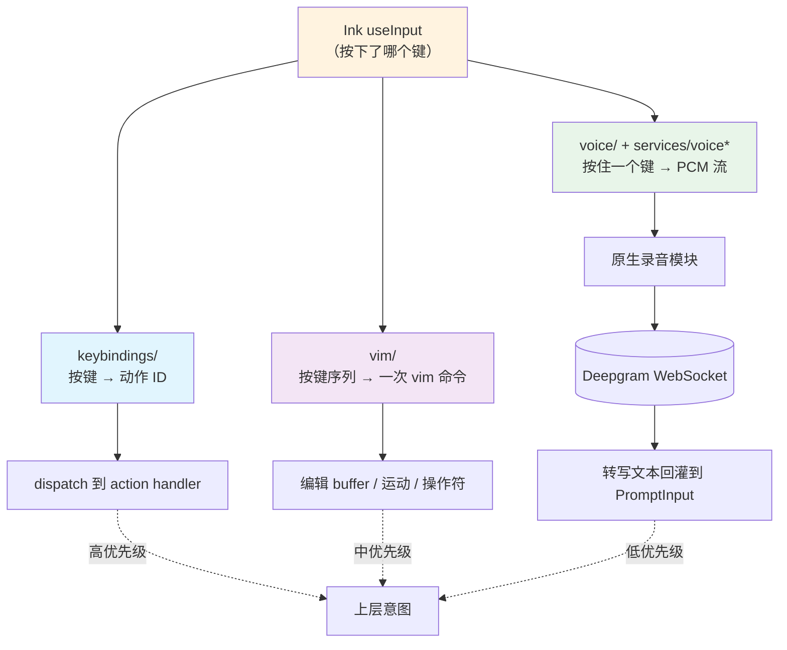

# 第 28 章：Keybindings、Vim 模式与 Voice 输入 — 终端输入层的三种解释

> 本章是《深入 Claude Code 源码》系列第 28 章。我们把 `keybindings/`、`vim/`、`voice/` 三套子系统放在一起讲，因为它们解决的是同一个问题的不同切面：**Ink 给的是"按下了哪个键"，这一层要回答的是"这一下按键意味着什么"**。

## 为什么把这三块放在同一篇里讲？

当你打开终端，敲下 `claude`，REPL 起来之后再按下任意一个键，背后其实不止一条路。Ink 把原始按键事件喂给上层；上层要决定的，是把这一下当成"用户在编辑框里输入字符"，还是当成"快捷键"派给某个动作，还是当成"我此刻按住空格在录音"喂给麦克风。

三种解读模式共用同一条 Ink 输入流，又各自维护一套自己的状态。这正是本章想要拆开看的"输入层"。

放在书脊上看：

- 第 26 章讲了 Ink 的渲染与组件系统；
- 第 27 章讲了组件与设计系统；
- 第 28 章要补的，是介于"原始按键"与"高层意图"之间的那一层胶水。

三套子系统的目录是分开的，但共同点很清晰：都坐在 Ink 的 `useInput` 之上，又都要绕开 Ink 默认的"按一下出一个字符"的语义。

```
keybindings/         # 14 个文件 — 按键 → 动作 ID
vim/                 # 5 个文件  — 按键序列 → 一次完整 vim 命令
voice/, services/voice*, hooks/useVoice* # 按住一个键 → 一段 PCM 流
```

本章按三段来讲：先讲 Keybindings，因为它是其他两套的基础设施；再讲 Vim 状态机；最后讲 Voice 推流——这是少数几个会跳出 React 渲染循环、绕开 Ink、直接和 Node 子进程、原生模块、WebSocket 对话的子系统。

---

## 全景图：同一条按键流被三套子系统分别解释



---

## 一、Keybindings：一套带优先级的按键解析器

### 1.1 为什么这件事值得做成一个子系统？

如果只是"按 Ctrl+C 退出"这种事，写两行 `useInput` 判断就够了，不需要单独造一个子系统。但 Claude Code 走到今天，要面对的是另一种局面：

- **同一个键在不同上下文里要执行不同动作**。比如 `escape`，在聊天框里是"取消刚输入的内容"，在工具卡片打开时是"关闭面板"，在 Vim INSERT 模式里是"切回 NORMAL"；
- **一部分键允许用户自定义覆盖，另一部分键写死不能改**。`Ctrl+C` 不能让用户绑成"插入图片"，否则用户就把自己锁在屋里了；
- **一部分键不是一下完事，是 chord**。要先按 `Ctrl+X` 再按 `Ctrl+E`，才会触发外部编辑器；
- **跨平台键名要做归一化**。macOS 上的 Option 和 Linux 上的 Alt 要当成同一个；
- **Ink 自己有一套对修饰键的奇怪处理**。典型例子是 `Esc` 在 Ink 里会被打上 `meta: true`，上层必须把这层假象抹掉。

任何一条单独看都不大，但叠在一起就需要一套把"原始按键"翻成"动作 ID"的解析层。这就是 `keybindings/` 这个目录的存在理由——一共 14 个 ts/tsx 文件，每一个文件解决上面其中一个问题。

### 1.2 18 个上下文与一张默认绑定表

打开 `keybindings/schema.ts`，文件顶部就是 18 个上下文名：

```typescript
// keybindings/schema.ts:12-32
export const KEYBINDING_CONTEXTS = [
  'Global', 'Chat', 'Autocomplete', 'Confirmation', 'Help',
  'Transcript', 'HistorySearch', 'Task', 'ThemePicker', 'Settings',
  'Tabs', 'Attachments', 'Footer', 'MessageSelector', 'DiffDialog',
  'ModelPicker', 'Select', 'Plugin',
] as const
```

每一个上下文都是聊天界面里一个"此刻你站在哪儿"的子状态：你站在聊天框输入文本，是 `Chat`；自动补全菜单弹出来，是 `Autocomplete`；某个权限确认弹窗站在最前面，是 `Confirmation`。

紧接着 `KEYBINDING_ACTIONS` 在同一个文件里枚举了一长串动作标识符（`schema.ts:64-172`），从最简单的 `app:exit` / `chat:cancel`，到 `chat:cycleMode` / `chat:modelPicker`，再到 `voice:pushToTalk`、`history:search`、`autocomplete:accept`。每一个动作 ID 都是一个字符串，配上 zod 校验的 `KeybindingBlockSchema` / `KeybindingsSchema`（`schema.ts:177-229`）。

zod 这一层是为 user override 服务的。用户写在 settings 里的 JSON 进来之前必须先过一道 schema，否则一个手滑的拼写就会让 REPL 抛出难以追踪的 runtime 错误。

默认绑定表写在 `keybindings/defaultBindings.ts`。这个文件有意把"默认是什么键"和"动作是什么"放在一处，不像有些项目把默认散在十几个 `useInput(...)` 里。读起来你能很快把握住"Claude Code 想给你的按键体验"的全貌。几个跨平台细节值得点出来：

```typescript
// keybindings/defaultBindings.ts:15
// Windows 终端会吃掉 Ctrl+V 的剪贴板粘贴 — 改用 alt+v
const IMAGE_PASTE_KEY = getPlatform() === 'windows' ? 'alt+v' : 'ctrl+v'

// keybindings/defaultBindings.ts:21-30
// 旧 Windows Terminal 在非 VT 模式下吃掉了 shift+tab 这类纯修饰键 chord
const SUPPORTS_TERMINAL_VT_MODE =
  getPlatform() !== 'windows' ||
  (isRunningWithBun()
    ? satisfies(process.versions.bun, '>=1.2.23')
    : satisfies(process.versions.node, '>=22.17.0 <23.0.0 || >=24.2.0'))
const MODE_CYCLE_KEY = SUPPORTS_TERMINAL_VT_MODE ? 'shift+tab' : 'meta+m'
```

Chat 上下文里还有两个 undo 键并列绑同一个动作（`ctrl+_` 和 `ctrl+shift+-`），原因是不同终端对"下划线"键的实际报码不一致。外部编辑器是一个真正的 chord——`ctrl+x ctrl+e`，必须先按 `Ctrl+X` 再按 `Ctrl+E`。推到说话键 `space` 在 Chat 上下文里绑到 `voice:pushToTalk`，并且只在 `feature('VOICE_MODE')` 为 true 时才生效。

整张默认表写下来不到 100 行，但它已经把这个 CLI 的所有按键体验压在一个文件里。后面 `loadUserBindings.ts` 会在这张表的基础上做"叠加"。

### 1.3 Ink 的按键模型与归一化

这一层最绕，也是 PR 评审里最容易翻车的一层。

Ink 把每次按键回调成一个对象，带 `ctrl` / `meta` / `shift` 三个布尔位加上一个 `input` 字符串。问题有两个。

**第一个问题：修饰键命名不一致。** Ink 里没有 `alt`，把 Alt 算到了 `meta` 上；同时 macOS 上真正的 Cmd 键也被算到了 `meta` 上。也就是说 Ink 给你的 `meta: true` 既可能是"按了 Alt"，也可能是"按了 Cmd"。这层歧义如果原样传给配置文件，用户根本写不清楚他想绑什么。

`keybindings/match.ts:60-79` 的 `modifiersMatch` 函数显式做了一个折叠：

```typescript
// keybindings/match.ts:60-79
function modifiersMatch(
  inkMods: InkModifiers,
  target: ParsedKeystroke,
): boolean {
  if (inkMods.ctrl !== target.ctrl) return false
  if (inkMods.shift !== target.shift) return false

  // Alt 和 meta 在 Ink 里都映射到 key.meta — 比较时合并
  const targetNeedsMeta = target.alt || target.meta
  if (inkMods.meta !== targetNeedsMeta) return false

  // Super (cmd/win) 是独立的修饰键 — 只在 kitty 协议下才能区分
  if (inkMods.super !== target.super) return false
  return true
}
```

这意味着大多数场景下你写 `alt+v` 和 `meta+v` 是等价的——这正是 IMAGE_PASTE_KEY 在 Windows 上写成 `alt+v`、在其他平台写成 `ctrl+v` 而不是在 macOS 上特意写成 `meta+v` 的原因。

**第二个问题：Escape 键被 Ink 标成 meta。** 某些终端在收到一个 Escape 之后会立刻把下一个键当成"带 Alt 修饰"的键来上报——这是 xterm 的历史包袱，Ink 直接继承了这种行为。表现是：当你单按 Escape 时，Ink 给你 `input: ''` + `meta: true`，meta 是假的。`match.ts` 对这种情况单独打了个补丁：

```typescript
// keybindings/match.ts:96-102
if (key.escape) {
  return modifiersMatch({ ...inkMods, meta: false }, target)
}
```

把这个假 meta 清掉，否则用户在 Vim INSERT 里按 Escape 永远匹配不上 `escape` 这条默认绑定。这条补丁不长，但它是整个 Vim 子系统能正常工作的隐藏前提。

### 1.4 解析：单按键与 chord 两条路径

`keybindings/resolver.ts` 是真正"按下这一个键，到底匹配到哪个动作"的地方。它同时维护两条路径。

**单按键解析。** `resolveKey` 传入当前激活的上下文列表与用户合成绑定后的全表，输出当前这一下按键应该派给哪个动作——或者 `unbound`：

```typescript
// keybindings/resolver.ts:32-61（核心循环）
const ctxSet = new Set(activeContexts)
let match: ParsedBinding | undefined
for (const binding of bindings) {
  if (binding.chord.length !== 1) continue
  if (!ctxSet.has(binding.context)) continue
  if (matchesBinding(input, key, binding)) match = binding  // last-wins
}
```

规则就一句话：**last-wins**。先用 `new Set(activeContexts)` 把激活上下文做成集合，按这个集合过滤 `bindings`，然后在过滤后的有序数组里按出现顺序找精确匹配——谁排在后面谁赢。

并不存在一个"按上下文优先级排序的查表过程"。`Global` 上下文的绑定永远出现在 `DEFAULT_BINDINGS` 的最前面，所以一旦后面有任何具体上下文绑定了同一个键，那条具体绑定就会盖过 `Global`。

**chord 解析。** `resolveKeyWithChordState` 复杂得多，因为 chord 有一个中间态：已经按了第一个键，正在等第二个键。这个中间态被存在 `pendingChord` 里。

```typescript
// keybindings/resolver.ts:187-221（节选）
const testChord = pending ? [...pending, currentKeystroke] : [currentKeystroke]
const ctxSet = new Set(activeContexts)
const contextBindings = bindings.filter(b => ctxSet.has(b.context))

// 收集所有以 testChord 为前缀的更长 chord
const chordWinners = new Map<string, string | null>()
for (const binding of contextBindings) {
  if (binding.chord.length > testChord.length &&
      chordPrefixMatches(testChord, binding)) {
    chordWinners.set(chordToString(binding.chord), binding.action)
  }
}

// 任何一条非 null 更长 chord 等着，就返回 chord_started
if (hasLongerChords) return { type: 'chord_started', pending: testChord }
```

为什么用一张以 chord 字符串为 key 的 Map？因为要支持"用户在低优先级里 null-解绑某个 chord 之后，同名 chord 不能再让前缀进入等待态"。Map 按 chord 字符串去重，保留 last-wins 的结果——只是为了让前缀检测尊重用户的 unbind 意图。

chord 体系里并不存在另一个"按上下文优先级收集 chordWinners 胜者"的额外通路。所有优先级语义都已经折叠成同一件事：**bindings 数组里靠后的条目盖过靠前的条目；高优先级上下文的绑定通过 last-wins 自然胜过低优先级上下文**。

### 1.5 useKeybinding 的 false 协议

`keybindings/useKeybinding.ts` 是把这套解析层接进 React 组件的桥。每个组件在自己的渲染范围内通过 `useKeybinding('chat:send', handler, { context: 'Chat' })` 注册一对"上下文 + 动作"到 handler 的映射。

这里有两个设计点值得讲。

**第一个是上下文叠加。** 任何时刻"激活上下文"不只是组件自己声明的那一个：

```typescript
// keybindings/useKeybinding.ts:54-60
const contextsToCheck: KeybindingContextName[] = [
  ...keybindingContext.activeContexts,
  context,
  'Global',
]
const uniqueContexts = [...new Set(contextsToCheck)]
const result = keybindingContext.resolve(input, key, uniqueContexts)
```

举个例子：聊天面板里嵌着一个 `Autocomplete` 候选框，候选框注册时声明 `context: 'Autocomplete'`，而 Provider 的 `activeContexts` 里已经压入了 `'Chat'`，这次 `uniqueContexts` 就是 `['Chat', 'Autocomplete', 'Global']`。

这串数组传给 `resolver.ts` 后只用来构成一个 `Set` 过滤 bindings，**并不**按数组顺序"找第一个匹配"。真正的胜负仍然交给 `bindings` 数组本身的 last-wins 规则裁决——具体上下文的绑定排在 `DEFAULT_BINDINGS` 里 `Global` 之后，于是天然胜过 `Global`。

**第二个是 handler 返回值的"false 协议"。**

```typescript
// keybindings/useKeybinding.ts:65-72
case 'match':
  keybindingContext.setPendingChord(null)
  if (result.action === action) {
    if (handler() !== false) {
      event.stopImmediatePropagation()
    }
  }
  break
```

`useKeybinding` 在匹配到自己注册的那条 action 之后会先调一次 handler；如果 handler 返回 `false`，框架就**不会**调 `event.stopImmediatePropagation()`，这次 Ink 输入事件还会继续派发给后续注册的 useInput / useKeybinding。

注意这里 framework 并不会在 `resolve` 内部继续找下一条 binding——`false` 控制的是事件传播，不是继续找下一条。给到调用方的语义是"我条件性地接管这次按键"。比如某个面板只在自己有内容时才响应 `escape`，没内容就把 `escape` 让给下面继续注册的 handler。

### 1.6 哪些键不许动？

`keybindings/reservedShortcuts.ts` 这个文件不长但很有意思。它把"绝对不许用户绑定"的键分成三档：

| 档位 | 键 | 理由 |
|------|----|------|
| `NON_REBINDABLE` | `ctrl+c`、`ctrl+d`、`ctrl+m` | 终止 / EOF / 回车 — 绑了 REPL 没法工作 |
| `TERMINAL_RESERVED` | `ctrl+z`、`ctrl+\` | 挂起 / quit signal — 交给终端处理 |
| `MACOS_RESERVED` | `cmd+q`、`cmd+w`、`cmd+tab` 等 7 条 | macOS 系统级吃掉，终端永远拿不到 |

这一层的存在不是为了功能，是为了"别给用户机会把自己锁在屋里"。所有用户自定义绑定在写回磁盘前都要先过这一道闸。

### 1.7 用户自定义：被特性开关守着

用户自定义绑定加载在 `keybindings/loadUserBindings.ts`。这个文件比想象的要重：不仅要读文件、还要 watch 文件变化、还要做特性闸控。

最外层是一道特性闸：`isKeybindingCustomizationEnabled` 读 Statsig 的 `tengu_keybinding_customization_release` 特性开关。这个 flag 关掉时，用户写了自定义绑定文件也不会被加载——新功能 ramp 期的标准做法。

特性闸通过之后，文件加载是同步加异步混合的：

- 首次启动时 `loadKeybindingsSyncWithWarnings` 同步读一次，确保 REPL 起来的第一帧就拿到了用户绑定；
- 之后用 chokidar 起一个 watcher 监听用户配置文件的写入；
- watcher 有一道 `FILE_STABILITY_THRESHOLD_MS = 500` 的防抖——编辑器保存大文件时会触发多次 write 事件，等到事件停止 500ms 之后才真正重新加载；
- 重新加载时如果发现自定义绑定数 > 0，会按"每天最多打一次"的节流走一次 telemetry。

合成后的绑定表用一条简单的规则叠加默认表：用户绑定的 `(context, action)` 对会覆盖默认表里同 `(context, action)` 的条目。chord 也是一等公民，用户可以重新绑某个 chord 或者把某个 chord 解绑——绑到一个特殊的 `null` 值即可。`chordWinners` 那张 Map 在收集候选时显式保留 null，意味着用户即使在低优先级上下文里"解绑"了一个 chord，也能让高优先级上下文里的同一 chord 不再生效。

---

## 二、Vim：把 11 种状态串成一台编辑器

### 2.1 为什么 Vim 这一段值得单独讲？

终端里的输入框做 Vim 模式，有两种典型做法。

一种是 textarea 加一组 keymap，按下哪个键执行哪段代码。做到 `i` / `a` / `x` 这种单字符命令时还行，做到 `3dw` / `gg` / `cit` 这种带计数、带 motion、带 text object 的复合命令时就会变成一团乱麻。

另一种做法是显式建一个状态机，把"我按到一半"这件事变成一个一等的"中间状态"，让每一次按键都是一次状态转移。Claude Code 走的是后一条路：

```typescript
// vim/types.ts:59-75
export type CommandState =
  | { type: 'idle' }
  | { type: 'count'; digits: string }
  | { type: 'operator'; op: Operator; count: number }
  | { type: 'operatorCount'; op: Operator; count: number; digits: string }
  | { type: 'operatorFind'; op: Operator; count: number; find: FindType }
  | { type: 'operatorTextObj'; op: Operator; count: number; scope: TextObjScope }
  | { type: 'find'; find: FindType; count: number }
  | { type: 'g'; count: number }
  | { type: 'operatorG'; op: Operator; count: number }
  | { type: 'replace'; count: number }
  | { type: 'indent'; dir: '>' | '<'; count: number }
```

整套 Vim 子系统挂在外层一个更简单的状态变量上：

```typescript
// vim/types.ts:49-51
export type VimState =
  | { mode: 'INSERT'; insertedText: string }
  | { mode: 'NORMAL'; command: CommandState }
```

INSERT 里没有任何状态机，就是普通的文本输入；NORMAL 里挂着上面那个 11 变体的子状态机。模式之间靠 `Escape` 与 `i` / `a` / `o` 等键切换。

下面把 11 个变体一一对到一个最小输入序列，方便边读边复现：

| # | 变体 | 触发序列 | 含义 |
|---|------|--------|------|
| 1 | `idle` | （初始） | NORMAL 下未按任何键 |
| 2 | `count` | `3` | 已输入计数前缀，等下一个动作 |
| 3 | `operator` | `d` | 已输入算子，等 motion |
| 4 | `operatorCount` | `d3` | 算子之后再输入计数（最终如 `d3w`） |
| 5 | `operatorFind` | `df` | 算子 + `f`/`F`/`t`/`T`，等下一个字符（如 `df,`） |
| 6 | `operatorTextObj` | `di` | 算子 + `i`/`a`，等 text object（如 `diw`、`ci"`） |
| 7 | `find` | `f` | NORMAL 下 `f`/`F`/`t`/`T`，等目标字符 |
| 8 | `g` | `g` | `g` 前缀，等下一个键（如 `gg`） |
| 9 | `operatorG` | `dg` | 算子 + `g` 前缀（如 `dgg`） |
| 10 | `replace` | `r` | `r` 前缀，等替换字符 |
| 11 | `indent` | `>` 或 `<` | 缩进算子，等 motion（如 `>>`、`<j`） |

### 2.2 从 idle 走到一个完整命令

`vim/transitions.ts` 是这台状态机的派发表。`transition` 函数是一个 switch，按当前状态名字分派到对应的 `fromXxx` 函数：

```typescript
// vim/transitions.ts:59-87（精简骨架）
export function transition(state, input, ctx) {
  switch (state.type) {
    case 'idle':            return fromIdle(input, ctx)
    case 'count':           return fromCount(state, input, ctx)
    case 'operator':        return fromOperator(state, input, ctx)
    // operatorCount / operatorFind / operatorTextObj / find /
    // g / operatorG / replace / indent —— 同形派发，共 11 case
  }
}
```

整个文件的形态就是 11 个 `fromXxx` 函数，加上两个公共的处理片段 `handleNormalInput` 与 `handleOperatorInput`。

来追一遍 `3dw`：

1. 起点是 `idle`。按下 `3`，`fromIdle` 走到 `/[1-9]/` 分支，进入 `{ type: 'count', digits: '3' }`；
2. 现在是 `count`。按下 `d`，`fromCount` 把 `digits` 解析成 `count = 3`，调用公共的 `handleNormalInput('d', 3, ctx)`。在那里 `isOperatorKey('d')` 命中，返回 `{ next: { type: 'operator', op: 'delete', count: 3 } }`；
3. 现在是 `operator`。按下 `w`，`fromOperator` 走到 `handleOperatorInput('delete', 3, 'w', ctx)`，那里 `SIMPLE_MOTIONS.has('w')` 命中，返回 `{ execute: () => executeOperatorMotion('delete', 'w', 3, ctx) }`；
4. `executeOperatorMotion`（`operators.ts:42-54`）拿 cursor 当前位置，调 `resolveMotion('w', cursor, 3)` 得到目标 cursor，再调 `getOperatorRange` 得到删除区间，最后调 `applyOperator('delete', from, to, ctx)`。同时把这次操作记到 `RecordedChange` 里供 `.` 重放。

`3d3w` 多出来的那一段：从 `operator` 状态按下 `3`，`fromOperator` 落到 `/[0-9]/` 分支，进入 `operatorCount` 状态，把第二段 count 收集起来。再按 `w` 时，`fromOperatorCount` 把两段 count 相乘——`state.count * motionCount`——得到 `9`，再调 `handleOperatorInput('delete', 9, 'w', ctx)`。语义和 vim 真机一致：`3d3w` 等价 `d9w`，删 9 个 word。

`di(`：从 `operator` 按下 `i`，`isTextObjScopeKey('i')` 命中，进入 `operatorTextObj` 子状态。再按 `(`，`fromOperatorTextObj` 在 `TEXT_OBJ_TYPES` 里查到 `(`，调 `executeOperatorTextObj('delete', 'inner', '(', 1, ctx)`，让 `findTextObject` 找到包围当前 cursor 的那对括号，删掉中间内容。

`df,`：从 `operator` 按下 `f`，`FIND_KEYS.has('f')` 命中，进入 `operatorFind`。再按 `,`，`fromOperatorFind` 调 `executeOperatorFind('delete', 'f', ',', 1, ctx)`，让 cursor 走到下一个 `,` 处，删除区间。

11 个状态变体每一个都对应一种"按到一半"的中间态。但读到这里你应该已经看出来：这套状态机的 fan-out 在 `handleNormalInput` 与 `handleOperatorInput` 这两个公共片段里就被收敛了，每一个具体的 `fromXxx` 函数都很短，多数 10 到 30 行。整张状态表能塞进同一个文件读起来。

### 2.3 count 的上限与溢出

vim 允许 `9999dd` 这种"一次性"操作，但不能让用户敲一长串 `9` 把字符串溢出成天文数字。`types.ts:182` 定了 `MAX_VIM_COUNT = 10000`：

```typescript
// vim/transitions.ts:272
const newDigits = state.digits + input
const count = Math.min(parseInt(newDigits, 10), MAX_VIM_COUNT)
```

`fromCount` 与 `fromOperatorCount` 在每次拼接新 digit 时都会这样截一刀。这条上限既是防 OOM，也是防一个手抖按住数字键的用户把整个 REPL 卡死。

### 2.4 dot-repeat：状态机外面的一个 ref

`.` 命令在 vim 里是"重放最近一次修改"。状态机本身是无副作用的——它只描述"现在按下一个键，状态转到哪里、要不要执行某个动作"。要让 `.` 工作，必须在状态机外面另开一个口子，把"最近一次修改"记下来。

`vim/types.ts:92-119` 定义了 `RecordedChange` 这个 discriminated union，列出了所有可重放的修改类型——`operator` / `operatorFind` / `operatorTextObj` / `x` / `replace` / `toggleCase` / `join` / `indent` / `openLine` 等。每一个具体的 operator 函数在结尾都会调一次 `ctx.recordChange({ ... })`，把刚执行完的这次操作压到一个 ref 里。

按下 `.` 时，`fromIdle` 通过 `handleNormalInput` 走到 `'.'` 分支，调 `ctx.onDotRepeat?.()`。上层钩子 `hooks/useVimInput.ts:109-173` 的 `replayLastChange` 读出最近的 `RecordedChange`，按 type 派回对应的 execute 函数。

INSERT 模式下敲入的字符并不是逐键写入 `RecordedChange`，而是在 `switchToNormalMode` 里整段提交一次：退出 INSERT 时把这段时间累积的 `insertedText` 打包成 `{ type: 'insert', text }`（`hooks/useVimInput.ts:61-68`），随后 `.` 重放时 `replayLastChange` 命中 `'insert'` 分支，再调用 `cursor.insert(change.text)` 把整段插入回放出来。所有 NORMAL 模式下的修改加上这一段 INSERT 序列，都能被 `.` 复现。

### 2.5 Escape 没走 Keybindings？

如果你把 Vim 子系统读完，会注意到一个奇怪的地方：`Escape` 切回 NORMAL 不在 Keybindings 里——它直接写死在 `hooks/useVimInput.ts:189-195` 的 `useInput` 回调里，而不是注册成 `vim:enterNormal` 让 Keybindings 系统派发。

源码里有一段注释解释了原因：Escape 在 INSERT 模式里要立刻起作用，且它的语义是"清空一切中间状态、回到一个稳定基线"——这正是用户在 panic 时按 Escape 的诉求。让它绕开按键解析层、直接在最贴近 Ink 输入的钩子里硬接，可以确保任何上层注册的 handler 都不会先把 Escape 消费掉。

这是一处"有意识地不统一"的设计选择。Keybindings 系统是基础设施，但基础设施不必无差别覆盖所有按键——Escape 是 INSERT/NORMAL 切换的权威按键，写死比让它经过一层注册表更安全。

### 2.6 几个小细节

- 方向键在 NORMAL 模式下被映射到 hjkl：上下两键映射到 j/k、剩下两键映射到 h/l，由 `useVimInput.ts:265-268` 在 input 进入状态机之前转译；
- Backspace 在 NORMAL 模式下也被映射到 `h`，但只在状态机正在"等 motion"的时候，否则按 Backspace 什么都不做——避免用户在 idle 状态下用 Backspace 误删字符；
- `dd` / `cc` / `yy` 这种"操作整行"的双字符命令在 `fromOperator` 里有一个专门分支：当第二个键和第一个 operator 同字母时直接走 `executeLineOp`，不进入 motion 流程；
- `gg` / `gj` / `gk` 在 `g` 状态里分支处理，`5gg` 这种带 count 的 `g` 单独走"跳到第 N 行"。

整体上，Vim 子系统的代码结构是"状态机决定意图、operator 函数决定副作用、`hooks/useVimInput.ts` 把它接进 Ink 输入流"。三层职责分得很干净。

---

## 三、Voice：从一颗按住的空格键到 Deepgram

### 3.1 Voice 的特殊性

Voice 是这一篇里最不像"输入子系统"的子系统。它的"输入"是从麦克风录到的 PCM 流，最终落点是后端 STT 服务返回的一段文本，然后被塞进聊天框。中间要经过：

1. 一个特性闸——关停可控；
2. 一个鉴权闸——只允许 Anthropic OAuth；
3. 一段录音管道——原生 / arecord / SoX 三档回落；
4. 一条 WebSocket 推流——带心跳、带 finalize 协议；
5. 一个按住空格键的 UI 状态机——短按 / 长按 / 取消的时序；
6. 一个语言归一化层——20 个 BCP-47 语言代码。

每一段都不复杂，但只要中间任何一段出问题，"按住空格说话"这件事就会以"什么都没发生"的方式失败。而这种失败往往要花一个下午才能复现，所以每一段都被打上了 telemetry 和回退。

### 3.2 双闸：特性 + 鉴权

`voice/voiceModeEnabled.ts` 只有几十行，但它是 Voice 的总开关：

```typescript
// voice/voiceModeEnabled.ts:16-54（精简）
export function isVoiceGrowthBookEnabled(): boolean {
  return feature('VOICE_MODE')
    ? !getFeatureValue_CACHED_MAY_BE_STALE('tengu_amber_quartz_disabled', false)
    : false
}
export function hasVoiceAuth(): boolean {
  if (!isAnthropicAuthEnabled()) return false
  return Boolean(getClaudeAIOAuthTokens()?.accessToken)
}
export const isVoiceModeEnabled = () => hasVoiceAuth() && isVoiceGrowthBookEnabled()
```

第一道闸是 `tengu_amber_quartz_disabled` 这个 GrowthBook 特性。注意名字里的 `disabled`——这是一个"反向 kill switch"，true 表示"关闭 Voice"。当线上 Voice 出问题需要紧急关停时，运维端把这个 flag 翻 true 就行，不需要发新版本。

第二道闸是鉴权类型检查：当前会话必须是 Anthropic OAuth——不是 API key、不是 Bedrock、不是 Vertex。这一条限制不仅是商业边界——Voice 的 STT 走 Anthropic 后端代付的 Deepgram，也是隐私边界——音频流不允许走第三方代理。

前面 Keybindings 那一节提到 `space → voice:pushToTalk` 这条默认绑定被 `feature('VOICE_MODE')` 守着——这个 `feature('VOICE_MODE')` 最后查的就是这两道闸的与。

React 端把上面这一组判定再裹一层：`hooks/useVoiceEnabled.ts` 把"用户在 settings 里有没有打开 voice"、"是否鉴权过"、`isVoiceGrowthBookEnabled()` 三者合并成一个布尔暴露给上层组件——也就是把 settings、鉴权、kill switch 拢到一个 hook 里，避免每个调用方都重写一遍这套合谋逻辑。

### 3.3 录音管道：三档回落

`services/voice.ts` 里 `startRecording`（`voice.ts:335-396`）是录音入口。它按平台加依赖可用性挑一档实现，挑选顺序固定：

```typescript
// services/voice.ts:335-396（精简骨架）
export async function startRecording(...): Promise<boolean> {
  const napi = await loadAudioNapi()
  if (napi.isNativeAudioAvailable() && napi.startNativeRecording(...)) return true
  if (process.platform === 'win32') return false  // Windows 无回退
  if (process.platform === 'linux' && hasCommand('arecord')
      && (await probeArecord()).ok) return startArecordRecording(...)
  return startSoxRecording(...)  // 第三档兜底
}
```

**第一档是 cpal**——一段用 Rust 写的、通过 N-API 暴露给 Node 的原生录音模块。`loadAudioNapi`（`voice.ts:24-36`）做的是 dlopen 的 lazy 加载：进程启动时不立刻 load，第一次按下空格键开始录音时才 load。理由有两层：一是不影响 REPL 的冷启动时间；二是如果用户压根不会用 Voice，那个 `.node` 文件就连进程地址空间都不进。

**第二档是 arecord**——Linux 上 ALSA 的命令行录音工具。但 arecord 不是装了就能跑的，有些容器或 WSL 环境里 ALSA 装了但没有声卡设备。`probeArecord`（`voice.ts:75-118`）做了一个 150ms 的 race：起一个 arecord 子进程，等它要么报错退出、要么 150ms 内还没退出说明它真的能跑，然后立刻 kill 掉。结果被 memoize 起来，整个进程生命周期里只探一次。

`linuxHasAlsaCards`（`voice.ts:130-139`）是 arecord 的前置：直接读 `/proc/asound/cards` 文件，里面如果只有 `--- no soundcards ---` 这一行就说明系统级没有声卡设备，连 arecord probe 都不必跑。这是一个早返优化，避免 150ms 的探测延迟。

**第三档是 SoX 的 `rec` 命令**——给 macOS / Linux 上装了 sox 的用户兜底用。

三档的输出参数被统一成同一组：

```typescript
// services/voice.ts:40-45
const RECORDING_SAMPLE_RATE = 16000   // 16 kHz
const RECORDING_CHANNELS = 1          // 单声道
// Signed 16-bit Little-Endian PCM
const SILENCE_DURATION_SECS = "2.0"
const SILENCE_THRESHOLD = "3%"
```

三档不论谁顶上，下游拿到的字节流形态一致。SoX 的 `rec` 支持"静音自动停止"参数，意思是连续 2 秒的音量都低于阈值 3% 就自动断录；原生 cpal 走的是另一条路径——由上层的 `FOCUS_SILENCE_TIMEOUT_MS = 5000` 在 hooks 层定时检查。

### 3.4 WebSocket 推流：心跳 + 双重 finalize

`services/voiceStreamSTT.ts` 是把 PCM 字节推到后端 STT 服务的那一段。

```typescript
// services/voiceStreamSTT.ts:36-47
const VOICE_STREAM_PATH = '/api/ws/speech_to_text/voice_stream'
const KEEPALIVE_INTERVAL_MS = 8_000

export const FINALIZE_TIMEOUTS_MS = {
  safety: 5_000,
  noData: 1_500,
}
```

WebSocket 走 `/api/ws/speech_to_text/voice_stream` 这个 path，跑在 Anthropic 后端，由它代理到 Deepgram。这里走自家后端再代理而不是让客户端直连 Deepgram，是为了把第三方 API key 留在服务端，同时让 Anthropic 自己有一层对音频请求的鉴权、限流、审计与计费切入点。建连之后客户端开始按帧推 PCM，同时维护两条计时器：

- **心跳**：每 8 秒发一条 ping，让中间件不要把空闲连接关掉；
- **finalize 计时器**：分两条。`noData: 1500` 毫秒——如果连续 1.5 秒没有新的 PCM 进来，就主动发 finalize 让服务端把当前帧的识别结果收尾返回。`safety: 5000` 毫秒——用户按完松开后无论如何 5 秒兜底 finalize 一次，避免某些边界场景下 noData 没触发就把会话挂着。心跳和 finalize 在同一个事件循环里互不相干：心跳关心的是连接的存活，finalize 关心的是这一轮"按住—说话—松开"的语义边界。把这两件事拆成两条计时器而不是合并成一条状态机，是因为它们的故障模式完全不同：心跳失败时连接可能还活着只是网络抖动，finalize 失败时连接活得好好的但用户已经在等结果了。

`FinalizeSource` 列出 finalize 的五种结算源：

```typescript
// services/voiceStreamSTT.ts:60-65
export type FinalizeSource =
  | 'post_closestream_endpoint'  // 正常收尾，CloseStream 后服务端给出 endpoint 包
  | 'no_data_timeout'            // CloseStream 后服务端零回包 — silent-drop 兜底
  | 'safety_timeout'             // 兜底 5 秒
  | 'ws_close'                   // WebSocket 主动关闭时落定
  | 'ws_already_closed'          // finalize 调用时连接已经关掉
```

这个 union 主要是 telemetry 用。后端关心的是"这条会话是怎么收尾的"，按这五种分桶上报，silent-drop 的指纹——`no_data_timeout`——单独成桶以便追踪。

值得停下来看一眼 `no_data_timeout` 这个值的存在感。它不是异常路径，是常态下兜底路径之一。一个干净的 STT 协议本应该是"客户端 CloseStream → 服务端回 endpoint → 客户端收到、落定"，但分布式系统里这个握手很容易在最后一步丢掉：服务端可能因为内部超时直接关流不再回包，也可能 endpoint 包丢在 WebSocket 关闭事件之前到达，但被 Node 端事件循环里更早的 close 事件给抢了。`no_data_timeout` 是一个明确的"我等了 2 秒服务端没说话，我自己宣布结束"——把这种端到端的不确定性从协议失败降级为正常计费路径。这条经验后续放到第五节的"可迁移模式"里再讲一次：**只要一条网络协议的收尾事件存在丢失可能性，客户端就必须用本地计时器把它"撤回"成自己可控的状态机转移**。

服务端的语言模型可以选。Deepgram 默认走 Nova 2，灰度阶段引入了 Nova 3，由 `tengu_cobalt_frost` 这个特性开关（`voiceStreamSTT.ts:157-165`）决定。同一段音频在两个模型上识别准确度可以差 5%，但 Nova 3 服务端成本更高，所以走 ramp。

### 3.5 按住空格的 UI 时序

`hooks/useVoice.ts` 是 Voice 在 React 端的核心钩子。这个文件读起来最难——不是因为复杂，而是因为它要处理一个看起来很简单实际很微妙的交互：按住空格说话。

考虑下面几种用户行为：

1. **真按住**：用户按下空格，听到提示音，开始说话，2 秒后松开。
2. **点一下**：用户只是想插入一个空格字符，按下立刻松开。
3. **快速重复**：用户按下、松开、按下、松开——是想说两次还是想 typo？
4. **按下但不说话**：用户按下空格、走神 5 秒不说话——是中途取消还是技术故障？

为了把这几种情况分清楚，`useVoice.ts` 维护了几条计时器：

| 计时器 | 值 | 用途 |
|--------|-----|------|
| `RELEASE_TIMEOUT_MS` | 200ms | 松开之后 200ms 内的再次按下当成"同一次按住的抖动" |
| `FIRST_PRESS_FALLBACK_MS` | 2000ms | 按下之后 2 秒还没收到音频自动认为这次按下没成立 |
| `REPEAT_FALLBACK_MS` | 600ms | xterm 的 key auto-repeat 把"持续按住"报成"连续按下"——600ms 内合并成同一次"按住中" |
| `FOCUS_SILENCE_TIMEOUT_MS` | 5000ms | 录音中连续 5 秒静音，主动 finalize 一次 |

这四个常数加在一起，把"按住空格"这个看起来最简单的交互压成了一个相对鲁棒的状态机。少任何一条都会有用户报"我按了没反应"或者"我按了一下它就一直在听"。

UI 反馈侧还有一个细节：录音时 status bar 会显示一个音量电平条。`computeLevel`（`useVoice.ts:185-197`）从最近一帧 PCM 算 RMS，开方一下做曲线压缩，再映射到 `AUDIO_LEVEL_BARS = 16` 档。开方是为了让用户感觉的"刻度"接近 log——人对响度的感知本来就是对数的。

### 3.6 20 种语言与 fallback 到英文

Voice 支持 20 个语言 base code（`hooks/useVoice.ts:93-114`，`SUPPORTED_LANGUAGE_CODES`）：

```typescript
// hooks/useVoice.ts:93-114
const SUPPORTED_LANGUAGE_CODES = [
  'en', 'es', 'fr', 'ja', 'de', 'pt', 'it', 'ko', 'hi', 'id',
  'ru', 'pl', 'tr', 'nl', 'uk', 'el', 'cs', 'da', 'sv', 'no',
]
```

这一层是 GrowthBook `speech_to_text_voice_stream_config` 允许列表的子集——发送一个不在 allowlist 里的代码，服务端会直接关连接。注意这里**没有**区域变体——`en-US` / `en-GB`，也**没有**中文——`zh-CN` / `zh-TW`，要识别的是 base code 这一层。

`normalizeLanguageForSTT`（`useVoice.ts:121-134`）做的是把用户在系统里设置的语言代码映射到 STT 服务能理解的代码：完全匹配的——lowercase 与 trim 之后——直接走、不在 allowlist 但 `LANGUAGE_NAME_TO_CODE` 里有名字映射的走那条、再不济按 `-` 切出 base 子串去查 allowlist，例如 `en-NZ` → `en`，都不命中就兜底到 `DEFAULT_STT_LANGUAGE`，同时把原始输入挂在 `fellBackFrom` 上让上层提示用户。

兜底到英文不是傲慢，是 Deepgram 在英文上准确率最高、且英文 fallback 之后用户至少能知道"这里说了一段不识别的话"，不至于完全没有反馈。

### 3.7 三条 slash 命令把这一切交回给用户

这三套子系统对用户暴露的"开关面板"是三条同名 slash 命令，分别落在 `commands/keybindings/`、`commands/vim/`、`commands/voice/` 三个目录里：

| 命令 | 文件 | 做什么 |
|------|------|--------|
| `/keybindings` | `commands/keybindings/keybindings.ts` | 打印当前合成绑定表 + 用户绑定文件路径，提供 reset 子命令清空用户自定义绑定 |
| `/vim` | `commands/vim/vim.ts` | 切换 vim 模式的持久化设置 — 下一次 `useVimInput` 起来时按新值决定要不要装那台 11 变体的状态机 |
| `/voice` | `commands/voice/voice.ts` | 切换 `settings.voiceEnabled` — `useVoiceEnabled.ts` 合谋判定里的"用户意图"位 |

三条命令本身的实现都很短——真正的逻辑都在前面三节讲过的那张表、状态机、合谋判定里。slash 命令只是把"切换开关 / 查看当前状态"这件最薄的事，留给用户能在 REPL 里直接打出来。

---

## 四、把三段串起来：为什么"输入层"值得作为一篇？

写到这里你应该能看出一个共同的形态：**这三套子系统都是在 Ink 的原始按键事件之上，套一层语义解释**。

| 子系统 | 语义解释 | 复杂度来源 |
|--------|---------|-----------|
| Keybindings | 按键 → 动作 ID | 跨上下文叠加、chord、用户覆盖 |
| Vim | 按键序列 → 一次完整 vim 命令 | 11 变体状态机的"按到一半"中间态 |
| Voice | 按住一个键的持续时间 → 一段音频流 | 毫秒级时序、三档录音回落、双重 finalize |

三套都各自决定了一组"哪一刻按一个键意味着什么"的语义，但都需要先经过同一道 Ink 输入流。换句话说，Ink 给的是"按下了什么键"，这一篇讲的子系统给的是"这意味着什么"。

也正是因为这层语义解释在三处分别独立实现，导致了一些有趣的协作问题：

- Voice 的 `space` 绑定走 Keybindings 注册；
- Vim 的 Escape 故意不走 Keybindings 而是写在 `useVimInput.ts` 里；
- Vim 状态机激活时整批按键被"吞"掉不进 Keybindings。

这些都是子系统边界处的妥协。读懂这些妥协，比读懂任何单个状态机都更接近 Claude Code 输入层的真实形态。

---

## 五、可迁移的设计模式

这一篇的三个子系统，对其他 CLI / TUI 项目可以直接借鉴的有四条模式。

### 模式 1：上下文叠加 + last-wins，替代显式优先级表

Claude Code 的 keybindings 没有任何"优先级数字"，也没有显式的 "context priority order" 表。它把所有绑定按出现顺序排进一个数组，激活上下文只用来过滤，胜负完全由数组顺序裁决——`Global` 排最前，具体上下文排后，用户自定义排最后。

**适用场景**：任何需要"基础默认 + 业务覆盖 + 用户覆盖"分层覆盖的配置系统。比起每加一档就要重新分配优先级数字，按数组顺序追加要稳定得多。

### 模式 2：把"按到一半"显式化成一等状态

Vim 状态机的 11 个变体本质上是"按一半的中间结果"。把这种中间态显式建模成一等状态，配合 TypeScript 的 discriminated union 让 switch 强制穷尽，比"在 keymap 函数里塞一堆 if-else 跟着可变变量"清晰得多。

**适用场景**：任何"用户的一次完整意图需要多次按键累积"的交互——命令面板的多步参数输入、配置向导、Vim 风格快捷键、表单 wizard。

### 模式 3：双反向 kill switch + 多重回退

Voice 用了两条"反向"开关：一个 GrowthBook `tengu_amber_quartz_disabled` 的紧急关停，一个 `feature('VOICE_MODE')` 的编译期门控。再叠一个三档录音回退（native → arecord → SoX）和两条 finalize 计时器（noData 1.5s / safety 5s）。

**适用场景**：任何"线上必须可关停、客户端依赖原生模块、依赖外部服务"的功能。kill switch 让运维端不用发版就能止血；回退链让最常见的失败模式不会变成"什么都没发生"。

### 模式 4：基础设施允许局部"故意不统一"

Keybindings 是按键派发的基础设施，但 Vim 的 Escape 故意绕过这套基础设施直接写在 `useInput` 回调里——因为 Escape 是 INSERT/NORMAL 切换的"权威按键"，不能让任何上层 handler 拦截。

**适用场景**：当一条横切关注点已经成为基础设施时，要给少数"权威路径"留逃生口，不要追求 100% 的统一性。基础设施的覆盖率不是越高越好。

---

## 六、实战示例：在 5 分钟内给自己绑一个 chord

下面这个示例完整演示了如何利用本章讲到的几条机制，给自己加一组 chord 绑定。

**目标**：把 `ctrl+k ctrl+t` 绑到 `app:toggleTodos`，覆盖原来的 `ctrl+t` 单键绑定。

**步骤 1：在用户 settings 里写入自定义绑定文件**

```jsonc
// ~/.claude/keybindings.json
{
  "$schema": "...",
  "bindings": [
    {
      "context": "Global",
      "bindings": {
        // 用 null 解绑原默认
        "ctrl+t": null,
        // 用 chord 重新绑
        "ctrl+k ctrl+t": "app:toggleTodos"
      }
    }
  ]
}
```

**步骤 2：理解会发生什么**

1. 启动时 `loadKeybindingsSyncWithWarnings` 同步读这份文件——`isKeybindingCustomizationEnabled` 这道闸要先打开，否则文件被忽略；
2. 这份用户绑定被追加到默认 `DEFAULT_BINDINGS` 数组后面；
3. 你按 `ctrl+t`：`resolveKey` 命中你的 `null` 条目，返回 `unbound`，事件被 swallow，**不会**误派给老绑定；
4. 你按 `ctrl+k`：`resolveKeyWithChordState` 在 `chordWinners` 里找到 `ctrl+k ctrl+t` 这条更长 chord，返回 `chord_started`，`pendingChord` 被设上；
5. 你按 `ctrl+t`：testChord 变成 `[ctrl+k, ctrl+t]`，命中 exact match，触发 `app:toggleTodos`。

**步骤 3：常见踩坑**

- **`ctrl+c` 想绑成别的动作**——会失败，`reservedShortcuts.ts` 的 `NON_REBINDABLE` 闸会拦下；
- **绑到一个不存在的 action ID**——zod schema 校验会在加载时报错，文件根本不进合成表；
- **保存后 REPL 没反应**——chokidar watcher 有 500ms 防抖，等半秒；
- **`ctrl+k ctrl+t` 绑了，但 `ctrl+k` 单键还会触发别的动作**——这是正常行为：单键绑定可以与同前缀的 chord 共存，只是单键的派发被"延迟"到 chord 等待态超时之后。

---

## 下一章预告

[第 29 章：Buddy 宠物 — 在 PromptInput 边上养一只随机生成的小动物](./29-Buddy宠物.md)

我们看 buddy/ 目录下的 6 个源码文件，以及它们怎么悄悄接进 REPL、PromptInput、配置、附件、消息流——最后挤出一只会眨眼、会冒话框的小动物。

---
*全部内容请关注 https://github.com/luyao618/Claude-Code-Source-Study (求一颗免费的小星星)*
