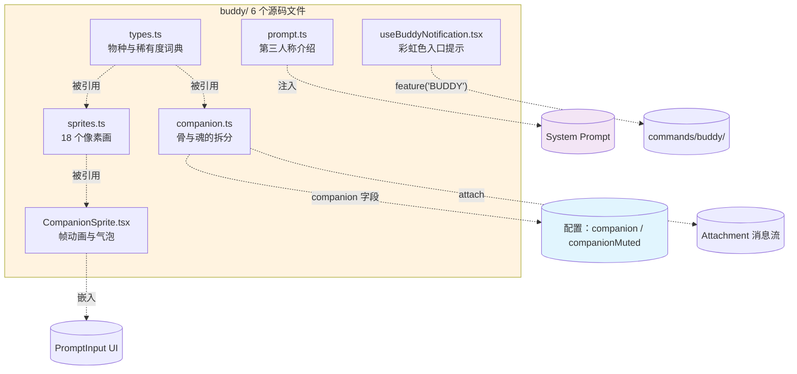

# 第 29 章：Buddy 宠物 — 在 PromptInput 边上养一只随机生成的小动物

> 本章是《深入 Claude Code 源码》系列第 29 章。我们要看的，是 `buddy/` 目录下的 6 个源码文件，以及它们怎么悄悄接进 REPL、PromptInput、配置、附件、消息流——最后在一个本来全是黑底白字的终端里，挤出一只会眨眼、会冒话框、会被你按 Enter 摸一下脑袋的小动物。

## 为什么单独写一篇讲一只小动物？

终端是个寸土寸金的世界。每多画一行像素，都要回答一句"凭什么不让位给输出"。可这一回，Claude Code 偏偏在输入框右边塞进了一只小宠物：它有名字、会偶尔眨眼、按回车会冒爱心，对话刚结束还会弹个圆角小气泡评论两句。

听起来像个一百行就能搞定的小玩意，但真要往一个严肃工具里塞一只宠物，避不开下面这五个问题：

1. **同一个人每次启动看到的会是同一只吗？** 每次重新随机就成了一次性噱头；全存配置文件，又怕用户清掉 `~/.claude.json` 那只就永别了。
2. **终端只有 80 列时怎么办？** 12 列宽的小动物硬塞进一个已经在挤滚动条的窗口，输入框直接崩。
3. **大模型会不会被带跑，自己开始扮演这只小动物？** 系统提示里冒出"你是只叫 Sproink 的鸭子"，下一句它八成就 `*quack*` 了。
4. **没开 Buddy 的渠道，能不能让这一整摊代码彻底不进二进制？** 一个彩蛋功能要是占了 critical path，是说不过去的。
5. **怎么让人发现这个隐藏功能、又不打扰那些不想要它的人？** 弹个明黄色公告会被骂，藏到 `--help` 里又没人看。

Claude Code 的答案可以一句话概括：**把"骨"和"魂"切开存，把渲染、出现、声明、命令、入口五件事分别接进现成的子系统，再用两道编译期门加一道运行期门，把整个 Buddy 在大多数构建里藏到一字节都不剩**。`buddy/` 目录里六个文件加起来 1298 行（`companion.ts` 133、`prompt.ts` 36、`sprites.ts` 514、`types.ts` 148、`CompanionSprite.tsx` 370、`useBuddyNotification.tsx` 97），刚好对应这五个问题一一作答：

- `companion.ts` 管"骨"和"魂"的拆分与生成
- `types.ts` 管物种与稀有度的小词典
- `sprites.ts` 管 18 个物种的 ASCII 像素画
- `CompanionSprite.tsx` 管帧动画与气泡
- `prompt.ts` 管给大模型的"第三人称介绍"
- `useBuddyNotification.tsx` 管短窗口里的彩虹色入口提示

本章也按这个顺序拆：先看"骨与魂"怎么切（§一）、18 个物种的名字怎么躲过打包扫描（§二）、500ms 一拍的眨眼摸头怎么转起来（§三）、窄屏和全屏两种排版怎么各让一步（§四）、第三人称介绍怎么把小动物钉在"旁观者"位置（§五）、最后看 `/buddy` 入口、彩虹高亮、footer 和两道编译门如何把 Buddy 整体藏起来（§六）。后两节是可以照搬到自己项目里的设计模式（§七）和一份"想在 PromptInput 边上塞个小装饰" walkthrough（§八）。

---

## 全景图：六个文件如何挂进五个子系统



---

## 一、骨与魂：一半算出来，一半存下来

打开 `buddy/types.ts:100-124`，能看到 `Companion` 这个类型被一刀切成两半：

```typescript
// buddy/types.ts:100-124
export type CompanionBones = {
  rarity: Rarity;
  species: Species;
  eye: Eye;
  hat: Hat;
  shiny: boolean;
  stats: Record<StatName, number>;
};

export type CompanionSoul = {
  name: string;
  personality: string;
};

export type Companion = CompanionBones & CompanionSoul & { hatchedAt: number };
export type StoredCompanion = CompanionSoul & { hatchedAt: number };
```

`Bones`（骨）是稀有度、物种、眼神、帽子、是否闪光、五维属性——这些字段都能从一颗稳定种子算回来，属于"派生数据"。`Soul`（魂）只有两样：模型给它起的名字，和模型生成的人格描述——这俩没法回算，只能存。`hatchedAt`（孵化时间戳）是外层字段，不在 Soul 里。落盘的 `StoredCompanion` 干脆把骨头一字节都不存。

为什么这样切？看 `companion.ts` 里 `getCompanion()` 的最后一步就懂了：

```typescript
// buddy/companion.ts:127-133
export function getCompanion(): Companion | undefined {
  const stored = getGlobalConfig().companion;
  if (!stored) return undefined;
  const { bones } = roll(companionUserId());
  return { ...stored, ...bones };
}
```

注意展开顺序：`stored` 先铺、`bones` 后铺。每次读出来的"骨"都是当场算的，不是从硬盘反序列化的。这件事带来两个直接好处。

**好处一：配置文件改不动骨架。** 源码里那行注释说得很直白——"editing config.companion can't fake a rarity"。用户翻开 `~/.claude.json` 把 `rarity` 改成 `legendary` 也没用，下次启动 `bones` 会盖掉这个字段。

**好处二：加字段不用写迁移。** 假如哪天往 `Bones` 里再加一个 `aura: Color`，老用户的配置文件根本不需要 migration，下次启动直接补上。

骨架的种子从哪来？`companionUserId()` 在 `buddy/companion.ts:119-122` 给了三档回退：

```typescript
// buddy/companion.ts:119-122
function companionUserId(): string {
  return getOauthAccountUuid() ?? getMachineId() ?? 'anon';
}
```

OAuth 账号 UUID 最优先，没有就回退到本机 ID，再没有就回退到字符串 `'anon'`——总之是一个"对同一台机器、同一个账号、同一只手指头"都可重现的稳定标识。

种子化的伪随机数走了一段教科书级的 Mulberry32：

```typescript
// buddy/companion.ts:16-25
function mulberry32(seed: number) {
  let s = seed >>> 0;
  return function (): number {
    s = (s + 0x6D2B79F5) >>> 0;
    let t = s;
    t = Math.imul(t ^ (t >>> 15), t | 1);
    t ^= t + Math.imul(t ^ (t >>> 7), t | 61);
    return ((t ^ (t >>> 14)) >>> 0) / 4294967296;
  };
}
```

整个 PRNG 状态只有 32 bit、函数体只有四行算术，最后把 32 位整数除以 `4294967296` 归一到 `[0,1)`。配套的 `hashString` 在 `buddy/companion.ts:27-37` 优先用 Bun 自带的非加密哈希，没有就退回到 FNV-1a 五行手写实现。两个函数都满足"相同输入永远相同输出"，是整套确定性派生的地基。

种子里还加了一道"咸"：

```typescript
// buddy/companion.ts:84
const SALT = 'friend-2026-401';
```

`roll(userId)` 实际用的种子是 `hashString(userId + SALT)`。这道咸是干嘛的？用户的 UUID 是稳定标识，把它和"具体哪只动物"绑死并不合适。咸值一改，全员重新孵化——相当于一次"全服换代"的开关，藏在源码里，不依赖任何运营后台。

最后是一个轻量缓存（`buddy/companion.ts:107-117`）：单槽位记住最近一次的 `userId → Bones`。运行期里 `userId` 不会变，但 `getCompanion()` 会被 500ms 一拍的渲染器频繁调用，缓存避免每帧都重算 5 次随机数。同文件里还导出一个不走缓存的 `rollWithSeed(seed)`，专门留给调试和文档场景做"我给你一个固定种子，你给我看看出什么"。

---

## 二、十八种小动物：藏在 `String.fromCharCode` 后面

`types.ts` 先用 18 个具名常量把物种名字一个个拼出来：

```typescript
// buddy/types.ts:17-52（节选）
const duck = (String.fromCharCode(100, 117, 99, 107)) as 'duck';
const goose = (String.fromCharCode(103, 111, 111, 115, 101)) as 'goose';
// ... 还有 blob / cat / dragon / octopus / owl / penguin /
//        turtle / snail / ghost / axolotl / capybara / cactus /
//        robot / rabbit / mushroom / chonk
```

下面 `SPECIES` 数组按这 18 个常量名一字排开：

```typescript
// buddy/types.ts:54-73
export const SPECIES = [
  duck, goose, blob, cat, dragon, octopus, owl, penguin,
  turtle, snail, ghost, axolotl, capybara, cactus,
  robot, rabbit, mushroom, chonk,
] as const;

export type Species = (typeof SPECIES)[number];
```

同文件还有两张配套表：`RARITY_WEIGHTS` 给五档稀有度分别赋 60/25/10/4/1，加起来正好 100；`RARITY_STARS` 给同样五档配上 1 到 5 个 `★`，渲染时直接拼在名字旁边。

读到这里你会想问：直接写 `'duck'` 不香吗，为什么非要拿 `String.fromCharCode` 一个个字符码拼？答案在仓库根目录的字符串扫描脚本里。打包流水线里有一条 canary：扫描 bundle 产物，凡是出现一组预定义的"内部代号"明文（`legendary`、`Sproink` 之类）就 fail。Buddy 是个只在内部构建（`USER_TYPE === 'ant'`）里完整开放的彩蛋，对外发行版要么完全 dead-code-eliminate 掉、要么仅在 2026 年 4 月之后的时间窗内激活，**绝大多数对外构建里它需要 DCE 干净到不剩字符串残骸**。把名字写成字符码常量数组，编译期 TypeScript 不动它、运行期 V8 会把它拼起来、扫描器看到的只是一串数字字面量，完全认不出来。

### 2.1 五档稀有度的累积权重

权重表 60/25/10/4/1 加起来是 100，刚好不是巧合。`rollRarity` 在 `[0,100)` 区间里掷一次随机数：

```typescript
// buddy/companion.ts:43-51
function rollRarity(rng: () => number): Rarity {
  const r = rng() * 100;
  let acc = 0;
  for (const [rarity, weight] of Object.entries(RARITY_WEIGHTS)) {
    acc += weight;
    if (r < acc) return rarity as Rarity;
  }
  return 'common';
}
```

累积扫一遍权重表，命中第一个区间就 `return`；最后兜底返回 `'common'` 防止浮点累积误差。

### 2.2 属性算法：peak / dump / 普通三分支

紧挨着还有一层"地板"保护：

```typescript
// buddy/companion.ts:53-59
const RARITY_FLOOR: Record<Rarity, number> = {
  common: 5,
  uncommon: 15,
  rare: 25,
  epic: 35,
  legendary: 50,
};
```

`RARITY_FLOOR` 给五档稀有度分别定下 5 / 15 / 25 / 35 / 50 的基线下限。这个数字在 `rollStats` 里用得很巧：

`rollStats` 在 `buddy/companion.ts:62-82` 里先把 `RARITY_FLOOR[rarity]` 取出作基线，再各掷一次 `peak`（强项）和 `dump`（弱项）的下标，用 `while (dump === peak)` 重掷直到两者不撞，然后遍历五项写值——`peak` 项是 `Math.min(100, floor + 50 + rng*30)`、`dump` 项是 `Math.max(1, floor - 10 + rng*15)`、其余项是 `floor + rng*40`。

五维属性是 `DEBUGGING / PATIENCE / CHAOS / WISDOM / SNARK`，一个很 self-aware 的清单。地板随稀有度递增、传说级最低 50，所以 legendary 那只看一眼属性条就跟普通一只一望可辨。这里用 `while` 重掷而不是偏移取模，是为了避免引入分布偏差。

### 2.3 帽子是稀有度的伴生物

`rollFrom(rng)` 在 `buddy/companion.ts:91-102` 把这一切串起来：先 `rollRarity` 决定稀有度档位，再从 `SPECIES`、`EYES` 各掷一个下标拿物种和眼神；帽子的有无完全由稀有度档位决定——`common` 永远是字符串 `'none'`，非 common 才在 `HATS` 里掷一个下标；接下来 `shiny = rng() < 0.01` 是一道独立的 1% 闪光判定；最后 `rollStats(rng, rarity)` 把五维填齐。

帽子这一档是 hard branch（硬分支），不是概率门。注意 `HATS` 数组本身把 `'none'` 也算成一个枚举值，所以非 common 也有八分之一概率掷到 `'none'`——没有"18% 概率给戴帽子"这种事。`shiny` 是一道**和稀有度无关**的独立 1% 概率：`buddy/companion.ts:98` 直接写 `shiny: rng() < 0.01`，common 到 legendary 五档都同一概率，没有"只有传说级才能闪光"这种额外门。五维属性最后再掷一遍收尾。

帽子表里包括 `tinyduck` 这种站在主体头顶上的小附庸。它在渲染时需要避开主体本身就有的纹理，所以帽子和物种像素画是要做空间互让的——这件事 §三 会接着看。

---

## 三、像素画、500ms 一拍、眨眼与摸头

`sprites.ts` 是一个把 18 个物种 × 3 帧 × 5 行 × 12 列全部硬编码进去的字典表。每个物种是一个 `string[][]`，外层 3 帧、内层 5 行字符串、每行宽 12 列。眼睛位置统一用 `{E}` 这个占位符标出来——因为眼睛是骨架字段，不能硬编进像素表，要在渲染时按 `Bones.eye` 替换成对应字符（圆点、星号、闭眼弧线之类）。

### 3.1 帽子布置的三种姿态

`renderSprite(bones, frame)` 在 `buddy/sprites.ts:454-468` 只做三件事：先 `raw.map(line => line.replaceAll('{E}', bones.eye))` 把眼睛占位符替换成对应字符；然后 `if (bones.hat !== 'none' && !lines[0]!.trim())` 时把 `HAT_LINES[bones.hat]` 写进 `lines[0]`；最后 `if (!lines[0]!.trim() && frames.every(f => !f[0]!.trim()))` 时 `lines.shift()` 节高一行。

短短 14 行里塞了三个判断，每一个都对应一种"帽子布置姿态"：

1. **眼睛替换** — 永远第一步，把所有 `{E}` 换成对应眼神字符。
2. **戴帽子** — 只在第 0 行本来 `trim()` 为空的情况下才把帽子写进去。第 0 行被 smoke / antenna 之类的纹理占用时，**源码直接放弃戴帽子**，不会"unshift 一行把动物拔高"。
3. **节高一行** — 如果最终 `lines[0]` 仍是空白，并且该物种的 `frames.every(f => !f[0]!.trim())` 都是空白，就把那行 `shift()` 掉省一行空间。源码注释把这个 `every` 判断的理由写得很清楚——"Only safe when ALL frames have blank line 0; otherwise heights oscillate"，目的是避免不同帧之间高度跳来跳去。

这些细节决定了每帧渲出来的 ASCII 在垂直方向能不能精确占用预期格子数，而正确的格子数对接下来 PromptInput 那段宽度结算（§四）至关重要。

### 3.2 帧动画的节奏常量

`CompanionSprite.tsx` 顶部一组常量定义了整套节奏：

```typescript
// buddy/CompanionSprite.tsx 顶部常量
const TICK_MS = 500;
const BUBBLE_SHOW = 20;          // 20 拍 ≈ 10 s
const FADE_WINDOW = 6;           // 最后 6 拍变暗，提示要消失
const PET_BURST_MS = 2500;
const IDLE_SEQUENCE = [0, 0, 0, 0, 1, 0, 0, 0, -1, 0, 0, 2, 0, 0, 0];
```

`IDLE_SEQUENCE` 是这整篇里最让人愿意盯着看的一段。它是长度 15 的循环序列，写明了"小动物在没事干时给你看什么"：大部分时候是帧 0（基础站姿），偶尔切到帧 1 和帧 2，中间穿插一个 `-1` 代表"眨眼"——渲染时遇到 `-1` 不取帧、改画一行 `^_^` 这种闭眼脸覆盖在原本的眼睛行上。15 拍正好 7.5 秒一个循环，长到不让人觉得机械、短到不让人怀疑它死了。

### 3.3 摸头与气泡的状态流

`useEffect` 里挂一个 `setInterval(tick, TICK_MS)`，每拍 `setFrameIdx(prev => prev + 1)`，根据 `companionReaction` 是否非空切换到"激动序列"——一段连续切帧的快节奏循环，10 秒之后清掉 reaction 回到 `IDLE_SEQUENCE`。

`companionReaction` 这个字段从哪里来？在 `AppStateStore.ts:168-171` 它和 `companionPetAt` 一同被列为顶层 app state 字段：

```typescript
// AppStateStore.ts:168-171
companionReaction?: string;
companionPetAt?: number;
```

`companionReaction` 由 REPL 在每一轮对话结束后投喂（`screens/REPL.tsx:2805-2809` 一带）：拿最后一条 assistant 消息的内容片段，丢给一个内部"伙伴观察者"函数，让它从一组短句模板里选一句作为反应，再 `setAppState({ companionReaction: '…' })`。`companionPetAt` 则由 PromptInput 那段 footer 集成里"按 Enter 摸头"的分支写入。

摸头的视觉表达靠一组 `PET_HEARTS` 帧：

```typescript
// buddy/CompanionSprite.tsx 内
const PET_HEARTS = [
  '   ♡       ',
  '  ♡ ♡      ',
  ' ♡   ♡     ',
  '♡     ♡    ',
  '            ',
];
```

在 `PET_BURST_MS` 也就是 2.5 秒内，每拍换一帧爱心、压在小动物正上方，整体看起来像几颗心从头顶慢慢飘起、散开、消失。

气泡用的是一个手写的 React 组件 `SpeechBubble`（`buddy/CompanionSprite.tsx:43-151`）。文本进来先过一道 30 列的贪心折行——按空白分词、逐词累加、超过 30 就把当前行 `push` 进 `lines`、当前词作为下一行的第一个词。折好之后用 Ink 的 `Box border` 包一圈，再按 `tail` 参数把一个尾巴字符定位在边框的对应位置上：`'right' → '◀'`、`'down' → '▼'`，整体看起来就像漫画里那种"指向小动物头顶"的对话框。`fading` 跟着 `BUBBLE_SHOW - tick < FADE_WINDOW` 走，最后 3 秒整段套 `dimColor`，告诉读者"再不看就消失了"。

30 列是这只圆角气泡的内部最大宽度——加上两侧各 1 列边框 + 内边距，整体占 36 列。这个 36 等下会以常量形式出现在宽度结算里。

---

## 四、窄屏退化与全屏的浮动气泡

终端宽度是这套渲染最大的不可控变量。一台 80 列宽的窗口，左边光是 PromptInput 自己就要 60 多列；如果再硬塞一只 12 列宽的小动物加一个 36 列的气泡，等于直接把输入框挤崩。`CompanionSprite.tsx` 用一个对外暴露的函数告诉 PromptInput "我要占多少列"：

```typescript
// buddy/CompanionSprite.tsx:167-175
export function companionReservedColumns(terminalColumns: number, speaking: boolean): number {
  if (!feature('BUDDY')) return 0;
  const companion = getCompanion();
  if (!companion || getGlobalConfig().companionMuted) return 0;
  if (terminalColumns < MIN_COLS_FOR_FULL_SPRITE) return 0;
  const nameWidth = stringWidth(companion.name);
  const bubble = speaking && !isFullscreenActive() ? BUBBLE_WIDTH : 0;
  return spriteColWidth(nameWidth) + SPRITE_PADDING_X + bubble;
}
```

四道闸顺序很关键，每一道都对应一种"我不该占任何列"的场景：

- 第一道 `feature('BUDDY')` 在最前。构建期把整支 Buddy 整体擦掉时，`companionReservedColumns` 也直接 return 0，PromptInput 那边算宽度不会引入对 `getCompanion` / `getGlobalConfig` 的运行期调用。
- 第二道 `getCompanion()`：没孵化过就没东西可占列。
- 第三道 `companionMuted`：用户的静音开关。
- 第四道 `MIN_COLS_FOR_FULL_SPRITE = 100`：窄屏退化阈值，太窄的终端直接不渲染。

过完四道才进入真正的宽度结算。`spriteColWidth(stringWidth(companion.name))` 把 companion 名字的视觉宽度算进去——名字长的 sprite 列宽要相应撑宽。再加 `SPRITE_PADDING_X = 2` 的内边距。最后只有在 `speaking && !isFullscreenActive()` 时才再加 `BUBBLE_WIDTH = 36`。全屏视图下气泡走 `CompanionFloatingBubble` 浮在 scrollback 之上、不再吃 PromptInput 的列宽，所以这里要把它扣掉。

### 4.1 `companionMuted` 是静音不是删除

`companionMuted` 这个字段在 `utils/config.ts:269-271` 里和 `companion` 并列：

```typescript
// utils/config.ts:269-271
companion?: import('../buddy/types.js').StoredCompanion;
companionMuted?: boolean;
```

`companionMuted: true` 是用户的"我知道有这个东西，但请你不要再占我屏幕"开关。它**不**删除 companion 本身——孵化记录、名字都还在——只是渲染期把 reserved columns 整条算零。

这里有一处很容易写错的细节：**已孵化 companion 的渲染路径**（sprite 占位、footer 项可见性、气泡显隐）都要先过这个静默开关；但**发现入口和 `/buddy` 输入高亮不以 muted 为门**——`useBuddyNotification` 的 teaser 通知（`buddy/useBuddyNotification.tsx:43-66`）只看是否已经孵化和时间窗口、不查 `companionMuted`；`/buddy` 字面的彩虹高亮 `findBuddyTriggerPositions`（`buddy/useBuddyNotification.tsx:79-96`）也只过 `feature('BUDDY')` 这一道闸。muted 用户依然能在输入框里看到 `/buddy` 高亮，因为这是一个**命令名提示**，跟 companion 渲染是两码事。

### 4.2 全屏视图的浮动气泡

第二个分歧在全屏视图。Claude Code 在某些屏（比如长输出回放、Doctor 屏）会切到一个把整个 viewport 接管的 `FullscreenLayout`，外层 box 设了 `overflowY: 'hidden'`。这种情况下小动物本体还是要画在原位，但气泡如果跟着画就会被裁掉一半。

解决办法是把气泡单独拆成 `CompanionFloatingBubble` 组件，挂进 `FullscreenLayout.bottomFloat` 这个专门预留的"逃出 overflow 裁切"的插槽：

```typescript
// buddy/CompanionSprite.tsx 内
export function CompanionFloatingBubble() {
  const reaction = useAppState(s => s.companionReaction);
  if (!reaction) return null;
  // 通过一个 portal-like 插槽渲染在 fullscreen 外层之上
  return <SpeechBubble text={reaction} tail="down" fading={…} />;
}
```

REPL 里两个组件分别挂载（`screens/REPL.tsx:276` 与同文件下方一带）：本体 `<CompanionSprite/>` 跟着 PromptInput 走，气泡 `<CompanionFloatingBubble/>` 跟着 FullscreenLayout 的浮动槽走。它们读同一份 `companionReaction` state，所以视觉上完全一致，只是渲染树位置不同。

REPL 还做了一件细节：滚动列表往上滚时立刻把 `companionReaction` 清空，气泡马上消失。理由很直白——用户在看历史的时候，弹一个对当前最后一句话的反应是干扰。

---

## 五、第三人称介绍：不让模型代入这只小动物

把 Buddy 接进 prompt 这件事最容易翻车的环节是：你给系统提示加一段"You are a duck named Sproink"，模型立刻开始 `*quack*` 全文，把整段对话毁掉。`buddy/prompt.ts:7-13` 这段刻意写成第三人称：

它只有两段。第一段是 `A small ${species} named ${name} sits beside the user's input box and occasionally comments in a speech bubble. You're not ${name} — it's a separate watcher.`——反复按住"你不是它"这个键。第二段处理"用户直接 by-name 点名 companion 时模型该怎么办"：要求模型回应一行以内，不要解释"我不是 X"（用户知道），也不要替 X 编台词（气泡会处理）。这两段加起来同时圈住了两种最常见的漂移：扮演 companion、和无视 companion 抢话。

### 5.1 走 attachment 体系，不动 system prompt

这段文本通过 `getCompanionIntroAttachment(messages)` 包成一个 attachment 注入消息流。函数签名是 `(messages: Message[]) => Attachment[]`——返回的是数组，不是 `Attachment | null`。函数体在 `buddy/prompt.ts:15-36`：先过三道前置闸 `!feature('BUDDY')` / `!getCompanion()` / `getGlobalConfig().companionMuted`，任一为真就返回 `[]`；然后双层 for 扫每条消息的 `attachments`，看到 `att.type === 'companion_intro' && att.name === companion.name` 就返回 `[]`；全过则返回单元素数组 `[{ type: 'companion_intro', name, species }]`。

去重那一步不是按 attachment 类型粗筛，而是逐条扫消息流匹配同名 `companion_intro`。这意味着如果用户换了一只 companion，新的 name 不同，旧的 intro 不算数，新的 intro 还是会注入一次。

调度由 `utils/attachments.ts` 一并处理：`maybe('companion_intro', getCompanionIntroAttachment(messages))` 和其他多个"按情况附加"的 attachment 走同一条 schedule（`utils/attachments.ts:866-867` 一带）。最终渲成模型可见的字符串靠 `utils/messages.ts:4232-4235`：

```typescript
// utils/messages.ts:4232-4235
case 'companion_intro':
  return companionIntroText(attachment.name, attachment.species);
```

整条链路里没有任何特例化的 system prompt 拼接——它走的就是 Claude Code 自己的 attachment 体系，复用 `maybe()`、复用 messages 渲染、复用去重判定。Buddy 在这件事上没有自己的"框架"，它只是一个新增的 attachment 类型。

---

## 六、入口、彩虹、footer 与两道编译门

### 6.1 用本地日期开一道时间门

发现入口的设计在 `useBuddyNotification.tsx`。`buddy/useBuddyNotification.tsx:12-21` 给出两个判断函数 `isBuddyTeaserWindow()` 和 `isBuddyLive()`，它们都先有一道 `if ('external' === 'ant') return true` 的字面量比较，然后用 `new Date()` 拿到当前时间，分别比较年月日。`isBuddyTeaserWindow` 返回 `d.getFullYear() === 2026 && d.getMonth() === 3 && d.getDate() <= 7`——2026 年 4 月 1 日到 7 日；`isBuddyLive` 返回 `d.getFullYear() > 2026 || (d.getFullYear() === 2026 && d.getMonth() >= 3)`——2026 年 4 月及之后。

两个判断都走 **本地日期**——`getFullYear() / getMonth() / getDate()`，不是 `getUTC*`。源码注释（`buddy/useBuddyNotification.tsx:9-10`）里把理由写明白了：

> Local date, not UTC — 24h rolling wave across timezones. Sustained Twitter buzz instead of a single UTC-midnight spike, gentler on soul-gen load.

（译：用本地日期而不是 UTC——24 小时跨时区滚动波。让 Twitter 上的讨论像滚雪球一样持续，而不是在 UTC 午夜出现一个集中尖峰，对后端"灵魂生成"的负载也更温和。）"Twitter buzz" 在原注释里就是字面上的"推上讨论度"——把"发现彩蛋"这件事铺到 24 个时区里慢慢发酵，比所有人在同一秒挤上去更有传播效果。

用本地时区铺开 24 小时滚动波，能让东亚和美西错峰孵化，避开一个 UTC 午夜的集中尖峰。`isBuddyTeaserWindow` 决定"要不要弹那个发现公告"：2026 年 4 月 1 日到 7 日（`getDate() <= 7`）这一周对所有人开，或者对特定渠道（`'external' === 'ant'`）持续开。`isBuddyLive` 决定"`/buddy` 命令本身能不能用"：2026 年 4 月以后一直能用。

两条线分开，使得"先 teaser 一周让大家发现、之后一直保留命令"这种节奏可以纯靠时间函数表达，不依赖任何外部 flag 服务。

### 6.2 彩虹色的发现通知

teaser 通知用 Claude Code 的通用 notification 系统。组件里挂一个 `useEffect`，函数体顺序过三道 early-return 闸：

```typescript
// buddy/useBuddyNotification.tsx:43-66
useEffect(() => {
  if (!feature('BUDDY')) return;
  const config = getGlobalConfig();
  if (config.companion || !isBuddyTeaserWindow()) return;
  addNotification({
    key: 'buddy-teaser',
    jsx: <RainbowText text="/buddy" />,
    priority: 'immediate',
    timeoutMs: 15000,
  });
  return () => removeNotification('buddy-teaser');
}, [addNotification, removeNotification]);
```

注意源码这里 **只查 `config.companion` 是否已经孵化、不查 `companionMuted`**——发现入口的弹出条件是"还没养过"，而不是"用户没把它静音"，毕竟没养过就没什么可静音的。三道闸全过则 `addNotification` 一条通知：主体就是彩虹色四字 `/buddy`，按字符逐个 `getRainbowColor(i)` 染色再拼成一段 `<Text>`，没有更长的文案。整段 effect 返回一个 cleanup 函数 `removeNotification('buddy-teaser')`。

三道闸顺序同样关键。`feature('BUDDY')` 在最前——构建时它返回常量 `false` 时整段 `useEffect` 在产物里被整体擦掉；窗口与已孵化状态过滤运行期人群。彩虹色用 `getRainbowColor` 把字符串逐字符按色环上色，是 Claude Code 内已经用在新版本公告里的同一组工具。

### 6.3 footer 集成只看 config，不再调 `getCompanion()`

footer 集成在 `PromptInput.tsx` 的可见性表达式里：

```typescript
// components/PromptInput/PromptInput.tsx:309-316
const {
  companion: _companion,
  companionMuted
} = feature('BUDDY') ? getGlobalConfig() : {
  companion: undefined,
  companionMuted: undefined
};
const companionFooterVisible = !!_companion && !companionMuted;
```

这里读的是 `getGlobalConfig()` 里已经存好的 `companion`，**不是**再调一次 `getCompanion()` 去重算。footer 的可见性只关心配置层面"这只 companion 有没有被孵化过 + 用户没把它静音"，不需要再走一遍 `companion.ts` 那个带缓存的随机滚算。

同样地，整个解构表达式被 `feature('BUDDY') ?` 包住。构建期 Buddy 被擦掉时，右侧的占位对象让 `_companion` 和 `companionMuted` 都解构成 `undefined`，`companionFooterVisible` 恒为 `false`，footer 那一项在编译产物里直接消失。

`'companion'` 这个 footer 变体在 `AppStateStore.ts:87` 一带被加进 `FooterItem` 联合类型。它的"焦点态 + Enter"行为映射到 `onSubmit('/buddy')`——把焦点停在 companion footer 项上按回车，等价于打 `/buddy` 命令。这件事不仅是发现入口，也是"鼠标用户、触控板用户在不打字的状态下也能摸到这只小动物"的入口。

### 6.4 `/buddy` 触发位置的彩虹高亮

`/buddy` 在输入框里被键入时，PromptInput 用一段 `findBuddyTriggerPositions` 把所有 `/buddy\b` 的位置找出来，叠一层彩虹色高亮。

函数体在 `buddy/useBuddyNotification.tsx:79-97`，是常规的 `while ((m = re.exec(text)) !== null)` 循环：先过一道 `feature('BUDDY')` 闸，再用 `/\/buddy\b/g` 在文本里滚一遍，把每次匹配的 `{ start: m.index, end: m.index + m[0].length }` push 进一个数组返回。

这一层视觉提示纯靠 PromptInput 自己的彩色字符渲染管线接进去。返回的是一组 `{ start, end }` 区间对象，**不是** `[number, number]` 元组。函数没有内部状态，便于单测。

### 6.5 两道编译门把整张子树切掉

最外层的总开关有两道，是编译期门：

```typescript
// commands.ts:118-120 与同文件下方一带
const buddy = feature('BUDDY') && require('./commands/buddy/index.js').default;
// …
const allCommands = [
  /* …其他命令… */
  ...(buddy ? [buddy] : []),
];
```

`feature('BUDDY')` 是 [§第 22 章](./22-FeatureFlag与编译期优化.md) 里讲过的"compile-time feature flag"——构建时根据当前渠道把它折叠成 `true` 或 `false`，配合 `require(…)` 的 lazy resolve 和 tree-shaker，整张 buddy 命令子树在 `feature('BUDDY') === false` 的产物里彻底消失。再加上 `useBuddyNotification.tsx` 里 `'external' === 'ant'` 这种字面量比较，构建时整段表达式可以直接被替换成常量布尔，余下的代码被压成无效分支删掉。

两道门一道由 `feature('BUDDY')` 控制特性总开关，另一道由 `'external' === 'ant'` 字面量给特定渠道再开一道边门。这种"compile-time 双重 gating"在第 22 章里见过 `migrateFennecToOpus()` 同样的写法——一句普通的 `if`，对编译器是常量条件，对源码读者是渠道意图的明示。

---

## 七、可迁移的设计模式

回过头看，`buddy/` 这六个文件做对的事一句话就能讲清：**把"宠物"这个本应横跨配置、渲染、prompt、命令、通知五个子系统的功能，拆成五块各自接进对应子系统的现有扩展点，自己不造任何"框架"**。

- 配置那侧只多了两个字段：`companion`（魂）和 `companionMuted`（开关），骨头一字不存
- 渲染那侧用 Ink 已有的 Box + 一个手写的 30 列 wrap，没有引入任何动画库；500ms 一拍是手摇的 `setInterval`
- prompt 那侧借用 attachment 体系新增了一个 `companion_intro` 类型，复用 `maybe()` 调度、复用 messages 渲染
- 命令那侧借 `feature('BUDDY')` 和 `require(…)` 的懒解析能力把整子树编译期切除
- 通知那侧借用现成的 `addNotification` 走和版本公告同一个发现通道

抽出来看，这套实现里有三个模式是任何在"严肃工具"里塞"非严肃功能"的人都可以照搬的。

### 模式 1：骨魂分离 — 派生数据不落盘

任何带"随机生成 + 个性化展示"的功能都可以问自己一个问题：哪些字段可以从一个稳定种子算回来？哪些必须由人或模型一次性产出、再也回不来？

Claude Code 把可算回来的全归入 `Bones`、不存；只把不可逆的 `name` 和 `personality` 落盘成 `StoredCompanion`。这样有三个直接收益：

1. **配置文件不能被用户篡改成不该出现的状态** — `getCompanion()` 的最后一步 `{...stored, ...bones}` 永远会用算出来的骨架盖掉伪造字段。
2. **加新字段不需要写 migration** — 往 `Bones` 里加 `aura` 那天，老用户的配置文件不动，下一次启动直接补上。
3. **"全服换代"是一行代码改 SALT** — `SALT = 'friend-2026-401'` 改成 `'friend-2027-1'`，所有人下次启动重新孵化，不需要走任何运营后台。

适用场景：任何带种子化随机的生成式特性——头像、皮肤、词条、装备、世界种子。

### 模式 2：用 attachment 体系挂第三人称声明 — 不动 system prompt

给大模型加一段"你身边有个 X"的说明，最直觉的写法是改 system prompt。但 system prompt 是个全局共享的资源，加东西就要考虑长期 token、和别的 section 的冲突、prompt cache 边界等等。

Buddy 没动 system prompt 一行——它在 `getCompanionIntroAttachment(messages)` 里组一个 `companion_intro` attachment，走 `maybe()` 调度、走 `utils/messages.ts` 的渲染分发，和文件附件、剪贴板附件、todo 附件挤在同一条路上。去重靠扫消息流里的同名 attachment 实现，换 companion 自动重新介绍。整件事没有自己的"框架"，只是新增了一个 attachment 类型枚举值。

适用场景：任何"按当前会话状态有条件追加一段背景描述给模型"的需求——人格设定、当前任务摘要、用户偏好提示。

### 模式 3：编译期门 + 字面量门双层 gating

`feature('BUDDY')` 是 Bun bundler 在编译期常量折叠的特性 flag，配合 `require()` 的 lazy resolve，可以做到"未开启的特性整张子树在产物里物理消失"。但这只解决了"渠道总开关"的问题。

Buddy 在它之上叠了一层 `'external' === 'ant'` 字面量比较——同样是编译期常量条件，但语义不是"整支特性开/关"，而是"特定渠道的边门"。两层叠加，渠道矩阵就变成了一张二维表：总开关 × 渠道边门。所有判断都在编译期折叠掉，运行期一行字节码都不留。

适用场景：任何需要"同一份源码构建多个渠道版本"的项目——内部版/外部版、付费版/免费版、A/B 测试分支。

---

## 八、实战示例：照着 Buddy 接入一个"PromptInput 边上的彩蛋装饰"

假设你想往 PromptInput 边上再塞一个东西——比如"今天的天气小图标"、"当前 git 分支的小旗子"、"待办事项的小计数器"。照着 `buddy/` 这六个文件的接法描一遍：

1. **配置侧**：在 `utils/config.ts` 的 global config 类型里加两个字段——`{feature}` 存生成后的稳定数据、`{feature}Muted` 是用户的静音开关。能算回来的字段一概不存。
2. **生成侧**：写一个像 `companion.ts` 那样的纯函数模块——种子化的 PRNG + 一道盐 + 一个轻缓存。所有派生字段在 `get{Feature}()` 里现算现拼。
3. **渲染侧**：仿 `CompanionSprite.tsx` 写一个 `{Feature}Sprite` 组件，导出一个 `{feature}ReservedColumns(cols, ...)` 函数告诉 PromptInput 自己要占多少列。函数体的前四道闸（feature flag → 是否存在 → 是否静音 → 窄屏阈值）按 §四 那段 9 行的版式抄。
4. **全屏分支**：如果你的装饰有"可能被 fullscreen 裁掉"的浮动元素（比如气泡、tooltip），仿 `CompanionFloatingBubble` 拆成两个组件，挂到 `FullscreenLayout.bottomFloat` 插槽。
5. **prompt 侧**（可选）：如果你想让大模型知道这个装饰的存在，仿 `getCompanionIntroAttachment` 写一个 `attachment` 返回器，走 `maybe()` 调度、新增一个 attachment 类型枚举值。第三人称写法、防扮演的 prompt 模板照抄 §五。
6. **入口侧**：仿 `useBuddyNotification.tsx` 写一个 `useEffect`，三道闸 `feature('YOUR_FLAG')` + 状态检查 + 时间窗口；通知用现成的 `addNotification` + 彩虹色 `<RainbowText>`。
7. **编译门**：在 `commands.ts` 里照 `commands.ts:118-122` 的形态接入：
   ```typescript
   const yourFeat = feature('YOUR_FLAG')
     ? (require('./commands/your-feat/index.js') as typeof import('./commands/your-feat/index.js')).default
     : null
   ```
   再在命令数组里条件 spread（`...(yourFeat ? [yourFeat] : [])`）。同时在所有 hot path（PromptInput 解构、`reservedColumns` 第一行）都用 `feature('YOUR_FLAG') ? … : …` 包住，确保未开启时 dead-code 折叠掉，编译产物里物理消失。

整套下来你应该不需要新建任何"框架文件"——所有接入点都是 Claude Code 已有的扩展槽。如果你发现自己在写"通用装饰系统抽象类"，多半是接错了路：回头照着 `buddy/` 的 6 个文件再描一遍。

---

---

## 下一章预告

[第 30 章：Doctor 屏与 Output Style 体验 — 给一个 CLI 装上自检仪表和换装系统](./30-Doctor屏与OutputStyle体验.md)

我们看 Claude Code 怎么用一个「全屏接管 viewport」的特殊布局承载诊断信息，以及 Output Style 系统如何让同一份消息流在不同语境下渲染出截然不同的视觉风格。

---
*全部内容请关注 https://github.com/luyao618/Claude-Code-Source-Study (求一颗免费的小星星)*
