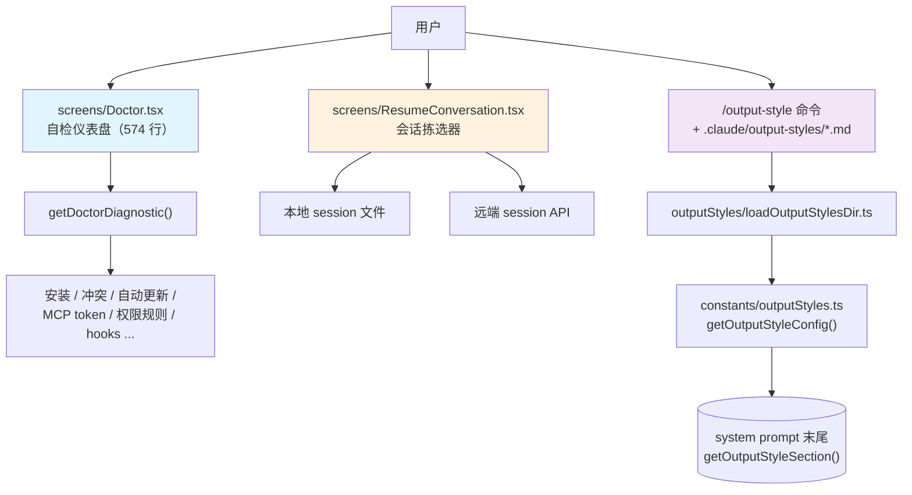

# 第 30 章：screens/ 三屏 — Doctor、Output Style 与 ResumeConversation

> 本章是《深入 Claude Code 源码》系列对终端 UI 一族的最后一篇。前面几章已经讲清楚三件事：Ink 怎么把 React 搬进终端、设计系统怎么收敛颜色与边距、键盘事件怎么注入 React 树。这一篇换一个角度：当 CLI 真的出问题时，用户怎么自己看清"问题在哪里"；当用户想换一种说话方式时，怎么用一份 markdown 把模型的开场白替换掉。

## 为什么把这三屏放在同一章？

`screens/` 目录下只有三个文件：`REPL.tsx`（主回合）、`ResumeConversation.tsx`（会话恢复）、`Doctor.tsx`（自检屏）。前面三十多章已经把 REPL 拆得很彻底，本章把镜头对准剩下两块 `screens/` —— `Doctor.tsx`（**给用户的自检仪表盘**）与 `ResumeConversation.tsx`（**会话恢复拣选器**），再加上不在 `screens/` 目录、但同样面向最终用户、由一组 markdown 文件驱动的 **Output Style 换装系统**（`outputStyles/loadOutputStylesDir.ts` + `constants/outputStyles.ts`）。三块合起来构成本章标题所列的"三屏"承诺。

它们看上去毫无关系：一个是 574 行的诊断面板（`screens/Doctor.tsx`），一个是会话拣选器（`screens/ResumeConversation.tsx`），还有一个是 markdown 驱动的 prompt 注入链路（`outputStyles/loadOutputStylesDir.ts` + `constants/outputStyles.ts`）。但拉远看，它们共用一种很少被单独强调的设计思路——**把 CLI 里那些"软参数"暴露成用户能直接看见或直接替换的东西**。Doctor 把"我是怎么被装上的、跟什么冲突、为什么自动更新不工作、MCP 工具吃了多少 token"这些藏在源码深处的运行期事实搬到一屏上；ResumeConversation 把"我之前哪些会话还能接着聊"摊到一屏让用户挑；Output Style 则把"对模型说话用的那段 system prompt 的尾巴"做成了 `.claude/output-styles/*.md` 这种用户可以直接覆写的文件。三者都在回答同一个问题：**当一个 AI CLI 装得越来越复杂，怎么让用户在不读源码的前提下，自己看明白它、自己改造它**。

本章按两条线索讲。第一节走完 Doctor 屏从 `getDoctorDiagnostic()` 到 React 树的整条路径，看一个自检屏背后实际上检了多少东西。第二节走完 Output Style 从 `.md` 文件被加载到最终拼进 system prompt 的注入链路，看一个"换装系统"真正改的是哪一段。第三节回到 `screens/` 目录本身，把 `ResumeConversation.tsx` 这条以前没在书里露过面的"会话拣选器"路径补上。最后两节把这一章的工程模式抽出来，给一个可以直接照搬的实战示例。

---

## 全景图：screens/ 三屏 + outputStyles 的体验入口



---

## 一、Doctor 屏：把诊断结果摆在一屏上

### 1.1 命令入口薄到只剩门面

`/doctor` 的命令入口短到让人意外。`commands/doctor/index.ts` 一共只有 12 行：

```typescript
// commands/doctor/index.ts:4-10
const doctor: Command = {
  name: 'doctor',
  description: 'Diagnose and verify your Claude Code installation and settings',
  isEnabled: () => !isEnvTruthy(process.env.DISABLE_DOCTOR_COMMAND),
  type: 'local-jsx',
  load: () => import('./doctor.js'),
}
```

它做的事只有三件：起一个名字、读一个开关（`DISABLE_DOCTOR_COMMAND` 可以把它关掉）、把真正干活的 JSX 模块延迟到第一次调用时再 import。同目录的 `doctor.tsx` 也是个一行 wrapper，把斜杠命令的 `onDone` 透传给 `<Doctor onDone={onDone} />`。

为什么命令层这么薄？因为 Doctor 是一个**完全由 React 树驱动的整屏 screen**。它不需要走命令系统的结果展示通道，而是要在自己的 `<Pane>` 里挂组件、跑副作用、读 store、显示加载态。命令模块只是"开一扇门"，门后的整屏 UI 全靠 `screens/Doctor.tsx` 自己撑起来。这也是 `screens/` 这三个文件共有的形态——命令把它们点燃，它们自己负责整屏的渲染节奏。

### 1.2 渲染前的副作用：四件事并行做

`screens/Doctor.tsx` 主组件首屏 `useEffect`（`Doctor.tsx:164-220`）启动时挂四个副作用，分别绑在四个 `setState` 上：

1. **打一次 `getDoctorDiagnostic()`**，结果塞进 `diagnostic`，装的是"我是 npm 全局还是 native？版本号多少？有没有多版本冲突？"这类**安装层事实**。
2. **算一份 `agentInfo`**，把 `~/.claude/agents/` 与项目级 `.claude/agents/` 的目录存在性，外加 `agentDefinitions` 里的 active/all/failedFiles 三元组拼起来。
3. **跑一遍 `checkContextWarnings()`**，把"CLAUDE.md 过大、agent 描述超 token 阈值、MCP 工具超 token 阈值、permission rule 被遮蔽"这四类警告一次性算出来。
4. **如果启用了 PID-based locking，跑一次 `cleanupStaleLocks` 并读出当前 `LockInfo[]`**——这是 native installer 的并发版本锁，Doctor 顺便替你扫尸。

值得停一下的是第 1 步里那条预热 `Promise`。下面贴的不是源码本身，而是 **React Compiler 自动生成的 memoization 包装**——`$[2]` 是组件的 memo 缓存槽位（slot 2），`_temp6` 是被提到外部、跨次 render 复用的回调，整个 if 块的语义就是"如果这个槽位还没缓存，就调一次 `getDoctorDiagnostic()` 并把 promise 存进去"。原始代码作者只写了 `const distTagsPromise = useMemo(() => getDoctorDiagnostic().then(handler), [])`，编译器替它展开成下面这种显式槽位的形式：

```typescript
// Doctor.tsx:124-131（React Compiler 输出形态）
let t2;
if ($[2] === Symbol.for("react.memo_cache_sentinel")) {
  t2 = getDoctorDiagnostic().then(_temp6);
  $[2] = t2;
}
const distTagsPromise = t2;
```

`_temp6` 这个被提升出去的回调做的事是根据 `diag.installationType` 决定调 `getGcsDistTags`（native 装法走 GCS）还是 `getNpmDistTags`（其余走 npm registry），失败时降级成 `{ latest: null, stable: null }`。这个 promise 在外层被 `<Suspense fallback={null}><DistTagsDisplay promise={distTagsPromise} /></Suspense>` 包住，走的是 React 18 的 `use(promise)` 通道。主屏不会因为它阻塞，但一旦它落地，"Latest version: ..." / "Stable version: ..." 两行就会无感地插进版面里。Doctor 把"诊断本体"和"对版本号"做了一次轻量的并发拆分，这是它写得最讨喜的细节之一。

### 1.3 `getDoctorDiagnostic()`：把"我是怎么被装上来的"翻一遍

`utils/doctorDiagnostic.ts` 是 Doctor 屏背后真正干活的文件，625 行，分成四段意图很清晰的代码。

**第一段是安装类型识别**——`getCurrentInstallationType()`（`doctorDiagnostic.ts:86-148`）。它按顺序问下去：是不是 dev 模式？是不是 bundled 模式？bundled 的话是不是被某个系统包管理器装的——Homebrew / Winget / Mise / Asdf / Pacman / Deb / Rpm / Apk 一个个 detect 过去？是不是 npm-local？路径是不是落在 `npm-global` 已知前缀里？最后兜底 `npm config get prefix`。任何一档命中都直接返回 `InstallationType` 枚举值。这个枚举是后面所有警告分支的第一性区分。

**第二段是多安装冲突检测**——`detectMultipleInstallations()`（`doctorDiagnostic.ts:205-315`）。它逐项检查 `~/.claude/local`、npm 全局 prefix 下的 `bin/claude` 与 `lib/node_modules/...` 孤儿目录、native 装法的 `~/.local/bin/claude`。这里最有意思的是**对 Homebrew 双装法的退让**：当 npm 全局 bin 的 realpath 落在 `Caskroom/` 且当前进程也确实跑自 Homebrew 时，就不再把这一份计为"另一个安装"——因为这只是同一个 Homebrew cask 的两条入口。诊断屏不愿意为"看似多装但其实是同一个"的情况虚报警告，这是一个很贴心的工程克制。

**第三段是配置警告**——`detectConfigurationIssues()`（`doctorDiagnostic.ts:317-485`）。这一段是为"装好了但用不上"准备的：native 装了但 `~/.local/bin` 不在 PATH 里，于是根据用户的 shell 类型给出该改哪个 rc 文件的具体命令；npm-local 装了但 PATH 里既找不到 `claude` 也没有有效 alias；npm-global 装了但同时存在一个 local 安装；npm-global 没有写权限，提示用户要么重装 node 不用 sudo、要么换 native installer。最特别的是开头那段对 `managed-settings.json` 的 `strictPluginOnlyCustomization` 字段校验——managed settings 的 schema 用 `.catch(undefined)` 兜了一手未来才会有的枚举值，但 Doctor 不能让管理员对此一无所知，所以它直接读 raw JSON 自己做一遍差分，把"你写了 N 个我不认识的 surface 名"显式列出来。

**第四段是 ripgrep 状态与 Linux glob warning**。ripgrep 在 Claude Code 里有三种来源：和二进制一起打包的（bundled）、随安装包附带在邻近 vendor 目录里的（vendor），或是从系统 PATH 上找到的（system path）；这三种来源对应 `ripgrepStatus` 字段的三种字面量取值，下面字段表里写的"ripgrep 三态"指的就是这三种。Linux 上 sandbox 的 glob pattern 支持不全，这一块也会被翻译成一条用户能看懂的 fix 建议。

把这四段事实揉合后，最后那个 `DiagnosticInfo` 对象（`doctorDiagnostic.ts:54-71`）就是 Doctor 主屏要消费的全部数据：

| 字段 | 含义 | 来源 |
|---|---|---|
| `installationType` | npm-global / npm-local / native / package-manager / development / unknown | `getCurrentInstallationType` |
| `version` | 当前进程的版本号 | 编译期 `MACRO.VERSION` |
| `installationPath` | 二进制实际落脚处 | `getInstallationPath` |
| `invokedBinary` | 本次进程被怎么唤起 | `process.argv[1]` 或 `execPath` |
| `configInstallMethod` | 配置里登记的安装方式 | `getGlobalConfig().installMethod` |
| `autoUpdates` | 是 enabled 还是因为某原因 disabled | `getAutoUpdaterDisabledReason` |
| `hasUpdatePermissions` | npm-global 是否有写权限 | `checkGlobalInstallPermissions` |
| `multipleInstallations` | 检测到的所有别的安装 | `detectMultipleInstallations` |
| `warnings` | 文字版的 issue/fix 对 | `detectConfigurationIssues` + Linux glob + native 残留 npm |
| `packageManager` | 如果是 package-manager 装法，是哪一种 | `getPackageManager` |
| `ripgrepStatus` | ripgrep 三态 | `getRipgrepStatus` |

Doctor 屏顶部的 Diagnostics 区块（`Doctor.tsx:266-373`）就是把上面 11 个字段一行一行翻译成 `└ Currently running: ...` / `└ Path: ...` / `└ Search: ...` 这种树枝符号开头的简洁文本。它特意把 warning 和 recommendation 与基本事实并排放在同一个 `Box` 里，避免读者把 warning 看成"出错了"——在 Doctor 的语境里，warning 是"装得能跑，但建议你处理一下"。

### 1.4 上下文警告：CLAUDE.md、agent、MCP、权限规则

Doctor 主屏除了"装机检查"还有第二个轴：**上下文体积健康度**。这一段由 `utils/doctorContextWarnings.ts` 提供，逻辑短得多，但意图清晰：

```typescript
// utils/doctorContextWarnings.ts:246-265
export async function checkContextWarnings(...): Promise<ContextWarnings> {
  const [claudeMdWarning, agentWarning, mcpWarning, unreachableRulesWarning] =
    await Promise.all([
      checkClaudeMdFiles(),
      checkAgentDescriptions(agentInfo),
      checkMcpTools(tools, getToolPermissionContext, agentInfo),
      checkUnreachableRules(getToolPermissionContext),
    ])
  return { claudeMdWarning, agentWarning, mcpWarning, unreachableRulesWarning }
}
```

四种检查并行做：

1. **CLAUDE.md 过大**。`getLargeMemoryFiles()` 筛出超过 `MAX_MEMORY_CHARACTER_COUNT`（40k chars）的记忆文件并按大小倒序展示。
2. **Agent 描述总和过大**。`getAgentDescriptionsTotalTokens()` 把所有非内置 agent 的 `${agentType}: ${whenToUse}` 拼起来粗算 token，超过 `AGENT_DESCRIPTIONS_THRESHOLD` 就 warn，并按 token 量倒序展示前 5 名。
3. **MCP 工具总和过大**。`MCP_TOOLS_THRESHOLD` 是 25_000，触发后按 server 名分组展示前 5 大。这里还做了一个降级——当真实的 `countMcpToolTokens` 拿不到 model 时退化成 `roughTokenCountEstimation` 估算字符。
4. **权限规则不可达**。`detectUnreachableRules` 检查"具体的 allow 规则被一条 tool-wide 的 ask 规则遮蔽掉"这种容易写错的场景，把规则文本和"该怎么改"一行行排出来。

Doctor 把这四类警告各自渲染成顶部带 `figures.warning` 的小节（`Doctor.tsx:464-479`），剩下的细节用两层缩进列在底下。这种"先一句话说事，再用缩进列证据"的版面在别的命令里也反复出现过，Doctor 只是把它推到一整屏的尺度。

### 1.5 还有谁也悄悄被 Doctor 接管了

主屏底部还嵌了五块"非 Doctor 自己生产"的组件：

- `<SandboxDoctorSection />`——sandbox 体系自己报的健康度；
- `<McpParsingWarnings />`——`.mcp.json` 与 MCP 服务器配置在加载阶段累积的解析错误；
- `<KeybindingWarnings />`——用户配的快捷键里有没有重复或冲突；
- `Environment Variables` 区块——检查 `BASH_MAX_OUTPUT_LENGTH` / `TASK_MAX_OUTPUT_LENGTH` / `CLAUDE_CODE_MAX_OUTPUT_TOKENS` 三个数值环境变量是不是被设到了非法值或被 clamp 到上限；
- `Version Locks` 区块——当开启 PID lock 时，列出仍然活着的版本锁与 PID 状态。

这五块的代码各自分散在不同模块，但它们都遵守同一个隐性契约：**只要你愿意自己渲染一段 Doctor 子节，就把组件挂在这里**。Doctor 屏因此从一个"检查我的安装"的工具，演化成了**整本 CLI 的子系统健康总线**——谁的状态值得在 `/doctor` 里展示，谁就把组件塞进 `Doctor.tsx` 的主 `<Pane>` 即可。这条契约没有写成接口、没有写成生命周期，纯靠惯例维持。

最后一段是 `<PressEnterToContinue />`，配合 `useKeybindings({ "confirm:yes": handleDismiss, "confirm:no": handleDismiss })`，按任意一种确认键都把整屏 `onDone("Claude Code diagnostics dismissed", { display: "system" })` 关闭，并把 system 消息推回 REPL 流。

---

## 二、Output Style：把 system prompt 的尾巴交给用户

### 2.1 Output Style 到底改的是哪一段？

要讲清楚"换装"的范围，先得回到 system prompt 是怎么拼出来的。`getSystemPrompt`（`constants/prompts.ts:444-577`）会并行做三件事：拿 skill tool 命令、拿当前 output style、拿 env info；然后把它们拼成一份多段 system prompt。Output style 在其中的位置由这个小函数决定：

```typescript
// constants/prompts.ts:151-157
function getOutputStyleSection(
  outputStyleConfig: OutputStyleConfig | null,
) {
  if (outputStyleConfig === null) return null
  return `# Output Style: ${outputStyleConfig.name}
${outputStyleConfig.prompt}`
}
```

也就是说，当 `outputStyle` 不是默认值的时候，会在 system prompt 里多注入一段 `# Output Style: <name>` 加它的 prompt 正文。同时 prompts.ts 顶上的 intro 行也会切换措辞：

```typescript
// constants/prompts.ts:180
You are an interactive agent that helps users ${outputStyleConfig !== null
  ? 'according to your "Output Style" below, which describes how you should respond to user queries.'
  : 'with software engineering tasks.'}
```

这就是 Output Style 的真正作用域——**它换的是模型的"人格开场白"以及"具体回话风格"，但不会替你换掉工具列表、不会换掉权限提示词、不会换掉 BashTool 的安全规约**。后面这些都在 prompts.ts 里另外几段被无条件拼上。Output Style 是一个**风格层的旁路**：它让用户能换"说话语气"，但不让用户能扩权。

`getSimpleIntroSection(outputStyleConfig)` 和那个 `outputStyleConfig === null || outputStyleConfig.keepCodingInstructions === true` 的分支（`constants/prompts.ts:564-566`）补上了第二个细节。`default` 这一档在 `constants/outputStyles.ts:42` 直接被映射成 `null`，靠 `=== null` 的左半边保留 coding instructions；内置 Explanatory 和 Learning 不是 `null`，而是分别在 `constants/outputStyles.ts:48` 与 `:61` 标了 `keepCodingInstructions: true`，靠右半边保留；只有用户自己写的、且没开这个开关的 output style，coding 指令才会被整段拿掉。这一刀切得很谨慎——默认情况下用户换风格不会丢失 Claude Code 作为 coding agent 的硬约束。

### 2.2 内置 Explanatory 与 Learning：把 prompt 当代码写

`constants/outputStyles.ts` 顶部维护了一份 `OUTPUT_STYLE_CONFIG`，里面有三种内置形态：

- `default`：值是 `null`，意味着不注入额外 prompt 段；
- `Explanatory`（`keepCodingInstructions: true`）：在 prompt 末尾加一段 `EXPLANATORY_FEATURE_PROMPT`，让 Claude 在写代码前后插入带 `★ Insight` 框的教学小段；
- `Learning`（`keepCodingInstructions: true`）：加一大段"邀请人类写 2–10 行关键代码"的协议，并要求 Claude 在请求人类贡献前先在代码里放一个 `TODO(human)` 标记。

两种内置风格都把 prompt 写成多行字符串拼 `figures.bullet` / `figures.star`，并直接 import 进 `OUTPUT_STYLE_CONFIG`。这意味着内置 output style 在 ts 编译期就被锁定，运行期没有任何额外读盘或网络。

### 2.3 用户/项目级 Output Style：让 `.md` 长成一份 prompt

`outputStyles/loadOutputStylesDir.ts` 是用户/项目级 Output Style 的入口，98 行，全部围绕一个 `memoize` 起来的异步函数 `getOutputStyleDirStyles(cwd)`。它做的事可以拆成三步。

**第一步是找到文件**。`loadMarkdownFilesForSubdir('output-styles', cwd)` 沿着标准的 Claude config 搜索顺序往上找 `.claude/output-styles/*.md`：managed dir → user `~/.claude/output-styles` → 项目 `.claude/output-styles`。这套机制是 `markdownConfigLoader` 早就为 agents 与 commands 写好的通用基础设施，Output Style 只是它的又一位调用者。

**第二步是解析单个文件**。`loadOutputStylesDir.ts:35-78` 这段把每个 markdown 拆成 frontmatter + content：

```typescript
const fileName = basename(filePath)
const styleName = fileName.replace(/\.md$/, '')
const name = (frontmatter['name'] || styleName) as string
const description =
  coerceDescriptionToString(frontmatter['description'], styleName) ??
  extractDescriptionFromMarkdown(content, `Custom ${styleName} output style`)
const keepCodingInstructionsRaw = frontmatter['keep-coding-instructions']
const keepCodingInstructions =
  keepCodingInstructionsRaw === true || keepCodingInstructionsRaw === 'true'
    ? true
    : keepCodingInstructionsRaw === false || keepCodingInstructionsRaw === 'false'
      ? false
      : undefined
```

文件名去掉 `.md` 之后就是默认的样式名，frontmatter 里也可以显式覆写；描述既可以写在 frontmatter，也可以让加载器从正文里抽——把 markdown 的人类友好性发挥到了极致。`keep-coding-instructions` 这种典型布尔字段同时接受 `true` / `'true'` / `false` / `'false'`，是为了让用户手写 YAML 时不被强类型卡住。

**第三步是对 `force-for-plugin` 的姿态**。这一段藏着一个很谨慎的判断：

```typescript
// loadOutputStylesDir.ts:65-70
if (frontmatter['force-for-plugin'] !== undefined) {
  logForDebugging(
    `Output style "${name}" has force-for-plugin set, but this option only applies to plugin output styles. Ignoring.`,
    { level: 'warn' },
  )
}
```

`force-for-plugin` 只对 plugin 出处的 output style 生效，由 `loadPluginOutputStyles` 那边读取。用户自己写的 `.md` 即使写了它也会被 ignored。Output Style 不愿意让用户级 markdown 拥有"强制覆盖"这种 plugin 才该有的权限，这是它在能力分级上的克制。

### 2.4 优先级合并：built-in 在底，policy 在顶

`constants/outputStyles.ts:137-175` 是合并器。它把所有来源的 output style 按优先级低到高叠加：

```typescript
// 优先级：built-in → plugin → user → project → managed (policy)
const styleGroups = [pluginStyles, userStyles, projectStyles, managedStyles]
for (const styles of styleGroups) {
  for (const style of styles) {
    allStyles[style.name] = { ... }
  }
}
```

合并顺序是**后写覆盖前写**：内置只有 default / Explanatory / Learning 三项打底；plugin 接着覆盖一层；用户级 `~/.claude/output-styles/*.md` 再覆盖；项目级 `.claude/output-styles/*.md` 再覆盖；最后由企业 managed settings 写下的 `policySettings` source 拥有最高优先级。这一段直接抄了 settings 体系的优先级语义，让 output style 与配置体系在"谁能盖谁"上保持一致。

挑选最终生效那一份的逻辑在 `getOutputStyleConfig()`（`constants/outputStyles.ts:181-211`）里。它先扫一遍所有 plugin 来源、`forceForPlugin === true` 的 style——只要找到第一个，立刻 return，并在控制台 debug 日志里告知，如果有多个被强制，挑第一个，剩下的告诉你被忽略了。没有被强制的，就回到 settings 里的 `outputStyle` 字段（默认 `default`）查一次。

这套优先级里有两个值得停一下的设计：

1. **plugin 的强制覆盖是"启动期硬决定"，但 debug 日志会让你看见**。它不静默接管，而是写进调试通道。配合 Doctor 屏或 `/status` 这类自检面板，你能反查"我现在到底在跑哪一份 output style"。
2. **企业 managed settings 在 output style 上拥有最高权重**。这跟整本书别处讲过的 settings 七层模型一致——企业部署时一份 `managed-settings.json` 可以钦定 output style，不被用户级覆盖。

### 2.5 `/output-style` 这条命令为什么被 hidden 了

最后一个细节经常让人困惑：`commands/output-style/index.ts` 里，命令本体是这样的：

```typescript
// commands/output-style/index.ts:3-9
const outputStyle = {
  type: 'local-jsx',
  name: 'output-style',
  description: 'Deprecated: use /config to change output style',
  isHidden: true,
  load: () => import('./output-style.js'),
} satisfies Command
```

它实际加载的 `output-style.tsx` 只有六行有效代码：弹一条 "/output-style has been deprecated. Use /config to change your output style, or set it in your settings file. Changes take effect on the next session."，仅此而已。

这是 Output Style 演进路径上的一个"为兼容而留"的尸位——早期版本里 `/output-style` 是个真正的交互选择器，现在风格选择被收编进了统一的 `/config` 屏。但命令本身没被删，因为仍然有用户与脚本会敲 `/output-style`，删掉会让他们看到"未知命令"，留下来则可以给一句明确的迁移指引。`isHidden: true` 让它不出现在 `/help` 与命令补全列表，但敲对名字仍然可被命中——这就是 Claude Code 处理"功能搬家"的统一做法。

---

## 三、ResumeConversation：另一块容易被忽略的屏

`screens/` 一共只有三个文件，Doctor 拆完了，REPL 在第 5 章和第 21 章已经反复出现过。剩下 `ResumeConversation.tsx` 在本书前面没专门讲过，但它是用户每天敲 `claude --resume` 时唯一会看见的整屏 UI，本节把它补上。

### 3.1 它解决的问题是什么

`claude --resume` 想让你从历史会话里挑一条接着说。看起来只是个文件选择器，但实际困难在三个地方：

1. **会话存储是"按 worktree 分桶"**。当前 cwd、当前 git worktree、同一个 repo 的其他 worktree、整台机器上所有项目——这四个范围是不同的。UI 默认只先列出"同 repo worktree"那一桶，让用户按需扩展。
2. **会话日志要 progressive 加载**。老用户机器上日志可能成千上万条，全量解析会把启动卡死。
3. **挑中的那一条不一定能就地恢复**。如果选的会话属于另一个 repo，得让用户跳到那个目录再 resume，不能直接在当前目录里把另一个项目的对话续上。

这三件事 `ResumeConversation` 都要在一屏 UI 里照顾到。

### 3.2 加载链路：先少后多

主组件 mount 时第一件事是调 `loadSameRepoMessageLogsProgressive(worktreePaths)`（`ResumeConversation.tsx:126-136`）。`Progressive` 这个后缀表明它返回的 `result` 里有两件东西：已经被解析好可以直接渲染的一批 `logs`，以及一份"还没解析、但已经知道存在"的 `allStatLogs` 与下一段游标 `nextIndex`。

`loadMoreLogs(count)` 这条 callback（`ResumeConversation.tsx:137-155`）就是为后续加载准备的：

```typescript
void enrichLogs(ref.allStatLogs, ref.nextIndex, count).then(result_1 => {
  ref.nextIndex = result_1.nextIndex;
  if (result_1.logs.length > 0) {
    const offset = logCountRef.current;
    result_1.logs.forEach((log, i) => { log.value = offset + i; });
    setLogs(prev => prev.concat(result_1.logs));
    logCountRef.current += result_1.logs.length;
  } else if (ref.nextIndex < ref.allStatLogs.length) {
    loadMoreLogs(count);
  }
});
```

有两处细节值得看。**第一**，新增的 `log.value` 编号基于 `logCountRef.current`，不是基于 `logs.length`。这是因为 React 的 `setLogs` 拿到的回调必须保持纯函数语义，不能在更新过程中读 `logs.length` 这种快照外部值。`logCountRef` 是个跟着 `setLogs` 同步累加的副本——把"React state 更新的纯度"与"业务逻辑里要算偏移量"两件事拆开了。**第二**，当某一批 enrich 出来后过滤剩零条时，会自动接着拉下一批——这是为了让 hidden（sidechain）日志不会让用户卡在"加载更多但什么都没出来"的假死态。

### 3.3 选中之后：先切 session 再渲染 REPL

`onSelect(log)` 是真正干活的那一段。它先做一次 `checkCrossProjectResume`（`ResumeConversation.tsx:181-189`）：如果用户选了一条来自另一个 repo 的会话，且不是同一个 repo 的另一个 worktree，那就把"应该敲的恢复命令"复制到剪贴板，改用 `<CrossProjectMessage>` 显示一句"请去那个目录敲这条命令"，不会就地恢复。

如果是同一个 repo 的 worktree，就走 `loadConversationForResume` 把消息流真正读出来，然后做一连串状态切换（`ResumeConversation.tsx:220-250`）：

1. `switchSession(asSessionId(result.sessionId), ...)`——把 `bootstrap/state.ts` 里那份全局 sessionId 切到挑中的 session 上。
2. `renameRecordingForSession()`——asciinema 之类的录屏文件名也得换。
3. `resetSessionFilePointer()`——sessionStorage 的写入指针归零，从此往下写到这一条 session 的日志里去。
4. `restoreCostStateForSession(...)`——把"成本累加器"也切到那一条 session 的历史值上去，不让 `/cost` 报错。

接着 `restoreAgentFromSession(...)` 把当时主线程跑的 agent 恢复出来；如果开了 `COORDINATOR_MODE`，还要从 `coordinatorMode.ts` 里读一段"模式不匹配"的 warning 注入到消息流头部，并把 agentDefinitions 重新拉一遍。最后把 `resumeData` 放进 state——这一帧渲染会从 `<LogSelector>` 切到 `<REPL initialMessages={resumeData.messages} ... />`，REPL 接管屏幕。整个 `ResumeConversation` 自此功成身退。

### 3.4 它和 Doctor 共享的 screen 契约

`ResumeConversation` 与 `Doctor` 在源码里没有共享代码，但它们体现了同一个 screen 层的写法约定：

- 每个 screen 是一个**完整接管整屏**的 React 组件，不复用 REPL 的对话容器；
- 进入这屏的副作用集中在 `useEffect` / `useCallback`，绝不放在 module 顶层；
- 离屏方式只有两种：要么 `onDone(...)` 推回斜杠命令、要么自己 `return <REPL ... />` 让下一个 screen 接管；
- 文件不超过千行，把"屏幕级 UI"和"业务逻辑"明确分到 `screens/` 与 `utils/`。

`screens/` 一共三块、合起来不到六千行，把 Claude Code 这种规模的 CLI 的"非对话屏幕"全部装下了——REPL 那 5005 行另当别论，因为它本质上是整本书的核心。

---

## 四、可迁移的设计模式

Doctor 屏与 Output Style 各管一摊，但拉远看，它们贡献了同一组可以脱离 Claude Code 直接照搬的工程模式。

### 模式 1：把命令做成"门面"，把整屏 UI 放进 `screens/`

斜杠命令模块只负责"开门"——一个 `Command` 对象 + 一个 lazy `load`。所有跟整屏 UI 相关的代码都搬进独立的 `screens/<Name>.tsx`。这样做有两个好处：命令系统不必感知 React 树的复杂度；同一块 screen 可以被多个命令、键绑定甚至外部触发器复用。

**适用场景**：任何 CLI / TUI 工具，凡是某条命令需要接管整屏而不是输出一段文本的，都值得用这套门面。

### 模式 2：自检屏作为"子系统健康总线"

`Doctor.tsx` 不写死它要展示哪些块，而是允许任意子系统挂一个组件进来（`<SandboxDoctorSection />`、`<McpParsingWarnings />`、`<KeybindingWarnings />` ……）。这条契约没有写成接口，纯靠约定维持，但它把"我要在 /doctor 里展示一段健康度"这件事的成本压到了"写一个 React 组件、import 进 Doctor.tsx"两行代码。

**适用场景**：任何复杂应用，只要你已经有 `/doctor`、`/status` 这类"给用户看的健康面板"，都可以把它做成总线，让新模块零成本上车。

### 模式 3：用并发预热 + Suspense 把"非关键信息"塞进版面

Doctor 屏的"对最新版本号"是一次 npm registry 的网络请求，不能让它阻塞首屏。Doctor 的做法是：在 React Compiler 友好的位置 `memoize` 出一个 `distTagsPromise`，把它交给 `<Suspense fallback={null}><DistTagsDisplay promise={...} /></Suspense>`，结果落地就 `use(promise)` 解包到版面里。这个模式把"主屏立即可看"和"附加信息按到达顺序补齐"两件事完全解耦。

**适用场景**：任何首屏需要"主信息 + 来自远端的可选附加信息"的页面。

### 模式 4：用户配置走 markdown + frontmatter，能力按来源分级

Output Style 不让用户写 JSON，而是 `.md` + frontmatter。frontmatter 提供结构化字段（`name` / `description` / `keep-coding-instructions`），正文就是 prompt 本体。这种格式既允许复杂多行内容（prompt 经常上百行），又不需要用户死记 schema。

更关键的是**能力分级**：同一个 markdown 写在用户级目录 vs plugin 目录 vs 企业 managed dir，被允许做的事情不同——`force-for-plugin` 只对 plugin 生效，managed settings 拥有最高优先级。这套模式让"放权给用户"和"留底线"同时成立。

**适用场景**：任何"用户可以提供自定义 prompt / 模板 / 规则"的产品，markdown 都比 JSON 更友好；任何允许多来源覆盖的配置，都可以套这套"来源即权限"的分级。

### 模式 5：废弃命令保留为"迁移指引"

`/output-style` 不再做事，但没被删除，只是 `isHidden: true` 加一条 deprecation 文案。这是个微小但贴心的做法：删命令会让历史脚本和肌肉记忆瞬间报错，保留 + 文案则把用户温柔引到新入口。

**适用场景**：任何有 CLI / 斜杠命令系统的产品做功能搬家时。

---

## 五、实战示例：给一个 CLI 加一个 `/doctor` 风格的自检屏

把以上模式串起来，可以照搬到任何 Ink 应用上。下面是一个最小骨架——它只用 80 行就把"门面命令 + 总线式自检屏 + 并发预热"全部跑通。

**Step 1：命令门面**

```typescript
// commands/checkup/index.ts
import type { Command } from '../../commands.js'

const checkup: Command = {
  name: 'checkup',
  description: 'Check the health of your installation',
  type: 'local-jsx',
  load: () => import('./checkup.js'),
}
export default checkup
```

**Step 2：整屏 screen，开放挂载点**

```tsx
// screens/Checkup.tsx
import React, { Suspense, useEffect, useState } from 'react'
import { Box, Text } from 'ink'
import { runDiagnostic, fetchLatestVersion } from '../utils/checkup.js'
import { NetworkSection } from '../components/checkup/NetworkSection.js'
import { CacheSection } from '../components/checkup/CacheSection.js'

const versionPromise = fetchLatestVersion()  // 并发预热

function LatestVersion({ promise }: { promise: Promise<string> }) {
  const v = React.use(promise)
  return <Text>└ Latest version: {v}</Text>
}

export function Checkup({ onDone }: { onDone: () => void }) {
  const [diag, setDiag] = useState<null | Awaited<ReturnType<typeof runDiagnostic>>>(null)
  useEffect(() => { runDiagnostic().then(setDiag) }, [])

  return (
    <Box flexDirection="column">
      <Text>Diagnostics</Text>
      {diag ? <Text>└ Running: v{diag.version} ({diag.installType})</Text>
            : <Text dimColor>Loading…</Text>}
      <Suspense fallback={null}>
        <LatestVersion promise={versionPromise} />
      </Suspense>

      {/* 子系统挂载点：要加一段健康度，新加一个组件即可 */}
      <NetworkSection />
      <CacheSection />

      <Text dimColor>Press enter to dismiss</Text>
    </Box>
  )
}
```

**Step 3：第三方加挂一块**

新模块要把状态摆进 `/checkup`？不需要改 `Checkup.tsx`——写一个 React 组件、import 进来、放在 `<Box>` 里就行。这条隐性契约和 Doctor 屏完全一致。

```tsx
// components/checkup/PluginsSection.tsx
export function PluginsSection() {
  // 读 plugin store、render 自己的 warning / fix
  return <Box>…</Box>
}
```

把它加进 `Checkup.tsx` 的 `<Box>` 即可。子系统作者不需要知道 Diagnostics 的实现细节，Diagnostics 也不需要为新模块改一行代码。

这就是 Doctor 屏的核心价值——它不解决问题，它把所有子系统的问题集中摆给用户看，并且对未来要加的子系统**保持开放**。Output Style 把同样的思路推到了另一边：它不解决"用户要什么风格"，它把风格的定义权交给用户，并对滥用保持克制。

---

---

## 下一章预告

[第 31 章：Memory 子系统全景 — AI 记忆的多层架构](./31-Memory子系统全景.md)

我们进入第八篇「记忆、扩展与总结」，从 memdir/ 8 个文件与 services/{SessionMemory, extractMemories, teamMemorySync}/ 出发，按会话级 / 项目级 / 团队级 / 长期四维度重画 Memory 系统。

---
*全部内容请关注 https://github.com/luyao618/Claude-Code-Source-Study (求一颗免费的小星星)*
