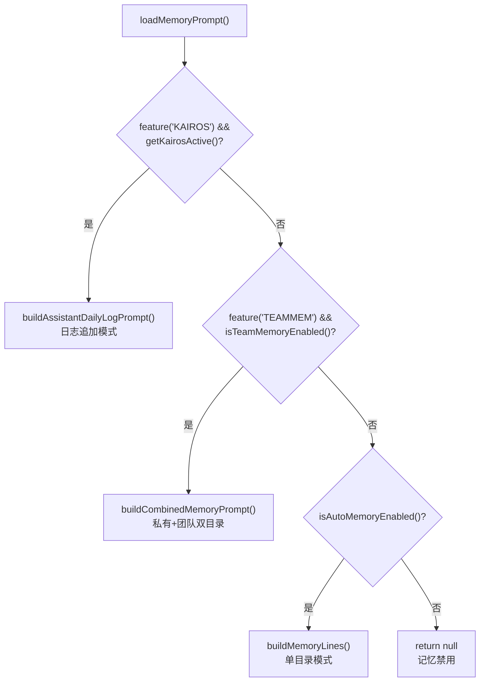

# 第 31 章：Memory 子系统全景 — AI 记忆的多层架构

> 本章深入 Claude Code 的记忆系统。我们将看到，一个 AI Agent 如何在"无状态"的 LLM 对话模型上，构建出跨越单次会话、跨越多个项目、甚至跨越团队协作的持久化记忆能力。

## 为什么 AI Agent 需要记忆？

LLM 天生是"金鱼记忆" —— 每次对话都是从零开始。用户上次告诉 Claude "我喜欢用 bun 而不是 npm"，下次对话它就忘了。用户在项目里纠正了 Claude 三次"不要 mock 数据库"，第四次它可能又 mock 了。

这不仅仅是用户体验问题 —— 它直接影响 AI Agent 的工作效率。没有记忆的 Agent 永远是新手：每次都要重新了解用户偏好、重新踩同样的坑、重新探索同样的代码库。

Claude Code 的解决方案是一个**五层记忆架构**：

| 层级 | 名称 | 生命周期 | 存储位置 | 核心职责 |
|------|------|---------|---------|---------|
| 1 | CLAUDE.md 指令文件 | 永久 | 项目目录 / 用户目录 | 静态指令与规则 |
| 2 | Auto Memory（memdir） | 跨会话 | `~/.claude/projects/<slug>/memory/` | 自动提取的持久化知识 |
| 3 | Session Memory | 单次会话 | `~/.claude/projects/<slug>/<sessionId>/session-memory/summary.md` | 当前会话的结构化笔记 |
| 4 | Agent Memory | 跨会话 | 三种 scope 目录 | 特定 Agent 的专属记忆 |
| 5 | Relevant Memories | 每用户 turn 按需注入 | 内存（Attachment） | 按需召回的相关记忆 |

每一层解决不同时间尺度和不同粒度的记忆需求。接下来我们逐层深入。

---

## 一、CLAUDE.md —— 静态指令的层级发现

CLAUDE.md 是 Claude Code 最早也最基础的"记忆"形式。它本质上不是 AI 自主写入的记忆，而是**人类预写的指令文件**，但它的发现与加载机制值得深入分析。

### 1.1 四种类型与加载顺序

```typescript
// utils/claudemd.ts:1-9
// Files are loaded in the following order:
// 1. Managed memory (eg. /etc/claude-code/CLAUDE.md) - Global instructions for all users
// 2. User memory (~/.claude/CLAUDE.md) - Private global instructions for all projects
// 3. Project memory (CLAUDE.md, .claude/CLAUDE.md, .claude/rules/*.md) - Instructions checked into the codebase
// 4. Local memory (CLAUDE.local.md) - Private project-specific instructions
//
// Files are loaded in reverse order of priority, i.e. the latest files are highest priority
```

这里有一个精妙的设计：**加载顺序与优先级相反**。Managed 最先加载但优先级最低，Local 最后加载但优先级最高。这是因为 LLM 对消息中**靠后**的内容关注度更高（recency bias），所以高优先级内容排在后面。

### 1.2 目录遍历与去重

`getMemoryFiles()` 的核心逻辑是从当前工作目录**逐级向上遍历**到文件系统根目录，每个目录尝试读取 `CLAUDE.md`、`.claude/CLAUDE.md` 和 `.claude/rules/*.md`：

```typescript
// utils/claudemd.ts:850-934
// Then process Project and Local files
const dirs: string[] = []
let currentDir = originalCwd
while (currentDir !== parse(currentDir).root) {
  dirs.push(currentDir)
  currentDir = dirname(currentDir)
}
// Process from root downward to CWD
for (const dir of dirs.reverse()) {
  // CLAUDE.md (Project)
  // .claude/CLAUDE.md (Project)
  // .claude/rules/*.md (Project)
  // CLAUDE.local.md (Local)
}
```

注意这里 `dirs.reverse()` —— 先 push 的是 CWD，reverse 后变成从根目录向 CWD 方向遍历，确保离 CWD 越近的文件优先级越高。

### 1.3 @include 指令与安全约束

CLAUDE.md 支持 `@path` 语法引用外部文件，实现指令的模块化组织：

```markdown
@./coding-standards.md
@~/global-rules.md
```

但 include 有严格的安全约束：只支持 70+ 种文本文件扩展名（`TEXT_FILE_EXTENSIONS`），防止二进制文件被加载到上下文中。include 也有循环引用检测和深度限制。值得注意的是，`processMemoryFile()` 的函数注释写着"includes first, then main file"，但实际实现是**parent before children**（`claudemd.ts:663-664`，先 `result.push(memoryFile)` 再递归处理 include 文件）。

### 1.4 注入到 System Prompt

最终，加载的 CLAUDE.md 内容通过 `getUserContext()` 注入到用户上下文消息中：

```typescript
// context.ts:155-188
export const getUserContext = memoize(async () => {
  const claudeMd = shouldDisableClaudeMd
    ? null
    : getClaudeMds(filterInjectedMemoryFiles(await getMemoryFiles()))
  setCachedClaudeMdContent(claudeMd || null)
  return {
    ...(claudeMd && { claudeMd }),
    currentDate: `Today's date is ${getLocalISODate()}.`,
  }
})
```

注意这里的 `filterInjectedMemoryFiles()`——它不是简单的透传。当 GrowthBook feature gate `tengu_moth_copse` 开启时，该函数会**过滤掉 AutoMem 和 TeamMem 类型的文件**（即 `MEMORY.md` 索引），不再将其注入用户上下文：

```typescript
// utils/claudemd.ts:1142-1151
export function filterInjectedMemoryFiles(files: MemoryFileInfo[]): MemoryFileInfo[] {
  const skipMemoryIndex = getFeatureValue_CACHED_MAY_BE_STALE('tengu_moth_copse', false)
  if (!skipMemoryIndex) return files
  return files.filter(f => f.type !== 'AutoMem' && f.type !== 'TeamMem')
}
```

这意味着 MEMORY.md 索引的注入存在**双路径**：
- **传统路径**（`tengu_moth_copse` 关闭）：MEMORY.md 通过 `getMemoryFiles()` → `getUserContext()` 始终注入用户上下文
- **新路径**（`tengu_moth_copse` 开启）：MEMORY.md 索引不再注入用户上下文，记忆完全依赖 `startRelevantMemoryPrefetch()` 的异步预取 + Attachment 注入（详见第六节）

同时，`tengu_moth_copse` 也影响 `loadMemoryPrompt()` 中的 `skipIndex` 参数——开启后，System Prompt 中的记忆指令不再包含 MEMORY.md 索引内容和"两步保存"流程，改为让 AI 直接写 topic 文件。

`getMemoryFiles()` 本身是 `memoize` 包装的 —— session 级缓存，一次会话只加载一次（除非被 compact 等操作显式清除缓存）。

---

## 二、Auto Memory（memdir）—— AI 的持久化知识库

Auto Memory 是 Claude Code 记忆系统的核心 —— 它让 AI 能够**自主学习和记住**跨会话的知识。与 CLAUDE.md 由人类编写不同，memdir 中的内容完全由 AI 生成和维护。

### 2.1 目录结构与路径解析

```
~/.claude/projects/<sanitized-git-root>/memory/
├── MEMORY.md                  # 索引文件（≤200行），可注入上下文（受 gate 控制）
├── user_role.md               # 用户角色记忆
├── feedback_testing.md        # 反馈记忆：测试偏好
├── project_auth_rewrite.md    # 项目记忆：认证重构背景
├── reference_linear.md        # 参考记忆：外部系统指针
├── team/                      # 团队共享记忆（feature('TEAMMEM')）
│   ├── MEMORY.md
│   └── ...
└── logs/                      # Assistant 模式日志（feature('KAIROS')）
    └── 2026/03/2026-03-15.md
```

路径解析有三级优先级（`paths.ts:223-235`）：

```typescript
// memdir/paths.ts:223-235
export const getAutoMemPath = memoize(
  (): string => {
    const override = getAutoMemPathOverride() ?? getAutoMemPathSetting()
    if (override) return override
    const projectsDir = join(getMemoryBaseDir(), 'projects')
    return (
      join(projectsDir, sanitizePath(getAutoMemBase()), AUTO_MEM_DIRNAME) + sep
    ).normalize('NFC')
  },
  () => getProjectRoot(), // memoize key：projectRoot 变则重算
)
```

1. **环境变量覆盖**：`CLAUDE_COWORK_MEMORY_PATH_OVERRIDE`（Cowork/SDK 场景）
2. **Settings 覆盖**：`autoMemoryDirectory`（仅信任 policy/flag/local/user 四种来源，**排除 projectSettings** —— 防止恶意仓库通过 `.claude/settings.json` 将记忆目录指向 `~/.ssh`）
3. **默认路径**：基于 Git 根目录的 sanitized 路径。`sanitizePath()` 将非字母数字字符替换为连字符（如 `/Users/foo/my-project` → `-Users-foo-my-project`），仅当路径超过文件系统长度限制时才追加 hash 后缀确保唯一性（`sessionStoragePortable.ts:311-318`）

`getAutoMemBase()` 使用 `findCanonicalGitRoot()` 确保所有 Git worktree **共享同一个记忆目录**，避免同一仓库的不同 worktree 各自维护一份记忆。

### 2.2 四类记忆的闭合分类法

Auto Memory 使用严格的四类分类法，每种类型有明确的写入时机和使用场景（`memoryTypes.ts:14-19`）：

```typescript
// memdir/memoryTypes.ts:14-19
export const MEMORY_TYPES = ['user', 'feedback', 'project', 'reference'] as const
```

| 类型 | 含义 | 写入时机 | 不应保存的内容 |
|------|------|---------|--------------|
| `user` | 用户角色、偏好、知识水平 | 了解到用户信息时 | 负面评价 |
| `feedback` | 行为纠正 + 正向确认 | 用户纠正或确认做法时 | 仅保存纠正而忽视确认 |
| `project` | 项目背景、决策、截止日期 | 了解到不可从代码推导的项目信息时 | 可从 git log 推导的内容 |
| `reference` | 外部系统指针 | 了解到外部资源位置时 | 系统的具体内容（只存指针） |

分类法有一个关键原则："What NOT to save" 同样重要。`WHAT_NOT_TO_SAVE_SECTION` 明确排除了 5 类内容：代码模式、Git 历史、调试方案、CLAUDE.md 已有内容、临时任务状态。这些都可以从当前项目状态**派生**，不需要重复存储。

更值得注意的是这条规则（`memoryTypes.ts:193-194`）：

> These exclusions apply even when the user explicitly asks you to save. If they ask you to save a PR list or activity summary, ask what was *surprising* or *non-obvious* about it — that is the part worth keeping.

即使用户**明确要求**保存某些内容，AI 也应该反问"其中什么是令人惊讶或不显而易见的"—— 这是通过 Prompt 设计来约束 AI 行为的典型案例。

### 2.3 MEMORY.md 索引与截断保护

`MEMORY.md` 是记忆的索引文件。在传统路径下，它通过 `getMemoryFiles()` → `getUserContext()` 注入上下文；当 `tengu_moth_copse` gate 开启时，它不再注入用户上下文（改由 Relevant Memories prefetch 机制替代，详见第六节）。无论哪种路径，MEMORY.md 都有严格的大小限制（`memdir.ts:35-38`）：

```typescript
// memdir/memdir.ts:34-38
export const ENTRYPOINT_NAME = 'MEMORY.md'
export const MAX_ENTRYPOINT_LINES = 200
export const MAX_ENTRYPOINT_BYTES = 25_000
```

`truncateEntrypointContent()` 实现双重保护：先按行截断（200 行），再按字节截断（25KB）。截断时在最后一个换行符处切割，避免行被截断到一半。超出后会附加一条 WARNING，提示 AI 保持索引精简。

### 2.4 System Prompt 中的记忆指令注入

`loadMemoryPrompt()` 是记忆指令注入到 System Prompt 的入口（`memdir.ts:419-507`）。它根据启用状态做三路分发：



通过 `systemPromptSection('memory', ...)` 注册为 System Prompt 的缓存段（`constants/prompts.ts:495`），这意味着记忆指令的内容在 session 期间是**缓存友好的**——只要 MEMORY.md 内容不变，这个 section 就不会变，Prompt Cache 命中率不受影响。

### 2.5 `DIR_EXISTS_GUIDANCE` —— 被真实行为驱动的 Prompt 优化

一个看似微小但极具启发性的设计细节（`memdir.ts:116-118`）：

```typescript
// memdir/memdir.ts:116-118
export const DIR_EXISTS_GUIDANCE =
  'This directory already exists — write to it directly with the Write tool (do not run mkdir or check for its existence).'
```

源码注释解释了原因：_Shipped because Claude was burning turns on `ls`/`mkdir -p` before writing._ AI 在写入记忆前会浪费 1-2 个 tool call 去检查目录是否存在。解决方案不是改代码逻辑，而是在 Prompt 中告诉 AI "目录已经存在，直接写"。同时，代码层面通过 `ensureMemoryDirExists()` 保证这个承诺成立。

这是典型的**Prompt 与代码协同**设计模式：代码保证前置条件，Prompt 告知 AI 前置条件已满足，从而省去不必要的验证步骤。

### 2.6 Team Memory —— 把私有记忆同步给整支团队

私有 Auto Memory 解决了"自己跨会话记住事情"，但团队协作还需要"全员共享同一套约定"。Claude Code 把这件事单独建在 `services/teamMemorySync/` 下（5 个文件：`index.ts` 1256 行 + `watcher.ts` 387 行 + `secretScanner.ts` 324 行 + `types.ts` 156 行 + `teamMemSecretGuard.ts` 44 行），整体走 feature gate `tengu_herring_clock` + `feature('TEAMMEM')`。

team 目录是 auto 目录的子目录（`memdir/teamMemPaths.ts:84-86`）：

```typescript
// memdir/teamMemPaths.ts:84-86
export function getTeamMemPath(): string {
  return (join(getAutoMemPath(), 'team') + sep).normalize('NFC')
}
```

放在子目录而不是平级，是为了让一次 `mkdir -p team/` 顺带创建 auto 目录（见 `memdir.ts:455-458` 的注释解释）。但子目录化也带来了攻击面：服务端下发的 key 如果包含 `..` 或 URL 编码的遍历，就可能写到 `~/.ssh/`。`teamMemPaths.ts` 用一整个 `validateTeamMemKey()` 来防这件事，依次拒绝：null 字节、URL 编码遍历、Unicode NFKC 归一化后的全角点号（`．．／`）、反斜杠、绝对路径、以及最关键的"先 resolve 再走一次 realpath" —— 防止仓库里被埋了一个指向 `~/.ssh/authorized_keys` 的符号链接，绕过纯字符串的前缀比较（`teamMemPaths.ts:108-171`）。

同步通道是一对 HTTP 端点（`teamMemorySync/index.ts:8-12`）：

```text
GET  /api/claude_code/team_memory?repo={owner/repo}             → 全量拉取
GET  /api/claude_code/team_memory?repo={owner/repo}&view=hashes → 只取 checksum 元数据
PUT  /api/claude_code/team_memory?repo={owner/repo}             → 增量 upsert 推送
```

仓库身份由 git remote URL 决定 —— 这意味着 fork 出去的私人仓库不会污染上游团队的记忆库。**Pull** 是"服务端赢"：每个 key 用服务端版本覆盖本地。**Push** 是 delta：本地为每个文件算 `sha256:<hex>`，只把 hash 与 `serverChecksums` 不一致的 key 上传。文件删除不会反向传播 —— 删本地一份不会让服务端跟着删，下一次 pull 会把它放回来（`index.ts:14-19`）。这条设计是有意的"最小破坏"语义：误删比误增的代价更高。

推送链路上还有两个不显眼但很关键的尺寸限制（`index.ts:71-89`）：单条 entry 250KB（服务端 `claude_code_team_memory_limits` 的客户端镜像），单个 PUT body 200KB。后者的注释解释得很坦白 —— API 网关会在请求触达应用层之前就把超过 256–512KB 的 body 用未结构化的 HTML 413 拒掉，应用层那个带 `extra_details.max_entries` 的结构化 413 永远拿不到。所以 watcher 在客户端就按 200KB 自己拆批，让服务端的 upsert merge 把多次 PUT 合起来。

`watcher.ts` 用 `fs.watch` 监听 team 目录，写入触发 2 秒 debounce 后 push（`watcher.ts:35`）。它还维护一条 `pushSuppressedReason` 闸 —— 一旦遇到 `no_oauth` / `no_repo` 或 4xx 永久错误（409、429 不算）就熄火，避免另一个会话给共享目录写文件触发我这边的 watcher、然后我无限重试。注释里给出的事实是："Mar 14-16 一个 no_oauth 设备在 2.5 天内发了 167K 个 push event"（`watcher.ts:45-51`），这条闸就是那次事故复盘的产物。

push 之前还要过一层秘密扫描（`secretScanner.ts` 324 行）—— OpenAI key、AWS key、GitHub PAT 等命中模式的文件会被跳过并以 `SkippedSecretFile` 形式返回。团队记忆里夹带的密钥比私有记忆里夹带的更危险，因为前者会被分发给每一位组织成员。

但 push 阶段的扫描只是最后一道闸：等到 watcher 攒满 debounce 才发现密钥，文件已经落盘了，进程崩溃或重启都可能让那一份明文落到 git working tree 里。`teamMemSecretGuard.ts:15-44` 把这道防线前移到**写入前**——`checkTeamMemSecrets()` 由 FileWriteTool / FileEditTool 的 `validateInput` 同步调用，先用 `isTeamMemPath()` 判断目标路径，再跑 `scanForSecrets()`，命中则直接返回带 label 的错误字符串，工具调用根本不会执行。整层逻辑包在 `feature('TEAMMEM')` 之内，build flag 关闭时函数立即返回 `null`，调用方无需自己再加门控。

---

## 三、Background Extract Memories —— 从对话中自动提取记忆

Auto Memory 的内容从哪来？除了 AI 在对话中主动写入，Claude Code 还有一个**后台提取系统**，在每次对话回合结束时自动运行，从对话中萃取值得记住的信息。

### 3.1 触发机制：stopHooks 中的 fire-and-forget

提取器通过 `initExtractMemories()` 初始化，在 `handleStopHooks`（对话循环结束时）被 fire-and-forget 调用（`extractMemories.ts:598-603`）：

```typescript
// services/extractMemories/extractMemories.ts:598-603
export async function executeExtractMemories(
  context: REPLHookContext,
  appendSystemMessage?: AppendSystemMessageFn,
): Promise<void> {
  await extractor?.(context, appendSystemMessage)
}
```

### 3.2 Closure-scoped 状态与互斥控制

`initExtractMemories()` 使用**闭包作用域**而非模块级变量来管理状态，与 `confidenceRating.ts` 相同的模式。这让测试可以在 `beforeEach` 中调用 `initExtractMemories()` 获得全新的闭包。

核心状态包括：

- `lastMemoryMessageUuid`：游标，标记上次处理到哪条消息
- `inProgress`：互斥锁，防止并行执行
- `pendingContext`：当提取进行中有新的触发到来，**暂存最新上下文**等当前提取完成后执行 trailing run

```typescript
// services/extractMemories/extractMemories.ts:556-564
if (inProgress) {
  logForDebugging('[extractMemories] extraction in progress — stashing for trailing run')
  pendingContext = { context, appendSystemMessage }
  return
}
```

这是一个优雅的**合并模式**：不排队所有请求，只保留最新的一个（因为最新的上下文包含了最多的消息）。

### 3.3 主 Agent 与提取 Agent 的互斥

一个关键的设计决策：当主 Agent **自己已经写了记忆**，后台提取就**跳过并推进游标**（`extractMemories.ts:348-360`）：

```typescript
// services/extractMemories/extractMemories.ts:348-360
if (hasMemoryWritesSince(messages, lastMemoryMessageUuid)) {
  logForDebugging('[extractMemories] skipping — conversation already wrote to memory files')
  const lastMessage = messages.at(-1)
  if (lastMessage?.uuid) {
    lastMemoryMessageUuid = lastMessage.uuid
  }
  return
}
```

`hasMemoryWritesSince()` 扫描助手消息中的 `tool_use` 块，检查是否有 Edit/Write 操作目标路径在 `isAutoMemPath()` 范围内。这避免了主 Agent 和后台 Agent 同时写同一个记忆文件的竞态。

### 3.4 Forked Agent 的权限沙箱

提取 Agent 使用 `createAutoMemCanUseTool()` 创建严格的权限约束（`extractMemories.ts:171-222`）：

- **允许**：FileRead、Grep、Glob（任意路径，只读）
- **允许**：Bash（仅只读命令：ls, find, grep, cat, stat...）
- **允许**：FileEdit/FileWrite（**仅限** memoryDir 内的路径）
- **拒绝**：MCP、Agent、写入型 Bash、其他所有工具

这确保了即使后台 Agent 的 Prompt 被注入攻击，它也无法对记忆目录之外的文件系统造成影响。

### 3.5 提取 Prompt 的两步高效策略

提取 Prompt 指导 Agent 采用**两步并行**策略（`extractMemories/prompts.ts:39`）：

> turn 1 — issue all FileRead calls in parallel for every file you might update;
> turn 2 — issue all FileWrite/FileEdit calls in parallel.

同时还限制了 `maxTurns: 5`，防止 Agent 进入验证兔子洞（rabbit-hole），不断读代码去验证记忆的准确性。

---

## 四、Session Memory —— 当前会话的结构化笔记

Session Memory 解决的是另一个问题：当对话变得很长，需要 auto-compact 时，如何保留关键的会话上下文？

### 4.1 结构化模板

Session Memory 使用固定的 10 段 Markdown 模板（`services/SessionMemory/prompts.ts:11-41`）：

```typescript
// services/SessionMemory/prompts.ts:11-41
export const DEFAULT_SESSION_MEMORY_TEMPLATE = `
# Session Title
_A short and distinctive 5-10 word descriptive title..._

# Current State
_What is actively being worked on right now?..._

# Task specification
_What did the user ask to build?..._

# Files and Functions
_What are the important files?..._

# Workflow
_What bash commands are usually run?..._

# Errors & Corrections
_Errors encountered and how they were fixed..._

# Codebase and System Documentation
_What are the important system components?..._

# Learnings
_What has worked well? What has not?..._

# Key results
_If the user asked a specific output..._

# Worklog
_Step by step, what was attempted, done?..._
`
```

每个 section 有固定标题和斜体描述行，AI 只能修改描述行之后的内容。这种**模板不可变 + 内容可变**的设计确保了结构的稳定性。

### 4.2 双阈值触发机制

Session Memory 的更新不是每轮都触发，而是使用双阈值控制（`sessionMemory.ts:134-181`）：

```typescript
// services/SessionMemory/sessionMemory.ts:134-181
export function shouldExtractMemory(messages: Message[]): boolean {
  const currentTokenCount = tokenCountWithEstimation(messages)
  // 1. 初始化阈值：上下文 token 数达到 minimumMessageTokensToInit (默认 10000)
  if (!isSessionMemoryInitialized()) {
    if (!hasMetInitializationThreshold(currentTokenCount)) return false
    markSessionMemoryInitialized()
  }
  // 2. Token 增长阈值：自上次提取后增长 minimumTokensBetweenUpdate (默认 5000)
  const hasMetTokenThreshold = hasMetUpdateThreshold(currentTokenCount)
  // 3. Tool call 计数阈值：toolCallsBetweenUpdates (默认 3)
  const hasMetToolCallThreshold = toolCallsSinceLastUpdate >= getToolCallsBetweenUpdates()

  // 触发条件：token 阈值 AND (tool call 阈值 OR 无 tool call 的自然暂停)
  return (hasMetTokenThreshold && hasMetToolCallThreshold) ||
         (hasMetTokenThreshold && !hasToolCallsInLastTurn)
}
```

关键约束：**Token 阈值是必要条件**。即使 tool call 阈值满足，token 没增长就不触发 —— 防止过度提取。

### 4.3 与 Compact 的协同

Session Memory 的核心价值在 compact（上下文压缩）时体现。当 auto-compact 触发时，Session Memory 提供了一个比让 LLM 重新总结更低成本的替代方案 —— `sessionMemoryCompact.ts`（第 7 章已详述）可以直接复用后台已经提取好的 Session Memory 作为 compact 后的总结，**免去额外的 compact 总结 API 调用**。需要注意的是，Session Memory 自身的维护仍然是通过 forked agent 完成的（每次提取都要调用一次 API），但这些提取是在后台增量进行的，代价远低于在 compact 时从头生成摘要。

提取完成后会等待（`waitForSessionMemoryExtraction()`，15 秒超时）确保 compact 能拿到最新的笔记。

### 4.4 Section 大小控制

每个 section 有 2000 token 的软限制，总文件有 12000 token 的硬限制（`prompts.ts:8-9`）：

```typescript
// services/SessionMemory/prompts.ts:8-9
const MAX_SECTION_LENGTH = 2000
const MAX_TOTAL_SESSION_MEMORY_TOKENS = 12000
```

`generateSectionReminders()` 会在更新 Prompt 末尾附加警告，要求 AI 压缩超大 section。`truncateSessionMemoryForCompact()` 在注入 compact 消息时做硬截断，防止超大的 Session Memory 消耗整个 post-compact token 预算。

---

## 五、Agent Memory —— 每个 Agent 的专属记忆

除了主对话的记忆，Claude Code 还为**自定义 Agent** 提供了独立的记忆空间。这让 Agent 可以积累自己领域的专属知识。

### 5.1 三种作用域

```typescript
// tools/AgentTool/agentMemory.ts:12-13
export type AgentMemoryScope = 'user' | 'project' | 'local'
```

| Scope | 默认路径 | 版本控制 | 适用场景 |
|-------|------|---------|---------|
| `user` | `<memoryBase>/agent-memory/<type>/` | 否 | 跨项目通用知识 |
| `project` | `<cwd>/.claude/agent-memory/<type>/` | 是 | 项目特定知识，团队共享 |
| `local` | `<cwd>/.claude/agent-memory-local/<type>/` | 否 | 本地特定知识，不分享 |

其中 `<memoryBase>` 默认是 `~/.claude/`，但当设置了 `CLAUDE_CODE_REMOTE_MEMORY_DIR` 时会重定向到远端挂载路径。`local` scope 在 remote 模式下也会被重定向到 `<remoteDir>/projects/<sanitized-root>/agent-memory-local/<type>/`，而非 cwd 本地目录（`agentMemory.ts:29-44`）。

三种 scope 的区别在于代码注释中的指引（`agentMemory.ts:142-156`）：

```typescript
// tools/AgentTool/agentMemory.ts:142-156
case 'user':
  scopeNote = '- Since this memory is user-scope, keep learnings general since they apply across all projects'
case 'project':
  scopeNote = '- Since this memory is project-scope and shared via version control, tailor your memories to this project'
case 'local':
  scopeNote = '- Since this memory is local-scope (not checked into version control), tailor to this project and machine'
```

### 5.2 Fire-and-forget 目录创建

Agent Memory 的加载发生在 `loadAgentMemoryPrompt()` 中，它内部调用了 `ensureMemoryDirExists()`。但这里有一个工程细节：`loadAgentMemoryPrompt()` 是在 React render 的同步路径中被调用的（`AgentDetail.tsx`），所以它不能是 async。解决方案是**fire-and-forget**（`agentMemory.ts:164-165`）：

```typescript
// tools/AgentTool/agentMemory.ts:164-165
// Fire-and-forget: this runs at agent-spawn time inside a sync
// getSystemPrompt() callback. The spawned agent won't try to Write
// until after a full API round-trip, by which time mkdir will have completed.
void ensureMemoryDirExists(memoryDir)
```

注释解释了为什么这样做是安全的：Agent 从 spawn 到实际写文件，中间至少要经过一个完整的 API 往返（几百毫秒到几秒），而 `mkdir` 只需要微秒级别。

---

## 六、Relevant Memories —— 按需召回的智能记忆注入

前面四层都是关于"如何存储记忆"。最后一层解决的是"何时以及如何召回记忆" —— 不是把所有记忆都塞进上下文，而是**只注入与当前查询相关的记忆**。

### 6.1 双阶段召回：Scan → Select

召回过程分两步（`memdir/findRelevantMemories.ts:39-75`）：

**阶段一：扫描（`scanMemoryFiles`）**

```typescript
// memdir/memoryScan.ts:35-77
export async function scanMemoryFiles(
  memoryDir: string, signal: AbortSignal,
): Promise<MemoryHeader[]> {
  const entries = await readdir(memoryDir, { recursive: true })
  const mdFiles = entries.filter(f => f.endsWith('.md') && basename(f) !== 'MEMORY.md')
  // 并行读取每个文件的前 30 行 frontmatter
  const headerResults = await Promise.allSettled(
    mdFiles.map(async (relativePath) => {
      const { content, mtimeMs } = await readFileInRange(filePath, 0, FRONTMATTER_MAX_LINES)
      const { frontmatter } = parseFrontmatter(content, filePath)
      return { filename, filePath, mtimeMs, description, type }
    }),
  )
  // 按修改时间降序排序，最多 200 个
  return results.sort((a, b) => b.mtimeMs - a.mtimeMs).slice(0, MAX_MEMORY_FILES)
}
```

这是一个巧妙的**单遍扫描**设计：`readFileInRange` 内部 stat 获取 `mtimeMs`，所以读取和排序不需要两轮 syscall。对于常见情况（N ≤ 200），这**减半了系统调用次数**。

**阶段二：选择（`selectRelevantMemories`）**

```typescript
// memdir/findRelevantMemories.ts:77-141
async function selectRelevantMemories(
  query: string, memories: MemoryHeader[], signal: AbortSignal,
  recentTools: readonly string[],
): Promise<string[]> {
  const manifest = formatMemoryManifest(memories)
  const result = await sideQuery({
    model: getDefaultSonnetModel(),
    system: SELECT_MEMORIES_SYSTEM_PROMPT,
    messages: [{ role: 'user', content: `Query: ${query}\n\nAvailable memories:\n${manifest}${toolsSection}` }],
    max_tokens: 256,
    output_format: { type: 'json_schema', schema: { ... } },
  })
  return parsed.selected_memories.filter(f => validFilenames.has(f))
}
```

用 Sonnet 模型做一个**轻量 side query**，传入用户查询和记忆清单（文件名 + 描述），让模型选择最多 5 个相关文件。选择器的 Prompt 强调要**选择性和审慎性**（_Be selective and discerning_）。

还有一个反直觉的细节：如果最近使用了某些工具，这些工具的**参考文档**不应被召回（因为 AI 已经在使用它了），但相关的**已知问题/注意事项**仍应被召回 —— 正在使用时恰恰是这些警告最重要的时候。

### 6.2 Prefetch + Attachment 注入

相关记忆的召回是**异步预取**的（`attachments.ts:2392`），与主对话并行执行：

```
用户提交查询 → startRelevantMemoryPrefetch() → [并行执行 sideQuery]
                                                ↓
query() 组装消息 ← await prefetch result ← 选中的记忆
                                                ↓
                                    注入为 'relevant_memories' Attachment
```

注入时的记忆内容带有**预计算的新鲜度标记**（`memoryAge.ts:15-20`）：

```typescript
// memdir/memoryAge.ts:15-20
export function memoryAge(mtimeMs: number): string {
  const d = memoryAgeDays(mtimeMs)
  if (d === 0) return 'today'
  if (d === 1) return 'yesterday'
  return `${d} days ago`
}
```

为什么要预计算而不是在渲染时计算？因为如果在每次 API 调用时重新计算 `memoryAge()`，"saved 3 days ago" 可能变成 "saved 4 days ago" —— 不同的字节会导致 **Prompt Cache 失效**。预计算保证了跨 turn 的字节稳定性。

### 6.3 Session-level 去重与总量控制

为了防止同一记忆被反复注入，系统通过扫描消息历史做 session 级去重（`attachments.ts:2251-2266`）：

```typescript
// utils/attachments.ts:2251-2266
export function collectSurfacedMemories(messages: ReadonlyArray<Message>) {
  const paths = new Set<string>()
  let totalBytes = 0
  for (const m of messages) {
    if (m.type === 'attachment' && m.attachment.type === 'relevant_memories') {
      for (const mem of m.attachment.memories) {
        paths.add(mem.path)
        totalBytes += mem.content.length
      }
    }
  }
  return { paths, totalBytes }
}
```

`alreadySurfaced` 在 sideQuery **之前**就过滤掉已展示的路径，让选择器把 5 个名额花在新候选上。同时 `totalBytes` 有 session 总量上限，防止记忆注入累计占用过多上下文空间。

一个精巧的细节是：扫描 messages 而非追踪 `toolUseContext` 上的状态。这意味着当 compact 发生时，旧的 attachment 消息被删除，`surfacedPaths` 自然被重置 —— 那些记忆可以被**合理地重新注入**到压缩后的上下文中。

---

## 七、Auto Dream —— 记忆的后台巩固

最后一个组件是 Auto Dream —— 类似于人类睡眠时的记忆巩固过程。当积累了足够多的会话后，系统会自动运行 `/dream` 技能来整理和优化记忆。

### 7.1 三重门控

Auto Dream 使用最小成本优先的门控链（`autoDream.ts:95-100`）：

```typescript
// services/autoDream/autoDream.ts:95-100
function isGateOpen(): boolean {
  if (getKairosActive()) return false  // KAIROS 模式用自己的 dream
  if (getIsRemoteMode()) return false
  if (!isAutoMemoryEnabled()) return false
  return isAutoDreamEnabled()
}
```

通过后还有：

1. **时间门控**：距上次巩固 ≥ 24 小时（`minHours`，默认 24）
2. **会话门控**：此期间至少有 5 个新会话（`minSessions`，默认 5）
3. **锁门控**：无其他进程正在巩固（文件锁）

### 7.2 锁与回滚

```typescript
// services/autoDream/autoDream.ts:261-270
} catch (e: unknown) {
  if (abortController.signal.aborted) {
    logForDebugging('[autoDream] aborted by user')
    return
  }
  failDreamTask(taskId, setAppState)
  // Rewind mtime so time-gate passes again
  await rollbackConsolidationLock(priorMtime)
}
```

如果巩固失败，**回滚锁的 mtime** 让时间门控重新通过，下次会话会再次尝试。如果用户手动 kill 了 dream task，DreamTask 的 `kill()` 方法也会回滚 mtime —— 防止"梦被永久打断"（第 16 章已详述）。

---

## 八、记忆系统架构全景

```mermaid
graph TD
    subgraph "写入路径"
        A["主 Agent 对话"] -->|用户说 'remember this'| W1["直接写入 memdir"]
        A -->|每轮结束| W2["extractMemories\n后台提取 Agent"]
        A -->|会话进行中| W3["Session Memory\n结构化笔记"]
        A -->|足够多会话后| W4["Auto Dream\n记忆巩固"]
        AGENT["自定义 Agent"] -->|运行时| W5["Agent Memory\n专属记忆"]
    end

    subgraph "存储层"
        W1 --> S1["~/.claude/projects/.../memory/\n(MEMORY.md + topic files)"]
        W2 --> S1
        W3 --> S2["~/.claude/projects/.../<sessionId>/\nsession-memory/summary.md"]
        W4 --> S1
        W5 --> S3["agent-memory/\n(user/project/local)"]
        CLAUDE["CLAUDE.md 体系"] --> S4["项目目录 + ~/.claude/\n(多级遍历)"]
    end

    subgraph "读取路径"
        S4 -->|getUserContext()| R1["System Prompt\n用户上下文消息"]
        S1 -->|"MEMORY.md（传统路径）"| R1
        S1 -->|"topic files + MEMORY.md（新路径）"| R2["Relevant Memories\nsideQuery 选择 + Attachment 注入"]
        S2 -->|compact 时| R3["Session Memory Compact\n免额外 API 总结"]
        S3 -->|loadAgentMemoryPrompt()| R4["Agent System Prompt\n记忆段"]
    end

    style W2 fill:#e8f5e9
    style R2 fill:#e1f5fe
    style R3 fill:#fff3e0
```

---

## 九、可迁移的设计模式

### 模式 1：分类法驱动的记忆质量

不要让 AI 自由存储任何东西 —— 定义一个**闭合的分类法**（user/feedback/project/reference），每种类型有明确的写入条件和排除规则。特别重要的是定义"什么不应该存储" —— 可从当前状态派生的信息不需要记忆。

**适用场景**：任何 AI Agent 的知识库设计，RAG 系统的文档质量控制。

### 模式 2：索引-内容分离 + 智能召回

将记忆分为**轻量索引**（MEMORY.md，≤200 行）和**按需召回的详细内容**（topic files）。索引可以常驻上下文，也可以通过 feature gate 切换为完全按需召回模式。用一个轻量模型（Sonnet/Haiku）做 side query 选择最多 5 个相关文件注入。这比"把所有记忆塞进上下文"高效得多。

**适用场景**：知识密集型 Agent、企业文档助手、需要管理大量上下文的 RAG 系统。

### 模式 3：后台提取 + 主 Agent 互斥

不要在主对话流中做记忆提取（会增加延迟），而是用 fire-and-forget 的后台 Agent。通过扫描主 Agent 是否已写入记忆来决定是否跳过（互斥），用闭包作用域管理游标和合并逻辑。

**适用场景**：任何需要后台处理但又与主流程共享资源的系统 —— 日志分析、缓存预热、数据同步。

---

## 十、最后一块拼图：远程会话历史的分页回放

前九节讲的是"本机文件系统上的记忆"。但 Claude Code 还支持把会话状态保存到云端，然后在另一台设备上接着聊（Resume Conversation 屏的远端模式就走这条路径）。负责把云端 session 的事件流捞回本地的，是 `assistant/sessionHistory.ts` —— 整个模块只有 87 行，干净到值得整段读完，但它在这里被点名是因为它定义了"什么算是这场会话的可访问历史"。

接口设计是典型的反向分页（`sessionHistory.ts:7-22`）：

```typescript
// assistant/sessionHistory.ts:7-22
export const HISTORY_PAGE_SIZE = 100

export type HistoryPage = {
  /** Chronological order within the page. */
  events: SDKMessage[]
  /** Oldest event ID in this page → before_id cursor for next-older page. */
  firstId: string | null
  /** true = older events exist. */
  hasMore: boolean
}
```

`fetchLatestEvents()` 用 `anchor_to_latest=true` 拿最新一页，`fetchOlderEvents()` 用 `before_id` 游标向更早翻页（`sessionHistory.ts:73-87`）。一页 100 条事件，所有请求带一个 15 秒超时和 `validateStatus: () => true`，把 HTTP 错误降级成"返回 null"而不是抛异常 —— 历史拉取失败不应该把 REPL 弄崩，最坏情况退化成"看不到更早的历史"。

它还携带一个固定的 beta header（`sessionHistory.ts:39`）：

```typescript
'anthropic-beta': 'ccr-byoc-2025-07-29',
```

同一个 `ccr-byoc-2025-07-29` 在 `utils/teleport/api.ts:19` 被提升为常量 `CCR_BYOC_BETA`，并在 `bridge/createSession.ts`、`bridge/remoteBridgeCore.ts`、`utils/teleport.tsx`、`commands/remote-setup/api.ts` 等所有走云端 session 的请求里被一致使用——可以把它理解成"这条请求属于远端 Resume 这一族 API"的标签。源码层面对这条 header 的具体语义没有额外注释，行为细节以服务端契约为准，本节不展开。

这块模块和前几节的记忆系统不属于同一类 —— 前者是"AI 自主写、自主读"，后者是"对话事件流的服务端回放"。但它们共同回答了同一个问题："这场会话开始之前，AI 知道些什么？" memdir 给出的是跨会话的语义沉淀，sessionHistory 给出的是当前 session 续接前的逐条事件。在 Resume Conversation 屏里，两者会同时被拉起 —— memdir 走 `loadMemoryPrompt()` 进入 System Prompt，sessionHistory 分页把历史 SDK 消息塞回 messages 数组，然后 query loop 才开始第一轮。

---

---

## 下一章预告

[第 32 章：命令系统全景 — 斜杠命令的聚合与扩展架构](./32-命令系统全景.md)

我们将深入 commands.ts 与 commands/（86 个一级目录 + 15 个一级文件 = 101 个一级条目），揭示 Claude Code 如何将内建命令、用户自定义 Skill、Plugin 命令、Workflow 命令统一到一套类型体系中。

---
*全部内容请关注 https://github.com/luyao618/Claude-Code-Source-Study (求一颗免费的小星星)*
