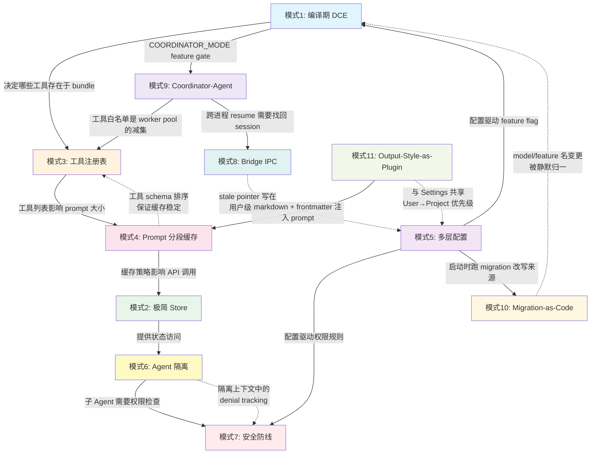

# 第 34 章：架构模式总结 — 可迁移到你自己项目的设计模式

> 本章是《深入 Claude Code 源码》系列的终篇。我们将从前 33 章的源码分析中，提炼出 11 个可复用的架构模式。每个模式都附有 Claude Code 中的真实代码、适用场景和迁移要点。

## 为什么需要这篇总结？

在过去 33 章中，我们逐一拆解了 Claude Code 的每个子系统——从启动链路到对话循环，从工具系统到权限防线，从 Prompt Cache 到 MCP 协议，再到 Bridge IPC、Coordinator、Migration 与 Output Style。每章都聚焦于"**这个模块是怎么设计的**"。

但工程师阅读源码的终极目的不是理解别人的代码，而是**把好的设计用到自己的项目里**。

本章将切换视角：不再关注 Claude Code 特有的业务逻辑，而是提取那些**跨项目可复用的架构模式**。这 11 个模式覆盖了从编译期优化到运行时状态管理、从工具注册到安全防线、从跨进程桥接到配置演化的全栈设计决策。

---

## 模式 1：编译期 DCE — 同一份代码构建多版本

### 问题

你的产品需要从同一份代码库构建出多个版本——内部版/外部版、免费版/付费版、或者面向不同客户的定制版。传统做法是维护多个分支或在运行时用 `if/else` 判断，前者导致合并噩梦，后者让所有版本都包含所有代码。

### Claude Code 的解法

利用 Bun bundler 的 `feature()` 函数实现编译期 Dead Code Elimination（DCE）。关键技巧是将 `feature()` 与 `require()`（而非静态 `import`）配合使用：

```typescript
// tools.ts:25-28
import { feature } from 'bun:bundle'

const SleepTool =
  feature('PROACTIVE') || feature('KAIROS')
    ? require('./tools/SleepTool/SleepTool.js').SleepTool
    : null
```

编译时，`feature('PROACTIVE')` 被替换为 `true` 或 `false`。当为 `false` 时，bundler 直接删除整个 `require()` 分支及其依赖的模块树。这实现了**零成本的功能门控**——外部版本的 bundle 中完全不存在内部功能的代码。

第二个维度是 `process.env.USER_TYPE`，它通过 `--define` 在构建时被替换为字符串常量：

```typescript
// tools.ts:16-19
const REPLTool =
  process.env.USER_TYPE === 'ant'
    ? require('./tools/REPLTool/REPLTool.js').REPLTool
    : null
```

这两层 Flag 各有分工：`feature()` 用于**功能级**门控（覆盖数十个功能区域），`USER_TYPE` 用于**身份级**门控。它们共同构成了一个编译期的"功能矩阵"。

### 必须遵守的约束

这个模式有一个容易被忽略的关键约束——**不能使用顶层静态 `import`**：

```typescript
// ❌ 错误：静态 import 会被模块系统无条件加载，DCE 无法生效
import { SleepTool } from './tools/SleepTool/SleepTool.js'

// ✅ 正确：require() 是运行时调用，配合常量折叠可被 bundler 删除
const SleepTool = feature('PROACTIVE')
  ? require('./tools/SleepTool/SleepTool.js').SleepTool
  : null
```

同时，为了保留 TypeScript 类型安全，使用 `as typeof import(...)` 模式：

```typescript
// tools.ts:63-65
const getTeamCreateTool = () =>
  require('./tools/TeamCreateTool/TeamCreateTool.js')
    .TeamCreateTool as typeof import('./tools/TeamCreateTool/TeamCreateTool.js').TeamCreateTool
```

另一个约束来自 `QueryConfig`（`query/config.ts:12-14`）——它刻意排除 `feature()` gate，只包含运行时 gate：

```typescript
// query/config.ts:8-14
// Intentionally excludes feature() gates — those are tree-shaking boundaries
// and must stay inline at the guarded blocks for dead-code elimination.
export type QueryConfig = {
  sessionId: SessionId
  gates: {
    streamingToolExecution: boolean
    // ...
  }
}
```

如果把 `feature()` 的值抽取到配置对象中，bundler 就无法在 call site 进行常量折叠，DCE 失效。

### 迁移要点

- **适用场景**：需要从同一代码库构建多个产品变体（SaaS 多租户、内部/外部版、平台差异化）
- **前提条件**：使用支持编译期常量替换的 bundler（Bun、esbuild `--define`、webpack `DefinePlugin`）
- **核心原则**：Flag 必须在 call site 内联，不能提升为变量；搭配 `require()` 而非 `import`

---

## 模式 2：极简 Store — 35 行代码桥接 React 与非 React

### 问题

在混合架构的应用中（UI 层用 React，核心逻辑不依赖 React），状态管理是一个典型痛点。用 Redux/Zustand 太重，用 React Context 又把非 React 代码绑死在框架上。

### Claude Code 的解法

整个状态管理的核心只有 35 行代码（`state/store.ts`）：

```typescript
// state/store.ts（完整代码）
type Listener = () => void
type OnChange<T> = (args: { newState: T; oldState: T }) => void

export type Store<T> = {
  getState: () => T
  setState: (updater: (prev: T) => T) => void
  subscribe: (listener: Listener) => () => void
}

export function createStore<T>(
  initialState: T,
  onChange?: OnChange<T>,
): Store<T> {
  let state = initialState
  const listeners = new Set<Listener>()

  return {
    getState: () => state,
    setState: (updater: (prev: T) => T) => {
      const prev = state
      const next = updater(prev)
      if (Object.is(next, prev)) return  // 相等性检查，避免无效更新
      state = next
      onChange?.({ newState: next, oldState: prev })
      for (const listener of listeners) listener()
    },
    subscribe: (listener: Listener) => {
      listeners.add(listener)
      return () => listeners.delete(listener)
    },
  }
}
```

这个 Store 的精妙之处在于：

1. **零依赖**：不依赖 React 或任何框架，纯 TypeScript
2. **`Object.is` 相等性检查**：与 React 的行为完全一致，避免无效渲染
3. **`onChange` 回调**：集中式副作用处理（权限同步、模型持久化、缓存清理等）
4. **`subscribe` 返回取消函数**：与 `useSyncExternalStore` 的接口契约完全匹配

桥接到 React 只需要一行 `useSyncExternalStore`：

```typescript
// state/AppState.tsx:27,57
export const AppStoreContext = React.createContext<AppStateStore | null>(null)

// 在 Provider 中创建 Store 实例
const [store] = useState(() =>
  createStore(initialState ?? getDefaultAppState(), onChangeAppState)
)
```

React 组件通过 Context 拿到 Store 实例，用 `useSyncExternalStore` 订阅。非 React 代码（如 `query.ts`、工具执行逻辑）直接调用 `store.getState()` / `store.setState()`。**两个世界共享同一个状态源，但互不耦合**。

### 迁移要点

- **适用场景**：React + 非 React 混合架构（CLI、Electron、SSR）、需要在纯逻辑层读写 UI 状态
- **核心技巧**：Store 接口与 `useSyncExternalStore` 天然兼容——`getState` + `subscribe` 就是 React 18 要求的外部 Store 协议
- **扩展方向**：通过 `onChange` 回调实现中间件模式（日志、持久化、同步）

---

## 模式 3：工具注册表 — 单一来源 + 三层条件注册

### 问题

当你的系统需要管理 40+ 个可插拔的功能模块（工具、插件、处理器），如何确保注册逻辑集中可控，同时支持编译期、加载期、运行时三个层面的条件过滤？

### Claude Code 的解法

工具注册采用"**单一来源 + 三层漏斗**"模式。所有工具在 `tools.ts` 的 `getAllBaseTools()` 中注册——这是唯一的注册入口：

```typescript
// tools.ts:193-251
export function getAllBaseTools(): Tools {
  return [
    AgentTool,                    // 静态导入：始终包含
    BashTool,
    FileReadTool,
    // ...

    // 第一层：编译期 DCE（feature flag）
    ...(SleepTool ? [SleepTool] : []),              // feature('PROACTIVE')
    ...(WebBrowserTool ? [WebBrowserTool] : []),     // feature('WEB_BROWSER_TOOL')

    // 第二层：模块加载期（环境变量）
    ...(process.env.USER_TYPE === 'ant' ? [ConfigTool] : []),
    ...(isEnvTruthy(process.env.ENABLE_LSP_TOOL) ? [LSPTool] : []),

    // 第三层：运行时条件
    ...(isTodoV2Enabled() ? [TaskCreateTool, ...] : []),
    ...(isWorktreeModeEnabled() ? [EnterWorktreeTool, ExitWorktreeTool] : []),
  ]
}
```

三层漏斗的成本递增：

| 层级 | 时机 | 成本 | 示例 |
|------|------|------|------|
| 编译期 DCE | 构建时 | 零（代码不存在于 bundle） | `feature('PROACTIVE')` |
| 模块加载期 | 进程启动 | 极低（环境变量读取） | `process.env.USER_TYPE === 'ant'` |
| 运行时 | 每次调用 | 低（函数调用） | `tool.isEnabled()` |

在 `getAllBaseTools()` 之上，`getTools()` 还叠加了一层 **deny 规则过滤** + **`isEnabled()` 运行时检查**：

```typescript
// tools.ts:271-327
export const getTools = (permissionContext: ToolPermissionContext): Tools => {
  const tools = getAllBaseTools().filter(tool => !specialTools.has(tool.name))
  let allowedTools = filterToolsByDenyRules(tools, permissionContext)
  const isEnabled = allowedTools.map(_ => _.isEnabled())
  return allowedTools.filter((_, i) => isEnabled[i])
}
```

最终，`assembleToolPool()` 将内置工具与 MCP 工具合并，按名称排序保证 Prompt Cache 稳定性：

```typescript
// tools.ts:345-367
export function assembleToolPool(
  permissionContext: ToolPermissionContext,
  mcpTools: Tools,
): Tools {
  const builtInTools = getTools(permissionContext)
  const allowedMcpTools = filterToolsByDenyRules(mcpTools, permissionContext)
  const byName = (a: Tool, b: Tool) => a.name.localeCompare(b.name)
  return uniqBy(
    [...builtInTools].sort(byName).concat(allowedMcpTools.sort(byName)),
    'name',  // 内置工具优先，MCP 同名工具被去重
  )
}
```

### Builder 模式：安全默认值

每个工具通过 `buildTool()` 构建，它在**并发、读写、破坏性标注**这些维度上提供了保守的安全默认值：

```typescript
// Tool.ts:757-769
const TOOL_DEFAULTS = {
  isEnabled: () => true,
  isConcurrencySafe: (_input?: unknown) => false,  // 默认不允许并发
  isReadOnly: (_input?: unknown) => false,          // 默认非只读
  isDestructive: (_input?: unknown) => false,
  checkPermissions: (input) =>                      // 默认允许（权限由外层管线兜底）
    Promise.resolve({ behavior: 'allow', updatedInput: input }),
}

// Tool.ts:783-791
export function buildTool<D extends AnyToolDef>(def: D): BuiltTool<D> {
  return { ...TOOL_DEFAULTS, userFacingName: () => def.name, ...def } as BuiltTool<D>
}
```

新增一个工具时，你只需定义必要的方法，其余由默认值兜底。注意这里的"保守"是分层的：`isConcurrencySafe` 默认 `false` 意味着新工具默认串行执行——并发需要显式 opt-in；但 `checkPermissions` 默认 `allow`，因为工具级别的权限判定只是外层 7 步管线（见模式 7）的一个环节，真正的安全兜底由管线的 deny 规则、safety check 和模式级变换提供。

### 迁移要点

- **适用场景**：任何需要管理多个可插拔模块的系统（API 路由、中间件、事件处理器、AI 工具）
- **核心原则**：一个 `getAll*()` 函数作为唯一注册入口，所有过滤逻辑在此之上叠加
- **安全哲学**：`buildTool()` 的 `TOOL_DEFAULTS` 展示了分层保守——在并发/读写/破坏性标注上默认保守（`false`），权限判定则交给外层管线兜底

---

## 模式 4：Prompt 分段缓存 — static/dynamic boundary

### 问题

在调用 LLM API 时，System Prompt 每次请求都会被发送。对于包含大量工具描述、行为指引的复杂 prompt，这意味着巨大的 token 成本。如何在保持 prompt 动态性的同时最大化缓存命中率？

### Claude Code 的解法

System Prompt 的缓存设计实际上是**三层结构**，而非简单的二分。边界由 `SYSTEM_PROMPT_DYNAMIC_BOUNDARY` 标记（`constants/prompts.ts:105-115`）：

1. **静态段**（boundary 之前）：跨用户、跨请求不变的内容（介绍、编码规范、工具使用指引等），可以设置 `scope: 'global'` 做最高级别缓存
2. **Memoized 动态段**（boundary 之后，`systemPromptSection()`）：包含用户/会话特定信息（环境信息、MCP 指令、CLAUDE.md 内容等），**不能走 global cache，但在 session 内只计算一次**，缓存直到 `/clear` 或 `/compact`
3. **Volatile 段**（boundary 之后，`DANGEROUS_uncachedSystemPromptSection()`）：每轮 API 调用都重新计算的内容，**每次变化都会破坏 prompt cache**

关键洞察是：boundary 之后 ≠ 每轮都变。大多数动态 section 使用 `systemPromptSection()` 注册，session 内只计算一次；只有极少数使用 `DANGEROUS_uncachedSystemPromptSection()` 才会每轮重算。

实现的核心是这对注册 API（`constants/systemPromptSections.ts`）：

```typescript
// constants/systemPromptSections.ts:20-38
export function systemPromptSection(
  name: string,
  compute: ComputeFn,
): SystemPromptSection {
  return { name, compute, cacheBreak: false }  // 计算一次，缓存到 /clear 或 /compact
}

export function DANGEROUS_uncachedSystemPromptSection(
  name: string,
  compute: ComputeFn,
  _reason: string,  // 强制写明为什么需要每轮重算
): SystemPromptSection {
  return { name, compute, cacheBreak: true }
}
```

函数命名本身就是设计文档：`DANGEROUS_uncached` 前缀让开发者在写代码时就意识到"**我正在做一个会破坏缓存的决定**"。`_reason` 参数虽然不被运行时使用，但强制开发者记录理由，这是一种**代码级的 ADR（Architecture Decision Record）**。

解析逻辑同样简洁：

```typescript
// constants/systemPromptSections.ts:43-58
export async function resolveSystemPromptSections(
  sections: SystemPromptSection[],
): Promise<(string | null)[]> {
  const cache = getSystemPromptSectionCache()
  return Promise.all(
    sections.map(async s => {
      if (!s.cacheBreak && cache.has(s.name)) {
        return cache.get(s.name) ?? null  // 缓存命中，跳过计算
      }
      const value = await s.compute()
      setSystemPromptSectionCacheEntry(s.name, value)
      return value
    }),
  )
}
```

### 延迟构造：lazySchema

同样的"延迟到需要时才付出成本"理念也体现在工具 schema 的构造上：

```typescript
// utils/lazySchema.ts（完整代码，仅 8 行）
export function lazySchema<T>(factory: () => T): () => T {
  let cached: T | undefined
  return () => (cached ??= factory())
}
```

每个工具的 Zod schema 可能很复杂，但在应用启动时并不需要。`lazySchema` 将构造推迟到第一次访问时，既节省启动时间，又保证后续访问的零成本。

### 迁移要点

- **适用场景**：任何涉及 LLM API 调用的应用、需要管理复杂配置模板的系统
- **核心技巧**：将配置/prompt 分为三层（global cache / session-memoized / per-turn volatile），而非简单的 static/dynamic 二分；session 内稳定的内容虽然不能走 global cache，但仍可在 org scope 内缓存
- **API 设计**：用命名约定（`DANGEROUS_*`）在代码层面标记高风险操作，比注释更持久

---

## 模式 5：多层配置合并 — 6 层 Settings 的优先级链

### 问题

企业级应用需要支持多个配置来源：用户个人偏好、项目级配置、CI 环境变量、企业安全策略……如何设计一个清晰、可预测、可调试的配置合并系统？

### Claude Code 的解法

配置系统采用 5 + 1 层架构，优先级从低到高（`utils/settings/constants.ts:7-22`）：

```typescript
// utils/settings/constants.ts:7-22
export const SETTING_SOURCES = [
  'userSettings',      // ~/.claude/settings.json — 用户全局配置
  'projectSettings',   // .claude/settings.json — 项目共享配置（提交到 Git）
  'localSettings',     // .claude/settings.local.json — 项目本地配置（gitignore）
  'flagSettings',      // --settings CLI 参数
  'policySettings',    // 企业管理策略（MDM / remote API / managed-settings.json）
] as const
```

加上 Plugin 基底层（非 `SettingSource`，通过 `getPluginSettingsBase()` 注入），共 6 层。**数组顺序即合并优先级：后覆盖前**。

合并使用 lodash 的 `mergeWith` 配合自定义合并器——**数组拼接去重，标量覆盖**：

```typescript
// 合并语义：
// - 标量字段：后来源覆盖先来源
// - 数组字段：拼接后去重（如权限规则列表）
```

Policy Settings 内部还有 4 层子优先级（first-source-wins）：remote API → MDM → managed-settings.json + drop-in 目录 → HKCU。Drop-in 目录模式（`managed-settings.d/*.json`）借鉴了 systemd/sudoers 的约定——不同团队可以各自投放策略片段，无需协调编辑同一个文件。

### 安全边界

配置系统的一个关键设计是**信任边界**。对于高风险操作（如环境变量注入），`projectSettings` 和 `localSettings` **都不被信任**。源码中 `TRUSTED_SETTING_SOURCES` 仅包含三种来源（`utils/managedEnv.ts:105-109`）：

```typescript
// utils/managedEnv.ts:94-109
/**
 * Trusted setting sources whose env vars can be applied before the trust dialog.
 *
 * Project-scoped sources (projectSettings, localSettings) are excluded because they live
 * inside the project directory and could be committed by a malicious actor to redirect
 * traffic (e.g., ANTHROPIC_BASE_URL) to an attacker-controlled server.
 */
const TRUSTED_SETTING_SOURCES = [
  'userSettings',
  'flagSettings',
  'policySettings',
] as const
```

原因是 `projectSettings` 和 `localSettings` 都位于项目目录内，可以被任何有仓库写权限的人修改。如果允许它们在信任对话框之前设置 `ANTHROPIC_BASE_URL` 等环境变量，就等于打开了 RCE（Remote Code Execution）攻击面。对于项目级来源，只有 `SAFE_ENV_VARS` 白名单中的变量才会被应用。

```
env 注入信任度：policySettings = flagSettings = userSettings > projectSettings = localSettings（仅白名单）
```

### 变更检测

配置变更通过三路检测：
1. **chokidar 文件监听**：本地文件变更实时响应
2. **30 分钟 MDM 轮询**：企业策略定期刷新
3. **`internalWrites.ts` 时间戳 Map**：过滤自身写入产生的回声事件

还有一个精妙的细节：删除-重建的 grace period（1700ms）。某些编辑器保存文件时会先删除再创建，如果不处理这个时间差，就会误判为"配置被删除"。

### 迁移要点

- **适用场景**：任何需要多层配置的应用（VS Code 扩展、DevOps 工具链、企业 SaaS）
- **核心原则**：配置源用有序数组定义优先级，一目了然；合并逻辑与业务逻辑分离
- **安全考量**：项目目录内的配置来源（project / local）对高风险操作（env 注入等）不可信，只允许白名单内的安全变量
- **容错设计**：使用 `.catch(undefined)` 式的前向兼容——未知字段不报错，只忽略

---

## 模式 6：Agent 隔离 — Context Clone + Shared Infrastructure

### 问题

在多 Agent 系统中，子 Agent 需要与父 Agent **隔离状态**（避免互相干扰），但又需要**共享基础设施**（避免僵尸进程、避免重复创建资源）。如何在这两个矛盾的需求之间找到平衡？

### Claude Code 的解法

`createSubagentContext()` 函数（`utils/forkedAgent.ts:345-462`）实现了一个"**默认全隔离 + 显式 opt-in 共享**"的模式：

```typescript
// utils/forkedAgent.ts:307-344（文档注释）
/**
 * Creates an isolated ToolUseContext for subagents.
 *
 * By default, ALL mutable state is isolated to prevent interference:
 * - readFileState: cloned from parent
 * - abortController: new controller linked to parent
 * - getAppState: wrapped to set shouldAvoidPermissionPrompts
 * - All mutation callbacks (setAppState, etc.): no-op
 *
 * Callers can explicitly opt-in to sharing specific callbacks.
 */
export function createSubagentContext(
  parentContext: ToolUseContext,
  overrides?: SubagentContextOverrides,
): ToolUseContext {
  // ...
}
```

具体的隔离/共享决策：

```typescript
// utils/forkedAgent.ts:376-461（核心逻辑）
return {
  // ① 可变状态 —— 克隆隔离
  readFileState: cloneFileStateCache(
    overrides?.readFileState ?? parentContext.readFileState,
  ),
  nestedMemoryAttachmentTriggers: new Set<string>(),  // 全新集合
  toolDecisions: undefined,

  // ② AbortController —— 链接而非共享
  abortController: overrides?.abortController ??
    (overrides?.shareAbortController
      ? parentContext.abortController
      : createChildAbortController(parentContext.abortController)),

  // ③ 状态写入 —— 默认 no-op，opt-in 共享
  setAppState: overrides?.shareSetAppState
    ? parentContext.setAppState
    : () => {},  // 静默丢弃，不影响父 Agent

  // ④ 基础设施 —— 始终穿透到根 Store
  setAppStateForTasks:
    parentContext.setAppStateForTasks ?? parentContext.setAppState,
  // ↑ 关键：即使 setAppState 是 no-op，任务注册/清理必须到达根 Store
  // 否则异步 Agent 的后台 bash 任务变成 PPID=1 的僵尸进程

  // ⑤ UI 回调 —— 子 Agent 不控制父 Agent 的 UI
  addNotification: undefined,
  setToolJSX: undefined,
  setStreamMode: undefined,

  // ⑥ 追踪信息 —— 安全共享（无副作用的函数式更新）
  updateAttributionState: parentContext.updateAttributionState,
}
```

这个设计有几个值得注意的细节：

**为什么 `contentReplacementState` 默认克隆而非新建？** 因为 cache-sharing fork 会处理父线程的消息（包含父线程的 `tool_use_id`）。如果用全新的 state，子 Agent 会对这些 ID 做出不同的替换决策，导致序列化字节不同，prompt cache 失效。克隆保证了决策一致性。

**为什么 `localDenialTracking` 在不共享 `setAppState` 时新建？** 因为异步子 Agent 的 `setAppState` 是 no-op，denial 计数无法写入全局状态。没有本地跟踪，denial 熔断器永远不会触发，子 Agent 会无限重试被拒绝的操作。

### 迁移要点

- **适用场景**：任何多 Agent/多线程/多租户系统需要状态隔离的场景
- **核心原则**：**默认隔离，共享需要显式声明**——这与安全领域的"最小权限原则"一脉相承
- **基础设施穿透**：进程/资源管理类的操作必须始终到达根级别，不能被隔离
- **类型驱动设计**：`SubagentContextOverrides` 类型让每个共享选项都有文档注释，IDE 提示即文档

---

## 模式 7：安全防线 — Permission Rule Chain

### 问题

AI Agent 能执行任意代码（Bash 命令、文件编辑、网络请求），如何设计一个既不会被绕过、又不会让用户体验崩溃的权限系统？

### Claude Code 的解法

权限判定采用**多步决策管线**（pipeline）。内层函数 `hasPermissionsToUseToolInner()`（`utils/permissions/permissions.ts:1158-1318`）定义了完整的决策流程，每一步都可以提前终止：

```
步骤 1a: 整工具 deny 规则 → 匹配则拒绝（最高优先级）
步骤 1b: 整工具 ask 规则 → 匹配则需要人工确认
步骤 1c: tool.checkPermissions() → 工具自身的权限逻辑（返回 allow/ask/deny/passthrough）
步骤 1d: 工具返回 deny → 拒绝
步骤 1e: requiresUserInteraction + ask → 即使 bypass 也需要人工确认
步骤 1f: 内容级 ask 规则（如 Bash(npm publish:*)） → bypass 也绕不过
步骤 1g: safety check（.git/、.claude/ 等敏感路径）→ bypass 也绕不过
步骤 2a: bypass 模式 → 以上全部通过后，才允许跳过
步骤 2b: 整工具 allow 规则 → 匹配则允许
步骤 3:  passthrough → 转为 ask，交给用户决定
```

这个管线的核心设计哲学有两层：

**第一层：deny 优先**。无论后续规则怎么配置，`deny` 规则永远第一个被检查（步骤 1a）。

**第二层：bypass 不是万能的**。步骤 1e-1g 定义了三类 **bypass-immune** 的 ask 决策——需要用户交互的工具、用户显式配置的内容级 ask 规则、以及敏感路径安全检查。这些 ask 即使在 `bypassPermissions` 模式下也必须弹出确认。这是一个容易被忽略但至关重要的安全边界：bypass 只跳过"没有明确规则命中"的默认 ask，不能覆盖显式的安全约束。

外层 `hasPermissionsToUseTool()`（`utils/permissions/permissions.ts:503-955`）根据当前权限模式对管线结果进行**模式级变换**：

```
dontAsk 模式 → passthrough/ask 变为 deny（不能问用户就直接拒绝）
auto 模式   → passthrough 交给 Classifier API 评估
headless 模式 → passthrough 交给 Hook 系统处理
```

### 熔断器：Denial Tracking

为了防止 Agent 在被拒绝后无限重试，系统实现了一个熔断器：

```typescript
// 连续 3 次拒绝 或 总计 20 次拒绝 → 回退到用户确认（CLI）或 abort（headless）
```

这个机制在子 Agent 隔离上下文中尤为重要——正如模式 6 所述，异步子 Agent 需要 `localDenialTracking` 才能让熔断器正常工作。

### 多源规则系统

权限规则来自 8 种来源：5 种 Settings 来源 + cliArg + command + session。遍历顺序定义在 `PERMISSION_RULE_SOURCES` 中：

```typescript
// utils/permissions/permissions.ts:109-114
const PERMISSION_RULE_SOURCES = [
  ...SETTING_SOURCES,   // userSettings, projectSettings, localSettings, flagSettings, policySettings
  'cliArg',
  'command',
  'session',
] as const satisfies readonly PermissionRuleSource[]
```

注意：这个数组的顺序是**遍历顺序**（搜索遍历），而非严格的优先级语义。在决策管线中，deny 和 allow 规则分开处理，deny 优先于 allow，同一行为内的规则按来源遍历匹配。

### 迁移要点

- **适用场景**：任何需要细粒度权限控制的系统（API 网关、CI/CD pipeline、自动化工具）
- **核心原则**：deny 优先 + bypass-immune 层——安全策略永远不会被"更宽松"的模式覆盖，显式的安全约束（用户配置的 ask 规则、敏感路径检查）即使在最宽松的 bypass 模式下也必须被尊重
- **模式分层**：内层管线（规则匹配）与外层变换（模式适配）分离，同一套规则在不同模式下行为不同
- **熔断保护**：对自动化系统尤为重要——防止 Agent 在死循环中消耗资源

---

## 模式 8：Bridge IPC — 用 crash-recovery pointer 桥接两个生命周期

### 问题

当一个长时间运行的本地 CLI 进程需要被另一端（手机、Web、桌面端）远程驱动时，你会撞上一个看似简单、其实很恶心的问题：**这两端的生命周期不对齐**。CLI 进程可能崩溃、被 `kill -9`、被终端关闭；远端不知道。下次用户想"接着上次那个会话继续"时，怎么找回正确的 session？

### Claude Code 的解法

`bridge/bridgePointer.ts` 用一个极轻量的 JSON 文件 + 文件 mtime 当心跳，把这个问题压成了 200 行代码。

```typescript
// bridge/bridgePointer.ts:42-50
const BridgePointerSchema = lazySchema(() =>
  z.object({
    sessionId: z.string(),
    environmentId: z.string(),
    source: z.enum(['standalone', 'repl']),
  }),
)
export type BridgePointer = z.infer<ReturnType<typeof BridgePointerSchema>>
```

bridge session 一启动就把 `{sessionId, environmentId, source}` 写到 `.../bridge-pointer.json`，之后周期性"刷新"——但**不**改内容，只是 `writeFile` 一次让 mtime 推到当前时间。clean shutdown 时把它 `unlink` 掉。

```typescript
// bridge/bridgePointer.ts:40
export const BRIDGE_POINTER_TTL_MS = 4 * 60 * 60 * 1000
```

下次 `claude remote-control --continue` 启动时，`readBridgePointer()`（`bridge/bridgePointer.ts:83-113`）先 `stat()` 读出 mtime，超过 4h 直接判 stale + 删文件 + 返回 null；否则把内容 + `ageMs` 一起返回给调用方做 resume。

这个设计的精妙之处在于**用文件系统的两个原生原语（内容 + mtime）分别承载两件不同的事**：

- **内容**承载身份（sessionId / environmentId）——回答"我要恢复哪个 session"；
- **mtime**承载活跃度——回答"这个 pointer 还有效吗"。

很多 IPC 方案会把 timestamp 也塞进 JSON，然后写一个 `lastRefreshedAt` 字段，每次刷新都要重新序列化整个对象。这里直接借用 mtime，刷新 = 写同样的字节 = OS 自动 bump mtime。零计算开销。

### Worktree-aware 回查：fast path + fanout

Bridge pointer 写在 "REPL 启动时的 CWD" 下，但用户后续可能 `EnterWorktreeTool` 切到另一个 worktree。`--continue` 又是用 shell 当前 CWD 找 pointer 的——两者可能不在同一个目录。

```typescript
// bridge/bridgePointer.ts:129-184
export async function readBridgePointerAcrossWorktrees(dir: string): ...
```

策略很务实：**先 stat 当前目录，命中就返回**（标准情况）；只有 miss 时才 `git worktree list` 列出所有兄弟 worktree，并行 `stat()` + 读 pointer，挑 `ageMs` 最小的那个。Fanout 上限 50，超过就放弃 fanout 退回当前目录——既覆盖了 worktree 漂移的边缘情况，又不让"找回 session"成为慢路径。

### 迁移要点

- **适用场景**：任何"长跑进程 + 可断连远端"的桥接（CLI ↔ Web/Mobile、Daemon ↔ TUI 控制面板、本地构建器 ↔ CI dashboard）
- **核心技巧**：把"身份"和"活跃度"用两个不同的存储原语承载，避免序列化开销
- **崩溃恢复哲学**：clean shutdown 删文件，crash 留文件——文件存在本身就是"上一次没退干净"的信号
- **TOCTOU 友好**：直接 `stat()`/`unlink()`/`readFile()`，对 ENOENT 一律 swallow，不写 `if exists then read` 的双步逻辑

---

## 模式 9：Coordinator-Agent — 同一份源码两种角色

### 问题

当系统从"单 Agent 串行做事"演化到"多 Agent 并行做事"时，最容易掉进的坑是**给协调者写一份独立的代码**。两套 Prompt、两套工具白名单、两套上下文构造——很快就会出现"协调者不知道工人能用什么工具"、"工人能调用协调者专属的 SendMessage"这类 bug。

### Claude Code 的解法

`coordinator/coordinatorMode.ts` 一共 369 行，整章只做一件事：**把同一份 Claude Code 二进制，按一个环境变量切成 coordinator 或 worker**。

```typescript
// coordinator/coordinatorMode.ts:36-41
export function isCoordinatorMode(): boolean {
  if (feature('COORDINATOR_MODE')) {
    return isEnvTruthy(process.env.CLAUDE_CODE_COORDINATOR_MODE)
  }
  return false
}
```

外层用 `feature('COORDINATOR_MODE')` 做编译期门控（模式 1 的 DCE），里层用环境变量做运行期切换。这意味着**非 coordinator 构建里这段代码会被 bundler 直接 DCE 掉**——零运行时成本。

### 角色感知的工具过滤

`getCoordinatorUserContext()`（`coordinator/coordinatorMode.ts:80-109`）把"工人到底能用哪些工具"以纯文本注入给 coordinator，让 coordinator 在写 worker prompt 时知道能委托什么：

```typescript
// coordinator/coordinatorMode.ts:88-95（节选）
const workerTools = isEnvTruthy(process.env.CLAUDE_CODE_SIMPLE)
  ? [BASH_TOOL_NAME, FILE_READ_TOOL_NAME, FILE_EDIT_TOOL_NAME]
      .sort().join(', ')
  : Array.from(ASYNC_AGENT_ALLOWED_TOOLS)
      .filter(name => !INTERNAL_WORKER_TOOLS.has(name))
      .sort().join(', ')
```

注意这里的减法：`INTERNAL_WORKER_TOOLS`（`TeamCreate / TeamDelete / SendMessage / SyntheticOutput`）是 coordinator 自己用的、不应该被 worker 调用的工具。同一个工具池，**根据角色减去不应该暴露的部分**，而不是为两个角色各维护一份白名单。

### Mode 与 session 的一致性约束

```typescript
// coordinator/coordinatorMode.ts:49-78
export function matchSessionMode(
  sessionMode: 'coordinator' | 'normal' | undefined,
): string | undefined {
  // ...
  if (currentIsCoordinator === sessionIsCoordinator) return undefined
  if (sessionIsCoordinator) {
    process.env.CLAUDE_CODE_COORDINATOR_MODE = '1'
  } else {
    delete process.env.CLAUDE_CODE_COORDINATOR_MODE
  }
  // ...
}
```

resume 一个旧 session 时，如果当前进程的 mode 与 session 当初的 mode 不一致，**直接翻转环境变量**而不是报错。配合 `isCoordinatorMode()` 每次读 live env（不缓存）的设计，这一翻就立刻生效。这是个很务实的取舍：在 resume 这种用户视角"接着干"的语义下，强行让两端 mode 一致比让用户改启动命令更友好。

### 迁移要点

- **适用场景**：任何需要"同一套核心逻辑、不同角色行为"的系统（leader/follower、coordinator/worker、driver/runner）
- **核心原则**：用一个 boolean 切角色，让两条代码路径在同一份源码里共存——而不是 fork 出两个二进制
- **工具白名单是减法**：从全集减去"本角色不该有"的，而不是手维护两份并集
- **角色信息要进 prompt**：让模型知道自己是谁、能委托给谁能用什么工具，否则 coordinator 会幻觉出 worker 没有的能力

---

## 模式 10：Migration-as-Code — 配置演化也是代码演化

### 问题

产品长期演化中，设置项的语义、字段名、模型别名都会变。"删个字段升个版本"听起来简单，但真实场景是：旧用户的本地配置文件里可能存着 3 年前某个废弃模型名、被替换掉的 feature flag、改名的子系统 key。你不能让他们升级后启动失败，也不能默默把旧值丢掉。

### Claude Code 的解法

`migrations/` 目录下放着 11 个独立的 migration 脚本，每个文件就是一次配置演化的"小迁移"：

```
migrations/
├── migrateAutoUpdatesToSettings.ts
├── migrateBypassPermissionsAcceptedToSettings.ts
├── migrateEnableAllProjectMcpServersToSettings.ts
├── migrateFennecToOpus.ts
├── migrateLegacyOpusToCurrent.ts
├── migrateOpusToOpus1m.ts
├── migrateReplBridgeEnabledToRemoteControlAtStartup.ts
├── migrateSonnet1mToSonnet45.ts
├── migrateSonnet45ToSonnet46.ts
├── resetAutoModeOptInForDefaultOffer.ts
└── resetProToOpusDefault.ts
```

文件名本身就是 migration 的语义：`migrateSonnet45ToSonnet46` 告诉你这是把 `sonnet-4-5-…` 改写成 `sonnet[1m]` / `sonnet` 别名。

每个 migration 都遵循同一套契约：

```typescript
// migrations/migrateSonnet45ToSonnet46.ts:29-67（节选）
export function migrateSonnet45ToSonnet46(): void {
  if (getAPIProvider() !== 'firstParty') return
  if (!isProSubscriber() && !isMaxSubscriber() && !isTeamPremiumSubscriber()) {
    return
  }
  const model = getSettingsForSource('userSettings')?.model
  if (model !== 'claude-sonnet-4-5-20250929' && ...) {
    return
  }
  const has1m = model.endsWith('[1m]')
  updateSettingsForSource('userSettings', {
    model: has1m ? 'sonnet[1m]' : 'sonnet',
  })
  // ... log telemetry
}
```

注意这个函数的所有性质：

1. **幂等**：跑一遍后旧值已不匹配，再跑直接 return；
2. **保守的作用域**：只读 `getSettingsForSource('userSettings')`（不读合并视图），只改 `userSettings`——项目级/本地级 pin 不动；
3. **入口条件门控**：先 check provider / 订阅类型 / model 字符串是否匹配，三层 guard 都过了才动笔；
4. **副作用记账**：写完后给全局 config 打 timestamp、发 telemetry，方便事后审计"哪些用户什么时候被迁了"。

### 为什么不用一个统一的 migration 框架？

很多系统会把 migration 写成"version → version+1"的版本号链。Claude Code 没这么做。原因是**配置 migration 的颗粒比 schema migration 更碎**：模型重命名、bridge → remote-control 改名、Pro 默认值重置——它们之间没有线性版本关系，硬塞进版本链反而要为不相关的 migration 排顺序、想"如果用户从 1.2 直接升到 1.7 怎么办"这种伪问题。

11 个独立函数，每个只关心"我自己应不应该跑、跑完是不是幂等"。新增一个 migration = 新加一个文件 + 在启动序列里挂一行调用，不动任何已有 migration。

### 迁移要点

- **适用场景**：任何"用户配置 / 项目 schema / 数据库枚举值"需要长期演化的系统
- **核心原则**：每个 migration 一个文件，文件名即语义；函数本身负责自己的入口判定和幂等
- **不要早早抽框架**：配置 migration 通常碎且独立，version 链反而是过度设计
- **可观测性**：每次成功 migration 落 timestamp + telemetry，事后能回放"这个用户的配置为什么是现在这样"

---

## 模式 11：Output-Style-as-Plugin — 用文件系统目录当扩展点

### 问题

当你想让用户能自定义系统行为（人格、prompt 模板、生成风格）时，最差的做法是逼用户改源码或写配置 DSL。两者都把扩展门槛抬到了"程序员"级别。

### Claude Code 的解法

Output Style 用 markdown 文件 + frontmatter 当扩展协议，整个加载逻辑只有 98 行（`outputStyles/loadOutputStylesDir.ts`）：

```typescript
// outputStyles/loadOutputStylesDir.ts:26-92（节选）
export const getOutputStyleDirStyles = memoize(
  async (cwd: string): Promise<OutputStyleConfig[]> => {
    const markdownFiles = await loadMarkdownFilesForSubdir('output-styles', cwd)
    const styles = markdownFiles
      .map(({ filePath, frontmatter, content, source }) => {
        const fileName = basename(filePath)
        const styleName = fileName.replace(/\.md$/, '')
        const name = (frontmatter['name'] || styleName) as string
        const description = coerceDescriptionToString(...)
        // ...
        return {
          name, description,
          prompt: content.trim(),
          source, keepCodingInstructions,
        }
      })
      .filter(style => style !== null)
    return styles
  },
)
```

用户只需要在 `~/.claude/output-styles/` 或项目的 `.claude/output-styles/` 下扔一个 `my-style.md`：

```markdown
---
name: 简洁回答
description: 不要解释，直接给答案
---
你必须用最少的词回答，不要任何前导寒暄。
```

这个文件被 `loadMarkdownFilesForSubdir` 自动发现，文件名做默认 style 名，frontmatter 覆盖元数据，正文当 prompt。**用户不需要写一行代码、不需要重启、不需要懂任何编程概念**——他知道 markdown，就能扩展 Claude Code。

### 三个值得抄的细节

1. **文件名当默认 key**：`fileName.replace(/\.md$/, '')` 当 styleName，frontmatter 的 `name` 字段只是覆盖。这意味着"创建一个新 style"的最小成本就是"创建一个文件"。
2. **memoize 加载，clear 触发刷新**：`memoize(async cwd => ...)` 让每次会话内只扫一次目录，`clearOutputStyleCaches()` 提供显式失效点。这避免了 watch 文件系统的复杂性，把"什么时候刷新"的决策权留给上层。
3. **Project 覆盖 User**：项目目录的 style 覆盖用户级 style——和 Settings、CLAUDE.md、skills 走同一套优先级。用户的认知模型只学一次。

### 同样的模式在 Claude Code 里出现了多次

- **Skills**：`.claude/skills/*.md` 同款机制
- **Commands**：`.claude/commands/*.md` 同款机制
- **CLAUDE.md memory**：项目根 + 父目录回溯 + 用户级
- **Hooks**：settings 的 `hooks` 字段 + 文件路径

四个扩展点共享同一个心智模型："**在某个 `.claude/` 子目录里放个 markdown，它就生效了**"。这种**协议同构**是用户体验上最大的胜利——学一次，会四个。

### 迁移要点

- **适用场景**：任何想给用户"零代码扩展能力"的产品（编辑器主题、AI 人格、prompt 模板、命令脚本）
- **核心原则**：文件系统目录 + markdown frontmatter > 配置 DSL > 代码 API
- **优先级要复用**：所有扩展点共享同一套"User → Project → Local"的优先级链，不要每个扩展点重新发明
- **不要 watch，要 memoize + clear**：watch 复杂度极高（删除-重建 grace period、多平台 fsevents 差异），memoize + 在已知时机 clear 就够了

---

## 11 个模式的全景关系

这 11 个模式（编译期 DCE、极简 Store、工具注册表、Prompt 分段缓存、多层配置、Agent 隔离、安全防线、Bridge IPC、Coordinator-Agent、Migration-as-Code、Output-Style-as-Plugin）并非孤立存在，它们在 Claude Code 中形成了一个协作网络：



- **编译期 DCE**（模式 1）决定了哪些工具代码存在于 bundle 中，直接影响**工具注册表**（模式 3）；同样的 `feature()` 门控也包住了 **Coordinator-Agent**（模式 9）的整段实现
- **工具注册表**的排序策略直接服务于 **Prompt 分段缓存**（模式 4）的稳定性；**Coordinator-Agent** 又从这套注册表里**做减法**得到 worker 的工具白名单
- **多层配置**（模式 5）驱动权限规则与 feature flag；**Migration-as-Code**（模式 10）在启动时改写这些配置来源（只动 `userSettings`，项目级 pin 不动）
- **极简 Store**（模式 2）在 **Agent 隔离**（模式 6）中被克隆/穿透，隔离上下文中的 denial tracking 又反馈给**安全防线**（模式 7）
- **Bridge IPC**（模式 8）用文件 mtime 当心跳，把远端 resume 桥到本地 session；pointer 文件本身就放在用户级目录，和 Settings 共用同一棵 `.claude/` 树
- **Output-Style-as-Plugin**（模式 11）把 markdown frontmatter 注入到 system prompt 的 memoized 段，复用模式 4 的缓存策略，也复用模式 5 的 User→Project 优先级——Skills / Commands / CLAUDE.md memory 走的是同一条路

---

## 写在最后

在这 34 章中，我们从一个约 1900 个文件的真实 AI 产品中，看到了工程决策背后的权衡逻辑。Claude Code 的源码展示了一个核心理念：

> **好的架构不是追求"正确"的抽象，而是在矛盾的约束之间找到务实的平衡点。**

- 编译期 DCE 在"代码可维护性"与"bundle 体积"之间平衡
- 极简 Store 在"框架无关性"与"React 集成便利性"之间平衡
- Agent 隔离在"状态安全"与"基础设施共享"之间平衡
- 安全防线在"用户体验流畅度"与"操作安全性"之间平衡
- Bridge IPC 在"严谨的会话恢复语义"与"零额外服务依赖"之间平衡——文件 mtime 当心跳，clean shutdown 删文件，crash 留文件
- Coordinator-Agent 在"协调者/工人角色分离"与"避免维护两份代码"之间平衡——一份源码 + 一个环境变量
- Migration-as-Code 在"配置长期演化"与"避免过度抽象"之间平衡——11 个独立幂等函数，不发明 version 链
- Output-Style-as-Plugin 在"用户零代码扩展"与"协议同构"之间平衡——一个 markdown 文件就是一个扩展，且 Skills / Commands / Memory 共享同一套优先级心智

这些模式的价值不在于原创性——每一个单独拿出来都不算新奇。它们的价值在于**在同一个生产系统中被验证了可以协同工作**，并且在 1900 个文件、数百万次 API 调用的规模下证明了自己的可靠性。

希望这 11 个模式能成为你下一个项目的设计工具箱的一部分。

---

*全部内容请关注 https://github.com/luyao618/Claude-Code-Source-Study (求一颗免费的小星星)*
